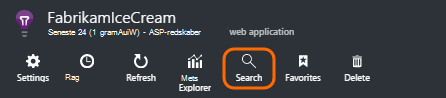
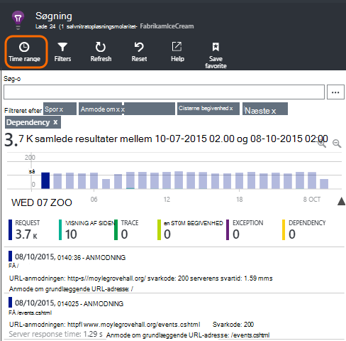
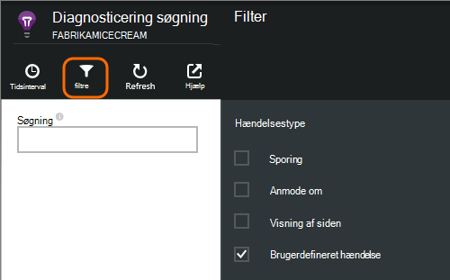
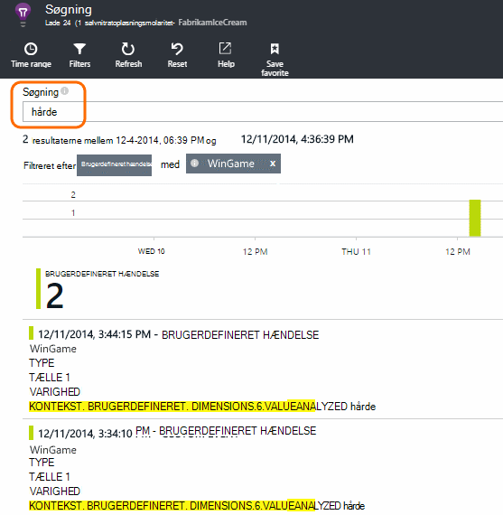
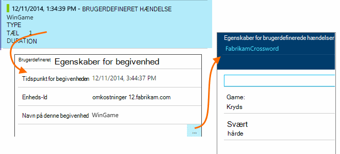
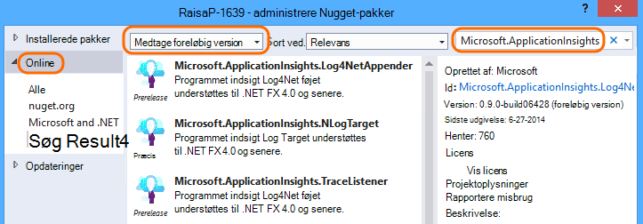
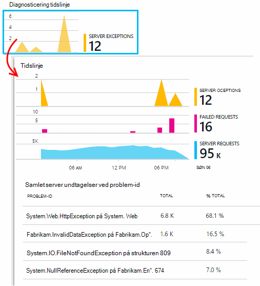
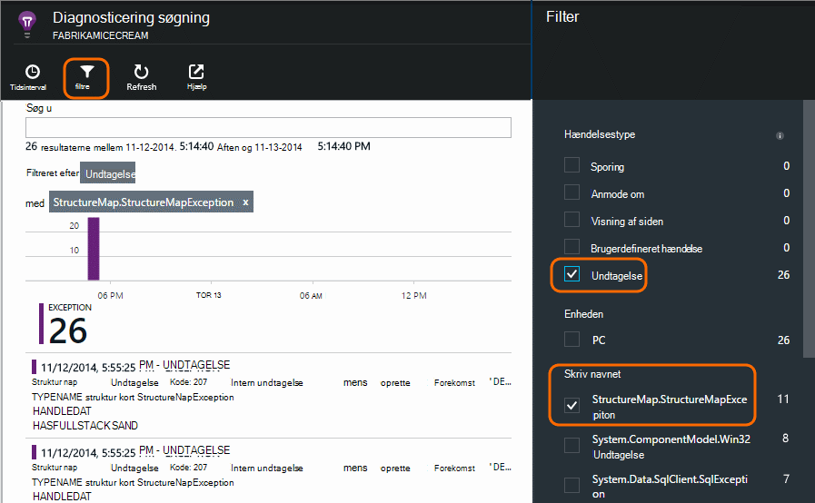

<properties 
    pageTitle="Logfiler, undtagelser og brugerdefinerede diagnosticering til ASP.NET i programmet indsigt" 
    description="Diagnosticere problemer i ASP.NET webapps ved at søge anmodninger, logfiler, der er oprettet med sporing, NLog eller Log4Net og undtagelser." 
    services="application-insights" 
    documentationCenter=""
    authors="alancameronwills" 
    manager="douge"/>

<tags 
    ms.service="application-insights" 
    ms.workload="tbd" 
    ms.tgt_pltfrm="ibiza" 
    ms.devlang="na" 
    ms.topic="article" 
    ms.date="04/08/2016" 
    ms.author="awills"/>
 
# Logfiler, undtagelser og brugerdefinerede diagnosticering til ASP.NET i programmet indsigt

[Programmet indsigt] [ start] indeholder en effektiv [Diagnosticering Søg] [ diagnostic] værktøj, der gør det muligt at udforske og analysere i til telemetri, der er sendt af programmet indsigt SDK fra dit program. Mange begivenheder som bruger sidevisninger sendes automatisk af SDK.

Du kan også skrive kode for at sende brugerdefinerede hændelser, undtagelse rapporter og sporinger. Og hvis du allerede bruger et logføring framework såsom log4J, log4net, NLog eller System.Diagnostics.Trace, kan du registrere disse logfiler og medtage dem i feltet Søg. Dette gør det nemt at koordinere log sporinger med brugerhandlinger, undtagelser og andre begivenheder.

## Før du skriver brugerdefineret telemetri

Hvis du endnu ikke har [konfigurere programmet indsigt for projektet][start], gøre det nu.

Når du kører dit program, det vil sende nogle telemetri, der vises på diagnosticering søgning, herunder anmodninger modtaget af serveren, siden visninger, der er logget på klienten, og en ikke-opfanget undtagelser.

Åbn diagnosticering søgning for at se de telemetri, der automatisk sender SDK.

Detaljerne variere fra én programtype til en anden. Du kan klikke gennem en enkelt begivenhed til at få flere detaljer.

## Udvalg 

Hvis dit program sender en stor mængde data, og du bruger programmet indsigt SDK til ASP.NET version 2.0.0-beta3 eller nyere, kan funktionen tilpasset udvalg betjene og send kun en procentdel af din telemetri. [Lær mere om udvalg.](app-insights-sampling.md)

##Brugerdefinerede hændelser

Brugerdefinerede hændelser vises både i [Diagnosticering Søg] [ diagnostic] og i [Metrisk Explorer][metrics]. Du kan sende dem fra enheder, websider og server-programmer. De kan bruges både til diagnosticering og at [forstå brugsmønstre][track].

En brugerdefineret hændelse har et navn, og kan også udføre egenskaber, som du kan filtrere på, sammen med numeriske mål.

JavaScript på klient

    appInsights.trackEvent("WinGame",
         // String properties:
         {Game: currentGame.name, Difficulty: currentGame.difficulty},
         // Numeric measurements:
         {Score: currentGame.score, Opponents: currentGame.opponentCount}
         );

C# på serveren

    // Set up some properties:
    var properties = new Dictionary <string, string> 
       {{"game", currentGame.Name}, {"difficulty", currentGame.Difficulty}};
    var measurements = new Dictionary <string, double>
       {{"Score", currentGame.Score}, {"Opponents", currentGame.OpponentCount}};

    // Send the event:
    telemetry.TrackEvent("WinGame", properties, measurements);

VB på serveren

    ' Set up some properties:
    Dim properties = New Dictionary (Of String, String)
    properties.Add("game", currentGame.Name)
    properties.Add("difficulty", currentGame.Difficulty)

    Dim measurements = New Dictionary (Of String, Double)
    measurements.Add("Score", currentGame.Score)
    measurements.Add("Opponents", currentGame.OpponentCount)

    ' Send the event:
    telemetry.TrackEvent("WinGame", properties, measurements)

### Kør din app og få vist resultaterne.

Åbn diagnosticering søgning.

Vælg brugerdefineret hændelse, og vælg en bestemt hændelsesnavn.

Filtrere dataene, der er mere ved at indtaste et søgeord i en egenskabsværdi.  

Fokuser på detaljer i en enkelt begivenhed til at se egenskaberne detaljerede.

##Sidevisninger

Siden visning telemetri sendes af kald af trackPageView() i [JavaScript-kodestykket du indsætter i dine websider][usage]. Dens hovedformålet er at bidrage til optællinger for de sidevisninger, der vises på oversigtssiden.

Som regel den hedder én gang i hver HTML-side, men du kan indsætte flere opkald – f.eks, hvis du har en enkelt side-app, og du vil logge af en ny side, når brugeren flere data.

    appInsights.trackPageView(pageSegmentName, "http://fabrikam.com/page.htm"); 

Nogle gange er det nyttigt at vedhæfte egenskaber, der kan bruges som filtre i diagnosticering Søg:

    appInsights.trackPageView(pageSegmentName, "http://fabrikam.com/page.htm",
     {Game: currentGame.name, Difficulty: currentGame.difficulty});

##Spore telemetri

Spor telemetri er kode, du indsætter specifikt for at oprette diagnosticeringslogfiler. 

For eksempel kan du indsætte opkald således:

    var telemetry = new Microsoft.ApplicationInsights.TelemetryClient();
    telemetry.TrackTrace("Slow response - database01");

####  Installere en adapter til din logføring framework

Du kan også søge logfiler, der er oprettet med en logføring framework - log4Net, NLog eller System.Diagnostics.Trace. 

1. Hvis du planlægger at bruge log4Net eller NLog, kan du installere det i dit projekt. 
2. I Solution Explorer, skal du højreklikke på dit projekt, og vælg **Administrer NuGet pakker**.
3. Vælg Online > alle, Vælg **Medtage foreløbig version** , og Søg efter "Microsoft.ApplicationInsights"

    

4. Vælg den relevante pakke - en af:
  + Microsoft.ApplicationInsights.TraceListener (til hentning System.Diagnostics.Trace opkald)
  + Microsoft.ApplicationInsights.NLogTarget
  + Microsoft.ApplicationInsights.Log4NetAppender

Pakken NuGet installerer enheder som det er nødvendigt, og ændrer også web.config eller app.config.

#### Indsætte diagnosticeringsloggene opkald

Hvis du bruger System.Diagnostics.Trace, der ville være et typisk opkald:

    System.Diagnostics.Trace.TraceWarning("Slow response - database01");

Hvis du foretrækker log4net eller NLog:

    logger.Warn("Slow response - database01");

Køre din app i fejlsikret tilstand, eller installere den.

Du får vist meddelelser i diagnosticering Søg, når du vælger filteret sporing.

### Undtagelser

Få undtagelse rapporter i programmet indsigt giver en meget effektiv oplevelse, især, da du kan navigere mellem mislykkede anmodninger og undtagelserne, og Læs undtagelse stablen.

I nogle tilfælde skal du [indsætte et par kodelinjer] [ exceptions] at sikre, at din undtagelser er taget automatisk.

Du kan også skrive eksplicitte kode for at sende undtagelse telemetri:

JavaScript

    try 
    { ...
    }
    catch (ex)
    {
      appInsights.TrackException(ex, "handler loc",
        {Game: currentGame.Name, 
         State: currentGame.State.ToString()});
    }

C#

    var telemetry = new TelemetryClient();
    ...
    try 
    { ...
    }
    catch (Exception ex)
    {
       // Set up some properties:
       var properties = new Dictionary <string, string> 
         {{"Game", currentGame.Name}};

       var measurements = new Dictionary <string, double>
         {{"Users", currentGame.Users.Count}};

       // Send the exception telemetry:
       telemetry.TrackException(ex, properties, measurements);
    }

VB

    Dim telemetry = New TelemetryClient
    ...
    Try
      ...
    Catch ex as Exception
      ' Set up some properties:
      Dim properties = New Dictionary (Of String, String)
      properties.Add("Game", currentGame.Name)

      Dim measurements = New Dictionary (Of String, Double)
      measurements.Add("Users", currentGame.Users.Count)
  
      ' Send the exception telemetry:
      telemetry.TrackException(ex, properties, measurements)
    End Try

Parametrene egenskaber og mål er valgfrit, men er nyttige til filtrering og tilføje yderligere oplysninger. Hvis du har en app, som kan køre flere spil, kan du finde alle de undtagelse-rapporter, der er relateret til en bestemt game. Du kan tilføje lige så mange elementer, som du gerne hver ordbog.

#### Få vist undtagelser

Du får vist en oversigt over undtagelser, der rapporteres for bladet oversigt, og du kan klikke gennem til at få vist flere detaljer. Eksempel:

[]

Klik på en hvilken som helst Undtagelsestype at se bestemte forekomster:

[]

Du kan også åbne søgning i diagnosticering direkte, filtrere efter undtagelser og vælge den Undtagelsestype, du vil have vist.

### Rapportering af ikke-afviklet undtagelser

Program indsigt rapporter ikke-afviklet undtagelser hvor den kan, fra enheder, [webbrowsere][usage], eller web-servere om udstyret ved [Status skærm] [ redfield] eller [Program indsigt SDK][greenbrown]. 

Det er dog ikke altid mulighed for at gøre dette i nogle tilfælde, fordi .NET framework opfanger undtagelserne.  For at sikre, at du får vist alle undtagelser, har du skal derfor skrive en lille undtagelsesbehandler. Den bedste fremgangsmåde afhænger af teknologien. Se [undtagelse telemetri til ASP.NET] [ exceptions] få mere at vide. 

### Samkøres med et build

Når du læser diagnosticeringslogfiler, er det sandsynligt, din kildekode vil har ændret, efter at den direkte kode blev installeret.

Det er derfor nyttigt at sætte build oplysninger som URL-adressen for den aktuelle version i en egenskab sammen med hver undtagelse eller sporing. 

I stedet for at føje egenskaben separat til hver undtagelse opkald, kan du angive oplysningerne i standardkonteksten. 

    // Telemetry initializer class
    public class MyTelemetryInitializer : ITelemetryInitializer
    {
        public void Initialize (ITelemetry telemetry)
        {
            telemetry.Properties["AppVersion"] = "v2.1";
        }
    }

I app-initialisering som Global.asax.cs:

    protected void Application_Start()
    {
        // ...
        TelemetryConfiguration.Active.TelemetryInitializers
        .Add(new MyTelemetryInitializer());
    }

###Anmodninger om Web Server

Anmode om telemetri sendes automatisk, når du [installerer Status skærm på webserveren][redfield], eller når du [tilføjer programmet indsigt til webprojektet][greenbrown]. Det er også feeds til og svar tid diagrammer i metrisk Stifinder og på siden Oversigt.

Hvis du vil sende yderligere hændelser, kan du bruge API'EN TrackRequest().

## Q & A

### Jeg får fejlen "Instrumentation nøgle må ikke være tom"

Ser ud til, du har installeret pakken logføring adapter Nuget uden at installere programmet indsigt.

I Solution Explorer, skal du højreklikke på `ApplicationInsights.config` , og vælg **Opdater programmet indsigt**. Du får vist en dialogboks, der inviterer dig til at logge på Azure og Opret enten et program indsigt ressource, eller brug et eksisterende dokument igen. Det skal løser problemet.

### Hvor meget data bevares?

Op til 500 begivenheder sekundet fra hvert program. Hændelser bevares til syv dage.

### Nogle af Mine begivenheder eller spor vises ikke

Hvis dit program sender en stor mængde data, og du bruger programmet indsigt SDK til ASP.NET version 2.0.0-beta3 eller nyere, kan funktionen tilpasset udvalg betjene og send kun en procentdel af din telemetri. [Lær mere om udvalg.](app-insights-sampling.md)

## Næste trin

* [Konfigurere tilgængeligheden og svartid test][availability]
* [Fejlfinding i forbindelse med][qna]

<!--Link references-->

[availability]: app-insights-monitor-web-app-availability.md
[diagnostic]: app-insights-diagnostic-search.md
[exceptions]: app-insights-asp-net-exceptions.md
[greenbrown]: app-insights-asp-net.md
[metrics]: app-insights-metrics-explorer.md
[qna]: app-insights-troubleshoot-faq.md
[redfield]: app-insights-monitor-performance-live-website-now.md
[start]: app-insights-overview.md
[track]: app-insights-api-custom-events-metrics.md
[usage]: app-insights-web-track-usage.md

 
