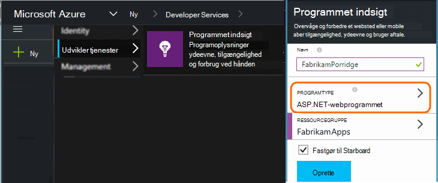
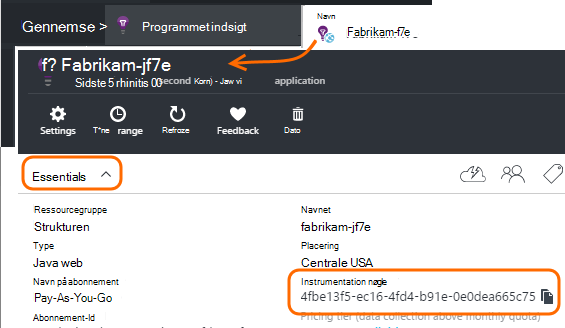

<properties 
    pageTitle="Separat program indsigt ressourcer til Udviklingscenter, test og" 
    description="Overvåge ydeevnen og brugen af dit program på forskellige stadier af udvikling" 
    services="application-insights" 
    documentationCenter=""
    authors="alancameronwills" 
    manager="douge"/>

<tags 
    ms.service="application-insights" 
    ms.workload="tbd" 
    ms.tgt_pltfrm="ibiza" 
    ms.devlang="na" 
    ms.topic="article" 
    ms.date="05/04/2016" 
    ms.author="awills"/>

# Adskille programmet indsigt ressourcer

Skal telemetri fra forskellige komponenter og versioner af dit program sendt til anden programmet indsigt ressourcer, eller kombineret i én? I denne artikel søger i bedste praksis og de nødvendige teknikker.

Først skal vi forstår spørgsmålet. De data, der er modtaget fra dit program er gemt og behandlet af programmet indsigt i en Microsoft Azure *ressource*. Hver ressource er identificeret med en *instrumentation nøgle* (iKey). I din app leveres tasten i programmet indsigt SDK, så den kan sende de data, der indsamles højre ressourcen. Tasten kan leveres, enten kode eller ApplicationInsights.config. Ved at ændre nøglen i SDK, kan du dirigere data til forskellige ressourcer. 

I et simpelt tilfælde, når du opretter koden for et nyt program, oprette du også en ny ressource i programmet indsigt. I Visual Studio gør dialogboksen *nyt projekt* ud for dig.

Hvis det er et store mængder websted, kan det være installeret på mere end én server-forekomst.

I mere komplekse scenarier har du et system, der består af flere komponenter – for eksempel et websted og en back end-processor. 

## Hvornår skal jeg bruge separat iKeys

Her er nogle generelle retningslinjer:

* Hvor du har en programmet på computeren kan installeres bekræftet af uafhængig enhed, der kører på en række server forekomster, der kan skaleres op/ned uafhængigt af andre komponenter, og derefter du normalt ville gøre tilknytte, til en enkelt ressource - det vil sige, kan det have en enkelt instrumentation nøgle (iKey).
* Derimod omfatter grunde til at bruge separate iKeys:
 - Nemt læse separat målepunkter fra separate komponenter.
 - Holde nederste lydstyrken telemetri adskilt fra store mængder, så (throttling), kvoter, og udvalg på én stream ikke påvirker den anden.
 - Separat påmindelser, eksportere og arbejde element konfigurationer.
 - Sprede [grænser](app-insights-pricing.md#limits-summary) såsom telemetri kvote, throttling og web teste Tæl.
 - Kode under udvikling og test skal sende til en separat iKey end fremstilling stempel.  

En masse programmet indsigt portalen oplevelser er designet med disse retningslinjer huske. For eksempel se servere segmenter på server-forekomst, hvilket gør antagelse, telemetri om et logisk komponent kan komme fra flere forekomster af server.

## Enkelt iKey

Hvor skal du sende telemetri fra flere komponenter til en enkelt iKey:

* Føje en egenskab til alle telemetri, der gør det muligt at segmentet og filtrere komponent-id. Rolle-ID'ET føjes automatisk til telemetri fra server rolle forekomster, men i andre tilfælde kan du bruge en [telemetri initialisering](app-insights-api-filtering-sampling.md#add-properties) egenskaben skal tilføjes.
* Opdater programmet indsigt SDK'er i de forskellige komponenter på samme tid. Telemetri til én iKey skal udspringe med den samme version af SDK.

## Separat iKeys

Hvor du har flere iKeys for forskellige programkomponenter:

* Oprette et [dashboard](app-insights-dashboards.md) til en visning af de vigtigste telemetri fra dit logiske-program, kombineres fra anden programkomponenterne. Dashboards kan deles, så en enkelt logisk systemvisning kan anvendes af forskellige teams.
* Organisere [ressourcegrupper](app-insights-resources-roles-access-control.md) på gruppeniveau. Adgangstilladelser tildeles af ressourcegruppe, og dette omfatter tilladelser til at konfigurere beskeder. 
* Brug [Azure ressourcestyring skabeloner og Powershell](app-insights-powershell.md) til at administrere elementer som regler for påmindelser og web test.

## Separat iKeys for Udviklingscenter/Test og

For at gøre det nemmere at ændre nøglen automatisk, når din app er udgivet, skal du angive iKey i kode, i stedet for i ApplicationInsights.config.

### Dynamisk instrumentation nøgle

Angive en nøgle i en initialiseringsmetode, som global.aspx.cs i en ASP.NET-tjenesten:

*C#*

    protected void Application_Start()
    {
      Microsoft.ApplicationInsights.Extensibility.
        TelemetryConfiguration.Active.InstrumentationKey = 
          // - for example -
          WebConfigurationManager.AppSettings["ikey"];
      ...

I dette eksempel placeres ikeys for de ressourcer, der er forskellige i forskellige versioner af web konfigurationsfil. Skift den web-konfigurationsfil - hvilket du kan gøre som en del af scriptet release - vil udskifte target ressourcen.

### Websider

IKey bruges også i din app websider i [script, som du har fået fra bladet Hurtig start](app-insights-javascript.md). I stedet for kodningssprog den direkte ind i script, kan du oprette den fra servertilstanden. For eksempel i en ASP.NET-app:

*JavaScript i Razor*

    <script type="text/javascript">
    // Standard Application Insights web page script:
    var appInsights = window.appInsights || function(config){ ...
    // Modify this part:
    }({instrumentationKey:  
      // Generate from server property:
      "@Microsoft.ApplicationInsights.Extensibility.
         TelemetryConfiguration.Active.InstrumentationKey"
    }) // ...

## Oprette en ekstra programmet indsigt ressource
  
Hvis du beslutter at adskille telemetri for forskellige programkomponenter eller forskellige stempler (Udviklingscenter/test/fremstilling) af samme komponent, får du har til at oprette en ny programmet indsigt ressource.

Tilføj en ressource programmet indsigt i [portal.azure.com](https://portal.azure.com):

* **Programtype** påvirker, hvad du ser på bladet oversigt og de egenskaber, der er tilgængeligt i [metriske Stifinder](app-insights-metrics-explorer.md). Hvis du ikke kan se din type app, vælge en af typerne web til websider.
* **Ressourcegruppe** er en praktisk til at administrere egenskaber som [adgangskontrol](app-insights-resources-roles-access-control.md). Du kan bruge separat ressourcegrupper til udvikling, test- og.
* **Abonnementet** er betalingskontoen i Azure.
* **Placeringen** er, hvor vi bevare dataene. I øjeblikket er ændres det ikke. 
* **Føj til dashboard** indsætter et hurtig adgang felt for ressourcen på startsiden for Azure. 

Oprettelse af ressourcen tager et par sekunder. Du får vist en besked, når guiden er fuldført.

(Du kan oprette en [PowerShell-script](app-insights-powershell-script-create-resource.md) for at oprette en ressource automatisk).

## Få tasten instrumentation

Tasten instrumentation identificerer den ressource, du har oprettet. 

Du skal bruge tasterne instrumentation for alle ressourcerne, som din app sender data.

 
