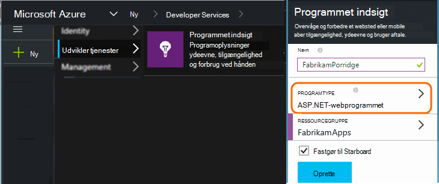
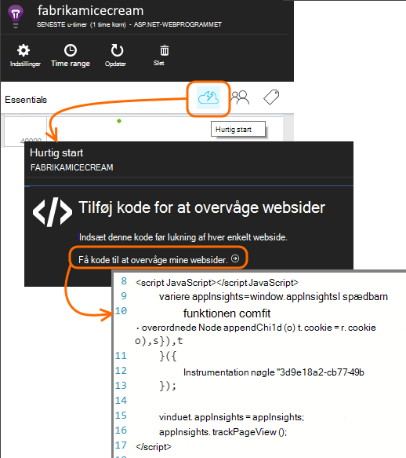
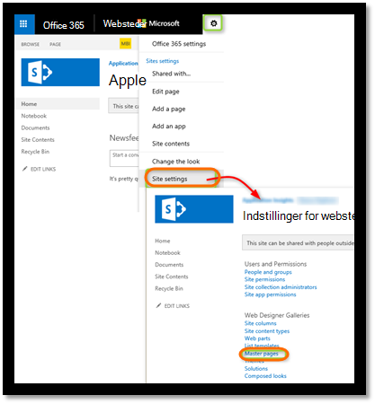
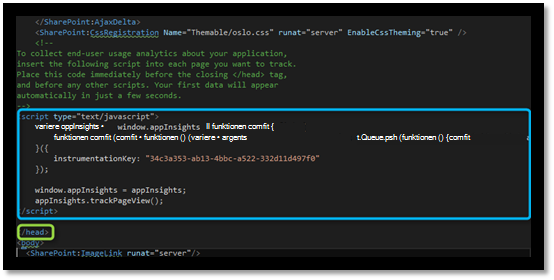
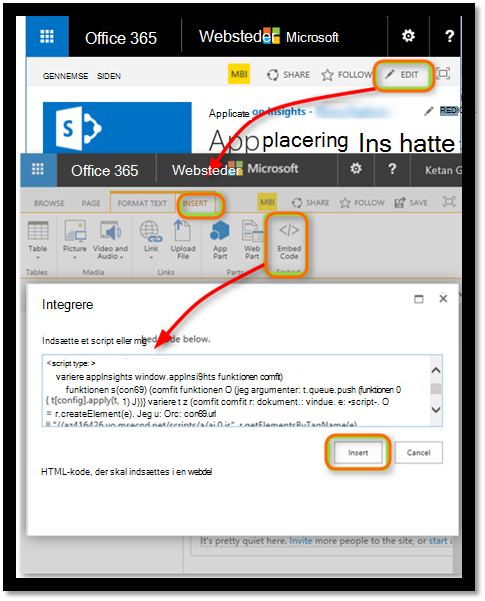
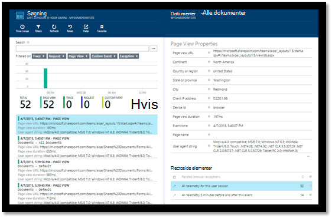
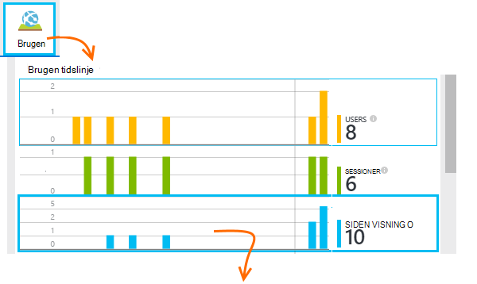
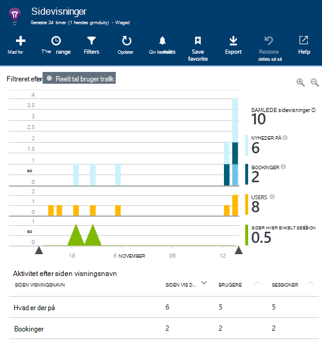
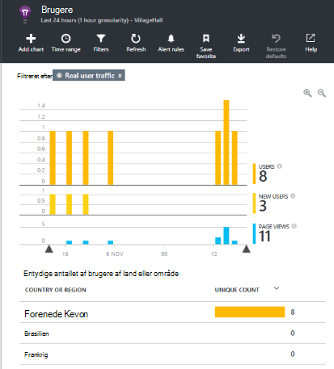
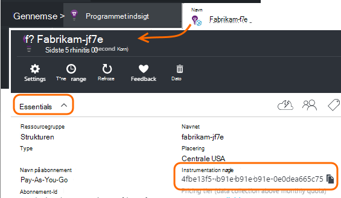

<properties 
    pageTitle="Overvåge et SharePoint-websted med programmet indsigt" 
    description="Starte overvågning af et nyt program med en ny instrumentation nøgle" 
    services="application-insights" 
    documentationCenter=""
    authors="alancameronwills" 
    manager="douge"/>

<tags 
    ms.service="application-insights" 
    ms.workload="tbd" 
    ms.tgt_pltfrm="ibiza" 
    ms.devlang="na" 
    ms.topic="article" 
    ms.date="03/24/2016" 
    ms.author="awills"/>

# <a name="monitor-a-sharepoint-site-with-application-insights"></a>Overvåge et SharePoint-websted med programmet indsigt


Visual Studio programmet indsigt overvåger tilgængelighed, ydeevne og brugen af dine apps. Her får du Lær, hvordan du implementerer et SharePoint-websted.


## <a name="create-an-application-insights-resource"></a>Oprette en programmet indsigt ressource


Oprette en ny programmet indsigt ressource i [Azure-portalen](https://portal.azure.com). Vælg ASP.NET som programtypen.




Bladet, der åbnes, er det sted, hvor du kan se ydeevne og data om brug af om din app. For at komme tilbage til den næste gang du logger på til Azure, skal du finde et felt til det på startskærmen. Du kan også klikke på Gennemse for at finde den.
    


## <a name="add-our-script-to-your-web-pages"></a>Føje vores script til dine websider

Få scriptet til websider i Hurtig Start:



Indsæt scriptet lige før den &lt;/hoved&gt; mærke på hver side, du vil registrere. Hvis webstedet har en masterside, kan du flytte scriptet der. For eksempel i et ASP.NET MVC projekt, du vil udskyde den i View\Shared\_Layout.cshtml

Scriptet indeholder tasten instrumentation, der omdirigerer telemetri til dit program indsigt ressource.

### <a name="add-the-code-to-your-site-pages"></a>Føj kode til din webstedssider

#### <a name="on-the-master-page"></a>På mastersiden

Hvis du kan redigere webstedets masterside, der angiver overvågning for hver side på webstedet.

Se mastersiden og redigere den ved hjælp af SharePoint Designer eller en anden editor.




Føj kode lige før den </head> mærke. 




#### <a name="or-on-individual-pages"></a>Eller på enkelte sider

For at overvåge et begrænset antal sider, skal du tilføje scriptet separat på hver side. 

Indsætte en webdel af typen og integrere kodestykket i den.





## <a name="view-data-about-your-app"></a>Få vist data om din app

Geninstaller din app.

Gå tilbage til dit program blade i [Azure-portalen](https://portal.azure.com).

De første hændelser vises i Søg. 



Klik på Opdater efter et par sekunder, hvis du forventer flere data.

Klik på **brugsstatistik** til at se til diagrammer af brugere, sessioner og sidevisninger fra bladet oversigt:



Klik på et diagram for at få vist flere detaljer – for eksempel sidevisninger:



Eller brugere:





## <a name="capturing-user-id"></a>Indsamle bruger-Id


Standard webside kodestykke registrere ikke bruger-id fra SharePoint, men du kan gøre det med en mindre ændring.


1. Kopiere din app instrumentation nøgle fra Essentials rullemenu i programmet indsigt. 


    

2. Erstatte tasten instrumentation 'XXXX' i kodestykket nedenfor. 
3. Integrere scriptet i din SharePoint-app i stedet for det kodestykke, du får fra portalen.


```


<SharePoint:ScriptLink ID="ScriptLink1" name="SP.js" runat="server" localizable="false" loadafterui="true" /> 
<SharePoint:ScriptLink ID="ScriptLink2" name="SP.UserProfiles.js" runat="server" localizable="false" loadafterui="true" /> 
  
<script type="text/javascript"> 
var personProperties; 
  
// Ensure that the SP.UserProfiles.js file is loaded before the custom code runs. 
SP.SOD.executeOrDelayUntilScriptLoaded(getUserProperties, 'SP.UserProfiles.js'); 
  
function getUserProperties() { 
    // Get the current client context and PeopleManager instance. 
    var clientContext = new SP.ClientContext.get_current(); 
    var peopleManager = new SP.UserProfiles.PeopleManager(clientContext); 
     
    // Get user properties for the target user. 
    // To get the PersonProperties object for the current user, use the 
    // getMyProperties method. 
    
    personProperties = peopleManager.getMyProperties(); 
  
    // Load the PersonProperties object and send the request. 
    clientContext.load(personProperties); 
    clientContext.executeQueryAsync(onRequestSuccess, onRequestFail); 
} 
     
// This function runs if the executeQueryAsync call succeeds. 
function onRequestSuccess() { 
var appInsights=window.appInsights||function(config){
function s(config){t[config]=function(){var i=arguments;t.queue.push(function(){t[config].apply(t,i)})}}var t={config:config},r=document,f=window,e="script",o=r.createElement(e),i,u;for(o.src=config.url||"//az416426.vo.msecnd.net/scripts/a/ai.0.js",r.getElementsByTagName(e)[0].parentNode.appendChild(o),t.cookie=r.cookie,t.queue=[],i=["Event","Exception","Metric","PageView","Trace"];i.length;)s("track"+i.pop());return config.disableExceptionTracking||(i="onerror",s("_"+i),u=f[i],f[i]=function(config,r,f,e,o){var s=u&&u(config,r,f,e,o);return s!==!0&&t["_"+i](config,r,f,e,o),s}),t
    }({
        instrumentationKey:"XXXX"
    });
    window.appInsights=appInsights;
    appInsights.trackPageView(document.title,window.location.href, {User: personProperties.get_displayName()});
} 
  
// This function runs if the executeQueryAsync call fails. 
function onRequestFail(sender, args) { 
} 
</script> 


```


## <a name="next-steps"></a>Næste trin

* [Web test](app-insights-monitor-web-app-availability.md) til at overvåge tilgængeligheden af dit websted.

* [Programmet indsigt](app-insights-overview.md) til andre typer app.


<!--Link references-->


 