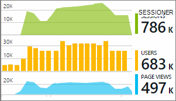

<properties 
    pageTitle="Programmet indsigt telemetri i Visual Studio CodeLens | Microsoft Azure" 
    description="Hurtig adgang til dit program indsigt anmodningen og undtagelse telemetri med CodeLens i Visual Studio." 
    services="application-insights" 
    documentationCenter=".net"
    authors="numberbycolors" 
    manager="douge"/>

<tags 
    ms.service="application-insights" 
    ms.workload="tbd" 
    ms.tgt_pltfrm="ibiza" 
    ms.devlang="na" 
    ms.topic="get-started-article" 
    ms.date="08/30/2016" 
    ms.author="daviste"/>
    
# Programmet indsigt telemetri i Visual Studio CodeLens

Metoder i koden for din online kan være forsynet med telemetri om kørselstidspunktet undtagelser og Anmod om svar gange. Hvis du installerer [Visual Studio programmet indsigt](app-insights-overview.md) i dit program, vises telemetri i Visual Studio [CodeLens](https://msdn.microsoft.com/library/dn269218.aspx) - noter øverst på hver enkelt funktion, hvor du er vant til at se nyttige oplysninger, som antallet pladser funktionen der refereres eller den sidste person, der redigeres den.

> [AZURE.NOTE] Programmet indsigt i CodeLens er tilgængelig i Visual Studio 2015 Update 3 og nyere, eller med den seneste version af [Analytics-udviklerværktøjer filtypenavn](https://visualstudiogallery.msdn.microsoft.com/82367b81-3f97-4de1-bbf1-eaf52ddc635a). CodeLens er tilgængelig i Enterprise og Professional udgaver af Visual Studio.

## Sådan finder du programmet indsigt data

Se efter programmet indsigt telemetri i CodeLens symbolerne af offentlige anmodning om metoder til dit webprogram. CodeLens indikatorer vises over metode og andre angivelser i C# og Visual Basic-kode. Hvis programmet indsigt data er tilgængelige for en metode, får du vist indikatorer for anmodninger om og undtagelser som "100 anmoder om, 1% mislykkedes" eller "10 undtagelser." Klik på en CodeLens indikator kan finde flere oplysninger. 

> [AZURE.TIP] Programmet indsigt i mødeindkaldelsen og undtagelse symboler kan tage et par ekstra sekunder at indlæse efter andre CodeLens indikatorer vises.

## Undtagelser i CodeLens

Indikatoren undtagelse CodeLens viser antallet af undtagelser, der er opstået i de seneste 24 timer fra de hyppigst forekommende undtagelser i dit program i denne periode, under behandlingen af anmodningen served ved hjælp af metoden 15.

Hvis du vil have vist flere detaljer, skal du klikke på indikatoren undtagelser CodeLens:

* Den procentvise forskel i antallet af undtagelser fra de seneste 24 timer i forhold til de foregående 24 timer
* Vælg **Gå til kode** til at navigere til kildekode for funktionen aktiverende undtagelsen
* Vælg **Søg** til at forespørge alle forekomster af denne undtagelse, der er opstået i de seneste 24 timer
* Vælg **tendens** til at få vist en tendens-visualisering efter forekomster af denne undtagelse i de seneste 24 timer
* Vælg **få vist alle undtagelser i denne app** til at forespørge alle undtagelser, der er opstået i de seneste 24 timer
* Vælg **Gennemse undtagelse tendenser** for at få vist en tendens visualisering for alle undtagelser, der er opstået i de seneste 24 timer. 

> [AZURE.TIP] Hvis du ser "0 undtagelser" i CodeLens, men du ved, at der skal være undtagelser, kontrollere Sørg for, at den rigtige programmet indsigt ressource er valgt i CodeLens. Højreklik på dit projekt i Solution Explorer for at vælge en anden ressource, og vælg **programmet indsigt > Vælg Telemetri kilde**. CodeLens vises kun for 15 de fleste hyppigst forekommende undtagelser i dit program i de seneste 24 timer, så hvis en undtagelse er 16 hyppigst eller mindre, kan du se "0 undtagelser." Undtagelser fra ASP.NET visninger vises muligvis ikke på metoderne controller, som genererede disse visninger.

> [AZURE.TIP] Hvis du ser "? undtagelser"i CodeLens, du har brug at knytte din Azure-konto til Visual Studio eller dine legitimationsoplysninger for Azure-konto kan være udløbet. I begge tilfælde, skal du klikke på "? undtagelser", og vælg **Tilføj en konto …** for at angive dine legitimationsoplysninger.

## Anmodninger i CodeLens

Anmodningen CodeLens indikator viser antallet af HTTP-anmodninger, der er blevet repareret ved en metode i de seneste 24 timer, plus procentdelen af disse anmodninger, der mislykkedes.

Hvis du vil have vist flere detaljer, skal du klikke på anmodninger CodeLens indikator:

* De absolutte og den procentvise ændringer i antallet af anmodninger om mislykkede anmodninger og gennemsnitlige svar gange hen over de seneste 24 timer, der er sammenlignet med de foregående 24 timer
* Pålideligheden af den metode, beregnes som procentdelen af forespørgsler, der ikke mislykkedes i de seneste 24 timer
* Vælg **Søg** efter anmodninger eller mislykkede anmodninger at forespørge på alle (mislykkedes) anmodninger, der er opstået i de seneste 24 timer
* Vælg **tendens** til at få vist en tendens visualisering for anmodninger, mislykkede anmodninger eller gennemsnitlige svar gange i de seneste 24 timer.
* Vælg navnet på ressourcen, programmet indsigt i øverste venstre hjørne af den CodeLens detaljevisning til at ændre, hvilke ressource er kilden til CodeLens data.

## Næste trin

||
|---|---
|**[Arbejde med programmet indsigt i Visual Studio](app-insights-visual-studio.md)** Søge telemetri, se data i CodeLens og konfigurere programmet indsigt. Alt sammen i Visual Studio. |
|**[Tilføje flere data](app-insights-asp-net-more.md)** Overvåge brugen, tilgængelighed, afhængigheder, undtagelser. Integrere sporinger fra logføring strukturer. Skrive brugerdefinerede telemetri. | 
|**[Arbejde med portalen programmet indsigt](app-insights-dashboards.md)** Dashboards, effektive diagnosticerings- og analytisk værktøjer, beskeder, en direkte afhængighed kort over dine programmer og telemetri eksportere. |
