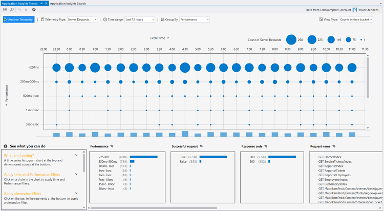
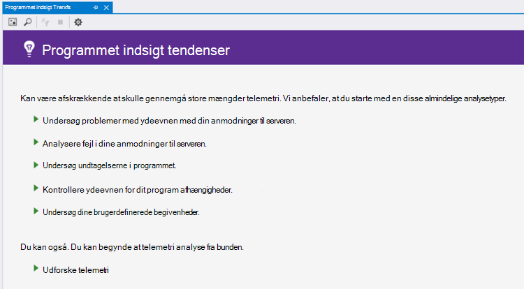
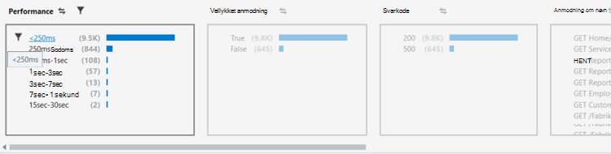
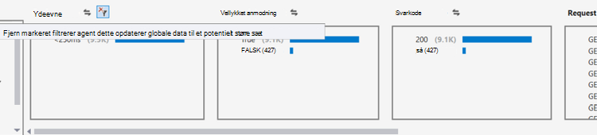
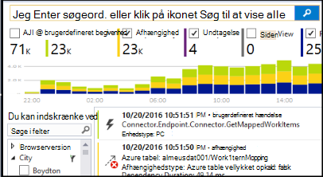

<properties 
    pageTitle="Analysere tendenser i Visual Studio | Microsoft Azure" 
    description="Analysere, visualisere og udforske tendenser i dit program indsigt telemetri i Visual Studio." 
    services="application-insights" 
    documentationCenter=".net"
    authors="numberbycolors" 
    manager="douge"/>

<tags 
    ms.service="application-insights" 
    ms.workload="tbd" 
    ms.tgt_pltfrm="ibiza" 
    ms.devlang="na" 
    ms.topic="get-started-article" 
    ms.date="10/25/2016" 
    ms.author="daviste"/>
    
# Analysere tendenser i Visual Studio

Værktøjet programmet indsigt tendenser visualiseres, hvordan dit program vigtige telemetri begivenheder ændrer sig med tiden, så du hurtigt kan identificere problemer og afvigelser. Ved at sammenkæde du med mere detaljerede diagnostiske oplysninger, kan tendenser hjælpe dig med at forbedre din app ydeevnen, spore årsager til undtagelser og afdække viden fra dine brugerdefinerede begivenheder.

> [AZURE.NOTE] Programmet indsigt tendenser er tilgængelig i Visual Studio 2015 Update 3 og nyere, eller med den [Analytics-udviklerværktøjer lokalnummer](https://visualstudiogallery.msdn.microsoft.com/82367b81-3f97-4de1-bbf1-eaf52ddc635a) version 5.209 eller nyere.

## Åbn programmet indsigt tendenser

At åbne vinduet programmet indsigt tendenser:

* Værktøjslinjeknappen programmet indsigt Vælg **Udforske Telemetri tendenser**, eller
* Fra genvejsmenuen project skal du vælge **programmet indsigt > udforske Telemetri tendenser**, eller
* Vælg menulinjen Visual Studio **Vis > andre Windows > programmet indsigt tendenser**.

Du kan se en meddelelse om at vælge en ressource. Klik på **Vælg en ressource**, log på med et Azure-abonnement og derefter vælge en programmet indsigt ressource fra listen, du vil analysere telemetri tendenser.

## Vælg en tendensanalyse

Kom i gang ved at vælge en af fem almindelige tendens analyser, hver analyse data fra de seneste 24 timer:

* **Problemer med ydeevnen Investigate med dine anmodninger om server** - anmodninger til din tjeneste, grupperet efter svar gange
* **Analysér fejl i dine anmodninger om server** - anmodninger til din tjeneste, grupperet efter HTTP-svarkode
* **Undersøge undtagelser i dit program** - undtagelser fra din tjeneste, grupperet efter Undtagelsestype
* **Kontrollere ydeevnen for dit program afhængigheder** - tjenester, der kaldes af din tjeneste, grupperet efter svar gange
* **Undersøge dine brugerdefinerede begivenheder** - brugerdefinerede hændelser, du har konfigureret for din tjeneste grupperet efter hændelsestype.

Disse færdigbyggede analyser findes senere fra knappen **Vis almindelige typer telemetri analysis** i det øverste venstre hjørne af vinduet tendenser.

## Visualisere tendenser i dit program

Programmet indsigt tendenser opretter en serie tidsvisualisering fra din app telemetri. Hver gang serie visualisering viser én type telemetri, grupperet efter en egenskab for pågældende telemetri over nogle tidsinterval. For eksempel kan du få vist anmodninger til serveren, grupperet efter det land, hvor de stammer fra, over de seneste 24 timer. I dette eksempel vil hver boble på Visualiseringen repræsenterer en optælling af serviceanmodninger om nogle land/område under en time.

Brug kontrolelementerne øverst i vinduet til at justere, hvilke typer telemetri, du får vist. Først skal du vælge typerne telemetri, hvor du er interesseret:

* **Telemetri Type** - anmodninger til serveren, undtagelser, depdendencies eller brugerdefinerede hændelser
* **Tidsinterval** - hvor som helst fra de seneste 30 minutter til sidste 3 dage
* **Group By** - undtagelse type problem-ID, land/område og mere.

Klik derefter på **Analysere Telemetri** for at køre forespørgslen.

Til at navigere mellem bobler i Visualiseringen:

* Klik for at vælge en boble, som opdaterer filtre i bunden af vinduet, summering af kun de hændelser, der er opstået i en bestemt tidsperiode
* Dobbeltklik på en boble for at gå til søgeværktøjet og se alle de individuelle telemetri hændelser, der er indtruffet i denne periode
* CTRL-klik en boble at deaktivere den i Visualiseringen.

> [AZURE.TIP] Tendenser og søgning tools arbejde sammen for at hjælpe dig med at finde årsagerne til problemer i din tjeneste mellem tusindvis af telemetri begivenheder. Eksempelvis hvis én eftermiddag kunderne Bemærk din app er ved at blive mindre svarede, starte med tendenser. Analysere anmodninger til tjenesten over de seneste adskillige timer grupperet efter svartid. Se, om der er en meget stor klynge af langsom anmodninger. Derefter dobbeltklikke på boblen at gå til søgeværktøjet, filtreret til disse anmodning om begivenheder. Fra søgningen, kan du undersøge indholdet af disse anmodninger og gå til den kode til at løse problemet.

## Filter

Se mere specifikke tendenser med Filterkontrolelementer nederst i vinduet. Hvis du vil anvende et filter, skal du klikke på navnet. Du kan hurtigt skifte mellem forskellige filtre til at finde tendenser, der kan skjule i en bestemt dimension af din telemetri. Hvis du anvender et filter i en dimension, som Undtagelsestype, forbliver filtre i andre dimensioner klikbart, selvom de vises nedtonet. Til FN-anvende et filter skal du klikke på den igen. CTRL-klik for at markere flere filtre i den samme dimension.

Hvad nu, hvis du vil anvende flere filtre? 

1. Anvend det første filter. 
2. Klik på knappen **Anvend markerede filtre og forespørgsel igen** af navnet på dimensionen af dit første filter. Dette vil genforespørge din telemetri til kun de hændelser, der svarer til det første filter. 
3. Anvende et andet filter. 
4. Gentag processen for at finde tendenser i bestemte undersæt af din telemetri. For eksempel anmodninger til serveren med navnet "Hent hjem/indeks" _og_ , der stammer fra Tyskland, _og_ som har modtaget en 500 svarkode. 

Til FN-Anvend en af disse filtre, skal du klikke på knappen **Fjern markerede filtre og forespørgslen igen** for dimensionen.

## Finde afvigelser

Værktøjet tendenser kan fremhæve bobler hændelser, der er uoverensstemmende sammenlignet med andre bobler i den samme tidsserie. Vælg **tæller i tid Malerbøtte (Fremhæv afvigelser)** eller **procenter i gang Malerbøtte (Fremhæv afvigelser)**i rullemenuen visningstype. Rød bobler er uoverensstemmende. Afvigelser er defineret som bobler med tæller/procentdele overstiger 2.1 gange standardafvigelsen for de tæller/procentdele, som fra fortiden to tidsperioder (48 timer, hvis du får vist de seneste 24 timer osv.).

> [AZURE.TIP] Fremhæve afvigelser er især nyttig til at finde outliers i tidsserie med små bobler, der ellers kan se på samme måde tilpasset.  

## Næste trin

||
|---|---
|**[Arbejde med programmet indsigt i Visual Studio](app-insights-visual-studio.md)** Søge telemetri, se data i CodeLens og konfigurere programmet indsigt. Alt sammen i Visual Studio. |
|**[Tilføje flere data](app-insights-asp-net-more.md)** Overvåge brugen, tilgængelighed, afhængigheder, undtagelser. Integrere sporinger fra logføring strukturer. Skrive brugerdefinerede telemetri. | 
|**[Arbejde med portalen programmet indsigt](app-insights-dashboards.md)** Dashboards, effektive diagnosticerings- og analytisk værktøjer, beskeder, en direkte afhængighed kort over dine programmer og telemetri eksportere. |
