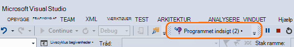
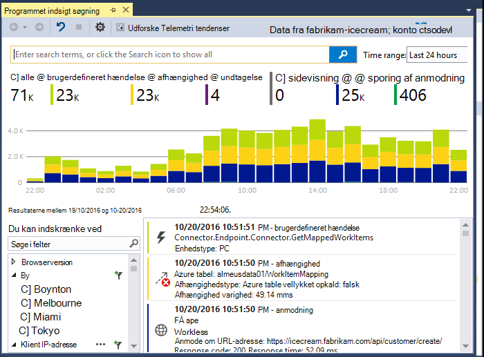
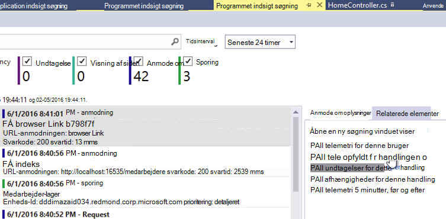
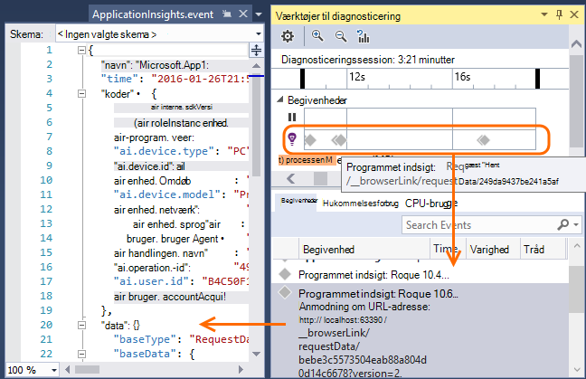
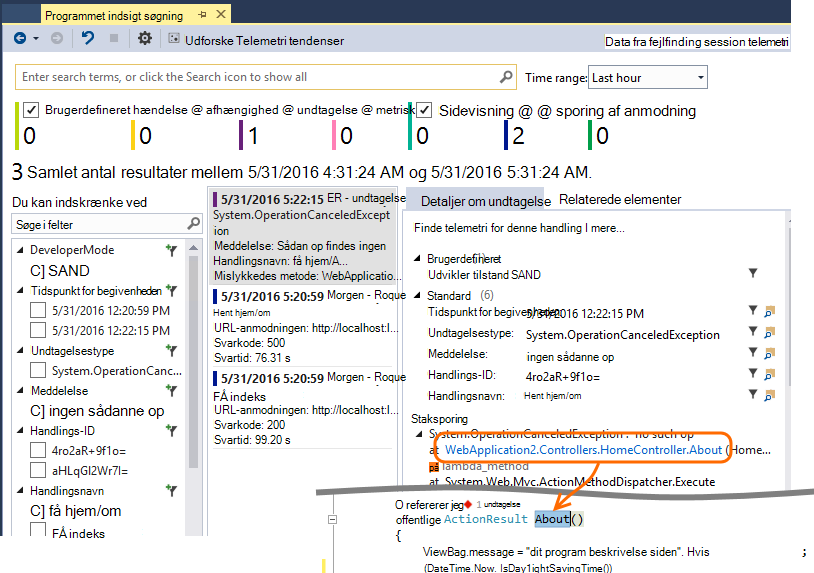
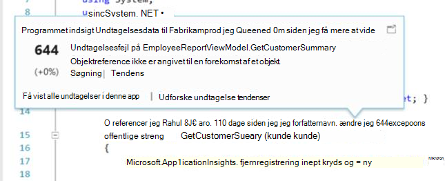
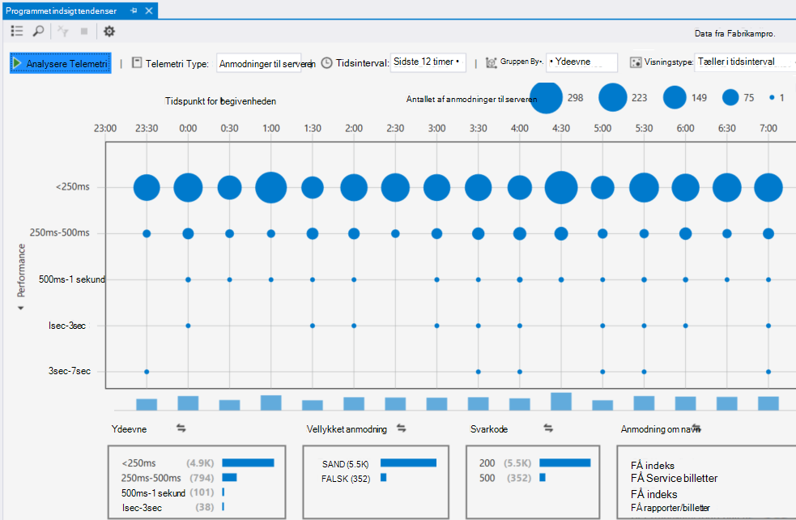

<properties 
    pageTitle="Arbejde med programmet indsigt i Visual Studio" 
    description="Analyse af ydeevnen og diagnosticering under fejlfinding og fremstilling." 
    services="application-insights" 
    documentationCenter=".net"
    authors="alancameronwills" 
    manager="douge"/>

<tags 
    ms.service="application-insights" 
    ms.workload="tbd" 
    ms.tgt_pltfrm="ibiza" 
    ms.devlang="na" 
    ms.topic="get-started-article" 
    ms.date="06/21/2016" 
    ms.author="awills"/>

# Arbejde med programmet indsigt i Visual Studio

Du kan analysere ydeevne og diagnosticere problemer både i forbindelse med fejlfinding og fremstilling, ved hjælp af telemetri fra [Visual Studio programmet indsigt](app-insights-overview.md)i Visual Studio (2015 eller nyere).

Hvis du endnu ikke har [Installeret programmet indsigt i din app](app-insights-asp-net.md), gør det nu.

## Fejlfinding af dit projekt

Kør programmet med F5, og prøv det: åbne forskellige sider for at generere nogle telemetri.

I Visual Studio, får du vist en optælling af de hændelser, der er blevet gemt.

Klik på denne knap for at åbne diagnosticering søgning. 

## Diagnosticering søgning

Vinduet Søg vises hændelser, der er blevet gemt. (Hvis du logget på Azure, når du konfigurerer programmet viden, du vil kunne søge de samme hændelser på portalen.)

Gratis tekst søgningen fungerer på en hvilken som helst felter i hændelserne. Eksempelvis Søg efter en del af URL-adressen på en side eller værdien af en egenskab som klient by; eller bestemte ord i en logfil over sporing.

Klik på en hvilken som helst begivenhed for at få vist egenskaberne detaljerede.

Du kan også åbne fanen relaterede elementer for at hjælpe med at diagnosticere mislykkede anmodninger eller undtagelser.

## Diagnosticerings-hub

Diagnosticerings-Hub (i Visual Studio 2015 eller nyere) viser programmet indsigt server telemetri, som den er oprettet. Det fungerer også selvom du har valgt kun, hvis du vil installere SDK, uden at oprette forbindelse til en ressource på portalen Azure.

## Undtagelser

Hvis du har [oprettet undtagelse overvågning](app-insights-asp-net-exceptions.md), undtagelse rapporter, vises i vinduet Søg. 

Klik på en undtagelse for at få et stablen spor. Hvis koden for appen er åben i Visual Studio, kan du klikke gennem fra staksporing til den relevante linje af koden.

Desuden i linjen kode Lens over hver enkelt metode, får du vist en optælling af de undtagelser, der er logget af programmet indsigt i det seneste 24 timer.

## Lokal overvågning

(Fra Visual Studio 2015 opdatering 2) Hvis du ikke har konfigureret SDK for at sende telemetri til portalen programmet indsigt (så der ikke er nogen instrumentation nøgle i ApplicationInsights.config) vises vinduet diagnosticering telemetri fra din seneste fejlfinding session. 

Dette er hensigtsmæssigt, hvis du allerede har udgivet en tidligere version af din app. Du vil ikke telemetri fra din fejlfinding sessioner for at være blandet sammen med telemetri på portalen programmet indsigt fra publicerede app.

Det er også nyttigt, hvis du har nogle [brugerdefinerede telemetri](app-insights-api-custom-events-metrics.md) , som du vil foretage fejlfinding inden du sender telemetri til portalen.

* *I første omgang konfigureret jeg fuldt programmet indsigt for at sende telemetri til portalen. Men nu jeg gerne vil se telemetri kun i Visual Studio.*

 * I vinduet Søg indstillinger, der ikke mulighed for at søge lokale diagnosticering, selvom din app sender telemetri til portalen.
 * Hvis du vil stoppe telemetri, der sendes til portalen, skrive en kommentar ud linjen `<instrumentationkey>...` fra ApplicationInsights.config. Fjern den, når du er klar til at sende telemetri til portalen igen.

## Tendenser

Tendenser er et værktøj til at visualisere, hvordan din app reagere over tid. 

Vælg **Udforske Telemetri tendenser** fra programmet indsigt værktøjslinjeknap eller søgevinduet programmet indsigt. Vælg en af fem almindelige forespørgsler for at komme i gang. Du kan analysere forskellige datasæt baseret på telemetri typer, tidsintervaller og andre egenskaber. 

For at finde afvigelser i dine data skal du vælge en af anomali indstillingerne under "Visningstype" rulleliste. De filtreringsindstillinger nederst i vinduet gør det nemt at finpudse i på bestemte undersæt af din telemetri.

[Lær mere om tendenser](app-insights-visual-studio-trends.md).

## Hvad skal der ske nu?

||
|---|---
|**[Tilføje flere data](app-insights-asp-net-more.md)** Overvåge brugen, tilgængelighed, afhængigheder, undtagelser. Integrere sporinger fra logføring strukturer. Skrive brugerdefinerede telemetri. | 
|**[Arbejde med portalen programmet indsigt](app-insights-dashboards.md)** Dashboards, effektive diagnosticerings- og analytisk værktøjer, beskeder, en direkte afhængighed kort over dine programmer og telemetri eksportere. |

 
