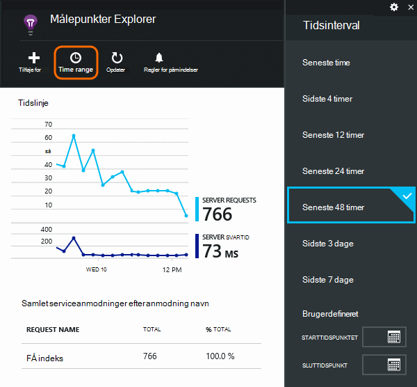
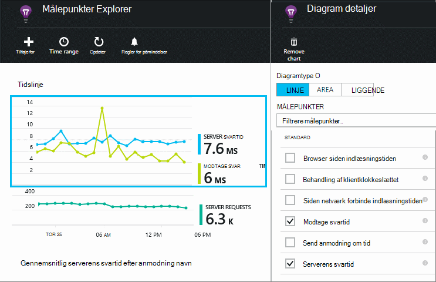
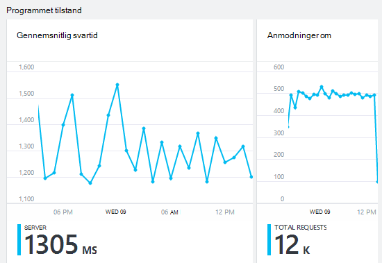
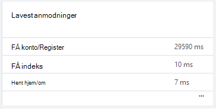
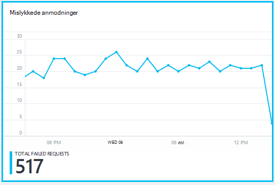
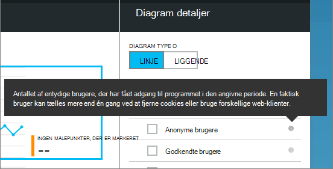
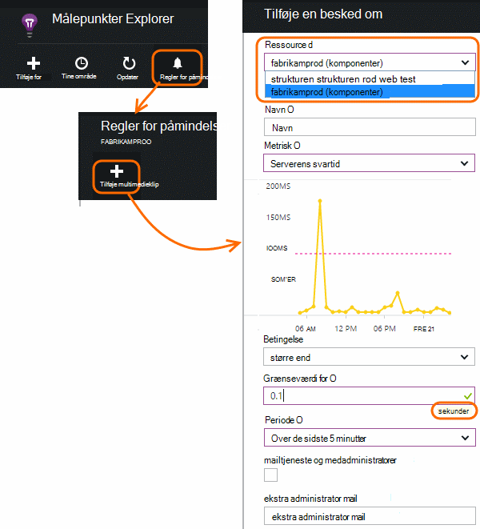

<properties 
    pageTitle="Overvåge din app tilstand og brug i programmet indsigt" 
    description="Introduktion til programmet indsigt. Analysere brugen, tilgængelighed og ydeevnen i din lokale eller Microsoft Azure-programmer." 
    services="application-insights" 
    documentationCenter=""
    authors="alancameronwills" 
    manager="douge"/>

<tags 
    ms.service="application-insights" 
    ms.workload="tbd" 
    ms.tgt_pltfrm="ibiza" 
    ms.devlang="na" 
    ms.topic="article" 
    ms.date="11/25/2015" 
    ms.author="awills"/>
 
# Overvåg ydeevne i webprogrammer

*Programmet indsigt er i Vis udskrift.*

Sørg for, at dit program fungerer godt, og hurtigt finde ud af, om eventuelle fejl. [Programmet indsigt] [ start] skal fortælle dig, om eventuelle problemer med ydeevnen og undtagelser, og hjælpe dig med at finde og diagnosticere grundlæggende årsager.

Programmet indsigt kan overvåge både Java og ASP.NET web-programmer og tjenester, WCF-tjenester. De kan være hostet lokalt, på virtuelle maskiner, eller som Microsoft Azure-websteder. 

På klientsiden, kan programmet indsigt tage telemetri fra websider og en lang række enheder, herunder iOS, Android- og Windows Store-apps.

## Konfigurere overvågning

Hvis du ikke allerede har tilføjet programmet indsigt til projektet (hvis den ikke har ApplicationInsights.config), vælge en af følgende måder at komme i gang:

* [ASP.NET webapps](app-insights-asp-net.md)
 * [Tilføj undtagelse overvågning](app-insights-asp-net-exceptions.md)
 * [Tilføje afhængighed overvågning](app-insights-monitor-performance-live-website-now.md)
* [J2EE webapps](app-insights-java-get-started.md)
 * [Tilføje afhængighed overvågning](app-insights-java-agent.md)

## Udforskning af ydeevnen målepunkter

I [portalen Azure](https://portal.azure.com), gå til programmet indsigt ressourcen, som du har konfigureret for dit program. Bladet oversigt viser grundlæggende ydelsesdata:

Klik på et diagram til at få flere detaljer og at få vist resultater for en længere periode. For eksempel skal du klikke på feltet anmodninger, og vælg derefter et tidsinterval:

Klik på et diagram for at vælge, hvilke målepunkter det viser, eller tilføje et nyt diagram og vælge dens metrik:

> [AZURE.NOTE] **Fjern markeringen i alle målene** for at få vist det fulde udvalg, som er tilgængelig. Målene falder inden for grupper. Når et medlem af en gruppe er markeret, vises kun de andre medlemmer af den pågældende gruppe.

## Hvad betyder det alle? Ydeevnen felter og rapporter

Der er mange forskellige ydeevne mål kan du få. Lad os starte med dem, der som standard vises på bladet programmet på computeren.

### Anmodninger om

Antallet af HTTP-anmodninger modtaget i en bestemt periode. Sammenligne det med resultaterne på andre rapporter for at se, hvordan din app fungerer som afkrydsningsfeltet Indlæs varierer.

HTTP-anmodninger omfatter alle GET eller POST anmodninger om sider, data og billeder.

Klik på feltet for at få tæller til bestemte URL-adresser.

### Gennemsnitlig svartid

Måler tiden mellem en web anmodning om at indtaste dit program og svaret returneres.

Punkterne få vist bevægeligt gennemsnit. Hvis der er mange anmodninger, kan der være nogle, der afviger fra gennemsnitsværdien uden en indlysende top eller dip i diagrammet.

Se efter usædvanlige spidser. Generelt Forvent svartid at stige med en stigning i anmodninger. Hvis stigningen er uforholdsmæssig, nå din app kan en ressourcegrænse som CPU eller kapacitet til en tjeneste, der bruges.

Klik på feltet for at få gange til bestemte URL-adresser.

### Lavest anmodninger

Viser, hvilke anmodninger skal muligvis justering af ydeevnen.

### Mislykkede anmodninger

En optælling af forespørgsler, der udløste en ikke-opfanget undtagelser.

Klik på feltet for at se detaljerne for specifikke fejl, og vælg en individuel anmodning kan se dens detaljer. 

Kun et repræsentant eksempel antal mislykkede forsøg bevares til individuelle inspektion.

### Anden metrik

Hvis du vil se, hvad angive anden metrik, du kan få vist, klik på et diagram og derefter fjerne markeringen af alle målene at se den fulde, der er tilgængelige. Klik på (i) for at få vist hver metrisk definition.

Hvis du vælger en hvilken som helst metrisk deaktiveres de andre, der ikke kan vises i det samme diagram.

## Angive beskeder

Hvis du vil have besked via mail usædvanlige værdierne af enhver metrisk, skal du tilføje en besked. Du kan vælge enten at sende mail til konto administratorer eller til bestemte mailadresser.

Angiv ressourcen, før de andre egenskaber. Vælg ikke webtest ressourcer, hvis du vil indstille påmindelser for ydeevnen eller brugen målepunkter.

Sørg for at være opmærksom på de enheder, hvor du bliver bedt om Angiv grænseværdien.

*Jeg kan ikke se knappen Tilføj besked.* -Er dette en gruppe konto, du har adgang til skrivebeskyttet tilstand? Spørg kontoadministratoren.

## Diagnosticere problemer

Her er nogle tip til at finde og diagnosticering problemer med ydeevnen:

* Konfigurere [web test] [ availability] have besked, hvis dit websted går ned eller reagerer forkert eller langsomt. 
* Sammenligne anmodning antal sammen med anden metrik for at se, om fejl eller langsom svar er relateret til indlæse.
* [Indsætte, og Søg efter spor sætninger] [ diagnostic] i din kode for at udpege problemer.

## Næste trin

[Web test] [ availability] -web anmodninger skal sendes til dit program med jævne mellemrum fra hele verden.

[Registrere og søge i diagnosticering sporinger] [ diagnostic] – indsætte sporing opkald og gennemse resultaterne til pinpoint problemer.

[Brugen sporing] [ usage] -finde ud af, hvordan folk bruger dit program.

[Fejlfinding i forbindelse med] [ qna] - og Q & A

## Video

[AZURE.VIDEO performance-monitoring-application-insights]

<!--Link references-->

[availability]: app-insights-monitor-web-app-availability.md
[diagnostic]: app-insights-diagnostic-search.md
[greenbrown]: app-insights-asp-net.md
[qna]: app-insights-troubleshoot-faq.md
[redfield]: app-insights-monitor-performance-live-website-now.md
[start]: app-insights-overview.md
[usage]: app-insights-web-track-usage.md

 
