<properties 
    pageTitle="Besøgsanalyse for webprogrammer med programmet indsigt" 
    description="Oversigt over brugsstatistik for webapps med programmet indsigt" 
    services="application-insights" 
    documentationCenter=""
    authors="alancameronwills" 
    manager="douge"/>

<tags 
    ms.service="application-insights" 
    ms.workload="tbd" 
    ms.tgt_pltfrm="ibiza" 
    ms.devlang="na" 
    ms.topic="article" 
    ms.date="06/12/2016" 
    ms.author="awills"/>
 
# <a name="usage-analysis-for-web-applications-with-application-insights"></a>Besøgsanalyse for webprogrammer med programmet indsigt

Viden om, hvordan folk bruger dit program, kan du fokusere din udviklingsarbejde på de scenarier, der er vigtigst for dem, og få indblik i, som de kan finde lettere eller sværere at opnå mål. 

Visual Studio programmet indsigt indeholder to niveauer af Brug sporing af:

* **Brugere, session og få vist data** - leveres af feltet.  
* **Brugerdefineret telemetri** - du [skrive programkode] [ api] til at spore brugerne via din app brugeroplevelsen. 

## <a name="setting-up"></a>Konfiguration af

Åbn en ressource, som programmet indsigt i [Azure-portalen](https://portal.azure.com), klik på tom Browser siden indlæse diagrammet, og følg konfigurationsvejledningen.

[Lær mere](app-insights-javascript.md) 


## <a name="how-popular-is-my-web-application"></a>Hvordan populære er min webprogram?

Log på [Azure portal][portal], gå til dit program ressource, og klik på brug:

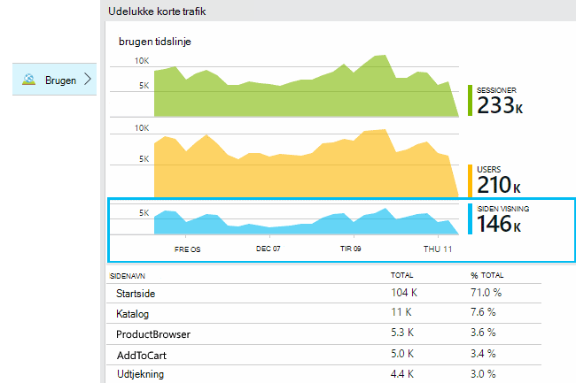

* **Brugere:** Antallet af entydige aktive brugere i det tidsrum i diagrammet. 
* **Sessioner:** Antallet af aktive sessioner
* **Sidevisninger** Tæller antallet af kald til trackPageView(), kaldes typisk én gang i hver enkelt webside.

Klik på diagrammer til at få vist flere detaljer. Bemærk, at du kan ændre tidsintervallet for diagrammerne.

### <a name="where-do-my-users-live"></a>Hvor live Mine brugere?

Klik på brugere diagrammet for at få vist flere detaljer fra bladet brugen:

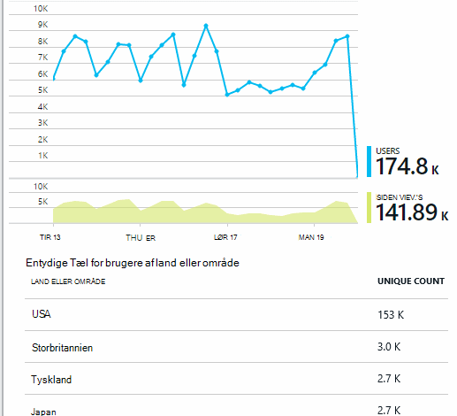
 
### <a name="what-browsers-or-operating-systems-do-they-use"></a>Hvilke browsere eller operativsystemer de bruger?

Gruppe (segment) data efter en egenskab som Browser, operativsystem eller by:

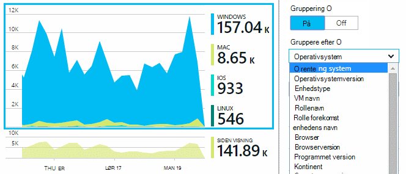


## <a name="sessions"></a>Sessioner

Session er et grundlæggende begreber i programmet viden, formål er at tilknytte alle telemetri - såsom anmodninger, sidevisninger, undtagelser, eller de brugerdefinerede hændelser, du kode selv - med en bestemt brugersession. 

RTF kontekstoplysninger der indsamles om hver enkelt session, som karakteristik, geografisk placering, operativsystem osv.

Hvis du instrumentere både klienten og serveren ([ASP.NET] [ greenbrown] eller [J2EE][java]), SDK'er overføres session-id mellem klienten og serveren, så der kan være mellem begivenheder på begge sider.

Når [diagnosticering][diagnostic], du kan finde alle telemetri, der er relateret til den session, hvori der opstod et problem, herunder alle anmodninger og alle begivenheder undtagelser eller sporinger, der blev registreret.

Sessioner giver en god mål for popularitets af kontekster som enhed, operativsystem eller placering. Ved at vise antallet af sessioner, der er grupperet efter enhed, for eksempel få du en mere nøjagtig antal hvor ofte enheden bruges sammen med din app end ved at tælle sidevisninger. Dette er en praktisk input til prioritere for en hvilken som helst enhed-specifikke problem.


#### <a name="whats-a-session"></a>Hvad er en session?

En session repræsenterer en enkelt støder på mellem brugeren og app. I sin enkleste form session starter med en bruger starter appen og afsluttes, når brugeren forlader appen. For webapps ophører som standard sessionen efter 30 minutters inaktivitet eller 24 timer for aktivitet. 

Du kan ændre disse standardindstillinger ved at redigere kodestykket:

    <script type="text/javascript">
        var appInsights= ... { ... }({
            instrumentationKey: "...",
            sessionRenewalMs: 3600000,
            sessionExpirationMs: 172800000
        });

* `sessionRenewalMs`: Tid i millisekunder, til at udløbe sessionen på grund af brugerens inaktivitet. Standard: 30 minutter.
* `sessionExpirationMs`: Den maksimale session-længde i millisekunder. Hvis brugeren forbliver aktive efter denne gang, tælles en anden session. Standard: 24 timer.

**Varighed af session** er en [metrikværdi] [ metrics] , der registrerer tidsrum mellem de første og sidste telemetri elementer af sessionen. (Den ikke indeholder timeout-perioden).

**Session Tæl** i et bestemt interval er defineret som antallet af entydige sessioner med nogle aktiviteter inden for dette interval. Når du ser på en lang tid område som daglige session Tæl for den seneste uge, er som regel svarer til det samlede antal sessioner. 

Men, når du udforske kortere tidsintervaller, som hver time korn, der der skal tælles en lang session, der strækker sig over flere timer for hver time, hvori sessionen var aktiv. 

## <a name="users-and-user-counts"></a>Brugere og bruger optællinger


Hver brugersession er knyttet til et unikt bruger-id. 

Brugeren er som standard identificeret ved at placere en cookie. En bruger, der bruger flere browsere eller enheder der skal tælles mere end én gang. (Men se [godkendte brugere](#authenticated-users))


**Bruger Tæl** metrisk i et bestemt interval er defineret som antallet af entydige brugere med registrerede aktiviteter inden for dette interval. Derfor kan kan brugere med lange sessioner gøres regnskab flere gange, når du indstiller et tidsinterval, så kornet er mindre end en time, eller så.

**Nye brugere** tæller de brugere, hvis første sessioner med appen opstod dette interval. Hvis der bruges standardmetoden for optælling af brugere af cookies, vil dette også omfatte brugere, der har fjernet deres cookies, eller der bruger en ny enhed eller browser til at få adgang til din app for første gang.
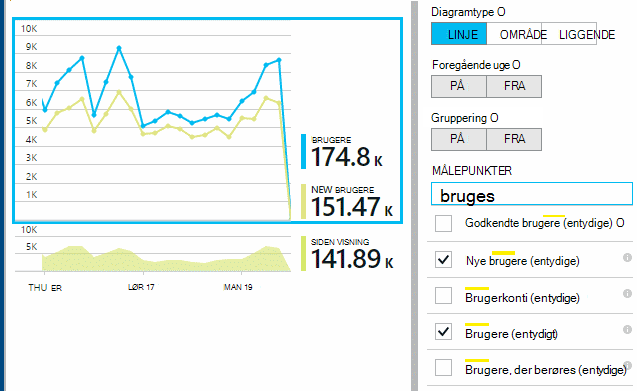

### <a name="authenticated-users"></a>Godkendte brugere

Hvis din online kan brugerne kan logge på, kan du få en mere nøjagtig tælling ved at indsende programmet indsigt med et unikt bruger-id. Det behøver ikke at være deres navn eller samme-id, du bruger i din app. Så snart din app har fundet brugeren, kan du bruge denne kode:


*JavaScript på klient*

      appInsights.setAuthenticatedUserContext(userId);

Hvis din app grupperer brugere i konti, kan du også overføre et id for kontoen. 

      appInsights.setAuthenticatedUserContext(userId, accountId);

Bruger- og konto-id'er må ikke indeholde mellemrum eller tegn`,;=|`


I [målepunkter explorer](app-insights-metrics-explorer.md), kan du oprette et diagram over **Godkendte brugere** og - **konti**. 

## <a name="synthetic-traffic"></a>Korte trafik

Korte trafik omfatter anmodninger fra tilgængelighed og belastning test, søgecrawlere-program og andre supportmedarbejdere. 

Program indsigt forsøg stræber efter til automatisk at finde ud af, og klassificere korte trafik og markere den korrekt. I de fleste tilfælde korte trafik ikke starte JavaScript SDK, så denne aktivitet udelades fra bruger og session optælling. 

Dog for programmet indsigt [web test][availability], bruger-id er automatisk konfigureret baseret på POP placering, og session-id'et angives baseret på test køre-id. I rapporter, korte trafik filtreres ud som standard, der udelader disse brugere og sessioner. Når korte trafik er inkluderet, kan det medføre en lille stigning i overordnede brugere og session tæller.
 
## <a name="page-usage"></a>Brug af siden

Klik på via siden visninger diagrammet for at få en mere zoomet version sammen med en opdeling af de mest populære sider:


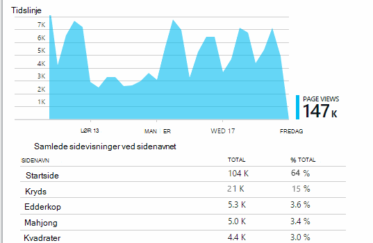
 
Ovenstående eksempel er fra et spil websted. Herfra kan vi med det samme se:

* Brug ikke er forbedret i den seneste uge. Vi bør måske tænke søgemaskineoptimering?
* Mange færre personer se spil sider end startsiden. Hvorfor ikke startsiden tiltrække andre kan afspille spil?
* 'Kryds' er de mest populære game. Vi bør give prioritet til nye ideer og forbedringer der.

## <a name="custom-tracking"></a>Brugerdefineret registrering

Lad os sige, i stedet for implementering af hver game i en separat webside, du beslutter at refactor dem alle i den samme enkeltsidet app med de fleste funktioner kodet som Javascript på websiden. Dette gør det muligt for brugeren at skifte hurtigt mellem én game og en anden, eller også har flere spil på én side. 

Men du stadig vil have programmet indsigt til at logge af antallet gange hver game åbnes på nøjagtigt samme måde som når de er på separate websider. Det er nemt: kun indsætte et opkald til modulet telemetri i din JavaScript, hvor du vil post, der er åbnet en ny side:

    appInsights.trackPageView(game.Name);

## <a name="custom-events"></a>Brugerdefinerede hændelser

Skrive brugerdefinerede telemetri at logføre bestemte hændelser. Særligt i en enkelt side-app skal du ved, hvor ofte brugeren udfører bestemte handlinger eller opnår bestemte mål: 

    appInsights.trackEvent("GameEnd");

For eksempel, til at logge at klikke på et link:

    <a href="target.htm" onclick="appInsights.trackEvent('linkClick');return true;">my link</a>


## <a name="view-counts-of-custom-events"></a>Få vist optællinger for de brugerdefinerede hændelser

Åbn målepunkter Stifinder og føje et diagram for at få vist begivenheder. Segment skal tildeles ved navn:

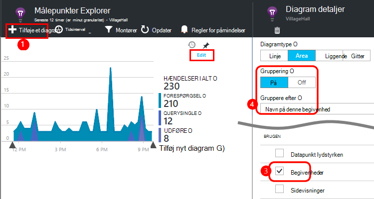


## <a name="drill-into-specific-events"></a>Fokuser på detaljer i bestemte hændelser

For at få en bedre forståelse af, hvordan en typisk session går, vil du fokusere på en bestemt brugersession, der indeholder en bestemt type hændelse. 

I dette eksempel skal indkodet vi en brugerdefineret hændelse "NoGame", som kaldes, hvis brugeren logger uden rent faktisk startes en game. Hvorfor vil en bruger, der? Hvis vi Fokuser på detaljer i nogle bestemte forekomster, så vi måske får dette. 

De brugerdefinerede hændelser, der er modtaget fra app vises efter navn på bladet oversigt:


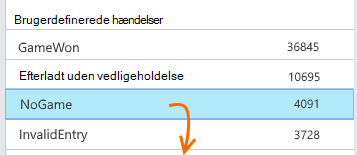
 
Klik dig gennem hændelsen af interesse, og vælg en seneste bestemte forekomst:


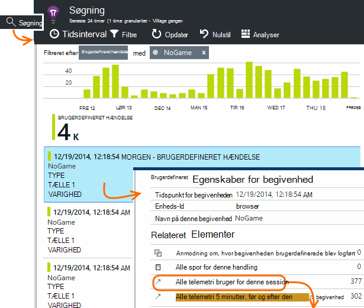
 
Lad os se på alle telemetri for den session, hvori bestemt NoGame hændelsen opstod. 


 
Der ikke er nogen undtagelser, så brugeren ikke blev forhindres afspilning af nogle fejl.
 
Vi kan filtrere alle typer telemetri undtagen sidevisninger for denne session:


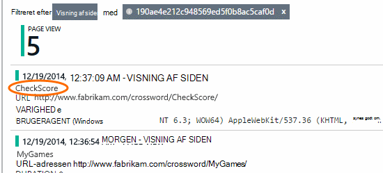
 
Og vi kan nu se, at denne bruger logget på blot for at kontrollere de seneste resultater. Vi bør måske overveje at udvikle en bruger tekstenhed, der gør det nemmere at gøre det. (Og vi skal implementere en brugerdefineret hændelse til rapport, når denne bestemte tekstenhed indtræffer.)

## <a name="filter-search-and-segment-your-data-with-properties"></a>Filtrere, søge og opdele dataene med egenskaber
Du kan vedhæfte vilkårlig mærker og numeriske værdier til begivenheder.
 

*JavaScript på klient*

```JavaScript

    appInsights.trackEvent("WinGame",
        // String properties:
        {Game: currentGame.name, Difficulty: currentGame.difficulty},
        // Numeric measurements:
        {Score: currentGame.score, Opponents: currentGame.opponentCount}
    );
```

*C# på serveren*

```C#

    // Set up some properties:
    var properties = new Dictionary <string, string> 
        {{"game", currentGame.Name}, {"difficulty", currentGame.Difficulty}};
    var measurements = new Dictionary <string, double>
        {{"Score", currentGame.Score}, {"Opponents", currentGame.OpponentCount}};

    // Send the event:
    telemetry.TrackEvent("WinGame", properties, measurements);
```

*VB på serveren*

```VB

    ' Set up some properties:
    Dim properties = New Dictionary (Of String, String)
    properties.Add("game", currentGame.Name)
    properties.Add("difficulty", currentGame.Difficulty)

    Dim measurements = New Dictionary (Of String, Double)
    measurements.Add("Score", currentGame.Score)
    measurements.Add("Opponents", currentGame.OpponentCount)

    ' Send the event:
    telemetry.TrackEvent("WinGame", properties, measurements)
```

Tilknytte egenskaber til sidevisninger på samme måde:

*JavaScript på klient*

```JS

    appInsights.trackPageView("Win", 
        url,
        {Game: currentGame.Name}, 
        {Score: currentGame.Score});
```

Få vist egenskaberne ved at klikke på via en enkelt forekomst af en begivenhed i diagnosticering Søg.


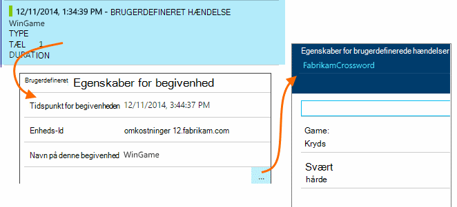
 
Brug søgefeltet til at se begivenhed forekomster med en bestemt egenskabsværdi.


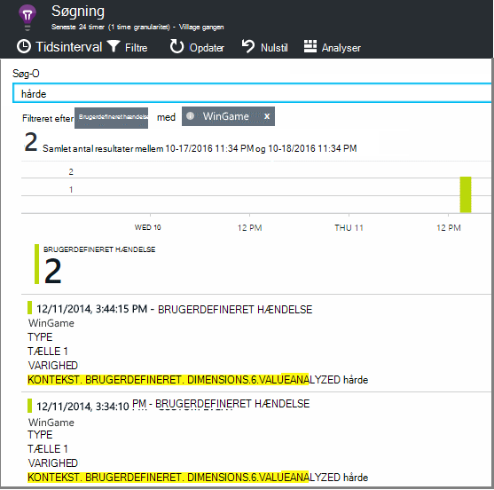


## <a name="a--b-testing"></a>A | Test af B

Hvis du ikke ved, hvilken variant af en funktion vil være bedre, slip begge af dem, at hver tilgængeligt for forskellige brugere. Måle succes af hver, og derefter flytte til en samlet version.

For denne metode vedhæfte du særskilte mærker til alle telemetri, der sendes af hver version af din app. Du kan gøre det ved at definere egenskaber i den aktive TelemetryContext. Disse standardegenskaber føjes til alle telemetri meddelelser, der sender programmet – ikke kun dine brugerdefinerede meddelelser, men den standard telemetri samt. 

I portalen programmet viden, du vil derefter kunne Filtrer og grupper (segment) dine data på mærkerne, således at sammenligne de forskellige versioner.

*C# på serveren*

```C#

    using Microsoft.ApplicationInsights.DataContracts;

    var context = new TelemetryContext();
    context.Properties["Game"] = currentGame.Name;
    var telemetry = new TelemetryClient(context);
    // Now all telemetry will automatically be sent with the context property:
    telemetry.TrackEvent("WinGame");
```

*VB på serveren*

```VB

    Dim context = New TelemetryContext
    context.Properties("Game") = currentGame.Name
    Dim telemetry = New TelemetryClient(context)
    ' Now all telemetry will automatically be sent with the context property:
    telemetry.TrackEvent("WinGame")
```

Individuelle telemetri kan tilsidesætte standardværdierne.

Du kan konfigurere ved initialisering af en universal, så alle nye TelemetryClients automatisk bruge din kontekst.

```C#


    // Telemetry initializer class
    public class MyTelemetryInitializer : ITelemetryInitializer
    {
        public void Initialize (ITelemetry telemetry)
        {
            telemetry.Properties["AppVersion"] = "v2.1";
        }
    }
```

I app-initialisering som Global.asax.cs:

```C#

    protected void Application_Start()
    {
        // ...
        TelemetryConfiguration.Active.TelemetryInitializers
        .Add(new MyTelemetryInitializer());
    }
```


## <a name="build---measure---learn"></a>Få mere at vide build - mål-

Når du bruger analytics, bliver en integreret del af din udviklingscyklus – ikke bare noget du synes om for at løse problemer. Her er nogle tip:

* Find ud af den vigtigste metrikværdi for dit program. Vil du have så mange brugere som muligt, eller foretrækker du et lille sæt meget tilfreds brugere? Vil du maksimere besøg eller salg?
* Planlægge at måle hver tekstenhed. Når du skitsere en ny bruger tekstenhed eller funktion, eller for at opdatere en eksisterende database, synes altid om, hvordan du vil måle succes efter ændringen. Spørg før kodningssprog starter "hvilken virkning vil dette have på vores statistik, hvis det fungerer? Bør vi registrere alle nye begivenheder?"
Og naturligvis når funktionen er direkte, skal du se på analyser og handle på siden resultater. 
* Anden metrik er relateret til den vigtige metrikværdi. Eksempelvis hvis du føjer funktionen "Foretrukne", du vil gerne vide, hvor ofte brugerne tilføje favoritter. Men det er måske mere interessant at vide, hvor ofte de kommer tilbage til deres Favoritter. Og det vigtigste er, kan kunder, der bruger Favoritter i sidste ende købe mere af dit produkt?
* Kanariske test. Konfigurere en funktion parameter, der gør det muligt at foretage en ny funktion vises kun for nogle brugere. Bruge programmet indsigt til at se, om den nye funktion bruges i den måde, du planlagte. Foretage justeringer, og slip det til et større publikum.
* Tale med dine brugere! Analytics er ikke nok af sig selv, men komplementære til at vedligeholde en god kunderelation.


## <a name="references"></a>Referencer

* [Brug af API - oversigt][api]
* [JavaScript API reference](https://github.com/Microsoft/ApplicationInsights-JS/blob/master/API-reference.md)

## <a name="video"></a>Video

> [AZURE.VIDEO usage-monitoring-application-insights]


<!--Link references-->

[api]: app-insights-api-custom-events-metrics.md
[availability]: app-insights-monitor-web-app-availability.md
[client]: app-insights-javascript.md
[diagnostic]: app-insights-diagnostic-search.md
[greenbrown]: app-insights-asp-net.md
[java]: app-insights-java-get-started.md
[metrics]: app-insights-metrics-explorer.md
[portal]: http://portal.azure.com/
[windows]: app-insights-windows-get-started.md

 
