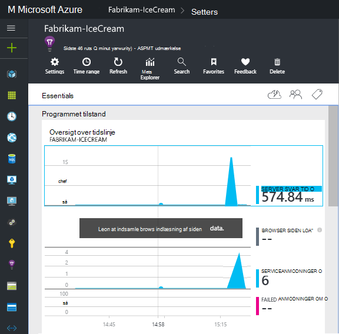

<properties
    pageTitle="Indsigt til Windows programtjenester og arbejder roller | Microsoft Azure"
    description="Tilføje manuelt i programmet indsigt SDK til ASP.NET-program til at analysere brugen, tilgængelighed og ydeevne."
    services="application-insights"
    documentationCenter=".net"
    authors="alancameronwills"
    manager="douge"/>

<tags
    ms.service="application-insights"
    ms.workload="tbd"
    ms.tgt_pltfrm="ibiza"
    ms.devlang="na"
    ms.topic="get-started-article"
    ms.date="08/30/2016"
    ms.author="awills"/>

# Konfigurere programmet indsigt til ASP.NET 4 programmer manuelt

*Programmet indsigt er i Vis udskrift.*

[AZURE.INCLUDE [app-insights-selector-get-started](../../includes/app-insights-selector-get-started.md)]

Du kan manuelt konfigurere [Visual Studio programmet indsigt](app-insights-overview.md) at overvåge Windows services, arbejder roller og andre ASP.NET-programmer. Manuel konfiguration er et alternativ til [automatisk konfiguration](app-insights-asp-net.md) , som Visual Studio til webapps.

Programmet indsigt hjælper dig med at diagnosticere problemer med og Overvåg ydeevne og brug i direkte programmet.

#### Før du starter

Du har brug for:

* Et abonnement på [Microsoft Azure](http://azure.com). Hvis dit team eller din organisation har et abonnement på Azure, kan ejeren føje dig til det, ved hjælp af din [Microsoft-konto](http://live.com).
* Visual Studio 2013 eller nyere.

## 1. Opret en programmet indsigt ressource

Log på [Azure-portalen](https://portal.azure.com/), og oprette en ny programmet indsigt ressource. Vælg ASP.NET som programtypen.

En [ressource](app-insights-resources-roles-access-control.md) i Azure er en forekomst af en tjeneste. Denne ressource er hvor telemetri fra din app, analysere og præsenteres for dig.

Valg af programtype angiver standard indholdet af ressource blade og egenskaberne, ses i [Målepunkter Stifinder](app-insights-metrics-explorer.md).

#### Kopiere Instrumentation nøglen

Tasten identificerer ressourcen, og du vil installere den snart i SDK til at dirigere data til ressourcen.

De trin, du netop har udført for at oprette en ny ressource er en god måde at starte overvågning af et program. Nu kan du sende data til den.

## 2. Installer SDK i dit program

Installation og konfiguration af programmet indsigt SDK varierer afhængigt af den platform, du arbejder på. Det er nemt til ASP.NET-apps.

1. I Visual Studio, skal du redigere NuGet pakker af projektet web app.

    

2. Installere programmet indsigt SDK til Webapps.

    

    *Kan jeg bruge andre pakker?*

    Ja. Vælg Core API (Microsoft.ApplicationInsights), hvis du kun vil bruge API til at sende din egen telemetri. Windows Server-pakken indeholder automatisk Core API plus et antal andre pakker som ydeevne tællerindsamling og afhængighed overvågning. 

#### At opgradere til fremtidige versioner af SDK

Vi medtage en ny version af SDK fra tid til anden.

Åbn NuGet pakke manager igen og filtrere de installerede pakker for at opgradere til en [ny version af SDK](https://github.com/Microsoft/ApplicationInsights-dotnet-server/releases/). Vælg **Microsoft.ApplicationInsights.Web** og vælg **opgradere**.

Hvis du har foretaget eventuelle tilpasninger ApplicationInsights.config, kan du gemme en kopi af filen, før du opgraderer, og bagefter flette dine ændringer til den nye version.

## 3. sende telemetri

**Hvis du har installeret pakken core API:**

* Angive en instrumentation nøgle i kode, for eksempel i `main()`: 

    `TelemetryConfiguration.Active.InstrumentationKey = "`*din nøgle*`";` 

* [Skrive dine egne telemetri ved hjælp af API](app-insights-api-custom-events-metrics.md#ikey).

**Hvis du har installeret andre programmet indsigt-pakker,** kan du, hvis du foretrækker, bruge .config-filen til at indstille nøglen instrumentation:

* Redigere ApplicationInsights.config (som blev tilføjet af NuGet installation). Indsætte lige før mærket lukning:

    `<InstrumentationKey>`*tasten instrumentation, du har kopieret*`</InstrumentationKey>`

* Sørg for, at egenskaberne for ApplicationInsights.config i Solution Explorer er sat til **opbygge handling = indhold, Kopiér til Output Directory = kopi**.

## Køre dit projekt

Tryk på **F5** for at køre programmet, og prøv det: åbne forskellige sider for at generere nogle telemetri.

I Visual Studio, får du vist en optælling af de hændelser, der er sendt.

## Få vist din telemetri

Gå tilbage til [Azure-portalen](https://portal.azure.com/) , og gå til dit program indsigt ressource.

Søge efter data i oversigt over diagrammer. I første omgang ser du bare et eller to punkter. Eksempel:

Klik dig gennem et diagram for at se flere målepunkter. [Lær mere om målepunkter.](app-insights-web-monitor-performance.md)

#### Ingen data?

* Bruge programmet, åbne forskellige sider, så det genererer nogle telemetri.
* Åbn feltet [Søg](app-insights-diagnostic-search.md) for at få vist individuelle begivenheder. Nogle gange tager det begivenheder lidt mens længere tid at komme gennem en målepunkter pipeline.
* Vent et par sekunder og klikke på **Opdater**. Diagrammer med jævne mellemrum opdatere sig selv, men du kan opdatere manuelt, hvis du venter for nogle data vises.
* Se [fejlfinding](app-insights-troubleshoot-faq.md).

## Publicere din app

Nu installere programmet til din server eller til Azure, og se dataene point, der kræves.

Når du kører i fejlsikret tilstand, hurtig telemetri gennem en pipeline, så du bør se data, der vises i sekunder. Når du installerer din app i Release konfiguration, indsamles data langsommere.

#### Ingen data, når du publicerer til din server?

Åbn følgende porte til udgående trafik i din server firewall:

+ `dc.services.visualstudio.com:443`
+ `f5.services.visualstudio.com:443`

#### Problemer med at på build-serveren?

Se [emnet Fejlfinding](app-insights-asp-net-troubleshoot-no-data.md#NuGetBuild).

> [AZURE.NOTE]Hvis din app genereres en masse telemetri (og du bruger ASP.NET SDK version 2.0.0-beta3 eller nyere), modulet tilpasset udvalg vil automatisk reducere lydstyrken, der sendes til portalen ved at sende en repræsentant brøkdel af begivenheder. Dog hændelser, der er relateret til den samme anmodning markeres eller ikke er markeret som en gruppe, så du kan navigere mellem relaterede begivenheder. 
> [Få mere at vide om udvalg](app-insights-sampling.md).

## Næste trin

* [Tilføje flere telemetri](app-insights-asp-net-more.md) til at få den fulde 360-graders visning af dit program.

