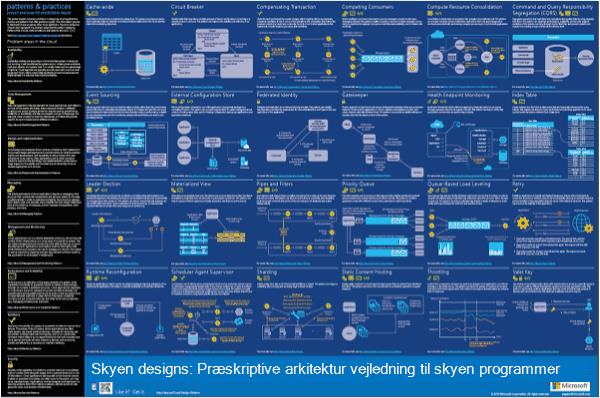
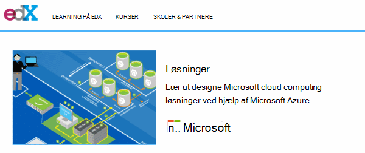
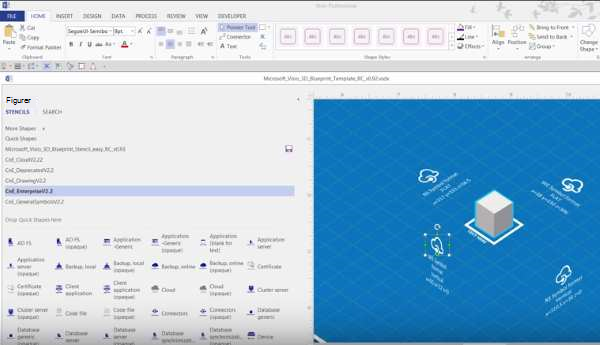
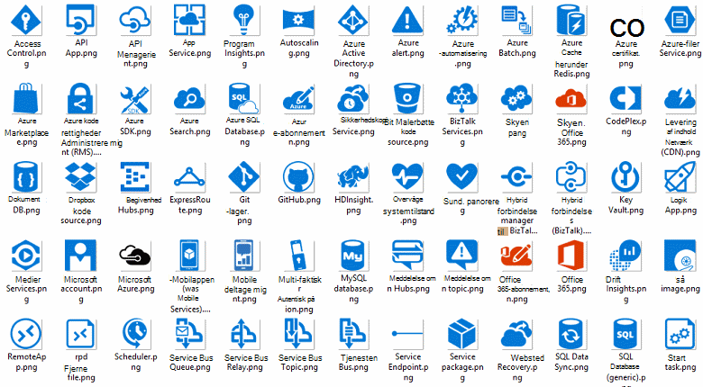
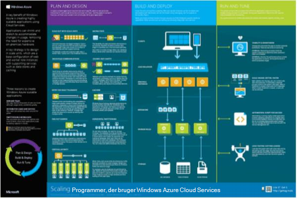

<properties 
    pageTitle="Programmet arkitektur på Microsoft Azure | Microsoft Azure" 
    description="Oversigt over arkitektur, der dækker almindelige designs" 
    services="" 
    documentationCenter="" 
    authors="Rboucher" 
    manager="jwhit" 
    editor="mattshel"/>

<tags 
    ms.service="multiple" 
    ms.workload="na" 
    ms.tgt_pltfrm="na" 
    ms.devlang="na" 
    ms.topic="article" 
    ms.date="09/13/2016" 
    ms.author="robb"/>

#Programmet arkitektur på Microsoft Azure
Ressourcer til udvikling af programmer, der bruger Microsoft Azure. Dette omfatter værktøjer for at hjælpe dig med at tegne diagrammer for at beskrive visuelt softwaresystemer. 

##Design mønstre plakat

Microsoft mønstre og fremgangsmåder, der er publiceret bogen [Skyen designs](http://msdn.microsoft.com/library/dn568099.aspx) , som er tilgængelig både på MSDN og i PDF-downloade. Der er også en store formater tilgængelige plakat som viser alle mønstrene. 

##Microsoft arkitektur certificering kursus

Microsoft har oprettet et arkitektur kursus understøttende Microsoft certificering eksamen 70-534. Den er [tilgængelig gratis på EDX.ORG](https://www.edx.org/course/architecting-microsoft-azure-solutions-microsoft-dev205x).  Det bruges [3D-grundrids Visio-skabelon](#3d-blueprint-visio-template). 

##Microsoft-løsninger

Microsoft udgiver et sæt af høj niveau [løsning arkitekturer](http://aka.ms/azblueprints) viser, hvordan du opretter bestemte typer af systemer ved hjælp af Microsoft-produkter. 

Tidligere, Microsoft publiceret et sæt af perspektivplaner, der viser eksempel arkitekturer. Dem, der er blevet erstattet af de løsning arkitekturer, der er nævnt tidligere, og linket grundrids er blevet omdirigeret pege på dem. Hvis du skal have adgang til de forrige perspektivplaner materialer eller anden grund, kan du sende [CnESymbols@microsoft.com](mailto:CnESymbols@microsoft.com) med din anmodning.   

Benytte en del af [skyen og Enterprise Symbol angive](#Drawing-symbol-and-icon-sets)perspektivplaner og løsning arkitekturer diagrammer.   

##3D-grundrids Visio-skabelon

3D-versioner af den nu defunct [Microsoft arkitektur perspektivplaner](http://aka.ms/azblueprints) blev oprindeligt oprettet i et ikke-Microsoft værktøj. En Visio 2013 (eller nyere) skabelon afsendt på 5 Aug 2015 som en del af en [Microsoft-arkitekturen certificering kurset fordelt på EDX.ORG](#microsoft-architecture-certification-course).

Skabelonen er også tilgængelig uden for kurset. 

- [Vis uddannelse video](http://aka.ms/3dBlueprintTemplateVideo) første, så du ved, hvad det kan gøre   
- Hent den [Microsoft 3D-grundrids Visio-skabelon](http://aka.ms/3DBlueprintTemplate)
- Hent [skyen og Enterprise symboler](#drawing-symbol-and-icon-sets) til brug med 3D-skabelonen. 

Sende en e-mail til [CnESymbols@microsoft.com](mailto:CnESymbols@microsoft.com) specifikke spørgsmål ikke besvaret ved-uddannelsesmaterialer eller at give feedback. Skabelonen er ikke længere under aktive udvikling, men det er stadig nyttige og relevante, da det kan bruge en hvilken som helst PNG eller i [skyen og Enterprise symboler](#drawing-symbol-and-icon-sets), som er opdateret.  

##Tegning symbol og ikon sæt 

[Få vist Visio og symboler kursus video](http://aka.ms/CnESymbolsVideo) og derefter [hente i skyen og Enterprise Symbol angive](http://aka.ms/CnESymbols) for at oprette tekniske materialer, som beskriver Azure, Windows Server, SQL Server og meget mere. Du kan bruge symbolerne i netværksarkitekturdiagrammer, kursusmaterialer, præsentationer, dataark, infographics, hvidbøger og endda 3 part bøger, hvis bogen træner brugerne skal bruge Microsoft-produkter. De er dog ikke beregnet til brug i brugergrænseflader.

CnE symboler er i Visio, SVG- og PNG-format. Yderligere oplysninger om, hvordan du bruger nemt bruge symboler i PowerPoint er inkluderet i dialogboksen Angiv. 

Symbolsættet leveres kvartalsvis og opdateres, når der udgives nye tjenester. 

Flere symboler til Microsoft Office og relaterede teknologier er tilgængelige i [Microsoft Office Visio stencilen](http://www.microsoft.com/en-us/download/details.aspx?id=35772), selvom de ikke er optimeret til arkitektonisk diagrammer, som sættet CnE er.   

**Feedback:** Hvis du har brugt CnE symboler, Udfyld den korte 5 spørgsmål [undersøgelse](http://aka.ms/azuresymbolssurveyv2) eller sende os på [CnESymbols@microsoft.com](mailto:CnESymbols@microsoft.com) specifikke spørgsmål og problemer. Vi vil gerne vide, hvad du mener, herunder positive feedback, så vi vide for at fortsætte med at investere tid i dem. 

##Arkitektur Infographics

Microsoft udgiver flere arkitektur relateret plakater/infographics. De omfatter [Dokumentkomponent reale skyen programmer](https://azure.microsoft.com/documentation/infographics/building-real-world-cloud-apps/) og [skalering og Skytjenester](https://azure.microsoft.com/documentation/infographics/cloud-services/) . 

