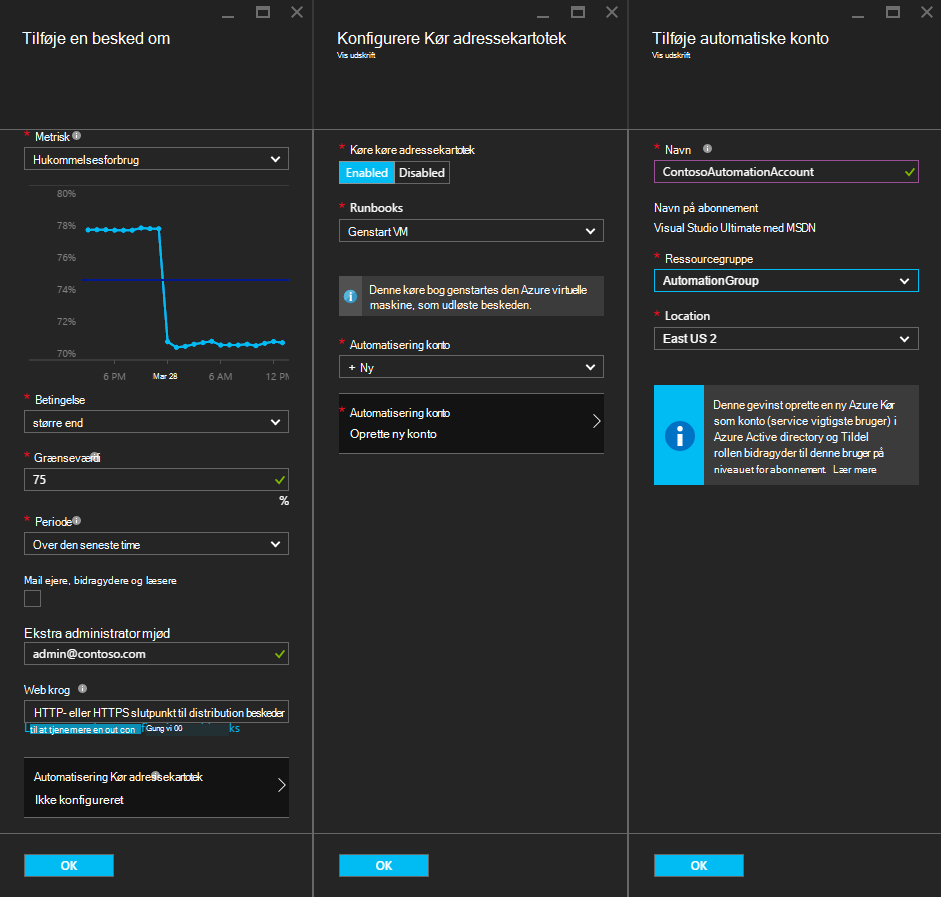
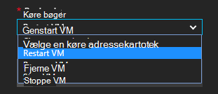
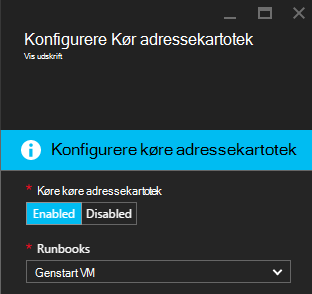
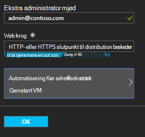

<properties
    pageTitle=" Afhjælpning Azure VM beskeder med Automation Runbooks | Microsoft Azure"
    description="Denne artikel beskrives, hvordan du kan integrere Azure virtuelt beskeder med Automation Azure runbooks og ret problemer"
    services="automation"
    documentationCenter=""
    authors="mgoedtel"
    manager="jwhit"
    editor="tysonn" />    
<tags
    ms.service="automation"
    ms.devlang="na"
    ms.topic="article"
    ms.tgt_pltfrm="na"
    ms.workload="infrastructure-services"
    ms.date="06/14/2016"
    ms.author="csand;magoedte" />

# <a name="azure-automation-scenario---remediate-azure-vm-alerts"></a>Azure scenarie med Automation - afhjælpning Azure VM beskeder

Azure automatisering og virtuelle Azure-computere har udgivet en ny funktion, så du kan konfigurere Virtual Machine (VM) beskeder for at køre automatisering runbooks. Denne nye funktion kan du automatisk udførelse af standard afhjælpning som svar på VM påmindelser, som genstarte eller stoppe VM.

Tidligere, under oprettelse af VM reglen kunne du [angive en automatisering webhook](https://azure.microsoft.com/blog/using-azure-automation-to-take-actions-on-azure-alerts/) til en runbook for at køre runbook, når påmindelsen udløst. Men dette påkrævet for at gøre arbejdet for oprettelse af runbook, oprette webhook for runbook, og derefter kopiere og indsætte webhook under oprettelse af reglen. Med denne nye version er processen er meget nemmere, fordi du kan vælge en runbook på en liste direkte under oprettelse af reglen, og du kan vælge en Automation-konto, som kan køre runbook eller nemt oprette en konto.

I denne artikel hjælper vi dig hvor nemt det er at oprette en Azure VM besked og konfigurere en automatisering runbook at køre, når påmindelsen udløser. Eksempelscenarier omfatter at genstarte en VM, når hukommelsesforbruget overskrider nogle grænse på grund af et program på VM med et hul i hukommelsen, eller stoppe en VM, når bruger CPU-tid har været under 1% i seneste time og ikke er i brug. Vi vil også forklarer, hvordan automatisk oprettelse af en tjeneste vigtigste i din konto med Automation forenkler brugen af runbooks i Azure beskeder om afhjælpning.

## <a name="create-an-alert-on-a-vm"></a>Oprette en besked på en VM

Udfør følgende trin for at konfigurere en besked for at starte en runbook, når dens grænseværdi er opfyldt.

>[AZURE.NOTE] Med denne version understøtter vi kun V2 virtuelle maskiner og support for klassisk FOS tilføjes snart.  

1. Log på portalen Azure, og klik på **virtuelle maskiner**.  
2. Vælg en af dine virtuelle computere.  Vises virtuel maskine dashboard blade og bladet **Indstillinger** til højre.  
3. Vælg **beskeder om regler**under sektionen overvågning bladet **Indstillinger** .
4. Klik på **Tilføj påmindelse**på bladet **regler for påmindelser** .

Dette åbner bladet **tilføje en besked om** , hvor du kan konfigurere betingelser for den vigtige besked og vælge mellem en af eller alle af følgende muligheder: sende mail til en person, skal du bruge en webhook til videresende den vigtige besked til et andet system og/eller køre en automatisering runbook i svar forsøg på at afhjælpning af problemet.

## <a name="configure-a-runbook"></a>Konfigurere en runbook

Vælg **Automatisering Runbook**for at konfigurere en runbook skal køres, når VM tærskelværdi er opfyldt. Du kan vælge runbook til at køre og automatisering kontoen til at køre runbook i bladet **Konfigurer runbook** .



>[AZURE.NOTE] I denne udgave kan du vælge mellem tre runbooks, som indeholder et tjenesten – genstart VM, Stop VM eller fjerne VM (slette den).  Muligheden for at vælge andre runbooks eller en af dine egne runbooks vil være tilgængelige i en senere version.



Når du markerer en af de tre tilgængelige runbooks rullelisten **automatisering konto** vises, og du kan vælge en runbook kører som automatisering-konto. Runbooks skal køre i forbindelse med en [konto med Automation](automation-security-overview.md) , der er i abonnementet Azure. Du kan vælge en Automation-konto, du allerede har oprettet, eller du kan oprette en ny automatisering-konto, der er oprettet for dig.

De runbooks, der kan bruges godkende Azure ved hjælp af en tjeneste sikkerhedskonto. Hvis du vælger at køre runbook i en af dine eksisterende konti med Automation, opretter vi automatisk tjenesten vigtigste for dig. Hvis du vælger at oprette en ny konto med Automation, vil derefter vi automatisk oprette kontoen og service hovedstolen. I begge tilfælde oprettet to Aktiver også i kontoen automatisering – et certifikat aktiv med navnet **AzureRunAsCertificate** og en forbindelse aktiv med navnet **AzureRunAsConnection**. Runbooks anvender **AzureRunAsConnection** til at godkende med Azure for at udføre handlingen, management mod VM.

>[AZURE.NOTE] Tjenesten hovedstolen er oprettet i området abonnement og er tildelt rollen bidragyder. Denne rolle er påkrævet i rækkefølge for kontoen, der har tilladelse til at køre automatisering runbooks til at administrere Azure FOS.  Oprettelse af en Automaton konto og/eller tjeneste vigtigste er en engangsbegivenhed. Når de er oprettet, kan du bruge denne konto til at køre runbooks for andre Azure VM beskeder.

Når du klikker på **OK** på beskeden er konfigureret, og hvis du har valgt indstillingen for at oprette en ny konto med Automation, oprettes den sammen med tjenesten vigtigste.  Det kan tage nogle sekunder at fuldføre.  



Når konfigurationen er fuldført vises navnet på runbook vises i bladet **tilføje en besked om** .



Klik på **OK** i den, **tilføje en besked om** blade og reglen oprettes og aktiver, hvis den virtuelle maskine er i en igangværende tilstand.

### <a name="enable-or-disable-a-runbook"></a>Aktivere eller deaktivere en runbook

Hvis du har en runbook, der er konfigureret til en besked, kan du deaktivere den uden at fjerne runbook konfigurationen. Dette kan du beholde beskeden kører og teste måske nogle af de regler for påmindelser og derefter senere genaktivere runbook.

## <a name="create-a-runbook-that-works-with-an-azure-alert"></a>Oprette en runbook, der fungerer sammen med en Azure besked

Når du vælger en runbook som en del af en Azure reglen, skal runbook have logik i den til at administrere de beskeder om data, der overføres til den.  Når en runbook er konfigureret i en besked om, oprettes der en webhook for runbook; Denne webhook bruges derefter at starte runbook hver gang beskeden udløser.  Faktisk opkaldet til at starte runbook er en anmodning om en HTTP POST til webhook URL-adresse. Brødteksten i POST-anmodningen indeholder et JSON-formateret objekt, der indeholder nyttige egenskaber, der er relateret til beskeden.  Beskeder om data indeholder oplysninger som subscriptionID, resourceGroupName, resourceName og ressourcetypen, som du kan se nedenfor.

### <a name="example-of-alert-data"></a>Eksempel på beskeder om data
```
{
    "WebhookName": "AzureAlertTest",
    "RequestBody": "{
    \"status\":\"Activated\",
    \"context\": {
        \"id\":\"/subscriptions/<subscriptionId>/resourceGroups/MyResourceGroup/providers/microsoft.insights/alertrules/AlertTest\",
        \"name\":\"AlertTest\",
        \"description\":\"\",
        \"condition\": {
            \"metricName\":\"CPU percentage guest OS\",
            \"metricUnit\":\"Percent\",
            \"metricValue\":\"4.26337916666667\",
            \"threshold\":\"1\",
            \"windowSize\":\"60\",
            \"timeAggregation\":\"Average\",
            \"operator\":\"GreaterThan\"},
        \"subscriptionId\":\<subscriptionID> \",
        \"resourceGroupName\":\"TestResourceGroup\",
        \"timestamp\":\"2016-04-24T23:19:50.1440170Z\",
        \"resourceName\":\"TestVM\",
        \"resourceType\":\"microsoft.compute/virtualmachines\",
        \"resourceRegion\":\"westus\",
        \"resourceId\":\"/subscriptions/<subscriptionId>/resourceGroups/TestResourceGroup/providers/Microsoft.Compute/virtualMachines/TestVM\",
        \"portalLink\":\"https://portal.azure.com/#resource/subscriptions/<subscriptionId>/resourceGroups/TestResourceGroup/providers/Microsoft.Compute/virtualMachines/TestVM\"
        },
    \"properties\":{}
    }",
    "RequestHeader": {
        "Connection": "Keep-Alive",
        "Host": "<webhookURL>"
    }
}
```

Når automatisering webhook tjenesten modtager HTTP POST henter beskeder om dataene og sender dem til runbook i WebhookData runbook inputparameteren.  Nedenfor er et eksempel runbook, der viser, hvordan du kan bruge parameteren WebhookData og udtrække beskeder om data og bruge det til at administrere Azure ressourcen, som udløste beskeden.

### <a name="example-runbook"></a>Eksempel på runbook

```
#  This runbook will restart an ARM (V2) VM in response to an Azure VM alert.

[OutputType("PSAzureOperationResponse")]

param ( [object] $WebhookData )

if ($WebhookData)
{
    # Get the data object from WebhookData
    $WebhookBody = (ConvertFrom-Json -InputObject $WebhookData.RequestBody)

    # Assure that the alert status is 'Activated' (alert condition went from false to true)
    # and not 'Resolved' (alert condition went from true to false)
    if ($WebhookBody.status -eq "Activated")
    {
        # Get the info needed to identify the VM
        $AlertContext = [object] $WebhookBody.context
        $ResourceName = $AlertContext.resourceName
        $ResourceType = $AlertContext.resourceType
        $ResourceGroupName = $AlertContext.resourceGroupName
        $SubId = $AlertContext.subscriptionId

        # Assure that this is the expected resource type
        Write-Verbose "ResourceType: $ResourceType"
        if ($ResourceType -eq "microsoft.compute/virtualmachines")
        {
            # This is an ARM (V2) VM

            # Authenticate to Azure with service principal and certificate
            $ConnectionAssetName = "AzureRunAsConnection"
            $Conn = Get-AutomationConnection -Name $ConnectionAssetName
            if ($Conn -eq $null) {
                throw "Could not retrieve connection asset: $ConnectionAssetName. Check that this asset exists in the Automation account."
            }
            Add-AzureRMAccount -ServicePrincipal -Tenant $Conn.TenantID -ApplicationId $Conn.ApplicationID -CertificateThumbprint $Conn.CertificateThumbprint | Write-Verbose
            Set-AzureRmContext -SubscriptionId $SubId -ErrorAction Stop | Write-Verbose

            # Restart the VM
            Restart-AzureRmVM -Name $ResourceName -ResourceGroupName $ResourceGroupName
        } else {
            Write-Error "$ResourceType is not a supported resource type for this runbook."
        }
    } else {
        # The alert status was not 'Activated' so no action taken
        Write-Verbose ("No action taken. Alert status: " + $WebhookBody.status)
    }
} else {
    Write-Error "This runbook is meant to be started from an Azure alert only."
}
```

## <a name="summary"></a>Oversigt

Når du konfigurerer en besked på en Azure VM, har du nu mulighed for at konfigurere en automatisering runbook for at udføre afhjælpning handling automatisk, når påmindelsen udløser nemt. I denne udgave, kan du vælge mellem runbooks at genstarte, stoppe eller slette en VM afhængigt af scenariet besked. Dette er blot begyndelsen af aktivere scenarier, hvor du styrer, hvilke handlinger (meddelelse skal fejlfinding afhjælpning), der udføres automatisk, når en påmindelse udløser.

## <a name="next-steps"></a>Næste trin

- For at komme i gang med grafiske runbooks skal du se [Min første grafiske runbook](automation-first-runbook-graphical.md)
- For at komme i gang med PowerShell arbejdsproces runbooks skal du se [Min første PowerShell arbejdsproces runbook](automation-first-runbook-textual.md)
- Hvis du vil vide mere om runbook typer, deres fordele og begrænsninger, se [Azure automatisering runbook typer](automation-runbook-types.md)
