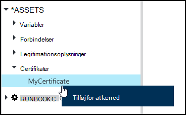
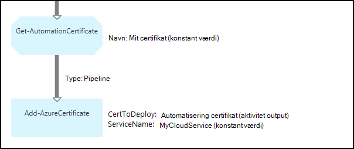

<properties 
   pageTitle="Aktiver i Azure automatisering af certifikat | Microsoft Azure"
   description="Certifikater kan lagres sikkert i Azure automatisering, så de kan åbnes af runbooks eller DTK konfigurationer til godkendelse mod Azure og ressourcer fra tredjepart.  I denne artikel beskrives det, oplysninger om certifikater, og hvordan du arbejder i dem i både tekstelementer og grafiske redigering."
   services="automation"
   documentationCenter=""
   authors="mgoedtel"
   manager="stevenka"
   editor="tysonn" />
<tags 
   ms.service="automation"
   ms.devlang="na"
   ms.topic="article"
   ms.tgt_pltfrm="na"
   ms.workload="infrastructure-services"
   ms.date="02/23/2016"
   ms.author="magoedte;bwren" />

# Certifikat aktiver i Azure automatisering

Certifikater kan lagres sikkert i Azure automatisering, så de kan åbnes af runbooks eller DTK konfigurationer ved hjælp af **Get-AutomationCertificate** aktivitet. Dette gør det muligt at oprette runbooks og DTK konfigurationer, der bruger certifikater til godkendelse eller føjer dem til Azure eller fra tredjepart ressourcer.

>[AZURE.NOTE] Sikker aktiver i Azure automatisering omfatter legitimationsoplysninger, certifikater, forbindelser og krypterede variabler. Disse aktiver, krypteres og gemmes med Azure automatisering ved hjælp af en entydig nøgle, der oprettes for hver konto med automation. Denne nøgle er krypteret af et overordnet certifikat og gemmes i Azure automatisering. Før du gemmer en sikker aktiv, nøglen for kontoen automatisering er dekrypteres ved hjælp af det overordnede certifikat og derefter bruges til at kryptere aktivet.

## Windows PowerShell-cmdletter

Cmdletter i den følgende tabel, der bruges til at oprette og administrere automatisering certifikat Aktiver med Windows PowerShell. De leveres som en del af [Azure PowerShell-modulet](../powershell-install-configure.md) som er tilgængelig til brug i automatisering runbooks og DTK konfigurationer.

|Cmdletter|Beskrivelse|
|:---|:---|
|[Get-AzureAutomationCertificate](http://msdn.microsoft.com/library/dn913765.aspx)|Henter oplysninger om et certifikat. Du kan kun hente certifikatet selve fra Get-AutomationCertificate aktivitet.|
|[Ny AzureAutomationCertificate](http://msdn.microsoft.com/library/dn913764.aspx)|Importerer et nyt certifikat til Azure automatisering.|
|[Fjern - AzureAutomationCertificate](http://msdn.microsoft.com/library/dn913773.aspx)|Fjerner et certifikat fra Azure automatisering.|
|[Sæt - AzureAutomationCertificate](http://msdn.microsoft.com/library/dn913763.aspx)|Angiver egenskaber for et eksisterende certifikat, herunder overførsel af certifikatfilen og angive adgangskoden til en .pfx.|

## Aktiviteter for at få adgang til certifikater

Aktiviteter i den følgende tabel, der bruges til at få adgang til certifikater i en runbook eller DTK konfiguration.

|Aktiviteter|Beskrivelse|
|:---|:---|
|Get-AutomationCertificate|Får et certifikat til brug i en runbook eller -DTK konfiguration.|

>[AZURE.NOTE] Du skal undgå at bruge variabler i – navn parameteren for Get-AutomationCertificate, da det kan let gøre registrering afhængigheder mellem runbooks eller DTK konfigurationer og certifikat aktiver i designfasen.

## Oprette et nyt certifikat

Når du opretter et nyt certifikat, kan du overføre en .cer eller .pfx-fil til Azure automatisering. Hvis du har markeret certifikatet, som kan eksporteres, kan du overføre den af Azure automatisering certifikat store. Hvis det ikke kan eksporteres, kan derefter det kun bruges til logge på runbook eller DTK konfiguration.

### Oprette et nyt certifikat ved hjælp af Azure klassisk portal

1. Klik på **Aktiver** øverst i vinduet fra kontoen automatisering.
1. Klik på **Tilføj indstillingen**nederst i vinduet.
1. Klik på **Tilføj legitimationsoplysninger**.
2. Vælg **certifikat**i rullemenuen **Type legitimationsoplysninger** .
3. Skriv et navn til certifikatet i boksen **navn** , og klik på højre pil.
4. Søge efter en .cer eller .pfx-fil.  Hvis du vælger en .pfx-fil, kan du angive en adgangskode, og om det skal have lov der skal eksporteres.
1. Klik på markeringen i afkrydsningsfeltet for at overføre certifikatfilen og gemme det nye certifikat aktiv.

### Oprette et nyt certifikat ved hjælp af Azure portal

1. Klik på **Aktiver** del for at åbne bladet **Aktiver** fra kontoen automatisering.
1. Klik på **certifikater** del for at åbne bladet **certifikater** .
1. Klik på **Tilføj et certifikat** på øverst del af bladet.
2. Skriv et navn til certifikatet i feltet **navn** .
2. Klik på **Vælg en fil** under **overføre en certifikatfil** at søge efter en .cer eller .pfx-fil.  Hvis du vælger en .pfx-fil, kan du angive en adgangskode, og om det skal have lov der skal eksporteres.
1. Klik på **Opret** for at gemme det nye certifikat aktiv.

### Oprette et nyt certifikat med Windows PowerShell

Kommandoerne følgende eksempel viser, hvordan du opretter et nyt certifikat med automation og markerer det eksporteres. Dette importerer en eksisterende .pfx-fil.

    $certName = 'MyCertificate'
    $certPath = '.\MyCert.pfx'
    $certPwd = ConvertTo-SecureString -String 'P@$$w0rd' -AsPlainText -Force
    
    New-AzureAutomationCertificate -AutomationAccountName "MyAutomationAccount" -Name $certName -Path $certPath –Password $certPwd -Exportable

## Bruge et certifikat

Du skal bruge **Get-AutomationCertificate** aktiviteten for at bruge et certifikat. Du kan ikke bruge Cmdletten [Get-AzureAutomationCertificate](http://msdn.microsoft.com/library/dn913765.aspx) , da den returnerer oplysninger om certifikatet aktiv, men ikke selve certifikatet.

### Tekstbaseret runbook eksempel

Følgende eksempelkode viser, hvordan du føjer et certifikat til en skybaseret tjeneste i en runbook. I dette eksempel hentes adgangskoden fra en krypteret automatisering variabel.

    $serviceName = 'MyCloudService'
    $cert = Get-AutomationCertificate -Name 'MyCertificate'
    $certPwd = Get-AutomationVariable –Name 'MyCertPassword'
    Add-AzureCertificate -ServiceName $serviceName -CertToDeploy $cert

### Grafiske runbook eksempel

Du føjer en **Get-AutomationCertificate** til en grafisk runbook ved at højreklikke på certifikatet i ruden bibliotek i den grafiske editor og derefter vælge **Føj til lærredet**.

Følgende billede viser et eksempel på brug af et certifikat i et grafisk runbook.  Dette er den samme eksemplet ovenfor for at tilføje et certifikat til en skybaseret tjeneste fra en tekstdata runbook.  

I dette eksempel bruges parameteren **UseConnectionObject** , der er angivet for den **Send TwilioSMS** aktivitet, der bruger et connection-objekt til godkendelse til tjenesten.  [Pipeline link](automation-graphical-authoring-intro.md#links-and-workflow) skal bruges her, da en sekvens link vil returnere en samling, der indeholder et enkelt objekt, der ikke forventer, parameteren forbindelse.

## Se også

- [Links i grafiske redigering](automation-graphical-authoring-intro.md#links-and-workflow) 
