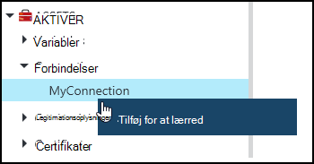
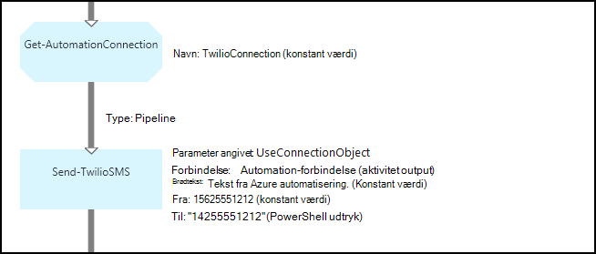
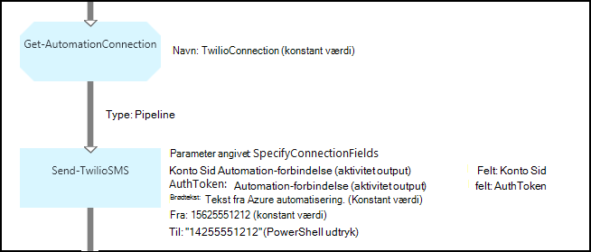

<properties 
   pageTitle="Forbindelse aktiver i Azure automatisering | Microsoft Azure"
   description="Forbindelse aktiver i Azure automatisering indeholder de oplysninger, der kræves for at oprette forbindelse til en ekstern tjeneste eller et program fra en runbook eller DTK konfiguration. Denne artikel forklares detaljerne for forbindelser, og hvordan du arbejder i dem i både tekstelementer og grafiske redigering."
   services="automation"
   documentationCenter=""
   authors="bwren"
   manager="stevenka"
   editor="tysonn" />
<tags 
   ms.service="automation"
   ms.devlang="na"
   ms.topic="article"
   ms.tgt_pltfrm="na"
   ms.workload="infrastructure-services"
   ms.date="01/27/2016"
   ms.author="bwren" />

# Forbindelse aktiver i Azure automatisering

Et automatisering forbindelse aktiv indeholder de oplysninger, der kræves for at oprette forbindelse til en ekstern tjeneste eller et program fra en runbook eller DTK konfiguration. Dette kan omfatte oplysninger, der kræves til godkendelse som et brugernavn og din adgangskode ud over forbindelsesoplysningerne som en URL-adresse eller en port. Værdien af en forbindelse er samle alle egenskaberne for at oprette forbindelse til et bestemt program i et aktiv i modsætning til oprettelse af flere variabler. Brugeren kan redigere værdierne for en forbindelse på ét sted, og du kan overføre navnet på en forbindelse til en runbook eller konfiguration af DTK i en enkelt parameter. Egenskaber for en forbindelse kan åbnes i runbook eller DTK konfiguration med **Get-AutomationConnection** aktivitet.

Når du opretter en forbindelse, skal du angive en *forbindelsestype*. Forbindelsestypen er en skabelon, der definerer et sæt af egenskaber. Forbindelsen definerer værdier for hver egenskab, der er defineret i dens forbindelsestype. Forskellige typer er føjet til Azure automatisering i integrationsmoduler eller oprettet med [Azure automatisering API](http://msdn.microsoft.com/library/azure/mt163818.aspx). Forbindelsestyperne kun, der er tilgængelige, når du opretter en forbindelse er dem, der er installeret på din konto med Automation.

>[AZURE.NOTE] Sikker aktiver i Azure automatisering omfatter legitimationsoplysninger, certifikater, forbindelser og krypterede variabler. Disse aktiver, krypteres og gemmes med Azure automatisering ved hjælp af en entydig nøgle, der oprettes for hver konto med automation. Denne nøgle er krypteret af et overordnet certifikat og gemmes i Azure automatisering. Før du gemmer en sikker aktiv, nøglen for kontoen automatisering er dekrypteres ved hjælp af det overordnede certifikat og derefter bruges til at kryptere aktivet.

## Windows PowerShell-cmdletter

Cmdletter i den følgende tabel, der bruges til at oprette og administrere automatisering forbindelser sammen med Windows PowerShell. De leveres som en del af [Azure PowerShell-modulet](../powershell-install-configure.md) som er tilgængelig til brug i automatisering runbooks og DTK konfigurationer.

|Cmdlet|Beskrivelse|
|:---|:---|
|[Get-AzureAutomationConnection](http://msdn.microsoft.com/library/dn921828.aspx)|Henter en forbindelse. Indeholder en hashtabel med værdierne i den forbindelse felter.|
|[Ny AzureAutomationConnection](http://msdn.microsoft.com/library/dn921825.aspx)|Opretter en ny forbindelse.|
|[Fjern AzureAutomationConnection](http://msdn.microsoft.com/library/dn921827.aspx)|Fjerne en eksisterende forbindelse.|
|[Angiv AzureAutomationConnectionFieldValue](http://msdn.microsoft.com/library/dn921826.aspx)|Angiver værdien af et bestemt felt til en eksisterende forbindelse.|

## Aktiviteter

Aktiviteter i den følgende tabel, der bruges til at få adgang til forbindelser i en runbook eller DTK konfiguration.

|Aktiviteter|Beskrivelse|
|---|---|
|Get-AutomationConnection|Henter en forbindelse til brug. Returnerer en hashtabel med egenskaber for forbindelsen.|

>[AZURE.NOTE] Du skal undgå at bruge variabler i – navn parameteren for **Get-AutomationConnection** da dette kan let gøre registrering afhængigheder mellem runbooks eller DTK konfigurationer og forbindelse aktiver i designfasen.

## Oprette en ny forbindelse

### Sådan oprettes en ny forbindelse ved hjælp af Azure klassisk portal

1. Klik på **Aktiver** øverst i vinduet fra kontoen automatisering.
1. Klik på **Tilføj indstillingen**nederst i vinduet.
1. Klik på **Tilføj forbindelse**.
2. Vælg typen forbindelse, du vil oprette i rullemenuen **Forbindelsestype** .  Guiden vil præsentere egenskaberne for den pågældende type.
1. Fuldføre guiden, og klik på afkrydsningsfeltet for at gemme den nye forbindelse.

### Sådan oprettes en ny forbindelse ved hjælp af Azure portal

1. Klik på **Aktiver** del for at åbne bladet **Aktiver** fra kontoen automatisering.
1. Klik på **forbindelser** del for at åbne bladet **forbindelser** .
1. Klik på **Tilføj en forbindelse** i toppen af bladet.
2. Vælg typen forbindelse, du vil oprette på rullelisten **Type** . Formularen skal vises egenskaberne for den pågældende type.
1. Udfyld formularen, og klik på **Opret** for at gemme den nye forbindelse.

### Oprette en ny forbindelse til Windows PowerShell

Opret en ny forbindelse med Windows PowerShell ved hjælp af [Ny AzureAutomationConnection](http://msdn.microsoft.com/library/dn921825.aspx) cmdlet. Denne cmdlet har en parameter med navnet **ConnectionFieldValues** , der forventer en [hashtabel](http://technet.microsoft.com/library/hh847780.aspx) definere værdier for hver af de egenskaber, der er defineret af forbindelsestypen.

Følgende eksempel kommandoer oprette en ny forbindelse til [Twilio](http://www.twilio.com) , som er en telefonitjeneste, hvor du kan sende og modtage sms'er.  Et eksempel integration modul, der indeholder en Twilio forbindelsestype er tilgængelig i [Script Center](http://gallery.technet.microsoft.com/scriptcenter/Twilio-PowerShell-Module-8a8bfef8).  Denne forbindelsestype definerer egenskaber for konto SID og godkendelse adgangstoken, som er nødvendig for godkendelse din konto, når du opretter forbindelse til Twilio.  Du skal [hente dette modul](http://gallery.technet.microsoft.com/scriptcenter/Twilio-PowerShell-Module-8a8bfef8) og installer det på din automatisering konto for denne eksempelkode til at arbejde.

    $AccountSid = "DAf5fed830c6f8fac3235c5b9d58ed7ac5"
    $AuthToken  = "17d4dadfce74153d5853725143c52fd1"
    $FieldValues = @{"AccountSid" = $AccountSid;"AuthToken"=$AuthToken}

    New-AzureAutomationConnection -AutomationAccountName "MyAutomationAccount" -Name "TwilioConnection" -ConnectionTypeName "Twilio" -ConnectionFieldValues $FieldValues

## Ved hjælp af en forbindelse i en runbook eller DTK konfiguration

Du kan hente en forbindelse i en runbook eller DTK konfiguration med cmdlet'en **Get-AutomationConnection** til.  Denne aktivitet henter værdierne i de forskellige felter i forbindelsen og returnerer dem som en [hashtabel](http://go.microsoft.com/fwlink/?LinkID=324844) som kan bruges med de relevante kommandoer i runbook eller DTK konfiguration.

### Tekstbaseret runbook eksempel
Kommandoerne følgende eksempel viser, hvordan du bruger Twilio forbindelsen i det forrige eksempel til at sende en tekstmeddelelse fra en runbook.  Send TwilioSMS aktiviteten bruges her er to parametersæt, hver bruger en anden metode til godkendelse af tjenesten Twilio.  En bruger et connection-objekt, og en anden bruger individuelle parametre for konto SID og godkendelse Token.  Begge metoder er vist i dette eksempel.

    $Con = Get-AutomationConnection -Name "TwilioConnection"
    $NumTo = "14255551212"
    $NumFrom = "15625551212"
    $Body = "Text from Azure Automation."

    #Send text with connection object.
    Send-TwilioSMS -Connection $Con -From $NumFrom -To $NumTo -Body $Body

    #Send text with connection properties.
    Send-TwilioSMS -AccountSid $Con.AccountSid -AuthToken $Con.AuthToken -From $NumFrom -To $NumTo -Body $Body

### Grafiske runbook eksempler

Du føjer en **Get-AutomationConnection** aktivitet til en grafisk runbook ved at højreklikke på forbindelsen i ruden bibliotek den grafiske editor og vælge **Føj til lærredet**.

Følgende billede viser et eksempel på brug af en forbindelse i et grafisk runbook.  Dette er den samme eksemplet ovenfor til at sende en tekstmeddelelse ved hjælp af Twilio fra en tekstdata runbook.  I dette eksempel bruges parameteren **UseConnectionObject** , der er angivet for den **Send TwilioSMS** aktivitet, der bruger et connection-objekt til godkendelse til tjenesten.  Et [pipeline link](automation-graphical-authoring-intro.md#links-and-workflow) bruges her, da parameteren for dataforbindelsen forventer et enkelt objekt.

Årsagen til, at en PowerShell udtryk, der bruges til værdien i parameteren **til** i stedet for en konstant værdi er, at denne parameter forventer en streng matrix værditype, så du kan sende til Multipla.  Et PowerShell-udtryk kan du give en enkelt værdi eller en matrix.

Billedet nedenfor viser de samme eksempel som ovenfor, men bruger parameteren **SpecifyConnectionFields** angivet, som du forventer parametrene AccountSid og AuthToken skal angives individuelt i modsætning til ved hjælp af et connection-objekt til godkendelse.  I dette tilfælde er felter af forbindelsen angivet i stedet for selve objektet.  

## Relaterede artikler

- [Links i grafiske redigering](automation-graphical-authoring-intro.md#links-and-workflow)
 
