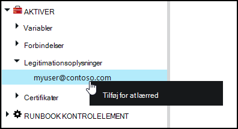
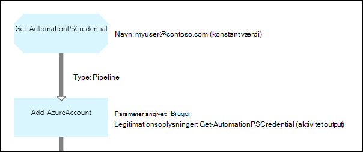

<properties 
   pageTitle="Aktiver i Azure automatisering af legitimationsoplysninger | Microsoft Azure"
   description="Legitimationsoplysninger aktiver i Azure automatisering indeholde legitimationsoplysninger, der kan bruges til at godkende til ressourcer, der åbnes af runbook eller DTK konfiguration. I denne artikel beskrives, hvordan du opretter legitimationsoplysninger aktiver og bruge dem i en runbook eller -DTK konfiguration."
   services="automation"
   documentationCenter=""
   authors="mgoedtel"
   manager="jwhit"
   editor="tysonn" />
<tags 
   ms.service="automation"
   ms.devlang="na"
   ms.topic="article"
   ms.tgt_pltfrm="na"
   ms.workload="infrastructure-services"
   ms.date="06/09/2016"
   ms.author="bwren" />

# Legitimationsoplysninger aktiver i Azure automatisering

Et automatisering legitimationsoplysninger aktiv indeholder en [PSCredential](http://msdn.microsoft.com/library/system.management.automation.pscredential) objekt, der indeholder sikkerhedslegitimationsoplysninger som et brugernavn og din adgangskode. Runbooks og DTK konfigurationer kan bruge cmdletter, der accepterer et PSCredential objekt til godkendelse, eller de kan udtrække brugernavnet og adgangskoden for objektet PSCredential til at levere nogle program eller en tjeneste, der kræver godkendelse. Egenskaberne for en legitimationsoplysninger gemmes sikkert i Azure automatisering og kan åbnes i runbook eller DTK konfiguration med [Get-AutomationPSCredential](http://msdn.microsoft.com/library/system.management.automation.pscredential.aspx) aktivitet.

>[AZURE.NOTE] Sikker aktiver i Azure automatisering omfatter legitimationsoplysninger, certifikater, forbindelser og krypterede variabler. Disse aktiver, krypteres og gemmes med Azure automatisering ved hjælp af en entydig nøgle, der oprettes for hver konto med automation. Denne nøgle er krypteret af et overordnet certifikat og gemmes i Azure automatisering. Før du gemmer en sikker aktiv, nøglen for kontoen automatisering er dekrypteres ved hjælp af det overordnede certifikat og derefter bruges til at kryptere aktivet. 

## Windows PowerShell-cmdlet'er

Cmdletter i den følgende tabel, der bruges til at oprette og administrere automatisering legitimationsoplysninger Aktiver med Windows PowerShell.  De leveres som en del af [Azure PowerShell-modulet](../powershell-install-configure.md) som er tilgængelig til brug i automatisering runbooks og DTK konfigurationer.

|Cmdletter|Beskrivelse|
|:---|:---|
|[Get-AzureAutomationCredential](http://msdn.microsoft.com/library/dn913781.aspx)|Henter oplysninger om en legitimationsoplysninger aktiv. Du kan kun hente legitimationsoplysninger selve fra **Get-AutomationPSCredential** aktivitet.|
|[Ny AzureAutomationCredential](http://msdn.microsoft.com/library/azure/jj554330.aspx)|Opretter en ny automatisering legitimationsoplysninger.|
|[Fjern - AzureAutomationCredential](http://msdn.microsoft.com/library/azure/jj554330.aspx)|Fjerner en automatisering legitimationsoplysninger.|
|[Sæt - AzureAutomationCredential](http://msdn.microsoft.com/library/azure/jj554330.aspx)|Angiver egenskaber for en eksisterende automatisering legitimationsoplysninger.|

## Runbook aktiviteter

Aktiviteter i den følgende tabel, der bruges til at få adgang til legitimationsoplysninger i en runbook og DTK konfigurationer.

|Aktiviteter|Beskrivelse|
|:---|:---|
|Get-AutomationPSCredential|Henter en legitimationsoplysninger, der skal bruges i en runbook eller DTK konfiguration. Returnerer et [System.Management.Automation.PSCredential](http://msdn.microsoft.com/library/system.management.automation.pscredential) objekt.|

>[AZURE.NOTE] Du skal undgå at bruge variabler i – navn parameteren for Get-AutomationPSCredential, da det kan let gøre registrering afhængigheder mellem runbooks eller DTK konfigurationer og legitimationsoplysninger aktiver i designfasen.

## Oprette et nyt legitimationsoplysninger aktiv

### Oprette et nyt legitimationsoplysninger aktiv ved hjælp af Azure klassisk portal

1. Klik på **Aktiver** øverst i vinduet fra kontoen automatisering.
1. Klik på **Tilføj indstillingen**nederst i vinduet.
1. Klik på **Tilføj legitimationsoplysninger**.
2. Vælg **PowerShell legitimationsoplysninger**på rullelisten **Type legitimationsoplysninger** .
1. Fuldføre guiden, og klik på afkrydsningsfeltet for at gemme de nye legitimationsoplysninger.

### Oprette et nyt legitimationsoplysninger aktiv ved hjælp af Azure portal

1. Klik på **Aktiver** del for at åbne bladet **Aktiver** fra kontoen automatisering.
1. Klik på delen **legitimationsoplysninger** for at åbne bladet **legitimationsoplysninger** .
1. Klik på **Tilføj en legitimationsoplysninger** på øverst del af bladet.
1. Udfyld formularen, og klik på **Opret** for at gemme de nye legitimationsoplysninger.

### Oprette et nyt legitimationsoplysninger aktiv med Windows PowerShell

Kommandoerne følgende eksempel viser, hvordan du opretter en ny automatisering legitimationsoplysninger. En PSCredential objektet er oprettet med brugernavn og adgangskode og derefter bruges til at oprette legitimationsoplysninger aktiv. Du kan også bruge cmdlet'en **Get-legitimationsoplysninger** til at blive bedt om at skrive på et navn og en adgangskode.

    $user = "MyDomain\MyUser"
    $pw = ConvertTo-SecureString "PassWord!" -AsPlainText -Force
    $cred = New-Object –TypeName System.Management.Automation.PSCredential –ArgumentList $user, $pw
    New-AzureAutomationCredential -AutomationAccountName "MyAutomationAccount" -Name "MyCredential" -Value $cred

## Ved hjælp af en PowerShell-legitimationsoplysninger

Du kan hente en legitimationsoplysninger aktiv i en runbook eller DTK konfiguration med **Get-AutomationPSCredential** aktivitet. Dette returnerer [PSCredential objekt](http://msdn.microsoft.com/library/system.management.automation.pscredential.aspx) , du kan bruge med en aktivitet eller -cmdlet, der kræver en PSCredential parameter. Du kan også hente egenskaberne for objektet legitimationsoplysninger til at bruge enkeltvis. Objektet har en egenskab for brugernavnet og den sikker adgangskode, eller du kan bruge metoden **GetNetworkCredential** til at returnere en [NetworkCredential](http://msdn.microsoft.com/library/system.net.networkcredential.aspx) -objekt, der giver en usikker version af adgangskoden.

### Tekstbaseret runbook eksempel

Kommandoerne følgende eksempel viser, hvordan du bruger en PowerShell-legitimationsoplysninger i en runbook. I dette eksempel legitimationsoplysninger, der er hentet og dens brugernavn og din adgangskode, der er tildelt til variabler.

    $myCredential = Get-AutomationPSCredential -Name 'MyCredential'
    $userName = $myCredential.UserName
    $securePassword = $myCredential.Password
    $password = $myCredential.GetNetworkCredential().Password

### Grafiske runbook eksempel

Du føjer en **Get-AutomationPSCredential** aktivitet til en grafisk runbook ved at højreklikke på legitimationsoplysninger i ruden bibliotek i den grafiske editor og derefter vælge **Føj til lærredet**.

Følgende billede viser et eksempel på brug af en legitimationsoplysninger i et grafisk runbook.  I dette tilfælde bruges den til at angive godkendelse for en runbook til Azure ressourcer, som beskrevet i [Godkende Runbooks til Azure AD-brugerkonto](automation-sec-configure-aduser-account.md).  Den første aktivitet henter de legitimationsoplysninger, der har adgang til Azure abonnementet.  **Tilføj AzureAccount** aktiviteten derefter bruges denne legitimationsoplysninger for at angive godkendelse for en hvilken som helst aktiviteter, der følger efter den.  Et [pipeline link](automation-graphical-authoring-intro.md#links-and-workflow) er her, da **Get-AutomationPSCredential** forventer et enkelt objekt.  

## Brug af en PowerShell-legitimationsoplysninger i DTK
Mens DTK konfigurationer i Azure automatisering kan referere til legitimationsoplysninger Aktiver ved hjælp af **Get-AutomationPSCredential**, kan legitimationsoplysninger Aktiver også sendes i via parametre, hvis du ønsker. Du kan finde yderligere oplysninger finder [Compiling konfigurationer i Azure automatisering DTK](automation-dsc-compile.md#credential-assets).

## Næste trin

- Hvis du vil vide mere om links i grafiske redigering, se [linkene i grafiske redigering](automation-graphical-authoring-intro.md#links-and-workflow)
- For at forstå de forskellige godkendelsesmetoder med Automation, skal du se [Azure automatisering sikkerhed](automation-security-overview.md)
- For at komme i gang med grafiske runbooks skal du se [Min første grafiske runbook](automation-first-runbook-graphical.md)
- For at komme i gang med PowerShell arbejdsproces runbooks skal du se [Min første PowerShell arbejdsproces runbook](automation-first-runbook-textual.md) 

 
