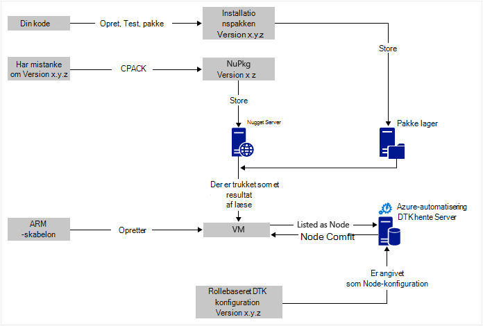
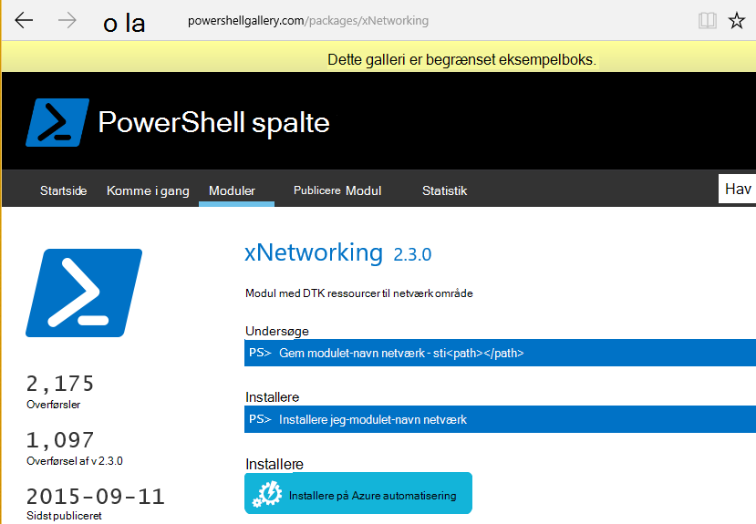

<properties
   pageTitle="Azure automatisering DTK fortløbende installation med Chocolatey | Microsoft Azure"
   description="DevOps fortløbende installation ved hjælp af Azure automatisering DTK og Chocolatey pakke manager.  Eksempel med fuld JSON ARM skabelon og PowerShell kilde."
   services="automation"
   documentationCenter=""
   authors="sebastus"
   manager="stevenka"
   editor=""/>

<tags
   ms.service="automation"
   ms.devlang="na"
   ms.topic="article"
   ms.tgt_pltfrm="vm-windows"
   ms.workload="na"
   ms.date="08/08/2016"
   ms.author="golive"/>

# Eksempel på brug: Kontinuert installation virtuelle maskiner med Automation DTK og Chocolatey

I en DevOps verden er der mange værktøjer til at hjælpe med forskellige punkter i fortløbende Integration pipeline.  Azure automatisering ønsket tilstand konfiguration (DTK) er en Velkommen ny tilføjelse til de indstillinger, der kan anvende DevOps teams.  I denne artikel beskrives konfigurationen af fortløbende installation (CD) til en Windows-computer.  Du kan nemt udvide metode for at medtage så mange Windows-computere efter behov i rollen (et websted, for eksempel), og derfra samt yderligere roller.

## På et højt niveau

Der er temmelig foregår her, men heldigvis kan opdeles i to primære processer: 

  - Skrive kode og tester den, oprette og publicere-pakker til overordnede og underordnede versioner af systemet. 
  - Oprettelse og administration af VM'er, der skal installeres og udføre koden i pakkerne.  

Når begge disse grundlæggende processer er på plads, er det et kort trin til at opdatere pakken kører på en bestemt VM som versioner oprettes og installeres automatisk.

## Oversigt over komponent

Pakke ledere som [Hovedgaden få](https://en.wikipedia.org/wiki/Advanced_Packaging_Tool) er ret velkendte i verden Linux, men ikke så mange i Windows verden.  [Chocolatey](https://chocolatey.org/) er tilfældet, og Scott Hanselman [blog](http://www.hanselman.com/blog/IsTheWindowsUserReadyForAptget.aspx) på emnet er en god introduktion.  I en nøddeskal Chocolatey giver dig mulighed at installere pakker fra et centralt lager over pakker til et Windows-system, ved hjælp af kommandolinjen.  Du kan oprette og administrere dine egne lager og Chocolatey kan installere pakker fra en hvilken som helst antal typer lagre, som du angiver.

Ønskede tilstand konfiguration (DTK) ([Oversigt](https://technet.microsoft.com/library/dn249912.aspx)) er et PowerShell-værktøj, der gør det muligt at definere den konfiguration, som du vil bruge til en maskine.  For eksempel kan du sige, "Jeg vil Chocolatey installeret, jeg vil installeret IIS, jeg vil port 80 åbnes, jeg vil version 1.0.0 af mit websted, der er installeret."  DTK lokale Configuration Manager (mindste.fælles.MULTIPLUM) implementerer konfigurationen. En DTK adskille Server indeholder et lager af konfigurationer for din computere. MINDSTE.fælles.MULTIPLUM på hver maskine kontrollerer med jævne mellemrum at se, hvis dens konfiguration stemmer overens med den gemte konfiguration. Det kan rapportere status eller forsøger at hente maskinen tilbage til justering med den gemte konfiguration. Du kan redigere den gemte konfiguration på hente serveren for at give en computer eller et sæt af maskiner til at komme til justering med den ændrede konfiguration.

Azure automatisering er en administreret tjeneste i Microsoft Azure, hvor du kan automatisere forskellige opgaver ved hjælp af runbooks, noder, legitimationsoplysninger, ressourcer og medieaktiver som tidsplaner og globale variabler. Azure automatisering DTK udvider denne automatisering muligheden for at medtage PowerShell DTK værktøjer.  Her er en god [Oversigt](automation-dsc-overview.md).

En ressource DTK er et modul af kode, der indeholder bestemte funktioner, som administration af netværk, Active Directory eller SQL Server.  Chocolatey DTK ressourcen ved, hvordan du kan få adgang til en NuGet Server (blandt andet), hente pakker, installere pakker og så videre.  Der findes mange andre DTK ressourcer i [PowerShell galleriet](http://www.powershellgallery.com/packages?q=dsc+resources&prerelease=&sortOrder=package-title).  Disse moduler er installeret i din Azure automatisering DTK adskille Server (af dig) så de kan anvendes af din konfigurationer.

ARM skabeloner giver en deklarativ måde til oprettelse af din infrastruktur – ting som netværk, undernet, netværkssikkerhed og routing, indlæse balancere, netværkskort, FOS osv.  Her er en [artikel](../resource-manager-deployment-model.md) , der sammenligner den ARM-implementeringsmodel (deklarativ) med Azure Service Management (ASM eller klassisk) implementeringsmodel (eventuelt).  Og en anden [artikel](../virtual-machines/virtual-machines-windows-compare-deployment-models.md) om core ressource udbydere, Beregn, opbevaring og netværk.

En vigtige funktion af en skabelon til ARM er muligheden for at installere filtypenavnet VM til VM, som den er klargjort.  Filtypenavnet VM har bestemte funktioner som kører et brugerdefineret script, installation af antivirussoftware eller kører et script til konfiguration af DTK.  Der findes mange andre typer VM filtypenavne.

## Hurtig forretningsrejse omkring diagrammet

Starter øverst, du skriver din kode, opbygge og teste og derefter oprette en installationspakke.  Chocolatey kan håndtere forskellige typer-pakker, som MSI, MSU, ZIP.  Og du har den fulde styrke i PowerShell til at gøre den faktiske installation, hvis Chocolateys oprindelige funktioner ikke er helt op til den.  Du kan placere pakken til et sted nås – en pakke lager.  I dette eksempel brugen bruges en offentlig mappe på en Azure blob-lager-konto, men det kan være et vilkårligt sted.  Chocolatey fungerer oprindeligt med NuGet servere og et par andre til at administrere pakke metadata.  [I denne artikel](https://github.com/chocolatey/choco/wiki/How-To-Host-Feed) beskrives indstillingerne.  I dette eksempel brugen bruges NuGet.  En Nuspec er metadata om dine pakker.  Nuspec "samlet" i Nupkgs og gemmes i en NuGet server.  Når konfigurationen af en pakke, som efter navn, og henviser til en NuGet server, Chocolatey DTK ressourcen (nu på VM) fanger pakken og installerer det for dig.  Du kan også anmode om en bestemt version af en pakke.

I den nederste venstre del af billedet er der en skabelon til Azure ressource Manager (ARM).  I dette eksempel brugen registrerer filtypenavnet VM VM med Azure automatisering DTK hente serveren (det vil sige, en hente server) som en Node.  Konfigurationen er gemt i hente server.  Faktisk, det er gemt to gange: én gang som almindelig tekst, og når kompileret som en MOF-fil (for dem, som vide om disse ting.)  I portalen er MOF en "node konfiguration" (i modsætning til blot "konfiguration)".  Det er den genstand, der er knyttet til en Node, så noden ved dens konfiguration.  Detaljer nedenfor viser, hvordan du tildeler noden node konfigurationen.

Du laver dias allerede bit øverst eller mest muligt ud af den.  Oprette nuspec, kompilering og gemme den i en NuGet server er en lille ting.  Og du allerede arbejder med FOS.  Tage det næste trin at fortløbende installation kræver konfiguration af hente serveren (én gang), registrerer din noder med den (én gang), og oprette og gemme konfigurationen der (først).  Opdater derefter som pakker er opgraderet, og brug af lager, konfiguration og Node konfiguration hente Server (Gentag efter behov).

Hvis du ikke starter med en skabelon til ARM, er det også OK.  Der er udviklet til at hjælpe dig med at registrere din FOS med hente serveren og alle resten PowerShell-cmdlet'er. Yderligere oplysninger finder du i denne artikel: [Onboarding maskiner til administration af Azure automatisering DTK](automation-dsc-onboarding.md)

## Trin 1: Konfigurere kontoen hente server og automatisering

På en godkendt (Tilføj-AzureRmAccount) PowerShell-kommandolinjen: (kan tage et par minutter mens hente serveren er konfigureret)

    New-AzureRmResourceGroup –Name MY-AUTOMATION-RG –Location MY-RG-LOCATION-IN-QUOTES
    New-AzureRmAutomationAccount –ResourceGroupName MY-AUTOMATION-RG –Location MY-RG-LOCATION-IN-QUOTES –Name MY-AUTOMATION-ACCOUNT 

Du kan sætte kontoen automatisering i nogen af de følgende områder (også kendt placering): af US 2, syd Central os, OS Gov Virginia, vest Europe, Sydøstasien, Japan Øst, Central Indien og Australien Sydøst.

## Trin 2: VM lokalnummer finjusteringer til skabelonen ARM

Oplysninger om VM registrering (med filtypenavnet PowerShell DTK VM) i denne [Skabelon til Azure Hurtig start](https://github.com/Azure/azure-quickstart-templates/tree/master/dsc-extension-azure-automation-pullserver).  Dette trin registrerer din nye VM med hente serveren på listen over DTK noder.  En del af denne registrering angiver node konfigurationen skal anvendes til noden.  Denne node konfiguration har ikke findes endnu i hente serveren, så det er OK, der er trin 4, hvor det er gjort for første gang.  Men her i trin 2 du har brug for at har besluttet dig for navnet på noden og navnet på konfigurationen.  I dette eksempel brugen noden er 'isvbox' og konfigurationen er 'ISVBoxConfig'.  Så er navnet på node konfigurationen (skal angives i DeploymentTemplate.json) 'ISVBoxConfig.isvbox'.  

## Trin 3: Tilføje krævede DTK ressourcer til at hente serveren

Galleriet PowerShell er udstyret for at installere DTK ressourcer til kontoen Azure automatisering.  Gå til den ressource, du vil, og klik på knappen "Installere til Azure automatisering".

En anden metode, der er tilføjet for nylig til portalen Azure kan du trække i nye moduler eller opdatere eksisterende moduler. Klik på ressourcen automatisering konto, feltet Aktiver og til sidst feltet moduler.  Ikonet Gennemse galleriet kan du se en liste over moduler i galleriet, analysere ned i detaljer og importere i sidste ende til din konto med Automation. Dette er en god måde at holde din moduler opdateret fra tid til anden. Og importfunktionen kontrollerer afhængigheder af andre moduler for at sikre dig, der får synkroniseret.

Eller der er den manuelle fremgangsmåde.  Mappestrukturen fra et PowerShell-Integration modul til en Windows-computer er en smule anderledes end forventet ved Azure automatisering mappestrukturen.  Dette kræver et lille tilpasse fra din side.  Men det er ikke svært, og det er gjort kun én gang hver ressource, (medmindre du vil opgradere den fremover.)  Se denne artikel kan finde flere oplysninger om redigering af PowerShell integrationsmoduler: [Redigering integrationsmoduler til Azure automatisering](https://azure.microsoft.com/blog/authoring-integration-modules-for-azure-automation/)

-   Installere det modul, du skal bruge på computeren, på følgende måde:
    -   Installere [Windows Management Framework, v5](http://aka.ms/wmf5latest) (ikke bruges til Windows 10)
    -   `Install-Module –Name MODULE-NAME`< – fanger modulet fra galleriet PowerShell 
-   Kopiere mappen modul fra `c:\Program Files\WindowsPowerShell\Modules\MODULE-NAME` til en temp-mappe 
-   Slette eksempler og dokumentation fra den primære mappe 
-   ZIP-mappen primære skal navngive ZIP-filen er helt magen til mappen 
-   Sætte ZIP-filen i en nås HTTP-placering, som blob-lager på en Azure-lager-konto.
-   Kør denne PowerShell:

        New-AzureRmAutomationModule `
            -ResourceGroupName MY-AUTOMATION-RG -AutomationAccountName MY-AUTOMATION-ACCOUNT `
            -Name MODULE-NAME –ContentLink "https://STORAGE-URI/CONTAINERNAME/MODULE-NAME.zip"
        

Eksemplet inkluderet udfører disse trin for cChoco og xNetworking. Se [noter](#notes) til særbehandling for cChoco.

## Trin 4: Tilføje node konfiguration til at hente serveren

Der er intet speciel om første gang du importerer din konfiguration til hente server og kompilering.  Alle efterfølgende import/indsamler med samme konfiguration ser ens.  Hver gang du opdaterer din pakke og har brug for til at overføre det til fremstilling gøre du dette trin, når du har kontrolleret konfigurationsfilen er korrekt – herunder den nye version af din pakke.  Her er de konfigurationsfil og PowerShell:

ISVBoxConfig.ps1:

    Configuration ISVBoxConfig 
    { 
        Import-DscResource -ModuleName cChoco 
        Import-DscResource -ModuleName xNetworking
    
        Node "isvbox" {   
    
            cChocoInstaller installChoco 
            { 
                InstallDir = "C:\choco" 
            }
    
            WindowsFeature installIIS 
            { 
                Ensure="Present" 
                Name="Web-Server" 
            }
    
            xFirewall WebFirewallRule 
            { 
                Direction = "Inbound" 
                Name = "Web-Server-TCP-In" 
                DisplayName = "Web Server (TCP-In)" 
                Description = "IIS allow incoming web site traffic." 
                DisplayGroup = "IIS Incoming Traffic" 
                State = "Enabled" 
                Access = "Allow" 
                Protocol = "TCP" 
                LocalPort = "80" 
                Ensure = "Present" 
            }
    
            cChocoPackageInstaller trivialWeb 
            {            
                Name = "trivialweb" 
                Version = "1.0.0" 
                Source = “MY-NUGET-V2-SERVER-ADDRESS” 
                DependsOn = "[cChocoInstaller]installChoco", 
                "[WindowsFeature]installIIS" 
            } 
        }    
    }

Ny-ConfigurationScript.ps1:

    Import-AzureRmAutomationDscConfiguration ` 
        -ResourceGroupName MY-AUTOMATION-RG –AutomationAccountName MY-AUTOMATION-ACCOUNT ` 
        -SourcePath C:\temp\AzureAutomationDsc\ISVBoxConfig.ps1 ` 
        -Published –Force
    
    $jobData = Start-AzureRmAutomationDscCompilationJob ` 
        -ResourceGroupName MY-AUTOMATION-RG –AutomationAccountName MY-AUTOMATION-ACCOUNT ` 
        -ConfigurationName ISVBoxConfig 
    
    $compilationJobId = $jobData.Id
    
    Get-AzureRmAutomationDscCompilationJob ` 
        -ResourceGroupName MY-AUTOMATION-RG –AutomationAccountName MY-AUTOMATION-ACCOUNT ` 
        -Id $compilationJobId

Disse trin resultatet i en ny node konfiguration med navnet "ISVBoxConfig.isvbox" anbringes på hente serveren.  Navnet på node konfigurationen er oprettet som "configurationName.nodeName".

## Trin 5: Oprette og vedligeholde pakke metadata

For hver pakke, som du har lagt i pakke lager, skal du en nuspec, der beskriver logoet.  Denne nuspec skal kompileret og gemmes i din NuGet server. Denne proces er beskrevet [her](http://docs.nuget.org/create/creating-and-publishing-a-package).  Du kan bruge MyGet.org som en NuGet server.  De sælge denne tjeneste, men har en starter SKU, der er gratis.  Du kan finde oplysninger om installation af din egen NuGet server for dine private pakker på NuGet.org.

## Trin 6: Sætte det alle sammen

Hver gang en version overfører QA og er godkendt til installation, oprettes pakken, nuspec og nupkg opdateret, og brug af NuGet serveren.  Desuden skal være opdateret konfigurationen (trin 4 ovenfor) for at acceptere med tallet for den nye version.  Den skal sendes til hente serveren og kompileret.  Fra tidspunkt er det op til de VM'er, der er afhænger af denne konfiguration til at hente opdateringen og installere den.  Hver af disse opdateringer er simpelt – bare en linje eller to med PowerShell.  I tilfælde af Visual Studio Team Services, er nogle af dem encapsulated i build opgaver, der kan være kædet sammen i et build.  I denne [artikel](https://www.visualstudio.com/en-us/docs/alm-devops-feature-index#continuous-delivery) indeholder flere oplysninger.  Denne [GitHub repo](https://github.com/Microsoft/vso-agent-tasks) indeholder oplysninger om de forskellige tilgængelige build opgaver.

## Noter

I dette eksempel brugen starter med en VM fra et Windows Server 2012 R2 standardbillede fra galleriet Azure.  Du kan starte fra en hvilken som helst lagrede billede og derefter tilpasse derfra med DTK konfigurationen.  Det er dog meget sværere end dynamisk opdatering af konfiguration ved hjælp af DTK at ændre konfiguration, er bagt til et billede.

Du behøver ikke at bruge en skabelon til ARM og filtypenavnet VM til at bruge denne teknik med din FOS.  Og din FOS behøver ikke at være på Azure skal være under Administration af CD.  Alle, der er nødvendige er, at Chocolatey er installeret, og mindste.fælles.MULTIPLUM konfigureret på VM, så det ved, hvor hente serveren er.  

Når du opdaterer en pakke på en VM, der er i fremstilling, skal du naturligvis tage pågældende VM af rotation, mens opdateringen er installeret.  Hvordan du gør dette varierer meget.  For eksempel med en VM bag en Azure justering af belastning, kan du føje en brugerdefineret forespørgsler.  Når du opdaterer VM, du har efterprøvning af af slutpunktet returnere en 400.  Den ændring, der er nødvendige for at give denne ændring kan være i din konfiguration, som kan ændring for at skifte tilbage til at returnere en 200, når opdateringen er fuldført.

Fuld kilde til denne brug eksempel er i [dette Visual Studio-projekt](https://github.com/sebastus/ARM/tree/master/CDIaaSVM) på GitHub.

##Relaterede artikler##

- [Azure automatisering DTK oversigt] (automation-DTK-overview.md)
- [Azure automatisering DTK cmdletter] (https://msdn.microsoft.com/library/mt244122.aspx)
- [Onboarding maskiner til administration af Azure automatisering DTK] (automation-DTK-onboarding.md)
