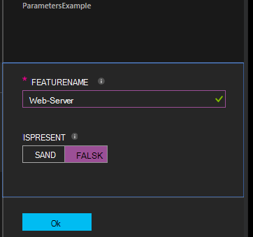

<properties 
   pageTitle="Kompilering konfigurationer i Azure automatisering DTK | Microsoft Azure" 
   description="Oversigt over to metoder til at samle beskedteksten tilstand konfiguration (DTK) konfigurationer: I portalen Azure og med Windows PowerShell. " 
   services="automation" 
   documentationCenter="na" 
   authors="coreyp-at-msft" 
   manager="stevenka" 
   editor="tysonn"/>

<tags
   ms.service="automation"
   ms.devlang="na"
   ms.topic="article"
   ms.tgt_pltfrm="powershell"
   ms.workload="na" 
   ms.date="01/25/2016"
   ms.author="coreyp"/>
   
#Kompilering konfigurationer i Azure automatisering DTK#

Du kan samle beskedteksten tilstand konfiguration (DTK) konfigurationer på to måder med Automation Azure: I portalen Azure og med Windows PowerShell. Tabellen nedenfor til at finde ud af, hvornår du skal bruge hvilken metode, der er baseret på egenskaberne for hver: 

###Azure preview-portalen###
- Nemmeste metode med interaktive brugergrænseflade
- Formular for at få enkle parameterværdier
- Nemt registrere jobtilstand
- Access godkendt med Azure logon

###Windows PowerShell###
- Ringe fra kommandolinjen med Windows PowerShell-cmdlet'er
- Kan inkluderes i automatiseret løsning med flere trin
- Få simple og komplekse parameterværdier
- Registrere jobtilstand
- Klient, der kræves for at understøtte PowerShell-cmdlet'er
- Overføre ConfigurationData
- Samle konfigurationer, der bruger legitimationsoplysninger

Når du har besluttet dig for en kompilering metode, kan du følge de respektive procedurer nedenfor for at starte kompilering.

##Sammensætning af en DTK konfiguration ved hjælp af Azure portal##

1.  Klik på **konfigurationer**fra kontoen automatisering.
2.  Klik på en konfiguration for at åbne dets blade.
3.  Klik på **samle**.
4.  Hvis konfigurationen ikke har nogen parametre, bliver du bedt om at bekræfte, om du vil samle den. Hvis konfigurationen har parametre, åbnes bladet **Samle konfiguration** , så du kan angive parameterværdier. I afsnittet <a href="#basic-parameters">**Grundlæggende parametre**</a> nedenfor for at få yderligere oplysninger om parametre.
5.  Bladet **Kompilering Job** åbnes, så du kan spore kompilering jobstatus og node konfigurationer (MOF konfigurationsdokumenter) det forårsaget skal placeres på Azure Automation DTK adskille-serveren.

##Sammensætning af en DTK konfiguration med Windows PowerShell##

Du kan bruge [`Start-AzureRmAutomationDscCompilationJob`](https://msdn.microsoft.com/library/mt244118.aspx) til at starte kompilering med Windows PowerShell. Følgende eksempelkode starter kompilering af en DTK konfiguration kaldet **SampleConfig**.

    Start-AzureRmAutomationDscCompilationJob -ResourceGroupName "MyResourceGroup" -AutomationAccountName "MyAutomationAccount" -ConfigurationName "SampleConfig" 
 
`Start-AzureRmAutomationDscCompilationJob`Returnerer et kompilering jobobjekt, du kan bruge til at registrere status. Du kan bruge denne kompilering jobobjekt med [`Get-AzureRmAutomationDscCompilationJob`](https://msdn.microsoft.com/library/mt244120.aspx) til at bestemme status for job kompilering og [`Get-AzureRmAutomationDscCompilationJobOutput`](https://msdn.microsoft.com/library/mt244103.aspx) til at få vist dets streams (output). Følgende eksempelkode starter kompilering af **SampleConfig** konfigurationen, skal vente, indtil den er fuldført, og derefter viser dets streams.
    
    $CompilationJob = Start-AzureRmAutomationDscCompilationJob -ResourceGroupName "MyResourceGroup" -AutomationAccountName "MyAutomationAccount" -ConfigurationName "SampleConfig"
    
    while($CompilationJob.EndTime –eq $null -and $CompilationJob.Exception –eq $null)           
    {
        $CompilationJob = $CompilationJob | Get-AzureRmAutomationDscCompilationJob
        Start-Sleep -Seconds 3
    }
    
    $CompilationJob | Get-AzureRmAutomationDscCompilationJobOutput –Stream Any 

##Grundlæggende parametre##

Parametererklæringen i DTK konfigurationer, inklusive parametertyper og egenskaber, fungerer på samme måde som i Azure automatisering runbooks. Se [starte en runbook i Azure Automation](automation-starting-a-runbook.md) mere at vide om runbook parametre.

I følgende eksempel bruges to parametre titlen **FeatureName** og **IsPresent**, til at bestemme værdierne for egenskaber i sektionen **ParametersExample.sample** node konfiguration, der genereres under kompilering.

    Configuration ParametersExample
    {
        param(
            [Parameter(Mandatory=$true)]
    
            [string] $FeatureName,
    
            [Parameter(Mandatory=$true)]
            [boolean] $IsPresent
        )
    
        $EnsureString = "Present"
        if($IsPresent -eq $false)
        {
            $EnsureString = "Absent"
        }
    
        Node "sample"
        {
            WindowsFeature ($FeatureName + "Feature")
            {
                Ensure = $EnsureString
                Name = $FeatureName
            }
        }
    }

Du kan samle DTK konfigurationer, der bruger grundlæggende parametre i portalen Azure automatisering DTK eller med Azure PowerShell:

###Portal###

Du kan angive parameterværdier i portalen, når du klikker på **samle**.

###PowerShell###

PowerShell kræver parametre i en [hashtable](http://technet.microsoft.com/library/hh847780.aspx) hvor tasten stemmer overens med parameternavnet, og værdien, der er lig med værdien for parameteren.

    $Parameters = @{
            "FeatureName" = "Web-Server"
            "IsPresent" = $False
    }
    
    
    Start-AzureRmAutomationDscCompilationJob -ResourceGroupName "MyResourceGroup" -AutomationAccountName "MyAutomationAccount" -ConfigurationName "ParametersExample" -Parameters $Parameters 
    

Du kan finde oplysninger om, der passerer PSCredentials som parametre <a href="#credential-assets">**Legitimationsoplysninger Aktiver**</a> nedenfor.

##ConfigurationData##

**ConfigurationData** giver dig mulighed at adskille strukturel konfiguration fra en hvilken som helst miljø bestemt konfiguration prøveversionen PowerShell DTK. Se [adskillelse "Hvad" fra "Hvor" i PowerShell DTK](http://blogs.msdn.com/b/powershell/archive/2014/01/09/continuous-deployment-using-dsc-with-minimal-change.aspx) mere at vide om **ConfigurationData**.

>[AZURE.NOTE] Du kan bruge **ConfigurationData** ved sammensætning af i Azure automatisering DTK ved hjælp af PowerShell Azure, men ikke i portalen Azure.

Følgende eksempel DTK konfiguration bruger **ConfigurationData** via **$ConfigurationData** og **$AllNodes** nøgleord. Du skal også [ **xWebAdministration** modul](https://www.powershellgallery.com/packages/xWebAdministration/) i dette eksempel:

     Configuration ConfigurationDataSample
     {
        Import-DscResource -ModuleName xWebAdministration -Name MSFT_xWebsite
    
        Write-Verbose $ConfigurationData.NonNodeData.SomeMessage 
    
        Node $AllNodes.Where{$_.Role -eq "WebServer"}.NodeName
        {
            xWebsite Site
            {
                Name = $Node.SiteName
                PhysicalPath = $Node.SiteContents
                Ensure   = "Present"
            }
        }
    }

Du kan samle DTK konfigurationen over med PowerShell. Den under PowerShell føjer to node konfigurationer til Azure Automation DTK adskille-serveren: **ConfigurationDataSample.MyVM1** og **ConfigurationDataSample.MyVM3**:

    $ConfigData = @{
        AllNodes = @(
            @{
                NodeName = "MyVM1"
                Role = "WebServer"
            },
            @{
                NodeName = "MyVM2"
                Role = "SQLServer"
            },
            @{
                NodeName = "MyVM3"
                Role = "WebServer"
    
            }
    
        )
    
        NonNodeData = @{
            SomeMessage = "I love Azure Automation DSC!"
    
        }
    
    } 
    
    Start-AzureRmAutomationDscCompilationJob -ResourceGroupName "MyResourceGroup" -AutomationAccountName "MyAutomationAccount" -ConfigurationName "ConfigurationDataSample" -ConfigurationData $ConfigData

##Aktiver##

Aktiver referencer er de samme i Azure automatisering DTK konfigurationer og runbooks. Se følgende for at få mere at vide:

- [Certifikater](automation-certificates.md)
- [Forbindelser](automation-connections.md)
- [Legitimationsoplysninger](automation-credentials.md)
- [Variabler](automation-variables.md)

###Legitimationsoplysninger Aktiver###
Mens DTK konfigurationer i Azure automatisering kan referere til legitimationsoplysninger Aktiver ved hjælp af **Get-AzureRmAutomationCredential**, kan legitimationsoplysninger Aktiver også sendes i via parametre, hvis du ønsker. Hvis en konfiguration tager en parameter af typen **PSCredential** , skal du overføre streng navnet på et Azure automatisering legitimationsoplysninger aktiv som pågældende parameterværdi i stedet for et PSCredential objekt. I baggrunden er Azure automatisering legitimationsoplysninger aktiv med dette navn hentet og overføres til konfigurationen.

Holde styr på legitimationsoplysninger kræver sikkert i node konfigurationer (MOF konfigurationsdokumenter), at kryptere legitimationsoplysninger i node MOF konfigurationsfil. Azure automatisering tager denne ét trin yderligere og krypterer hele MOF-filen. Dog skal aktuelt du se PowerShell DTK det er i orden for legitimationsoplysninger skal forbruges i almindelig tekst ved oprettelse af node konfiguration MOF, fordi PowerShell DTK ikke ved, at Azure automatisering kan kryptere hele MOF-filen efter dens generering af via et kompilering job.

Du kan se PowerShell DTK, at det er i orden for legitimationsoplysninger skal forbruges i almindelig tekst i den oprettede node konfiguration MOF'erne ved hjælp af <a href="#configurationdata">**ConfigurationData**</a>. Du skal gå, `PSDscAllowPlainTextPassword = $true` via **ConfigurationData** for hver node blok navn, der vises i DTK konfigurationen og legitimationsoplysningerne bruges.

I følgende eksempel viser en DTK konfiguration, der bruger et automatisering legitimationsoplysninger aktiv.

    Configuration CredentialSample
    {
       $Cred = Get-AzureRmAutomationCredential -Name "SomeCredentialAsset"
    
        Node $AllNodes.NodeName
        { 
            File ExampleFile
            { 
                SourcePath = "\\Server\share\path\file.ext" 
                DestinationPath = "C:\destinationPath" 
                Credential = $Cred 
            }
        }
    }

Du kan samle DTK konfigurationen over med PowerShell. Den under PowerShell føjer to node konfigurationer til Azure Automation DTK adskille-serveren: **CredentialSample.MyVM1** og **CredentialSample.MyVM2**.

    $ConfigData = @{
        AllNodes = @(
            @{
                NodeName = "*"
                PSDscAllowPlainTextPassword = $True
            },
            @{
                NodeName = "MyVM1"
            },
            @{
                NodeName = "MyVM2"
            }
        )
    }
    
    Start-AzureRmAutomationDscCompilationJob -ResourceGroupName "MyResourceGroup" -AutomationAccountName "MyAutomationAccount" -ConfigurationName "CredentialSample" -ConfigurationData $ConfigData
