<properties
   pageTitle="Introduktion til Azure automatisering DTK"
   description="FORKLARING og eksempler på de mest almindelige opgaver i Azure automatisering beskedteksten tilstand konfiguration (DTK)"
   services="automation" 
   documentationCenter="na" 
   authors="eslesar" 
   manager="dongill" 
   editor="tysonn"/>

<tags
   ms.service="automation"
   ms.devlang="na"
   ms.topic="article"
   ms.tgt_pltfrm="powershell"
   ms.workload="na" 
   ms.date="06/06/2016"
   ms.author="magoedte;eslesar"/>
   

# <a name="getting-started-with-azure-automation-dsc"></a>Introduktion til Azure automatisering DTK

Dette emne forklares det, hvordan du gør de mest almindelige opgaver med Azure automatisering beskedteksten tilstand konfiguration (DTK), såsom at oprette, importere, og kompilering konfigurationer, onboarding computere til at administrere, og få vist rapporter. Du kan finde en oversigt over, hvad Azure automatisering DTK er [Azure automatisering DTK oversigt](automation-dsc-overview.md). Du kan finde DTK dokumentation [Windows PowerShell beskedteksten tilstand konfiguration oversigt](https://msdn.microsoft.com/PowerShell/dsc/overview).

Dette emne indeholder en trinvis vejledning til brug af Azure automatisering DTK. Hvis du vil et eksempel-miljø, der er allerede konfigureret uden at følge trinnene beskrevet i dette emne, kan du bruge [følgende ARM skabelon](https://github.com/azureautomation/automation-packs/tree/master/102-sample-automation-setup). Denne skabelon konfigurerer et færdige Azure automatisering DTK miljø, herunder en Azure VM, der administreres af Azure automatisering DTK.
 
## <a name="prerequisites"></a>Forudsætninger

For at fuldføre eksemplerne i dette emne, skal følgende være krav:

- En Azure automatisering konto. Du kan finde vejledning i at oprette en konto, der er Azure automatisering Kør som [Azure køre som konto](automation-sec-configure-azure-runas-account.md).
- En Azure ressourcestyring VM (ikke klassisk) kører Windows Server 2008 R2 eller nyere. Vejledning i at oprette en VM, under [oprette din første virtuelle maskine til Windows Azure-portalen](../virtual-machines/virtual-machines-windows-hero-tutorial.md)

## <a name="creating-a-dsc-configuration"></a>Opretter en DTK konfiguration

Vi opretter en simpel [DTK konfiguration](https://msdn.microsoft.com/powershell/dsc/configurations) , som sikrer, at enten tilstedeværelsen eller fravær af **Web-Server** Windows funktion (IIS), afhængigt af hvordan du tildeler noder.

1. Start Windows PowerShell ISE (eller en hvilken som helst tekstredigeringsprogram).

2. Skriv følgende tekst:

    ```powershell
    configuration TestConfig
    {
        Node WebServer
        {
            WindowsFeature IIS
            {
                Ensure               = 'Present'
                Name                 = 'Web-Server'
                IncludeAllSubFeature = $true

            }
        }

        Node NotWebServer
        {
            WindowsFeature IIS
            {
                Ensure               = 'Absent'
                Name                 = 'Web-Server'

            }
        }
        }
    ```
3. Gem filen som `TestConfig.ps1`.

Denne konfiguration kalder en ressource i hver node blok, [WindowsFeature ressource](https://msdn.microsoft.com/powershell/dsc/windowsfeatureresource), der sikrer, at enten tilstedeværelsen eller fravær af funktionen **Web-Server** .

## <a name="importing-a-configuration-into-azure-automation"></a>Importere en konfiguration til Azure automatisering

Vi kan derefter importere konfigurationen til automatisering-konto.

1. Log på [Azure-portalen](https://portal.azure.com).

2. Menuen Hub på **alle de ressourcer** , og klik derefter på navnet på din konto med Automation.

3. Klik på **DTK konfigurationer**bladet **automatisering konto** .

4. Klik på **Tilføj en konfiguration**på bladet **DTK konfigurationer** .

5. Gå til på bladet **Importkonfiguration** på `TestConfig.ps1` fil på din computer.
    
    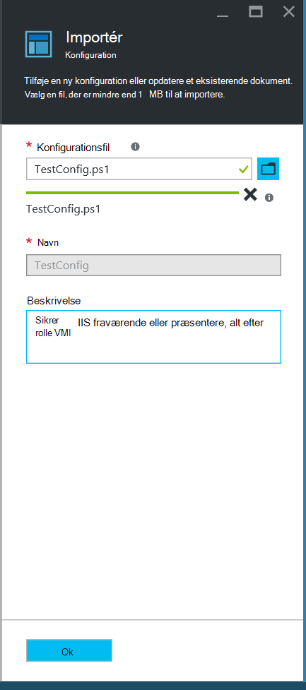
    

6. Klik på **OK**.

## <a name="viewing-a-configuration-in-azure-automation"></a>Få vist en konfiguration i Azure automatisering

Når du har importeret en konfiguration, kan du få den vist i portalen Azure.

1. Log på [Azure-portalen](https://portal.azure.com).

2. Menuen Hub på **alle de ressourcer** , og klik derefter på navnet på din konto med Automation.

3. Klik på bladet **automatisering konto** **DTK konfigurationer**

4. Klik på **TestConfig** (dette er navnet på den konfiguration, du har importeret i den foregående fremgangsmåde) bladet **DTK konfigurationer** .

5. Klik på **Vis konfiguration kilde**bladet **TestConfig konfiguration** .

    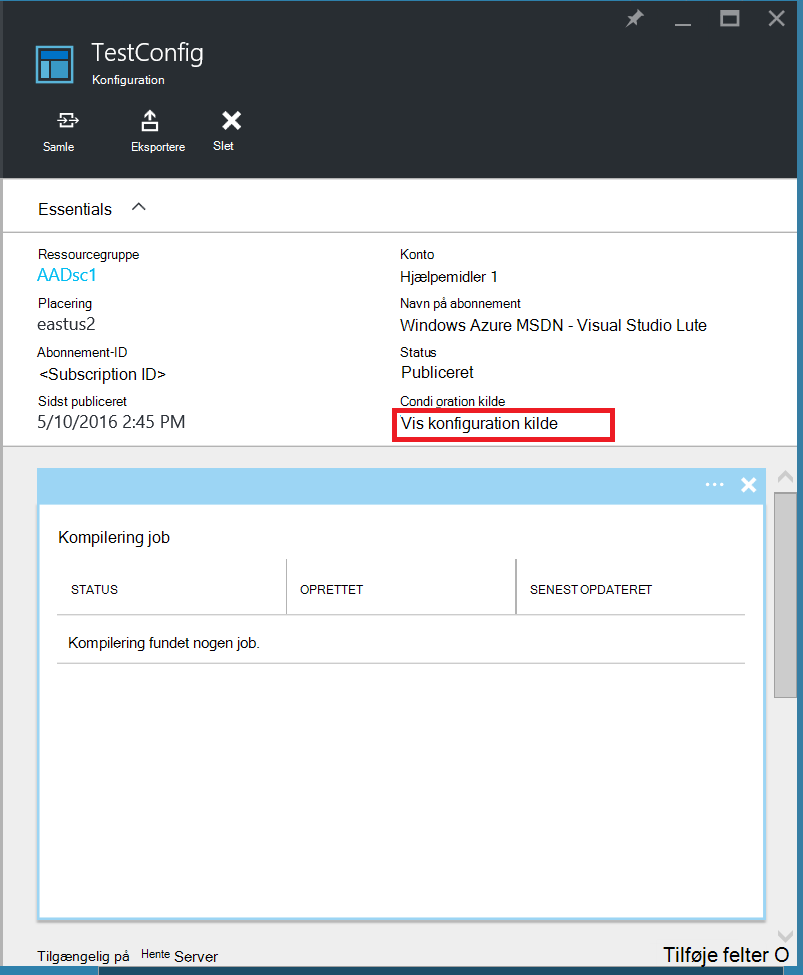
    
    En **TestConfig konfiguration kilde** blade åbnes og viser PowerShell-koden for konfigurationen.
    
## <a name="compiling-a-configuration-in-azure-automation"></a>Sammensætning af en konfiguration i Azure automatisering

Før du kan anvende en ønskede tilstand til en node, skal en DTK konfiguration, der definerer tilstanden være samlet i én eller flere node konfigurationer (MOF dokument), og som anbringes på automatiske DTK adskille serveren. Se [kompilering konfigurationer i Azure automatisering DTK](automation-dsc-compile.md)til en mere detaljeret beskrivelse af kompilering konfigurationer i Azure automatisering DTK. Du kan finde flere oplysninger om kompilering konfigurationer, [DTK konfigurationer](https://msdn.microsoft.com/PowerShell/DSC/configurations).

1. Log på [Azure-portalen](https://portal.azure.com).

2. Menuen Hub på **alle de ressourcer** , og klik derefter på navnet på din konto med Automation.

3. Klik på bladet **automatisering konto** **DTK konfigurationer**

4. Klik på **TestConfig** (navnet på den tidligere importerede konfiguration) bladet **DTK konfigurationer** .

5. Klik på **samle**på bladet **TestConfig konfiguration** , og klik derefter på **Ja**. Dette starter et job kompilering.
    
    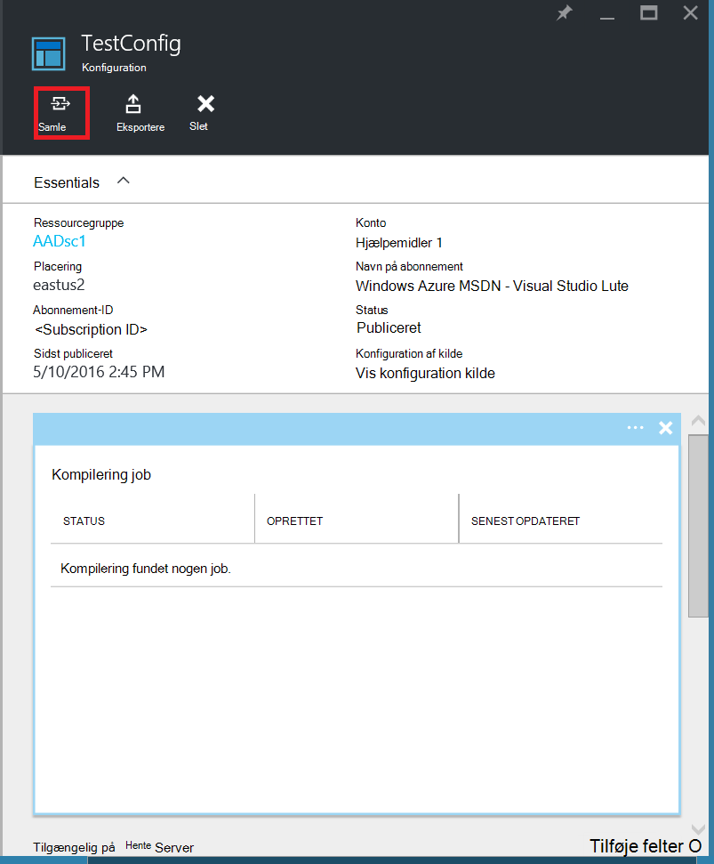
    
> [AZURE.NOTE] Når du kompilerer en konfiguration i Azure automatisering, installerer en oprettet node konfiguration MOF'erne automatisk til at hente serveren.

## <a name="viewing-a-compilation-job"></a>Få vist et kompilering job

Når du starter en samling, kan du få den vist i feltet **kompilering job** i bladet **konfiguration** . Feltet **kompilering job** vises i øjeblikket kører, fuldført, og mislykkedes job. Når du åbner en kompilering job blade, der vises for oplysninger om den opgave, herunder eventuelle fejl eller advarsler er stødt på, inputparametre bruges i konfigurationen og kompilering logfiler.

1. Log på [Azure-portalen](https://portal.azure.com).

2. Menuen Hub på **alle de ressourcer** , og klik derefter på navnet på din konto med Automation.

3. Klik på **DTK konfigurationer**bladet **automatisering konto** .

4. Klik på **TestConfig** (navnet på den tidligere importerede konfiguration) bladet **DTK konfigurationer** .

5. Klik på feltet **kompilering job** af bladet **TestConfig konfiguration** på ethvert af de job, der vises. En **Kompilering Job** blade åbnes, mærket med den dato, der er blevet startet kompilering jobbet.

    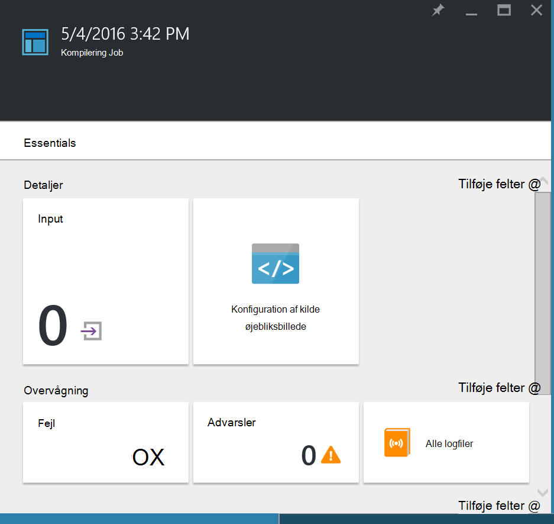
  
6. Klik på et felt i bladet **Kompilering jobstatus** for at få yderligere oplysninger om jobbet.

## <a name="viewing-node-configurations"></a>Få vist node konfigurationer

Vellykket gennemførelse af et kompilering job opretter en eller flere nye node konfigurationer. En node konfiguration er et MOF dokument, der er installeret på serveren hente og klar til at være trukket og anvendt af en eller flere noder. Du kan få vist node konfigurationerne i kontoen automatisering i bladet **DTK Node konfigurationer** . En node konfiguration har et navn med formularen *ConfigurationName*. *NodeName*.

1. Log på [Azure-portalen](https://portal.azure.com).

2. Menuen Hub på **alle de ressourcer** , og klik derefter på navnet på din konto med Automation.

3. Klik på **DTK Node konfigurationer**bladet **automatisering konto** .

    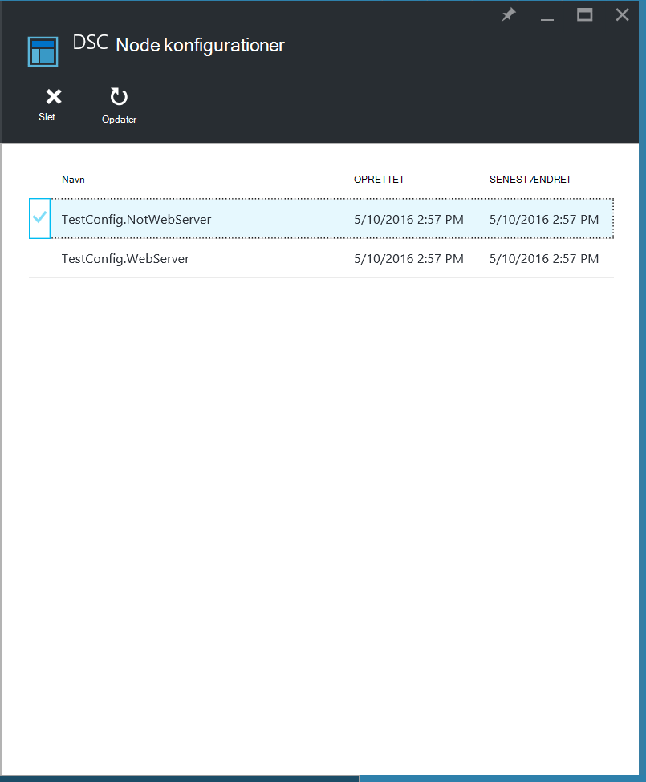
    
## <a name="onboarding-an-azure-vm-for-management-with-azure-automation-dsc"></a>Onboarding en Azure VM til at administrere med Azure automatisering DTK

Du kan bruge Azure automatisering DTK til at administrere Azure FOS (både klassisk og ressourcestyring), lokale FOS, Linux-computere, AWS FOS og lokale fysiske computere. I dette emne dækker vi Sådan indbyggede kun Azure ressourcestyring FOS. Finde oplysninger om onboarding andre typer maskiner, [computere Onboarding til administration af Azure automatisering DTK](automation-dsc-onboarding.md).

### <a name="to-onboard-an-azure-resource-manager-vm-for-management-by-azure-automation-dsc"></a>Til indbyggede en Azure ressourcestyring VM til administration af Azure automatisering DTK

1. Log på [Azure-portalen](https://portal.azure.com).

2. Menuen Hub på **alle de ressourcer** , og klik derefter på navnet på din konto med Automation.

3. Klik på **DTK noder**bladet **automatisering konto** .

4. Klik på **Tilføj Azure VM**i bladet **DTK noder** .

    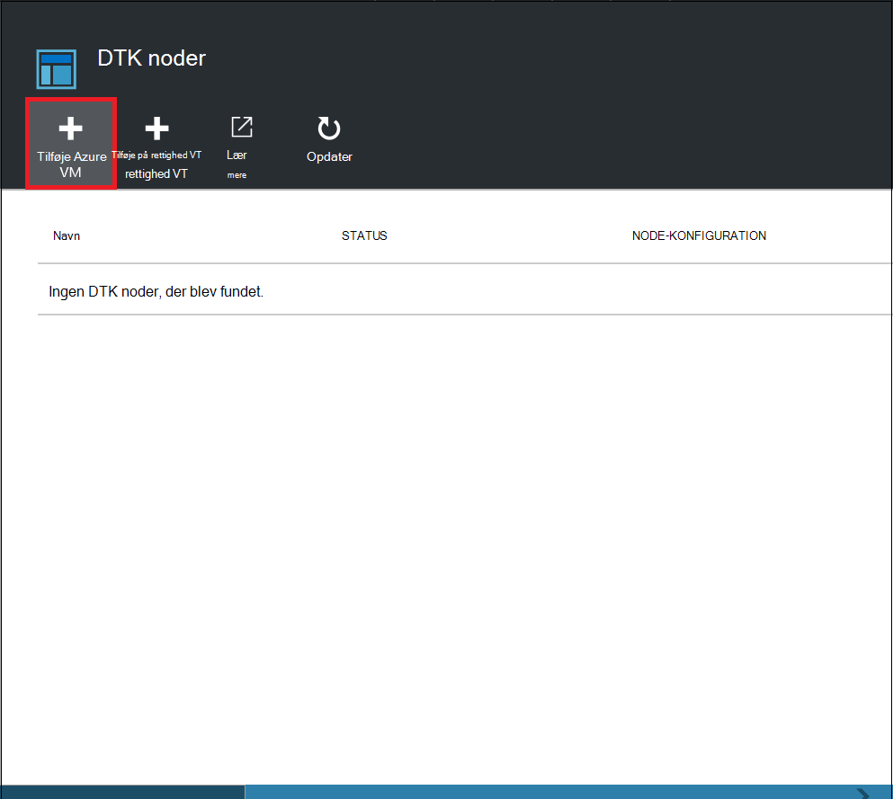

5. Klik på **Vælg virtuelle maskiner til indbyggede**i bladet **Tilføje Azure FOS** .

6. Vælg den ønskede til indbyggede VM bladet **Vælg FOS** , og klik på **OK**.

    >[AZURE.IMPORTANT] Det skal være en Azure ressourcestyring-VM kører Windows Server 2008 R2 eller nyere.
    
7. Klik på **Konfigurer registreringsoplysninger**i bladet **Tilføje Azure FOS** .

8. Angiv navnet på den node konfiguration, du vil anvende til VM i feltet **Navn på Node konfiguration** i bladet **registrering** . Dette skal svare nøjagtigt til navnet på en node konfiguration i den automatiske konto. Indtaste et navn på dette tidspunkt er valgfrit. Du kan ændre den tildelte node konfiguration efter onboarding noden.
Kontrollere **Genstart Node, hvis det er nødvendigt**, og klik derefter på **OK**.
    
    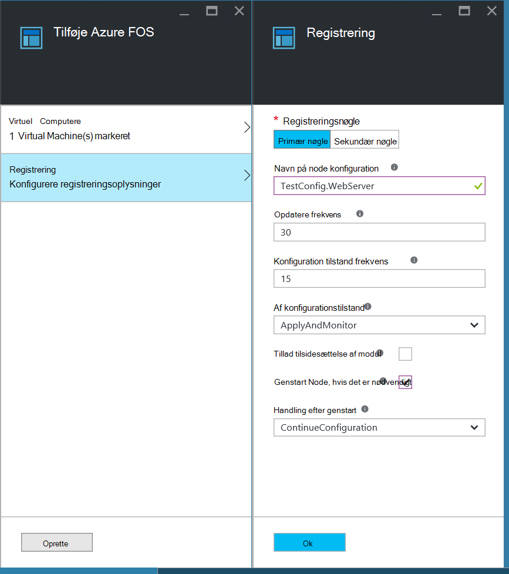
    
    Du har angivet node konfigurationen anvendes til VM med intervaller, der er angivet af **Konfiguration tilstand hyppighed**, og VM skal søge efter opdateringer af node konfigurationen med intervaller, der er angivet af **Opdatere frekvens**. Du kan finde flere oplysninger om, hvordan disse værdier bruges, kan du se [konfiguration af lokal Configuration Manager](https://msdn.microsoft.com/PowerShell/DSC/metaConfig).
    
9. Klik på **Opret**i bladet **Tilføje Azure FOS** .

Azure starter processen med at onboarding VM. Når den er fuldført, vises VM i bladet **DTK noder** i kontoen automatisering.

## <a name="viewing-the-list-of-dsc-nodes"></a>Få vist listen over DTK noder

Du kan få vist listen over alle de computere, der er blevet onboarded til administration af kontoen automatisering i bladet **DTK noder** .

1. Log på [Azure-portalen](https://portal.azure.com).

2. Menuen Hub på **alle de ressourcer** , og klik derefter på navnet på din konto med Automation.

3. Klik på **DTK noder**bladet **automatisering konto** .

## <a name="viewing-reports-for-dsc-nodes"></a>Få vist rapporter for DTK noder

Hver gang Azure automatisering DTK udfører konsistens Tjek på en administreret node sender noden en statusrapport tilbage til hente serveren. Du kan få vist disse rapporter på bladet for denne node.

1. Log på [Azure-portalen](https://portal.azure.com).

2. Menuen Hub på **alle de ressourcer** , og klik derefter på navnet på din konto med Automation.

3. Klik på **DTK noder**bladet **automatisering konto** .

4. Klik på rapporter på listen i feltet **rapporter** .

    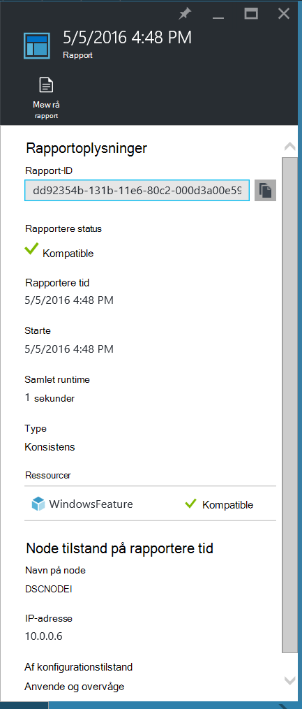

Du kan se de følgende statusoplysninger for den tilsvarende konsistens check på bladet for en enkelt rapport:

- Rapportere status – om noden er "Compliant", at konfigurationen "Mislykkedes", eller noden er "Ikke er kompatible" (når noden er i **applyandmonitor** tilstand og computeren ikke er i den ønskede tilstand).
- Starttidspunktet for konsistenskontrollen.
- Den samlede kørselstid for konsistenskontrollen.
- Typen af konsistens afkrydsningsfelt.
- Eventuelle fejl, herunder fejlkode og fejlmeddelelse. 
- En hvilken som helst DTK ressourcer, der bruges i konfigurationen og tilstanden for hver ressource (om noden er i den ønskede tilstand for den pågældende ressource) – kan du klikke på hver ressource for at få mere detaljerede oplysninger for den pågældende ressource.
- Det navn, IP-adresse og konfigurationstilstand for noden.

Du kan også klikke på **Vis rå rapport** for at få vist de faktiske data, noden sender til serveren. Du kan finde flere oplysninger om brug af disse data under [Brug af en DTK rapportserver](https://msdn.microsoft.com/powershell/dsc/reportserver).

Det kan tage lidt tid, når en node er onboarded, før den første rapport er tilgængelig. Du skal muligvis vente op til 30 minutter, før den første rapport efter at du om bord en node.

## <a name="reassigning-a-node-to-a-different-node-configuration"></a>Tildele en knude til en anden node-konfiguration

Du kan tildele en knude til brug af en anden node konfiguration end den, du har tildelt.

1. Log på [Azure-portalen](https://portal.azure.com).

2. Menuen Hub på **alle de ressourcer** , og klik derefter på navnet på din konto med Automation.

3. Klik på **DTK noder**bladet **automatisering konto** .

4. Klik på navnet på den knude, du vil tildele igen på bladet **DTK noder** .

5. Klik på bladet for denne node **Tildel node**.

    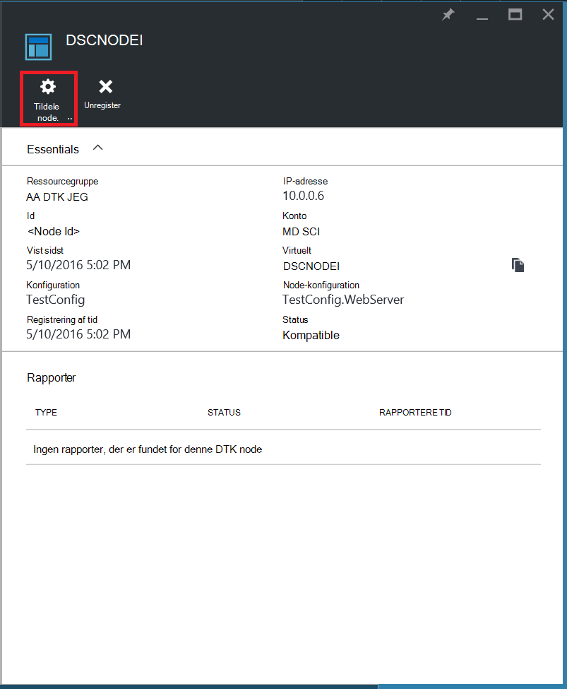

6. Vælg den node konfiguration, som du vil tildele noden på bladet **Tildele Node konfiguration** , og klik derefter på **OK**.

    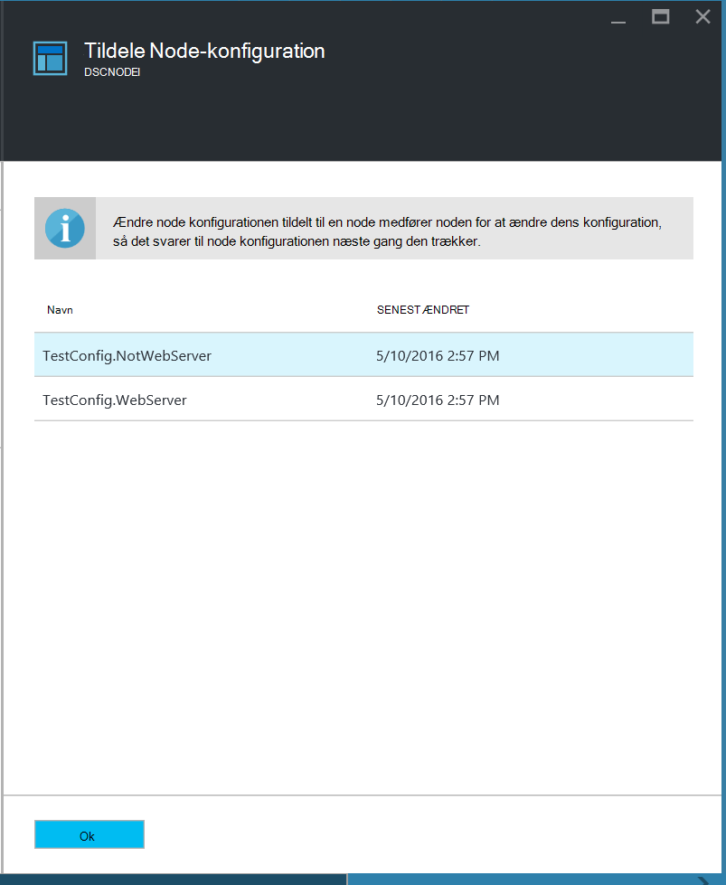
    
## <a name="unregistering-a-node"></a>Fjerne registreringen af en node

Hvis du vil ikke længere en node der skal administreres af Azure automatisering DTK, kan du fjerne registreringen.

1. Log på [Azure-portalen](https://portal.azure.com).

2. Menuen Hub på **alle de ressourcer** , og klik derefter på navnet på din konto med Automation.

3. Klik på **DTK noder**bladet **automatisering konto** .

4. Klik på navnet på den knude, du vil fjerne registreringen på bladet **DTK noder** .

5. Klik på **fjerner registreringen af**bladet for denne node.

    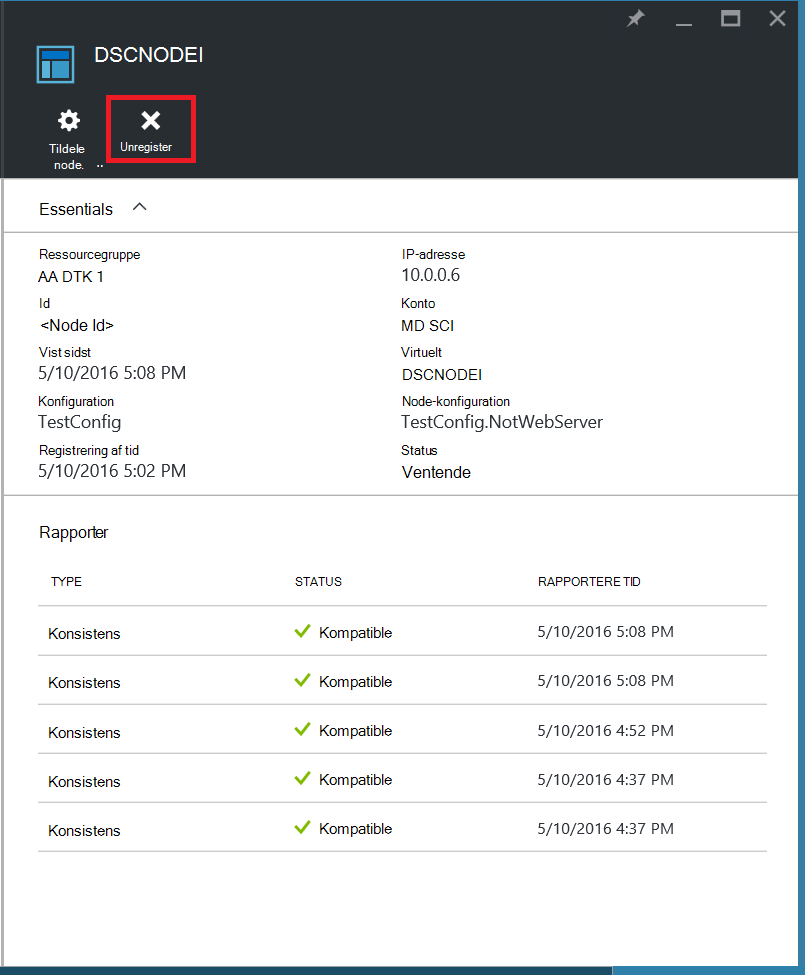

## <a name="related-articles"></a>Relaterede artikler
* [Azure automatisering DTK oversigt](automation-dsc-overview.md)
* [Onboarding maskiner til administration af Azure automatisering DTK](automation-dsc-onboarding.md)
* [Windows PowerShell beskedteksten oversigt over stat konfiguration](https://msdn.microsoft.com/powershell/dsc/overview)
* [Azure-cmdletter automatisering DTK](https://msdn.microsoft.com/library/mt244122.aspx)
* [Azure automatisering DTK priser](https://azure.microsoft.com/pricing/details/automation/)

