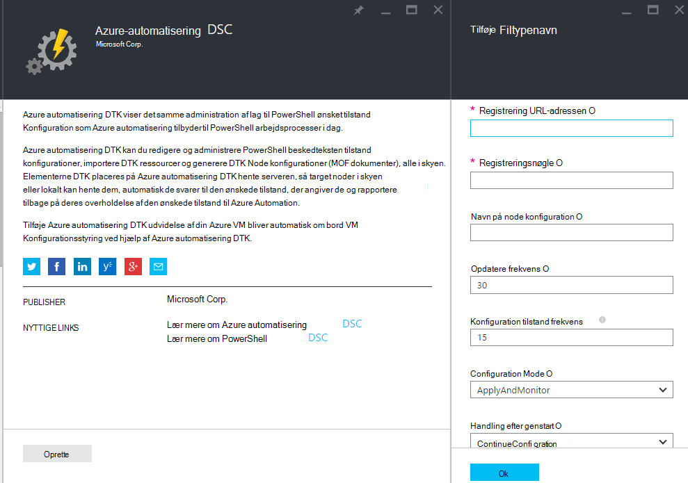
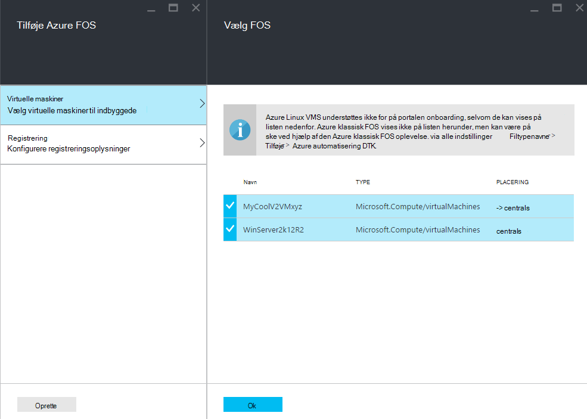
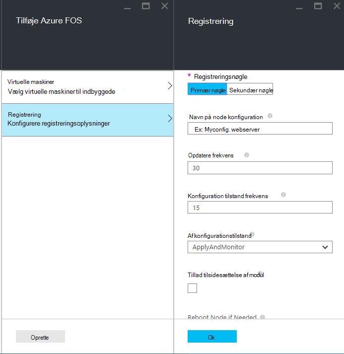
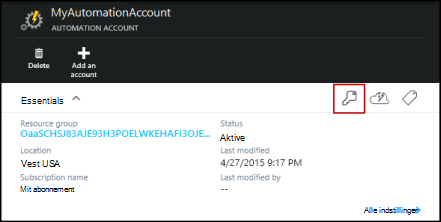
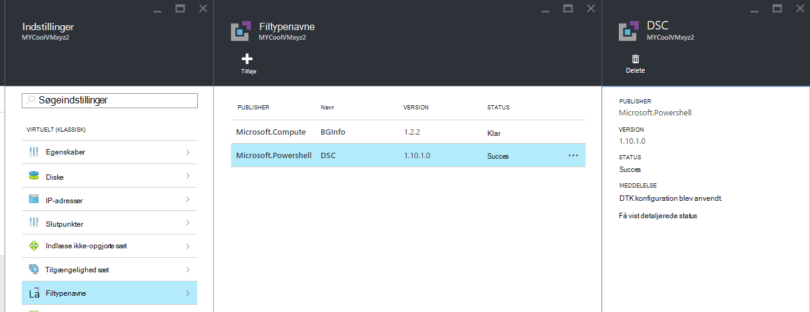

<properties 
   pageTitle="Onboarding fysiske og virtuelle maskiner til administration af Azure automatisering DTK | Microsoft Azure" 
   description="Sådan konfigureres computere til at administrere med Azure automatisering DTK" 
   services="automation" 
   documentationCenter="dev-center-name" 
   authors="coreyp-at-msft" 
   manager="stevenka" 
   editor="tysonn"/>

<tags
   ms.service="automation"
   ms.devlang="NA"
   ms.topic="article"
   ms.tgt_pltfrm="powershell"
   ms.workload="TBD" 
   ms.date="04/22/2016"
   ms.author="coreyp"/>

# Onboarding maskiner til administration af Azure automatisering DTK

## Hvorfor administrere maskiner med Azure automatisering DTK?

Azure automatisering beskedteksten tilstand konfiguration er som [PowerShell beskedteksten tilstand konfiguration](https://technet.microsoft.com/library/dn249912.aspx), en enkle og effektive, konfiguration management-tjenesten for DTK noder (fysiske og virtuelle maskiner) i en hvilken som helst skyen eller en lokal datacenter. Det gør det muligt for skalerbarhed på tværs af tusindvis af maskiner hurtigt og nemt fra et centralt og sikkert sted. Du kan nemt indbyggede maskiner, Tildel dem deklarativ konfigurationer, og få vist rapporter, der viser hver computer er overholdelse af regler til den ønskede tilstand, du har angivet. Azure automatisering DTK management lag er at DTK nyheder Azure automatisering administration af lag til PowerShell scripting. Det vil sige, på samme måde, der Azure automatisering hjælper dig med at administrere PowerShell-scripts, du kan også administrere DTK konfigurationer. Hvis du vil vide mere om fordelene ved at bruge Azure automatisering DTK skal du se [Oversigt over Azure automatisering DTK](automation-dsc-overview.md). 

Azure automatisering DTK kan bruges til at administrere en række forskellige computere:

*    Azure virtuelle maskiner (klassisk)
*    Azure virtuelle maskiner
*    Amazon Web Services (AWS) virtuelle maskiner
*    Fysisk/virtuelle Windows maskiner, der er lokale miljø, eller i en skybaseret end Azure/AWS
*    Fysisk/virtuelle Linux maskiner, der er lokale miljø, i Azure eller i en skybaseret end Azure

Hvis du ikke er klar til at administrere maskine konfiguration fra skyen, kan Azure automatisering DTK desuden også bruges som et kun rapport slutpunkt. Dette kan du angive (push) ønsket konfiguration gennem DTK lokalt og få vist omfattende rapportering detaljer om node overholdelse af den ønskede tilstand i Azure Automation.

De følgende afsnit beskrives, hvordan du om bord kan hver type machine til Azure automatisering DTK.

## Azure virtuelle maskiner (klassisk)

Med Azure automatisering DTK kan du nemt indbyggede Azure virtuelle maskiner (klassisk) Konfigurationsstyring ved hjælp af enten Azure-portalen, eller PowerShell. Under struktur og uden administrator skulle remote til VM, registrerer filtypenavnet Azure VM beskedteksten tilstand konfiguration VM med Azure automatisering DTK. Da filtypenavnet Azure VM beskedteksten tilstand konfiguration kører asynkront, trin for at få vist status eller foretage fejlfinding af det findes i afsnittet [**fejlfinding i forbindelse med Azure virtuelt onboarding**](#troubleshooting-azure-virtual-machine-onboarding) nedenfor.

### Azure-portalen

Klik på **Gennemse**i [Azure portal](http://portal.azure.com/) -> **virtuelle maskiner (klassisk)**. Vælg den Windows VM, du vil indbyggede. Klik på **alle indstillinger**på den virtuelle maskine dashboard blade -> **filtypenavne** -> **Tilføj** -> **Azure automatisering DTK** -> **Opret**. Angiv [PowerShell DTK lokale Configuration Manager værdier](https://msdn.microsoft.com/powershell/dsc/metaconfig4) , der kræves til din brug sag, kontoen automatisering registreringsnøgle og registrering URL-adresse og eventuelt en node konfiguration for at tildele til VM.

Hvis du vil finde registreringen konto URL-adresse og nøgle til at automatisere til om bord på computeren til at se afsnittet [**Secure registrering**](#secure-registration) nedenfor.

### PowerShell

    # log in to both Azure Service Management and Azure Resource Manager
    Add-AzureAccount
    Add-AzureRmAccount
    
    # fill in correct values for your VM/Automation account here
    $VMName = ""
    $ServiceName = ""
    $AutomationAccountName = ""
    $AutomationAccountResourceGroup = ""

    # fill in the name of a Node Configuration in Azure Automation DSC, for this VM to conform to
    $NodeConfigName = ""

    # get Azure Automation DSC registration info
    $Account = Get-AzureRmAutomationAccount -ResourceGroupName $AutomationAccountResourceGroup -Name $AutomationAccountName
    $RegistrationInfo = $Account | Get-AzureRmAutomationRegistrationInfo

    # use the DSC extension to onboard the VM for management with Azure Automation DSC
    $VM = Get-AzureVM -Name $VMName -ServiceName $ServiceName
    
    $PublicConfiguration = ConvertTo-Json -Depth 8 @{
      SasToken = ""
      ModulesUrl = "https://eus2oaasibizamarketprod1.blob.core.windows.net/automationdscpreview/RegistrationMetaConfigV2.zip"
      ConfigurationFunction = "RegistrationMetaConfigV2.ps1\RegistrationMetaConfigV2"

    # update these PowerShell DSC Local Configuration Manager defaults if they do not match your use case.
    # See https://technet.microsoft.com/library/dn249922.aspx?f=255&MSPPError=-2147217396 for more details
     Properties = @{
        RegistrationKey = @{
          UserName = 'notused'
          Password = 'PrivateSettingsRef:RegistrationKey'
        }
        RegistrationUrl = $RegistrationInfo.Endpoint
        NodeConfigurationName = $NodeConfigName
        ConfigurationMode = "ApplyAndMonitor"
        ConfigurationModeFrequencyMins = 15
        RefreshFrequencyMins = 30
        RebootNodeIfNeeded = $False
        ActionAfterReboot = "ContinueConfiguration"
        AllowModuleOverwrite = $False
      }
    }

    $PrivateConfiguration = ConvertTo-Json -Depth 8 @{
      Items = @{
         RegistrationKey = $RegistrationInfo.PrimaryKey
      }
    }
    
    $VM = Set-AzureVMExtension `
     -VM $vm `
     -Publisher Microsoft.Powershell `
     -ExtensionName DSC `
     -Version 2.19 `
     -PublicConfiguration $PublicConfiguration `
     -PrivateConfiguration $PrivateConfiguration `
     -ForceUpdate

    $VM | Update-AzureVM

## Azure virtuelle maskiner

Azure automatisering DTK kan du nemt indbyggede Azure virtuelle maskiner Konfigurationsstyring, med enten Azure-portalen, Azure ressourcestyring skabeloner eller PowerShell. Under struktur og uden administrator skulle remote til VM, registrerer filtypenavnet Azure VM beskedteksten tilstand konfiguration VM med Azure automatisering DTK. Da filtypenavnet Azure VM beskedteksten tilstand konfiguration kører asynkront, trin for at få vist status eller foretage fejlfinding af det findes i afsnittet [**fejlfinding i forbindelse med Azure virtuelt onboarding**](#troubleshooting-azure-virtual-machine-onboarding) nedenfor.

### Azure-portalen

Gå til kontoen Azure automatisering, hvor du vil indbyggede virtuelle maskiner i [Azure-portalen](https://portal.azure.com/). Automatisering konto-dashboard, klik på **DTK noder** -> **Tilføje Azure VM**.

Vælg en eller flere Azure virtuelle maskiner til indbyggede under **Vælg virtuelle maskiner til indbyggede**.

Angiv [PowerShell DTK lokale Configuration Manager værdier](https://msdn.microsoft.com/powershell/dsc/metaconfig4) , der kræves til din brug sag og eventuelt en node konfiguration for at tildele til VM under **Konfigurer registreringsoplysninger**.

 
### Azure ressourcestyring skabeloner

Azure virtuelle maskiner kan installeres og onboarded til Azure automatisering DTK via Azure ressourcestyring skabeloner. Se [konfigurere en VM via DTK lokalnummer og Azure automatisering DTK](https://azure.microsoft.com/documentation/templates/dsc-extension-azure-automation-pullserver/) til en eksempelskabelon, der onboards en eksisterende VM til Azure automatisering DTK. Finde registreringsnøgle og registrering URL-adresse, der er taget som input i denne skabelon, se afsnittet [**Secure registrering**](#secure-registration) nedenfor.

### PowerShell

Cmdletten [Register-AzureRmAutomationDscNode](https://msdn.microsoft.com/library/mt603833.aspx) kan bruges til at indbyggede virtuelle maskiner i portalen Azure via PowerShell.

## Amazon Web Services (AWS) virtuelle maskiner

Du kan nemt indbyggede Amazon webtjenester virtuelle maskiner Konfigurationsstyring ved Azure automatisering DTK ved hjælp af AWS DTK værktøjerne. Du kan læse mere om værktøjerne [her](https://blogs.msdn.microsoft.com/powershell/2016/04/20/aws-dsc-toolkit/).

## Fysisk/virtuelle Windows maskiner, der er lokale miljø, eller i en skybaseret end Azure/AWS

Lokale Windows-computere og Windows-computere i ikke-Azure skyer (såsom Amazon Web Services) kan du også være onboarded til Azure automatisering DTK, som de har udgående adgang til internettet, via et par enkle trin:

1. Sørg for, at den nyeste version af [WMF 5](http://aka.ms/wmf5latest) er installeret på de computere, du vil indbyggede til Azure automatisering DTK.
2. Følg vejledningen i afsnittet [**genererende DTK metaconfigurations**](#generating-dsc-metaconfigurations) , der nedenfor til at oprette en mappe, der indeholder den nødvendige DTK metaconfigurations.
3. Anvende fra en fjernplacering PowerShell DTK metaconfiguration på de computere, du vil indbyggede. **Denne kommando køres fra computeren skal have den nyeste version af [WMF 5](http://aka.ms/wmf5latest) installeret**:

    `Set-DscLocalConfigurationManager -Path C:\Users\joe\Desktop\DscMetaConfigs -ComputerName MyServer1, MyServer2`

4. Hvis du ikke kan installere PowerShell DTK metaconfigurations fra en fjernplacering, kan du kopiere mappen metaconfigurations fra trin 2 på hver maskine til indbyggede. Kald derefter **Sæt DscLocalConfigurationManager** lokalt på hver maskine til indbyggede.
5. Ved hjælp af Azure portal eller cmdletter, skal du kontrollere, maskiner til indbyggede nu vises som DTK noder, der er registreret i kontoen Azure automatisering.

## Fysisk/virtuelle Linux maskiner, der er lokale miljø, i Azure eller i en skybaseret end Azure

Lokalt Linux-computere, Linux-computere i Azure og Linux-computere i ikke-Azure skyer kan også være onboarded til Azure automatisering DTK, som de har udgående adgang til internettet, via et par enkle trin:

1. Sørg for, at den nyeste version af [DTK Linux-agent](http://www.microsoft.com/download/details.aspx?id=49150) er installeret på de computere, du vil indbyggede til Azure automatisering DTK.

2. Hvis [standardindstillinger for PowerShell DTK lokale Configuration Manager](https://msdn.microsoft.com/powershell/dsc/metaconfig4) svarer til din brug sag, og du vil til indbyggede maskiner, f.eks., at de **både** trække fra og rapportere til Azure automatisering DTK:

    *    Brug Register.py til indbyggede ved hjælp af PowerShell DTK lokale Configuration Manager standardindstillingerne hver Linux-Machine til indbyggede til Azure automatisering DTK:

        `/opt/microsoft/dsc/Scripts/Register.py <Automation account registration key> <Automation account registration URL>`

    *    For at finde den registreringsnøgle og registrering URL-adressen for din konto med Automation skal du se afsnittet [**Secure registrering**](#secure-registration) nedenfor.

    Hvis PowerShell DTK lokale Configuration Manager standarder **gør** Brug store og små bogstaver, eller du gerne vil indbyggede maskiner, så de kun rapport til Azure automatisering DTK **ikke** svarer til, men kan ikke hente konfiguration eller PowerShell moduler fra det, skal du følge trin 3-6. Ellers skal du fortsætte direkte til trin 6.

3.  Følg vejledningen i afsnittet [**genererende DTK metaconfigurations**](#generating-dsc-metaconfigurations) nedenfor til at oprette en mappe, der indeholder den nødvendige DTK metaconfigurations.
4.  Anvende fra en fjernplacering PowerShell DTK metaconfiguration på de computere, du vil indbyggede:
        
        $SecurePass = ConvertTo-SecureString -String "<root password>" -AsPlainText -Force
        $Cred = New-Object System.Management.Automation.PSCredential "root", $SecurePass
        $Opt = New-CimSessionOption -UseSsl -SkipCACheck -SkipCNCheck -SkipRevocationCheck

        # need a CimSession for each Linux machine to onboard
        
        $Session = New-CimSession -Credential $Cred -ComputerName <your Linux machine> -Port 5986 -Authentication basic -SessionOption $Opt
        
        Set-DscLocalConfigurationManager -CimSession $Session –Path C:\Users\joe\Desktop\DscMetaConfigs
    
Denne kommando køres fra computeren skal have den nyeste version af [WMF 5](http://aka.ms/wmf5latest) installeret.

5.  Hvis du ikke kan anvende PowerShell DTK metaconfigurations eksternt til hver Linux-computer til indbyggede, kopiere metaconfiguration svarer til maskinen fra mappen i trin 5 til Linux maskinen. Kald derefter `SetDscLocalConfigurationManager.py` lokalt på hver Linux maskine ønskede til indbyggede til Azure automatisering DTK:

    `/opt/microsoft/dsc/Scripts/SetDscLocalConfigurationManager.py –configurationmof <path to metaconfiguration file>`

6.  Ved hjælp af Azure portal eller cmdletter, skal du kontrollere, maskiner til indbyggede nu vises som DTK noder, der er registreret i kontoen Azure automatisering.

##Generering af DTK metaconfigurations
Til generisk indbyggede maskine til Azure automatisering DTK en DTK metaconfiguration kan være genereres, når du har anvendt, fortæller DTK agent på computeren til at trække fra og/eller rapport til Azure automatisering DTK. DTK metaconfigurations til Azure automatisering DTK kan oprettes ved hjælp af en PowerShell DTK konfiguration eller Azure automatisering PowerShell-cmdlet'er.

**Note:** DTK metaconfigurations indeholder hemmeligheder behov til indbyggede en computer til en Automation-konto til at administrere. Sørg for at beskytte effektivt en hvilken som helst DTK metaconfigurations du oprette eller slette dem efter anvendelse.

###Ved hjælp af en DTK konfiguration
1.  Åbn PowerShell ISE som administrator i en maskine i dit lokale miljø. Computeren skal have den nyeste version af [WMF 5](http://aka.ms/wmf5latest) installeret.

2.  Kopier følgende script lokalt. Dette script indeholder en PowerShell DTK konfiguration til at oprette metaconfigurations og en kommando til at starte oprettelsen af metaconfiguration.
    
        # The DSC configuration that will generate metaconfigurations
        [DscLocalConfigurationManager()]
        Configuration DscMetaConfigs 
        { 
            param 
            ( 
                [Parameter(Mandatory=$True)] 
                [String]$RegistrationUrl,
         
                [Parameter(Mandatory=$True)] 
                [String]$RegistrationKey,

                [Parameter(Mandatory=$True)] 
                [String[]]$ComputerName,

                [Int]$RefreshFrequencyMins = 30, 
            
                [Int]$ConfigurationModeFrequencyMins = 15, 
            
                [String]$ConfigurationMode = "ApplyAndMonitor", 
            
                [String]$NodeConfigurationName,

                [Boolean]$RebootNodeIfNeeded= $False,

                [String]$ActionAfterReboot = "ContinueConfiguration",

                [Boolean]$AllowModuleOverwrite = $False,

                [Boolean]$ReportOnly
            )

    
            if(!$NodeConfigurationName -or $NodeConfigurationName -eq "") 
            { 
                $ConfigurationNames = $null 
            } 
            else 
            { 
                $ConfigurationNames = @($NodeConfigurationName) 
            }

            if($ReportOnly)
            {
               $RefreshMode = "PUSH"
            }
            else
            {
               $RefreshMode = "PULL"
            }

            Node $ComputerName
            {

                Settings 
                { 
                    RefreshFrequencyMins = $RefreshFrequencyMins 
                    RefreshMode = $RefreshMode 
                    ConfigurationMode = $ConfigurationMode 
                    AllowModuleOverwrite = $AllowModuleOverwrite 
                    RebootNodeIfNeeded = $RebootNodeIfNeeded 
                    ActionAfterReboot = $ActionAfterReboot 
                    ConfigurationModeFrequencyMins = $ConfigurationModeFrequencyMins 
                }

                if(!$ReportOnly)
                {
                   ConfigurationRepositoryWeb AzureAutomationDSC 
                    { 
                        ServerUrl = $RegistrationUrl 
                        RegistrationKey = $RegistrationKey 
                        ConfigurationNames = $ConfigurationNames 
                    }

                    ResourceRepositoryWeb AzureAutomationDSC 
                    { 
                       ServerUrl = $RegistrationUrl 
                       RegistrationKey = $RegistrationKey 
                    }
                }

                ReportServerWeb AzureAutomationDSC 
                { 
                    ServerUrl = $RegistrationUrl 
                    RegistrationKey = $RegistrationKey 
                }
            } 
        }
        
        # Create the metaconfigurations
        # TODO: edit the below as needed for your use case
        $Params = @{
             RegistrationUrl = '<fill me in>';
             RegistrationKey = '<fill me in>';
             ComputerName = @('<some VM to onboard>', '<some other VM to onboard>');
             NodeConfigurationName = 'SimpleConfig.webserver';
             RefreshFrequencyMins = 30;
             ConfigurationModeFrequencyMins = 15;
             RebootNodeIfNeeded = $False;
             AllowModuleOverwrite = $False;
             ConfigurationMode = 'ApplyAndMonitor';
             ActionAfterReboot = 'ContinueConfiguration';
             ReportOnly = $False;  # Set to $True to have machines only report to AA DSC but not pull from it
        }
        
        # Use PowerShell splatting to pass parameters to the DSC configuration being invoked
        # For more info about splatting, run: Get-Help -Name about_Splatting
        DscMetaConfigs @Params

3.  Udfyld registreringsnøgle og URL-adressen for din konto med Automation samt navnene på maskiner til indbyggede. Alle andre parametre er valgfrit. For at finde den registreringsnøgle og registrering URL-adressen for din konto med Automation skal du se afsnittet [**Secure registrering**](#secure-registration) nedenfor.

4.  Hvis du vil maskiner rapportere DTK statusoplysninger til Azure automatisering DTK, men ikke trække konfiguration eller PowerShell moduler, parameteren **ReportOnly** indstillet til sand.

5.  Køre scriptet. Du skal nu har en mappe med navnet **DscMetaConfigs** i din arbejdsmappe, der indeholder PowerShell DTK metaconfigurations for maskiner til indbyggede.

###Brug af Azure automatisering cmdlet'er
Hvis standardindstillingerne PowerShell DTK lokale Configuration Manager svarer til din brug sag, og du vil indbyggede maskiner, så de både trække fra og rapportere til Azure automatisering DTK, indeholder Azure automatisering cmdletter en forenklet metode til at generere de DTK metaconfigurations behov:

1.  Åbn den PowerShell console eller PowerShell ISE som administrator på en computer i dit lokale miljø.

2.  Oprette forbindelse til Azure ressourcestyring ved hjælp af **Tilføj AzureRmAccount**

3.  Hente PowerShell DTK metaconfigurations for de ønskede maskiner til indbyggede fra kontoen automatisering, du vil indbyggede noder:

        # Define the parameters for Get-AzureRmAutomationDscOnboardingMetaconfig using PowerShell Splatting
        $Params = @{
            ResourceGroupName = 'ContosoResources'; # The name of the ARM Resource Group that contains your Azure Automation Account
            AutomationAccountName = 'ContosoAutomation'; # The name of the Azure Automation Account where you want a node on-boarded to
            ComputerName = @('web01', 'web02', 'sql01'); # The names of the computers that the meta configuration will be generated for
            OutputFolder = "$env:UserProfile\Desktop\";
        }
        
        # Use PowerShell splatting to pass parameters to the Azure Automation cmdlet being invoked
        # For more info about splatting, run: Get-Help -Name about_Splatting
        Get-AzureRmAutomationDscOnboardingMetaconfig @Params

Nu skal du have en mappe med navnet ***DscMetaConfigs***, der indeholder PowerShell DTK metaconfigurations for maskiner til indbyggede.

##Secure registrering

Computere kan sikkert om bord en Azure automatisering konto via WMF 5 DTK registrering protokollen, som gør det muligt for en DTK node til at godkende en PowerShell DTK V2 adskille eller Reporting-server (herunder Azure automatisering DTK). Noden registrerer til serveren på en **URL-adresse, registrering**, godkendelse ved hjælp af en **registreringsnøgle**. Forhandl et entydigt certifikat til denne node skal bruges til godkendelse til serveren efter registrering under registrering, DTK node og DTK hente/rapportering server. Denne proces forhindrer onboarded noder fra repræsenterer en en anden, som hvis en node er skadet og opfører sig åbner. Efter registreringen tasten registrering bruges ikke til godkendelse igen, og slettes fra noden.

Du kan få de oplysninger, der kræves til DTK registrering protokollen fra bladet **Administrer nøgler** i portalen Azure preview. Åbn denne blade ved at klikke på ikonet vigtige på panelet **Essentials** for kontoen automatisering.

*    Registrering URL-adressen er feltet URL-adresse i bladet Administrer nøgler.
*    Registreringsnøgle er den primærnøgle i Access eller sekundær hurtigtast i bladet Administrer nøgler. Du kan bruge enten nøgle.

Sikkerhedsmæssige kan primære og sekundære hurtigtasterne på en konto med Automation gendannes på et tidspunkt (på bladet **Administrer nøgler** ) for at undgå fremtidige node registreringer ved hjælp af tidligere nøgler.

##Fejlfinding i forbindelse med Azure virtuelt onboarding

Azure automatisering DTK kan du nemt indbyggede Azure Windows FOS Konfigurationsstyring. Under struktur bruges filtypenavnet Azure VM beskedteksten tilstand konfiguration til at registrere VM med Azure automatisering DTK. Da filtypenavnet Azure VM beskedteksten tilstand konfiguration kører asynkront, sporing af dens fremskridt og foretage fejlfinding af dens udførelse af kan være vigtig. 

>[AZURE.NOTE] Enhver metode til onboarding en Azure Windows VM til Azure automatisering DTK, der bruger filtypenavnet Azure VM beskedteksten tilstand konfiguration kan tage op til en time for noden for at få vist op, som er registreret i Azure automatisering. Dette er på grund af installationen af Windows Management Framework 5.0 på VM ved filtypenavnet Azure VM DTK, som kræves til indbyggede VM til Azure automatisering DTK.

For at foretage fejlfinding af eller få vist status for filtypenavnet Azure VM beskedteksten tilstand konfiguration, i Azure portalen gå til VM der onboarded og derefter klikke på **alle indstillinger**-> -> **filtypenavne** -> **DTK**. Få mere at vide kan du klikke på **få vist detaljerede status**.

## Udløb af certifikat og omregistrering

Når du registrerer en maskine som en DTK node i Azure automatisering DTK, er der flere årsager, hvorfor du kan være nødvendigt at registrere noden i fremtiden:

* Når du registrerer forhandler hver node automatisk et entydigt certifikat til godkendelse, der udløber efter et år. PowerShell DTK registrering protocol kan ikke i øjeblikket, automatisk fornys certifikater, når de nærmer udløb, så du har brug at registrere noderne efter et år gang. Før du registrerer igen, at sikre dig, at hver node kører Windows Management Framework 5.0 RTM. Hvis en node godkendelsescertifikat udløber, og noden er ikke genregistreret, noden vil ikke kunne kommunikere med Automation Azure og vil blive markeret 'Unresponsive'. Omregistrering udføres 90 dage eller mindre fra udløbsdatoen certifikat, eller når som helst efter udløbsdatoen certifikat resulterer i et nyt certifikat, der genereres og bruges.

* Ændre en hvilken som helst [PowerShell DTK lokale Configuration Manager værdier](https://msdn.microsoft.com/powershell/dsc/metaconfig4) , der er angivet under den indledende registrering af noden, som ConfigurationMode. Disse DTK agent værdier kan på nuværende tidspunkt kun ændres via omregistrering. Den eneste undtagelse er tildelt til noden Node konfigurationen – dette kan ændres på Azure automatisering DTK direkte.

Omregistrering kan udføres på samme måde, du har registreret noden i første omgang ved hjælp af onboarding metoder er beskrevet i dette dokument. Du behøver ikke at fjerne registreringen af en node fra Azure automatisering DTK før registrerer det igen.

## Relaterede artikler
* [Azure automatisering DTK oversigt](automation-dsc-overview.md)
* [Azure-cmdletter automatisering DTK](https://msdn.microsoft.com/library/mt244122.aspx)
* [Azure automatisering DTK priser](https://azure.microsoft.com/pricing/details/automation/)

