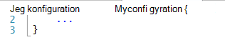
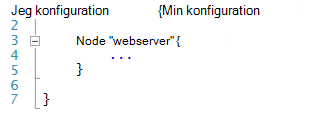
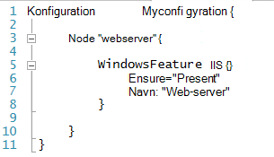
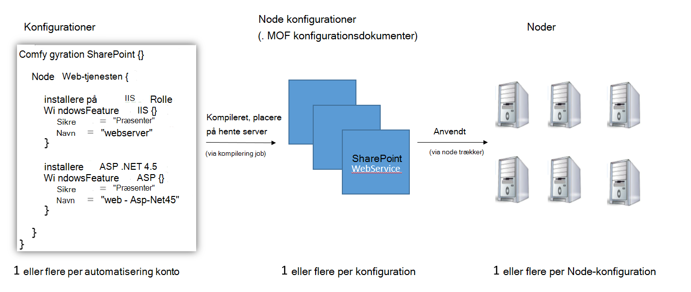
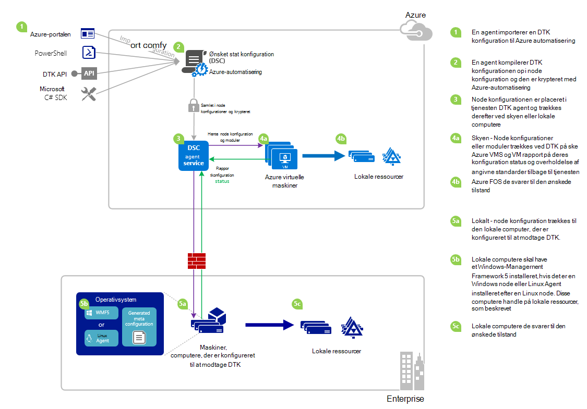

<properties 
   pageTitle="Oversigt over Azure automatisering DTK | Microsoft Azure" 
   description="En oversigt over Azure automatisering beskedteksten tilstand konfiguration (DTK), dens vilkår og kendte problemer" 
   services="automation" 
   documentationCenter="dev-center-name" 
   authors="coreyp-at-msft" 
   manager="stevenka" 
   editor="tysonn"
   keywords="PowerShell DTK, ønskede tilstand konfiguration, powershell DTK azure"/>

<tags
   ms.service="automation"
   ms.devlang="NA"
   ms.topic="article"
   ms.tgt_pltfrm="powershell"
   ms.workload="TBD" 
   ms.date="05/10/2016"
   ms.author="magoedte;coreyp"/>

# Azure automatisering DTK oversigt #

##Hvad er Azure automatisering DTK?##
Implementere og vedligeholde den ønskede tilstand for din servers og programmet ressourcer kan være tidskrævende og fejl. Med Azure automatisering ønskede tilstand konfiguration (DTK), kan du installere konsekvent, overvåge pålideligt og automatisk at opdatere den ønskede tilstand for alle dine IT-ressourcer, skaleres fra skyen. Bygget på PowerShell DTK justere automatisering DTK maskine konfiguration med en bestemt tilstand på tværs af fysiske og virtuelle maskiner (FOS), ved hjælp af Windows eller Linux, og i skyen eller i det lokale miljø. Du kan aktivere fortløbende IT services levering med ensartet kontrolelement og administrere hurtig ændring på tværs af din forskellige hybrid IT-miljø med øget.

Azure automatisering DTK opbygger oven på det grundlæggende, der blev introduceret i PowerShell DTK vil give en endnu nemmere at slette konfiguration management oplevelse. Azure automatisering DTK viser det samme administration af lag til [PowerShell beskedteksten tilstand konfiguration](https://msdn.microsoft.com/powershell/dsc/overview) , som Azure automatisering tilbyder til PowerShell scripting i dag.

Azure automatisering DTK giver dig mulighed for at [redigere og administrere PowerShell beskedteksten tilstand konfigurationer](https://technet.microsoft.com/library/dn249918.aspx), importere [DTK ressourcer](https://technet.microsoft.com/library/dn282125.aspx), og Opret DTK Node konfigurationer (MOF dokumenter), alle i skyen. Elementerne DTK placeres på Azure automatisering [DTK adskille server](https://technet.microsoft.com/library/dn249913.aspx) , så target noder (såsom fysiske og virtuelle maskiner) i skyen eller lokalt kan hente dem, automatisk de svarer til den ønskede tilstand, der angiver de og rapportere tilbage på deres overholdelse af den ønskede tilstand til Azure Automation.

Foretrækker du ser læseruden? Se på de under video fra maj 2015, når Azure automatisering DTK først blev offentliggjort. **Note:** Mens begreber og livscyklus, der er beskrevet i denne video er korrekte, er Azure automatisering DTK kommet meget da denne video blev registreret. Det er nu alment tilgængelig, indeholder en meget mere omfattende Brugergrænseflader på portalen Azure og understøtter mange flere funktioner.

> [AZURE.VIDEO microsoft-ignite-2015-heterogeneous-configuration-management-using-microsoft-azure-automation]

## Azure automatisering DTK vilkår ##
### Konfiguration ###
PowerShell DTK introduceret nye koncepter kaldet konfigurationer. Konfigurationer kan du angive den ønskede tilstand for dit miljø via PowerShell-syntaks. Definere en Windows PowerShell-script-blok ved hjælp af nøgleordet konfiguration først for at bruge DTK til at konfigurere dit miljø, og derefter følge den med et id, derefter med klammeparentes ({}) til at afgrænse blokering.

Du kan definere node konfiguration blokke, der angiver den ønskede konfiguration for et sæt af knuder (computere) i dit miljø, der skal være konfigureret nøjagtigt i konfiguration blokering. På denne måde repræsenterer en node konfiguration en "rolle" for en eller flere noder skal have. En node konfiguration blok starter med nøgleordet node. Følg dette nøgleord med navnet på den rolle, hvilket kan være en variabel eller et udtryk. Brug klammeparenteserne {} til at afgrænse node konfiguration blokering efter Rollenavnet.

 
Du kan definere ressource blokke for at konfigurere bestemte DTK ressourcer i node konfiguration blokering. En ressource blok starter med navnet på den ressource, efterfulgt af det id, du vil angive for, der blokerer og derefter kantede parenteser {} for at afgrænse blokering.

Du kan finde mere detaljerede oplysninger om konfiguration af nøgleord under: [Forstå konfiguration nøgleord i beskedteksten tilstand konfiguration](http://blogs.msdn.com/b/powershell/archive/2013/11/05/understanding-configuration-keyword-in-desired-state-configuration.aspx "Forstå konfiguration nøgleord i beskedteksten tilstand konfiguration")

Kører (sammensætning af) en DTK konfiguration, vil returnere en eller flere DTK node konfigurationer (MOF dokumenter), som er, hvad DTK noder anvende i overensstemmelse med ønskede tilstand.

Azure automatisering DTK gør det muligt at importere, forfatter, og kompilering DTK konfigurationer i Azure automatisering, svarende til hvordan runbooks kan importeres, har oprettet, og i gang med Automation Azure.

>[AZURE.IMPORTANT] En konfiguration skal indeholde kun én konfiguration blok med samme navn som konfigurationen i Azure automatisering DTK. 

###Node-konfiguration###

Når en DTK konfiguration er kompileret, oprettes der en eller flere node konfigurationer afhængigt af Node dokumentkomponenter i konfigurationen. En node konfiguration er den samme som "MOF" eller "konfigurationsdokument" (Hvis du er bekendt med betingelserne PS DTK) og repræsenterer en "rolle", som webserver eller kollega, som ønsket tilstand en eller flere noder skal forudsætter eller Kontroller, om overholdelse af angivne standarder mod. Navnene på node konfigurationer i Azure automatisering DTK tage form af "Konfiguration Name.NodeConfigurationBlockName".

PS DTK noder bliver opmærksom på node konfigurationer, de skal træffe via DTK opslagsnål eller hente metoder. Azure automatisering DTK er afhængig af metoden DTK hente, hvor noder anmodning node konfigurationer, de skal anvende fra Azure automatisering DTK adskille server. Da noderne gøre anmodningen til Azure automatisering DTK, noder kan være bag firewalls, har alle indgående porte lukket osv. De skal kun udgående adgang til internettet (enten direkte eller via en proxy).

###Node###

En DTK node er en hvilken som helst computer, der har den konfiguration, der administreres af DTK. Det kan skyldes en Windows eller Linux Azure VM, lokale VM / fysisk host eller maskine i en anden offentlige skyen. Noder træffe node konfigurationer for at blive og vedligeholde overholdelse af den ønskede tilstand de definerer, og kan også rapportere tilbage til en reporting server på deres konfiguration status og overholdelse af angivne standarder forhold til den ønskede tilstand.

Azure automatisering DTK gør onboarding af noder til administration af Azure automatisering DTK nemt, og gør det muligt for ændring af node konfigurationen tildelt hver node serversiden, så næste gang en node kontrollerer serveren for vejledningen den forudsætter en anden rolle og ændre, hvordan den er konfigureret og complaince status det skal rapportere mod til at matche.

###Ressource###
DTK ressourcer er dokumentkomponenter, du kan bruge til at definere en konfiguration med Windows PowerShell beskedteksten tilstand konfiguration (DTK). DTK leveres med en række indbyggede ressourcer som dem efter filer og mapper, server-funktioner og roller, indstillinger i registreringsdatabasen, miljøvariabler og tjenester og processer. Hvis du vil vide mere om den komplette liste over indbyggede DTK ressourcer og hvordan du bruger dem, se [Indbyggede Windows PowerShell beskedteksten tilstand konfiguration ressourcer](https://technet.microsoft.com/library/dn249921.aspx).

DTK ressourcer kan også importeres som en del af PowerShell moduler for at udvide sæt af indbyggede DTK ressourcer. Ikke-standard ressourcer trækkes af DTK noder fra DTK hente serveren, hvis en node konfiguration noden er meningen, at træffe indeholder referencer til disse ressourcer. Lære at oprette brugerdefinerede ressourcer kan du se [Oprette brugerdefinerede Windows PowerShell beskedteksten tilstand konfiguration ressourcer](https://technet.microsoft.com/library/dn249927.aspx).

Azure automatisering DTK leveres med alle de samme indbyggede DTK ressourcer, som gør PS DTK. Yderligere ressourcer kan føjes til Azure automatisering DTK ved at importere PowerShell moduler, der indeholder ressourcerne til Azure automatisering.

###Kompilering Job###
En kompilering sag i Azure automatisering DTK er en forekomst af kompilering af en konfiguration til at oprette en eller flere node konfigurationer. De ligner til Azure automatisering runbook sager, bortset fra at de ikke faktisk udfører alle opgaver, undtagen hvis du vil oprette node konfigurationer i. En hvilken som helst node konfigurationer, der er oprettet af en kompilering job placeres automatisk på Azure automatisering DTK hente serveren og Overskriv tidligere versioner af node konfigurationer, hvis de fandtes for denne konfiguration. Navnet på en node konfiguration, der er oprettet med et kompilering job tager form af "ConfigurationName.NodeConfigurationBlockName". For eksempel sammensætning af den under konfiguration resulterer i en enkelt node konfiguration kaldet "MyConfiguration.webserver"

>[AZURE.NOTE] Ligesom runbooks, kan udgives konfigurationer. Dette er ikke relateret til at lægge DTK varer på Azure automatisering DTK hente serveren. Kompilering job medføre DTK elementer, der skal placeres på Azure automatisering DTK hente serveren. Se [publicere en Runbook](https://msdn.microsoft.com/library/dn903765.aspx)kan finde flere oplysninger om "udgivelse" i Azure Automation.

##Azure automatisering DTK livscyklus##
Gå fra en tom automatisering konto til en administreret sæt korrekt konfigurerede noder omfatter et sæt af processer til at definere konfigurationer, for at gøre disse konfigurationer i node konfigurationer og onboarding noder til Azure automatisering DTK og disse konfigurationer node. I følgende diagram vises Azure automatisering DTK livscyklus:

Følgende billede viser detaljerede trinvis fremgangsmåde i DTK livscyklus. Den indeholder forskellige måder, en konfiguration er importeret og anvendes til noder i Azure Automation komponenter, der kræves for en lokal computer til at understøtte DTK og interaktion mellem forskellige komponenter. 

     

##Faktorer / kendte problemer:##

- Når der opgraderes til WMF 5 RTM, hvis computeren allerede er registreret som en node i Azure automatisering DTK, skal du fjerne registreringen af den fra Azure automatisering DTK og registrere den igen, når WMF 5 RTM opgradere.

- Azure automatisering DTK understøtter ikke delvis eller sammensatte DTK konfigurationer på nuværende tidspunkt. DTK sammensatte ressourcer kan dog importeres og bruges i Azure automatisering DTK konfigurationer præcis som på lokale PowerShell, aktivere konfigurationsgenbrug.

- Den seneste version af WMF 5 skal være installeret for PowerShell DTK agent til Windows for at kunne kommunikere med Automation Azure. Den seneste version af PowerShell DTK agent for Linux skal være installeret for Linux lov til at kommunikere med Automation Azure.

- Traditionelle PowerShell DTK hente serveren forventer modul går for at være placeret på hente serveren i formatet **ModuleName_Version.zip "**. Azure automatisering forventer PowerShell moduler der skal importeres med navne i form af **ModuleName.zip**. Se [dette blogindlæg](https://azure.microsoft.com/blog/2014/12/15/authoring-integration-modules-for-azure-automation/) for at få flere oplysninger om formatet Integration modul, der er behov for at importere modulet til Azure automatisering. 

- PowerShell-moduler, der er importeret til Azure automatisering må ikke indeholde .doc eller .docx-filer. Nogle PowerShell-moduler, der indeholder DTK ressourcer indeholder disse filer, så du kan hjælp. Disse filer skal fjernes fra moduler, forudgående importere til Azure automatisering.

- Når en node først er registreret med en Azure automatisering konto eller noden er ændret, så den knyttes til en anden node konfiguration-side, kan det er status 'Compliant', selvom den node status ikke er faktisk overholder node konfigurationen det nu er knyttet til. Når noden udfører den første hente, og sender den første rapport efter registrering eller en node konfiguration tilknytning ændring, kan node status have tillid til.

- Når onboarding en Azure Windows VM til administration af Azure automatisering DTK ved hjælp af vores direkte onboarding metoder, det kan tage op til en time for VM vises som en DTK node i Azure automatisering. Dette er på grund af installationen af Windows Management Framework 5.0 på VM ved filtypenavnet Azure VM DTK, som kræves til indbyggede VM til Azure automatisering DTK.

- Når du registrerer forhandler hver node automatisk et entydigt certifikat til godkendelse, der udløber efter et år. På nuværende tidspunkt kan ikke PowerShell DTK registrering protocol automatisk forny certifikater, når de nærmer udløb, så du har brug at registrere noderne efter et år gang. Før du registrerer igen, at sikre dig, at hver node kører Windows Management Framework 5.0 RTM. Hvis en node godkendelsescertifikat udløber, og noden er ikke genregistreret, noden vil ikke kunne kommunikere med Automation Azure og vil blive markeret 'Unresponsive'. Omregistrering udføres på samme måde, du har registreret noden. Omregistrering udføres 90 dage eller mindre fra udløbsdatoen certifikat, eller når som helst efter udløbsdatoen certifikat resulterer i et nyt certifikat, der genereres og bruges.

- Når der opgraderes til WMF 5 RTM, hvis computeren allerede er registreret som en node i Azure automatisering DTK, skal du fjerne registreringen af den fra Azure automatisering DTK og registrere den igen, når WMF 5 RTM opgradere. Slet filen $env:windir\system32\configuration\DSCEngineCache.mof, før du registrerer igen.

- DTK PowerShell-cmdletter fungerer muligvis ikke, hvis WMF 5 RTM er installeret oven på WMF 5 fremstilling Preview. Hvis du vil løse dette problem ved at køre følgende kommando i en øgede PowerShell-session (Kør som administrator):`mofcomp $env:windir\system32\wbem\DscCoreConfProv.mof`
 

##Relaterede artikler##

- [Onboarding maskiner til administration af Azure automatisering DTK] (.. /Automation/Automation-DSC-onboarding.MD)
- [Kompilering konfigurationer i Azure automatisering DTK] (.. /Automation/Automation-DSC-Compile.MD)
- [Azure automatisering DTK cmdletter] (https://msdn.microsoft.com/library/mt244122.aspx)
- [Azure automatisering DTK priser] (https://azure.microsoft.com/pricing/details/automation/)
- [Fortløbende installation til IaaS FOS ved hjælp af Azure automatisering DTK og Chocolatey] (automation-DTK-cd-chocolatey.md)
