<properties
    pageTitle="Min første grafiske runbook i Azure Automation | Microsoft Azure"
    description="Selvstudium, der vejleder dig gennem oprettelse, test og publicering af en simpel grafiske runbook."
    services="automation"
    documentationCenter=""
    authors="mgoedtel"
    manager="jwhit"
    editor=""
    keywords="runbook runbook skabelon runbook automatisering, og azure runbook"/>
<tags
    ms.service="automation"
    ms.workload="tbd"
    ms.tgt_pltfrm="na"
    ms.devlang="na"
    ms.topic="get-started-article"
    ms.date="07/06/2016"
    ms.author="magoedte;bwren"/>

# <a name="my-first-graphical-runbook"></a>Min første grafiske runbook

> [AZURE.SELECTOR] - [Grafiske](automation-first-runbook-graphical.md) - [PowerShell](automation-first-runbook-textual-PowerShell.md) - [PowerShell arbejdsproces](automation-first-runbook-textual.md)

Dette selvstudium vejleder dig gennem oprettelse af en [grafisk runbook](automation-runbook-types.md#graphical-runbooks) i Azure Automation.  Vi begynder med et enkelt runbook, som vi teste og publicere mens vi forklarer, hvordan du registrere status for runbook jobbet.  Derefter kan vi ændre runbook for at administrere faktisk Azure ressourcer i dette tilfælde starter en Azure virtuelt.  Vi derefter foretager runbook mere robust ved at tilføje runbook parametre og betinget links.

## <a name="prerequisites"></a>Forudsætninger

For at fuldføre dette selvstudium skal bruge du følgende.

-   Azure-abonnement.  Hvis du ikke har en endnu, kan du [aktivere fordele din MSDN-abonnement](https://azure.microsoft.com/pricing/member-offers/msdn-benefits-details/) eller <a href="/pricing/free-account/" target="_blank"> [tilmelde dig en gratis konto](https://azure.microsoft.com/free/).
-   [Azure køre som konto](automation-sec-configure-azure-runas-account.md) for at holde runbook og godkende til Azure ressourcer.  Denne konto skal have tilladelse til at starte og standse den virtuelle maskine.
-   En Azure virtuelt.  Vi stopper og starter denne computer, så den ikke skulle fremstilling.


## <a name="step-1---create-new-runbook"></a>Trin 1 – Opret en ny runbook

Vi begynder ved at oprette en simpel runbook, som producerer teksten *Hej verden*.

1.  Åbn din konto med Automation i Azure-portalen.  
    Siden med Automation konto får du en hurtig oversigt over ressourcerne, der i denne konto.  Du bør allerede har nogle aktiver.  De fleste af disse er de moduler, der medtages automatisk i en ny konto med Automation.  Du bør også have legitimationsoplysninger for aktivet, der er nævnt i [forudsætninger](#prerequisites).
2.  Klik på feltet **Runbooks** for at åbne listen med runbooks.<br> 
3.  Oprette en ny runbook ved at klikke på knappen **Tilføj en runbook** og derefter **oprette en ny runbook**.
4.  Giv runbook navnet *MyFirstRunbook grafisk*.
5.  I dette tilfælde skal vi oprette en [grafisk runbook](automation-graphical-authoring-intro.md) derfor vælges **grafiske** **Runbook**type.<br> 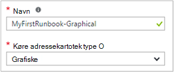<br>
6.  Klik på **Opret** for at oprette runbook og åbne den grafiske editor.

## <a name="step-2---add-activities-to-the-runbook"></a>Trin 2 – tilføje aktiviteter til runbook

Kontrolelementet bibliotek i venstre side af editoren kan du vælge aktiviteter til at føje til din runbook.  Vi tilføje en **Skriv Output** -cmdlet for at sende tekst fra runbook.

1.  Klik i tekstfeltet Søg i kontrolelementet bibliotek, og skriv **Skriv Output**.  Søgeresultaterne vises nedenfor. <br> 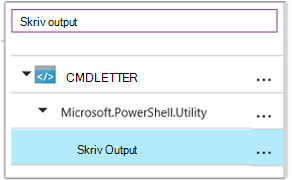
2.  Rul ned til bunden af listen.  Du kan enten højreklikke på **Skriv Output** , og vælg **Tilføj for at lærredet** eller klik på ellipsen ud for cmdlet og derefter vælge **Tilføj for at lærredet**.
3.  Klik på **Skriv Output** aktiviteten på lærredet.  Dette åbner bladet konfiguration kontrolelementet, kan du konfigurere aktiviteten.
4.  Som standard navnet på cmdlet **etiket** , men vi kan ændre den til noget mere brugervenligt. Ændre det til *Skrive Hej verden til at få vist*.
5.  Klik på **parametre** for at angive værdier for cmdlet'en til parametre.  
    Nogle cmdletter har flere parametersæt, og du skal vælge, hvilken du vil bruge. **Skriv Output** har i dette tilfælde kun en parameter opsætning, så du ikke behøver at vælge en. <br> 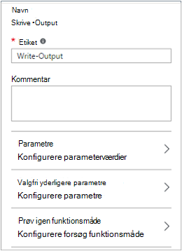
6.  Vælg parameteren **InputObject** .  Dette er parameteren, hvor vi vil angive teksten, der sendes til output strømmen.
7.  Vælg **PowerShell udtryk**i rullemenuen **datakilde** .  Rullemenuen **datakilde** indeholder forskellige kilder, du bruger til at udfylde en parameterværdi.  
    Du kan bruge output fra sådanne kilder som en anden aktivitet, et automatisering aktiv eller et PowerShell-udtryk.  I dette tilfælde vil vi kun til at få vist tekst *Hej verden*. Vi kan bruge et PowerShell-udtryk og angive en streng.
8.  Skriv *"Hej verden"* , og klik derefter på **OK** to gange for at vende tilbage til lærredet i feltet **udtryk** .<br> 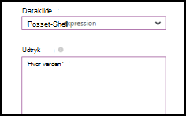
9.  Gem runbook ved at klikke på **Gem**.<br> 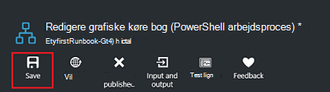

## <a name="step-3---test-the-runbook"></a>Trin 3 - Test runbook

Før vi udgiver runbook for at gøre det tilgængeligt i fremstilling, ønsker vi at teste den for at kontrollere, at den fungerer korrekt.  Når du tester en runbook, du kører dens **kladde** version og få vist resultatet interaktivt.

1.  Klik på **Test rude** for at åbne bladet Test.<br> 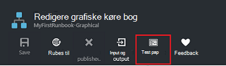
2.  Klik på **Start** for at starte testen.  Dette skal være den eneste mulighed for aktiveret.
3.  Der oprettes et [runbook job](automation-runbook-execution.md) og dens status vises i ruden.  
    Jobstatus starter som *i kø* , der angiver, at der venter på en runbook arbejder i skyen, bliver tilgængelig.  Den flyttes derefter til *Start* , når en arbejder udgiver den sag og derefter *køre* , når runbook begynder faktisk at køre.  
4.  Når runbook jobbet er fuldført, vises dets output. I dette tilfælde bør vi se *Hej verden*.<br> 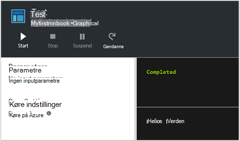
5.  Luk bladet Test for at vende tilbage til lærredet.

## <a name="step-4---publish-and-start-the-runbook"></a>Trin 4 – publicere og starte runbook

Runbook, vi lige har oprettet, er stadig i kladde-tilstand. Vi vil publicere den, før vi kan køre programmet i fremstilling.  Når du publicerer en runbook, kan du overskrive den eksisterende udgivne version med kladde-versionen.  I dette tilfælde har vi endnu ikke en udgivet version fordi vi lige har oprettet runbook.

1.  Klik på **Publicer** for at publicere runbook, og skriv derefter **Ja** når du bliver bedt om.<br> 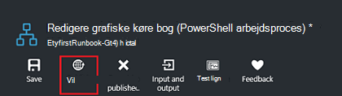
2.  Hvis du ruller venstre for at få vist runbook i bladet **Runbooks** , vises den en **Status for redigering** af **Published**.
3.  Rul tilbage til højre for at få vist bladet for **MyFirstRunbook**.  
    Indstillinger på tværs af toppen giver mulighed for os til at starte runbook, planlægge den til at starte på et tidspunkt i fremtiden eller oprette en [webhook](automation-webhooks.md) , så den kan startes via en HTTP-opkald.
4.  Vi blot ønsker at starte runbook så skal du klikke på **Start** , og skriv derefter **Ja** når du bliver bedt om.<br> 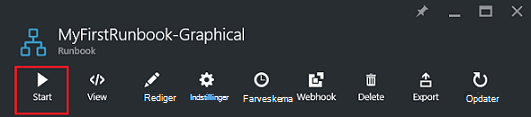
5.  Et job blade er åbnet for runbook sagen, vi lige har oprettet.  Vi kan lukke denne blade, men i dette tilfælde vi vil lade den stå åben så vi kan se det job status.
6.  Jobstatus vises i **Oversigt over Job** og sammenligner de statusser, som vi så, da vi testet runbook.<br> 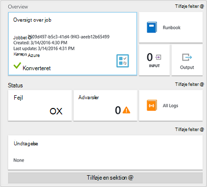
7.  Når runbook status viser *fuldført*, skal du klikke på **Output**. Bladet **Output** åbnes, og vi kan se vores *Hej verden* i ruden.<br> 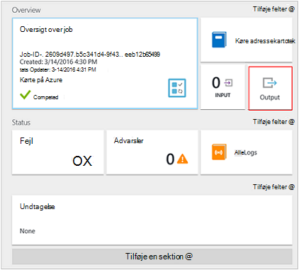  
8.  Luk bladet Output.
9.  Klik på **Alle logfiler** for at åbne bladet Streams til runbook jobbet.  Vi bør kun se *Hej verden* i output strømmen, men dette kan vise andre streams for en runbook sag som detaljeret og fejl, hvis runbook skriver til dem.<br> 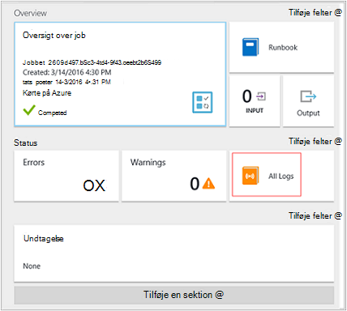
10. Luk alle logfiler blade og bladet Job at vende tilbage til bladet MyFirstRunbook.
11. Klik på **Jobs** for at åbne bladet job for denne runbook.  Dette viser alle de job, der er oprettet af denne runbook. Vi bør kun se ét job, der er angivet, da vi kun kørte jobbet én gang.<br> 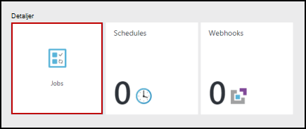
12. Du kan klikke på jobbet skal åbne ruden samme Job, som vi har set, da vi startede runbook.  Dette kan du gå tilbage i tiden og få vist oplysninger på en hvilken som helst sag, som er oprettet for en bestemt runbook.

## <a name="step-5---create-variable-assets"></a>Trin 5 – oprette variable Aktiver

Vi har testet og publiceret vores runbook, men hidtil det gøre ikke noget nyttigt. Vi vil have den administrere Azure ressourcer.  Før vi konfigurere runbook til at godkende, skal du oprette en variabel for at holde abonnement-ID og referere til den når vi installationen aktivitet til at godkende i trin 6 nedenfor.  Herunder en reference til konteksten abonnement, kan du nemt arbejde mellem flere abonnementer.  Før du fortsætter, kan du kopiere dit abonnement-ID fra indstillingen abonnementer fra navigationsruden.  

1. Klik på feltet **Aktiver** i bladet automatisering konti og bladet **Aktiver** åbnes.
2. Klik på feltet **variabler** i bladet aktiver.
3. Klik på **Tilføj en variabel**på bladet variabler.<br>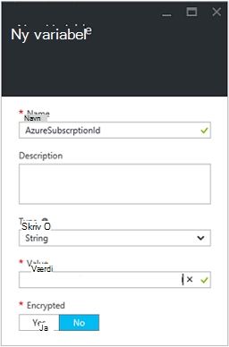
4. Skriv **AzureSubscriptionId** i den nye variable blade, i feltet **navn** , og skriv i boksen **værdi** for dit abonnement-ID.  Hold *streng* for **typen** og standardværdien for **kryptering**.  
5. Klik på **Opret** for at oprette variablen.  


## <a name="step-6---add-authentication-to-manage-azure-resources"></a>Trin 6 - Tilføj godkendelse for at administrere Azure ressourcer

Nu hvor vi har en variabel for at holde vores abonnement-ID, kan vi konfigurere vores runbook for at godkende med de Kør som legitimationsoplysninger, der henvises til i [forudsætninger](#prerequisites).  Vi kan gøre det ved at føje Azure Kør som forbindelse **aktiv** og **Tilføj AzureRMAccount** cmdlet til lærredet.  

1.  Åbn den grafiske editor ved at klikke på **Rediger** på bladet MyFirstRunbook.<br> 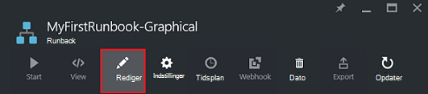
2.  Vi ikke længere har brug for **Skrive Hej verden til at få vist** , så Højreklik på det, og vælg **Slet**.
3.  Udvid **forbindelser** i kontrolelementet bibliotek og føje **AzureRunAsConnection** til lærredet ved at vælge **Føj til lærredet**.
4.  Vælg **AzureRunAsConnection** på lærredet, og skriv **Få køre som forbindelse** i tekstboksen **navn** i ruden konfiguration kontrolelement.  Dette er dataforbindelsen 
5.  Skriv **Tilføj AzureRmAccount** i tekstfeltet Søg i kontrolelementet bibliotek.
6.  Føje **Tilføj AzureRmAccount** til lærredet.<br> 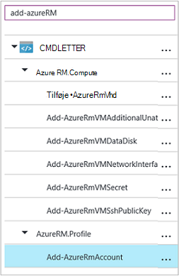
7.  Hold markøren over **Få køre som forbindelse** , indtil der vises en cirkel i bunden af figuren. Klik på cirklen, og træk pilen til **Tilføj AzureRmAccount**.  Den pil, som du lige har oprettet er et *link*.  Runbook starter med **Få køre som forbindelse** og derefter køre **Tilføj AzureRmAccount**.<br> 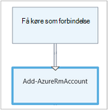
8.  Vælg **Tilføj AzureRmAccount** på lærredet, og styre ruden type **Login to Azure** i tekstboksen **navn** i konfigurationen.
9.  Klik på **parametre** og aktivitet Parameter konfigurationen blade vises. 
10.  **Tilføj AzureRmAccount** har flere parametersæt, så vi har brug at vælge en, før vi kan give parameterværdier.  Klik på **Parameter angivet** , og vælg derefter sættet **ServicePrincipalCertificate** parameter. 
11.  Når du vælger sættet parameter, vises parametrene i bladet aktivitet Parameter konfiguration.  Klik på **APPLICATIONID**.<br> 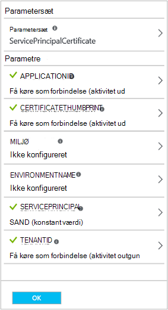
12.  Vælg **aktivitet output** til **datakilden** i bladet parameterværdi og vælg **Få køre som forbindelse** på listen, i **feltet sti** tekstfeltet Skriv **ApplicationId**, og klik derefter på **OK**.  Vi angiver navnet på egenskaben for feltet sti, fordi aktiviteten skriver et objekt med flere egenskaber.
13.  Klik på **CERTIFICATETHUMBPRINT**, og vælg **aktivitet output** i bladet parameterværdi for **datakilden**.  Vælg **Få køre som forbindelse** på listen, i **feltet sti** tekstfeltet Skriv **CertificateThumbprint**, og klik derefter på **OK**. 
14.  Skal du klikke på **SERVICEPRINCIPAL**, og vælg **ConstantValue** for **datakilden**i bladet parameterværdi, klikke på indstillingen, der er **Sand**, og klik derefter på **OK**.
15.  Klik på **TENANTID**, og vælg **aktivitet output** i bladet parameterværdi for **datakilden**.  Vælg **Få køre som forbindelse** på listen, i **feltet sti** tekstfeltet Skriv **TenantId**, og klik derefter på **OK** to gange.  
16.  Skriv **Angiv AzureRmContext** i tekstfeltet Søg i kontrolelementet bibliotek.
17.  Føje **Sæt AzureRmContext** til lærredet.
18.  Vælg **Sæt AzureRmContext** på lærredet, og styre ruden type **Angive abonnement-Id** i tekstboksen **navn** i konfigurationen.
19.  Klik på **parametre** og aktivitet Parameter konfigurationen blade vises. 
20. **Sæt AzureRmContext** har flere parametersæt, så vi har brug at vælge en, før vi kan give parameterværdier.  Klik på **Parameter angivet** , og vælg derefter sættet **SubscriptionId** parameter.  
21.  Når du vælger sættet parameter, vises parametrene i bladet aktivitet Parameter konfiguration.  Klik på **SubscriptionID**
22.  Vælg **Variable aktiv** for **datakilden** i bladet parameterværdi og vælge **AzureSubscriptionId** på listen, og klik derefter på **OK** to gange.   
23.  Hold markøren over **Login to Azure** , indtil der vises en cirkel i bunden af figuren. Klik på cirklen, og træk pilen til at **Angive abonnement-Id**.


Din runbook skal se ud som følgende på dette tidspunkt: <br>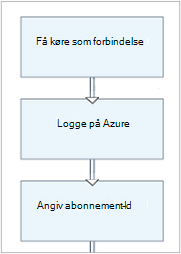

## <a name="step-7---add-activity-to-start-a-virtual-machine"></a>Trin 7 – Tilføj aktivitet for at starte en virtuel maskine

Nu skal du føje en **Start-AzureRmVM** aktivitet for at starte en virtuel maskine.  Du kan vælge en hvilken som helst virtuelt i abonnementet Azure, og nu vil vi være hardcoding, hvor navnet til cmdlet.

1. Skriv **Start-AzureRm** i tekstfeltet Søg i kontrolelementet bibliotek.
2. Føje **Start AzureRmVM** til lærredet, og klik derefter på og trække den under **Angiv abonnement-Id**.
3. Hold markøren over **Angiv abonnement-Id** , indtil der vises en cirkel i bunden af figuren.  Klik på cirklen, og træk pilen til **Start-AzureRmVM**. 
4.  Vælg **Start-AzureRmVM**.  Klik på **parametre** og derefter **Angive Parameter** for at få vist sæt til **Start-AzureRmVM**.  Vælg **ResourceGroupNameParameterSetName** parametersæt. Bemærk, at **ResourceGroupName** og **navn** har udråbstegn næste dem.  Dette angiver, at de er påkrævede parametre.  Bemærk også begge forvente strengværdier.
5.  Vælg **navn**.  Vælg **PowerShell udtryk** til **datakilde** , og skriv navnet på den virtuelle maskine omgivet af dobbelte anførselstegn, som vi starter med denne runbook.  Klik på **OK**.<br>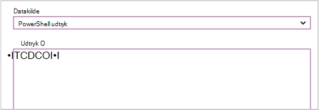
6.  Vælg **ResourceGroupName**. Bruge **PowerShell udtryk** til **datakilde** , og skriv navnet på den ressourcegruppe omgivet af dobbelte anførselstegn.  Klik på **OK**.<br> 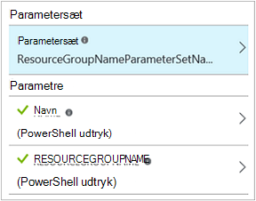
8.  Klik på Test ruden, så vi kan teste runbook.
9.  Klik på **Start** for at starte testen.  Når den er fuldført, skal du kontrollere, at den virtuelle maskine er blevet startet.

Din runbook skal se ud som følgende på dette tidspunkt: <br>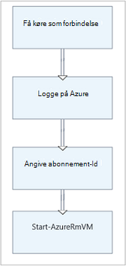

## <a name="step-8---add-additional-input-parameters-to-the-runbook"></a>Trin 8 – Tilføj flere Inputparametre til runbook

Vores runbook starter aktuelt den virtuelle maskine i ressourcegruppen, som vi angivet i Cmdletten **Start AzureRmVM** , men vores runbook vil være mere praktisk, hvis vi kan angive begge, når runbook startes.  Vi vil nu føje Inputparametre til runbook til at give denne funktionalitet.

1. Åbn den grafiske editor ved at klikke på **Rediger** i ruden **MyFirstRunbook** .
2. Klik på **Input og output** og derefter **tilføje input** for at åbne ruden Runbook inputparameteren.<br> 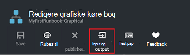
3. Angiv *VMName* **navn**.  Holde *streng* for **typen**, men ret **obligatorisk** til *Ja*.  Klik på **OK**.
4. Oprette en anden obligatorisk Inputparameteren, der hedder *ResourceGroupName* , og klik derefter på **OK** for at lukke ruden **Input og Output** .<br> 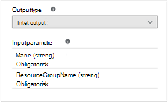
5. Vælg **Start AzureRmVM** aktiviteten, og klik derefter på **parametre**.
6. Ændre **datakilden** for **navn** til **Runbook input** , og vælg derefter **VMName**.<br>
7. Ændre **datakilden** for **ResourceGroupName** til **Runbook input** , og vælg derefter **ResourceGroupName**.<br> 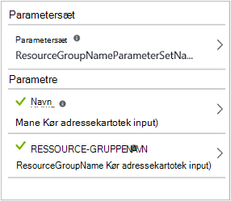
8. Gem runbook og åbne ruden Test.  Bemærk, at du kan nu angive værdier for de to input variabler, der skal bruges i testen.
9. Luk ruden Test.
10. Klik på **Publicer** for at publicere den nye version af runbook.
11. Stoppe den virtuelle maskine, du har startet i ovenstående trin.
12. Klik på **Start** for at starte runbook.  Skriv **VMName** og **ResourceGroupName** til den virtuelle maskine, som du skal starte.<br> 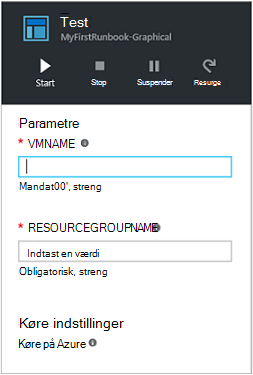
13. Når runbook er fuldført, skal du kontrollere, at den virtuelle maskine er blevet startet.

## <a name="step-9---create-a-conditional-link"></a>Trin 9 – oprette en betinget kæde

Vi vil nu ændre runbook, så det kun forsøger at starte den virtuelle maskine, hvis den ikke allerede er startet.  Vi vil gøre dette ved at tilføje en **Get-AzureRmVM** -cmdlet til runbook, som får forekomst niveau status for den virtuelle maskine. Derefter skal du føje et PowerShell arbejdsproces kodemodul kaldet **Hent Status** med et stykke af PowerShell-kode til at afgøre, om tilstanden virtuelt er kører eller er stoppet.  Et betinget link fra modulet **Hent Status** kan kun køre **Start AzureRmVM** , hvis den aktuelle kørende tilstand er stoppet.  Til sidst skal vi output vil blive sendt en meddelelse til at informere du hvis VM er startet, eller ikke bruger Cmdletten PowerShell Skriv-Output.

1. Åbn **MyFirstRunbook** i den grafiske editor.
2. Fjerne sammenkædningen mellem **Angive abonnement-Id** og **Start-AzureRmVM** ved at klikke på den og derefter trykke på tasten *Delete* .
3. Skriv **Get-AzureRm** i tekstfeltet Søg i kontrolelementet bibliotek.
4. Føje **Get-AzureRmVM** til lærredet.
5. Vælg **Få AzureRmVM** og derefter **Parameter angivet** til at få vist sæt til **Get-AzureRmVM**.  Vælg **GetVirtualMachineInResourceGroupNameParamSet** parametersæt.  Bemærk, at **ResourceGroupName** og **navn** har udråbstegn næste dem.  Dette angiver, at de er påkrævede parametre.  Bemærk også begge forvente strengværdier.
6. Vælg **Runbook input** under **datakilde** til **navn**, og vælg derefter **VMName**.  Klik på **OK**.
7. Vælg **Runbook input** under **datakilde** til **ResourceGroupName**, og vælg derefter **ResourceGroupName**.  Klik på **OK**.
8. Vælg **konstant værdi** , og klik derefter på **Sand**under **datakilde** for **Status**.  Klik på **OK**.  
9. Oprette et link fra **Angive abonnement-Id** til **Get-AzureRmVM**.
10. Udvid **Runbook kontrolelement** i kontrolelementet bibliotek, og Føj **kode** til lærredet.  
11. Oprette et link fra **Get-AzureRmVM** til **kode**.  
12. Klik på **kode** , og ret etiket i ruden konfiguration til at **Få Status**.
13. Parameter til valg af **kode** , og bladet **Code Editor** vises.  
14. Indsæt følgende kodestykke af kode i kodeeditoren:

     ```
     $StatusesJson = $ActivityOutput['Get-AzureRmVM'].StatusesText 
     $Statuses = ConvertFrom-Json $StatusesJson 
     $StatusOut ="" 
     foreach ($Status in $Statuses){ 
     if($Status.Code -eq "Powerstate/running"){$StatusOut = "running"} 
     elseif ($Status.Code -eq "Powerstate/deallocated") {$StatusOut = "stopped"} 
     } 
     $StatusOut 
     ```

15. Oprette et link fra **Hent Status** til **Start-AzureRmVM**.<br> 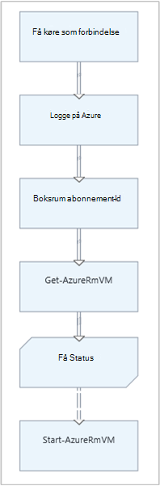  
16. Markér linket, og ret **Anvend betingelse** i ruden konfiguration til **Ja**.   Bemærk, at linket omdannes til en stiplet linje, der angiver, at aktiviteten for køres kun hvis betingelsen fortolkes til sand.  
17. Skriv *$ActivityOutput [' Hent Status'] - eq "Stoppet"*for **betingelsesudtryk**.  **Start-AzureRmVM** kan nu kun køre, hvis den virtuelle maskine er stoppet.
18. Udvid **cmdletter** og derefter **Microsoft.PowerShell.Utility**i kontrolelementet bibliotek.
19. Føj **Skriv Output** til lærredet to gange.<br> 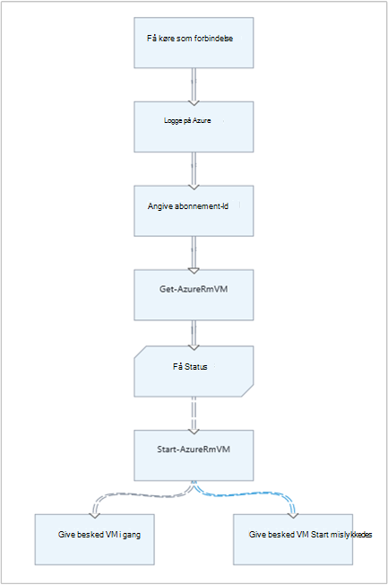
20. Klik på **parametre** på det første kontrolelement i **Skriv Output** og ændre værdien **etiket** til *At give besked VM i gang*.
21. Skift **datakilde** for **InputObject**til **PowerShell udtryk** og skrive udtrykket *"$VMName er startet."*.
22. På det andet **Skriv Output** -kontrolelement, klikke på **parametre** og ændre værdien **etiket** til *At give besked VM Start mislykkedes*
23. Ændre **datakilden** til **PowerShell udtryk** , og indtast udtrykket *"$VMName kunne ikke startes."*til **InputObject**.
24. Oprette et link fra **Start-AzureRmVM** til at **Give besked VM gang** og **Give besked VM Start mislykkedes**.
25. Klik på linket for **At give besked VM i gang** , og ret **Anvend betingelse** til **Sand**.
26. Skriv *$ActivityOutput ['Start-AzureRmVM'] for den **betingelsesudtryk**. IsSuccessStatusCode - eq $true*.  Dette Skriv Output kontrolelement kan nu kun køre, hvis den virtuelle maskine er blevet startet.
27. Klik på linket for **At give besked VM starte mislykkedes** , og ret **Anvend betingelse** til **Sand**.
28. Skriv *$ActivityOutput ['Start-AzureRmVM'] for den **betingelsesudtryk**. IsSuccessStatusCode - ne $true*.  Skriv Output kontrolelementet kan nu kun køre, hvis den virtuelle maskine ikke er startet.
29. Gem runbook og åbne ruden Test.
30. Start runbook med den virtuelle maskine, der ikke længere, og det skal starte.

## <a name="next-steps"></a>Næste trin

-   Hvis du vil vide mere om grafiske redigering skal du se [grafiske redigering i Azure automatisering](automation-graphical-authoring-intro.md)
-   For at komme i gang med PowerShell runbooks skal du se [Min første PowerShell runbook](automation-first-runbook-textual-powershell.md)
-   For at komme i gang med PowerShell arbejdsproces runbooks skal du se [Min første PowerShell arbejdsproces runbook](automation-first-runbook-textual.md)
