<properties
    pageTitle="Min første PowerShell runbook i Azure Automation | Microsoft Azure"
    description="Selvstudium, der vejleder dig gennem oprettelse, test og publicering af en simpel PowerShell runbook."
    services="automation"
    documentationCenter=""
    authors="mgoedtel"
    manager="jwhit"
    editor=""
    keywords="Azure powershell, powershell-script selvstudium, powershell automatisering"/>
<tags
    ms.service="automation"
    ms.workload="tbd"
    ms.tgt_pltfrm="na"
    ms.devlang="na"
    ms.topic="get-started-article"
    ms.date="07/19/2016"
    ms.author="magoedte;sngun"/>

# <a name="my-first-powershell-runbook"></a>Min første PowerShell runbook

> [AZURE.SELECTOR] - [Grafiske](automation-first-runbook-graphical.md) - [PowerShell](automation-first-runbook-textual-PowerShell.md) - [PowerShell arbejdsproces](automation-first-runbook-textual.md)  

Dette selvstudium vejleder dig gennem oprettelse af en [PowerShell runbook](automation-runbook-types.md#powershell-runbooks) i Azure Automation. Vi begynder med et enkelt runbook, som vi teste og publicere mens vi forklarer, hvordan du registrere status for runbook jobbet. Derefter kan vi ændre runbook for at administrere faktisk Azure ressourcer i dette tilfælde starter en Azure virtuelt. Vi derefter foretager runbook mere robust ved at tilføje runbook parametre.

## <a name="prerequisites"></a>Forudsætninger

For at fuldføre dette selvstudium skal bruge du følgende.

-   Azure-abonnement. Hvis du ikke har en endnu, kan du [aktivere fordele din MSDN-abonnement](https://azure.microsoft.com/pricing/member-offers/msdn-benefits-details/) eller <a href="/pricing/free-account/" target="_blank"> [tilmelde dig en gratis konto](https://azure.microsoft.com/free/).
-   [Automatisering konto](automation-security-overview.md) for at holde runbook og godkende til Azure ressourcer.  Denne konto skal have tilladelse til at starte og standse den virtuelle maskine.
-   En Azure virtuelt. Vi stopper og starter denne computer, så den ikke skulle fremstilling.

## <a name="step-1---create-new-runbook"></a>Trin 1 – Opret en ny runbook

Vi begynder ved at oprette en simpel runbook, som producerer teksten *Hej verden*.

1.  Åbn din konto med Automation i Azure-portalen.  
    Siden med Automation konto får du en hurtig oversigt over ressourcerne, der i denne konto. Du bør allerede har nogle aktiver. De fleste af disse er de moduler, der medtages automatisk i en ny konto med Automation. Du bør også have legitimationsoplysninger for aktivet, der er nævnt i [forudsætninger](#prerequisites).
2.  Klik på feltet **Runbooks** for at åbne listen med runbooks.  
      
3.  Oprette en ny runbook ved at klikke på knappen **Tilføj en runbook** og derefter **oprette en ny runbook**.
4.  Giv runbook navnet *MyFirstRunbook PowerShell*.
5.  I dette tilfælde skal vi oprette en [PowerShell runbook](automation-runbook-types.md#powershell-runbooks) derfor vælges **Powershell** **Runbook**type.  
    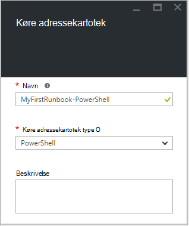  
6.  Klik på **Opret** for at oprette runbook og åbne redigeringsprogrammet indeholder tekst.

## <a name="step-2---add-code-to-the-runbook"></a>Trin 2 – Føj kode til runbook

Du kan enten skrive kode direkte i runbook, eller du kan vælge cmdletter, runbooks og aktiver fra kontrolelementet bibliotek og få dem føjet til runbook med en hvilken som helst relaterede parametre. Vi vil skrive direkte i runbook for denne gennemgang.

1.  Vores runbook er tom, type *Skriv Output "Hej verden."*.  
    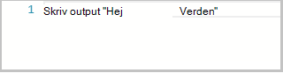  
2.  Gem runbook ved at klikke på **Gem**.  
    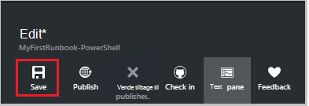  

## <a name="step-3---test-the-runbook"></a>Trin 3 - Test runbook

Før vi udgiver runbook for at gøre det tilgængeligt i fremstilling, ønsker vi at teste den for at kontrollere, at den fungerer korrekt. Når du tester en runbook, du kører dens **kladde** version og få vist resultatet interaktivt.

1.  Klik på **Test rude** for at åbne ruden Test.  
      
2.  Klik på **Start** for at starte testen. Dette skal være den eneste mulighed for aktiveret.
3.  Der oprettes et [runbook job](automation-runbook-execution.md) og dens status vises.  
    Jobstatus starter som *i kø* , der angiver, at der venter på en runbook arbejder i skyen kommer tilgængelige. Den flyttes derefter til *Start* , når en arbejder udgiver den sag og derefter *køre* , når runbook begynder faktisk at køre.  
4.  Når runbook jobbet er fuldført, vises dets output. I dette tilfælde skal vi se *Hej verden*  
    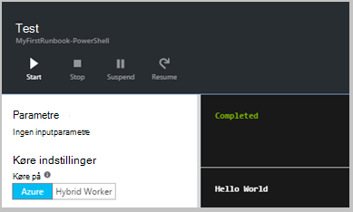  
5.  Luk ruden Test for at vende tilbage til lærredet.

## <a name="step-4---publish-and-start-the-runbook"></a>Trin 4 – publicere og starte runbook

Runbook, vi lige har oprettet, er stadig i kladde-tilstand. Vi vil publicere den, før vi kan køre programmet i fremstilling. Når du publicerer en runbook, kan du overskrive den eksisterende udgivne version med kladde-versionen. I dette tilfælde har vi endnu ikke en udgivet version fordi vi lige har oprettet runbook.

1.  Klik på **Publicer** for at publicere runbook, og skriv derefter **Ja** når du bliver bedt om.  
      
2.  Hvis du ruller venstre for at få vist runbook i ruden **Runbooks** nu, vises den en **Status for redigering** af **Published**.
3.  Rul tilbage til højre for at få vist ruden for **MyFirstRunbook PowerShell**.  
    Indstillingerne på tværs af toppen gør det muligt at starte runbook, få vist runbook, planlægge den til at starte på et tidspunkt i fremtiden eller oprette en [webhook](automation-webhooks.md) , så den kan startes via en HTTP-opkald.
4.  Vi blot ønsker at starte runbook så klik på **Start** , og klik derefter på **Ok** , når bladet starte Runbook åbnes.  
    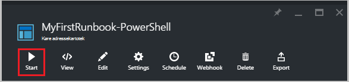  
5.  En rude med tingene er åbnet for runbook jobbet, vi lige har oprettet. Vi kan lukke denne rude, men i dette tilfælde vi vil lade den stå åben så vi kan se det job status.
6.  Jobstatus vises i **Oversigt over Job** og sammenligner de statusser, som vi så, da vi testet runbook.  
    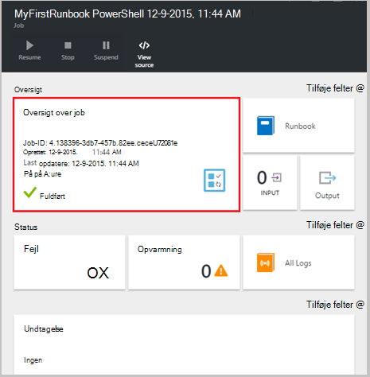  
7.  Når runbook status viser *fuldført*, skal du klikke på **Output**. Ruden Output åbnes, og vi kan se vores *Hej verden*.  
    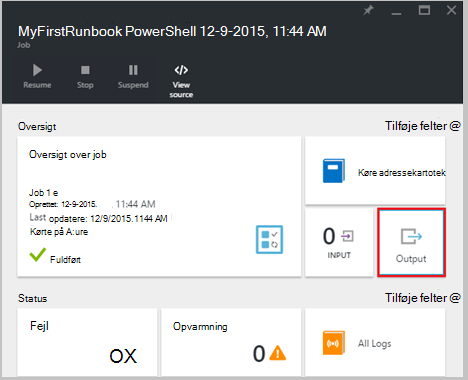
8.  Luk ruden Output.
9.  Klik på **Alle logfiler** for at åbne ruden Streams for runbook jobbet. Vi bør kun se *Hej verden* i output strømmen, men dette kan vise andre streams for en runbook sag som detaljeret og fejl, hvis runbook skriver til dem.  
    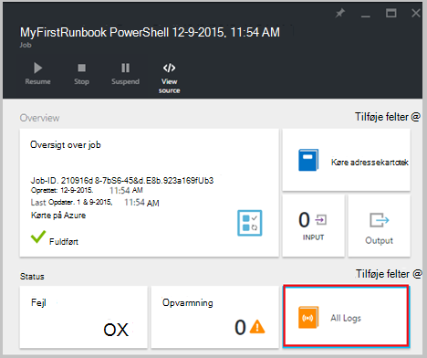  
10. Luk ruden Streams og ruden Job for at vende tilbage til ruden MyFirstRunbook PowerShell.
11. Klik på **Jobs** for at åbne ruden job for denne runbook. Dette viser alle de job, der er oprettet af denne runbook. Vi bør kun se ét job, der er angivet, da vi kun kørte jobbet én gang.  
    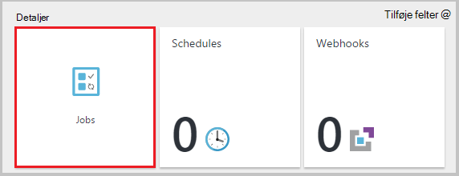  
12. Du kan klikke på jobbet skal åbne ruden samme Job, som vi har set, da vi startede runbook. Dette kan du gå tilbage i tiden og få vist oplysninger på en hvilken som helst sag, som er oprettet for en bestemt runbook.

## <a name="step-5---add-authentication-to-manage-azure-resources"></a>Trin 5 – Tilføj godkendelse for at administrere Azure ressourcer

Vi har testet og publiceret vores runbook, men hidtil det gøre ikke noget nyttigt. Vi vil have den administrere Azure ressourcer. Det kan ikke gøre det, selvom medmindre vi har det godkende ved hjælp af de legitimationsoplysninger, der henvises til i [forudsætninger](#prerequisites). Vi kan gøre det med **Tilføj AzureRmAccount** cmdlet.

1.  Åbne redigeringsprogrammet indeholder tekst ved at klikke på **Rediger** i ruden MyFirstRunbook PowerShell.  
    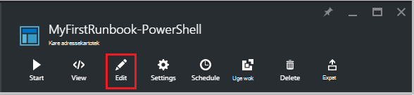  
2.  Vi ikke længere har brug for linjen **Skriv Output** , så gå videre og slette den.
3.  Skriv eller Kopiér og Indsæt følgende kode, der håndterer godkendelse med Automation Kør som din konto:

    ```
     $Conn = Get-AutomationConnection -Name AzureRunAsConnection 
     Add-AzureRMAccount -ServicePrincipal -Tenant $Conn.TenantID `
     -ApplicationId $Conn.ApplicationID -CertificateThumbprint $Conn.CertificateThumbprint
    ``` 
<br>
4.  Klik på **Test ruden** , så vi kan teste runbook.
5.  Klik på **Start** for at starte testen. Når den er fuldført, skal du modtage output, der svarer til de følgende, vise grundlæggende oplysninger fra din konto. Dette bekræfter, at legitimationsoplysningerne er gyldige. <br> 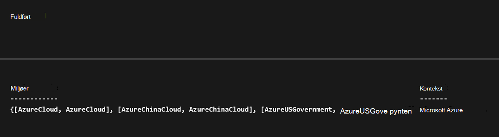

## <a name="step-6---add-code-to-start-a-virtual-machine"></a>Trin 6 – Tilføj kode for at starte en virtuel maskine

Nu hvor vores runbook godkendelse til vores Azure abonnement, kan vi administrere ressourcer. Vi tilføjer en kommando til at starte en virtuel maskine. Du kan vælge en hvilken som helst virtuelt i abonnementet Azure, og nu vil vi være hardcoding, hvor navnet til cmdlet.

1.  Skriv efter *Tilføj AzureRmAccount*, *Start-AzureRmVM-navn 'VMName' - ResourceGroupName 'NameofResourceGroup'* give navn og ressourcegruppe navnet på den virtuelle maskine til at starte.  
    
    ```
     $Conn = Get-AutomationConnection -Name AzureRunAsConnection 
     Add-AzureRMAccount -ServicePrincipal -Tenant $Conn.TenantID `
     -ApplicationID $Conn.ApplicationID -CertificateThumbprint $Conn.CertificateThumbprint 
     Start-AzureRmVM -Name 'VMName' -ResourceGroupName 'ResourceGroupName'
     ```
<br>
2.  Gem runbook, og klik derefter på **Test ruden** , så vi kan teste den.
3.  Klik på **Start** for at starte testen. Når den er fuldført, skal du kontrollere, at den virtuelle maskine er blevet startet.

## <a name="step-7---add-an-input-parameter-to-the-runbook"></a>Trin 7 – Tilføj en inputparameteren til runbook

Vores runbook aktuelt starter den virtuelle machine, vi hårdt i runbook, men den vil være mere praktisk, hvis vi kan angive den virtuelle maskine, når runbook startes. Vi vil nu føje Inputparametre til runbook til at give denne funktionalitet.

1.  Tilføj parametre for *VMName* og *ResourceGroupName* i runbook og bruge disse variabler med Cmdletten **Start AzureRmVM** som i eksemplet nedenfor.  
    
    ```
    Param(
       [string]$VMName,
       [string]$ResourceGroupName
    )
     $Conn = Get-AutomationConnection -Name AzureRunAsConnection 
     Add-AzureRMAccount -ServicePrincipal -Tenant $Conn.TenantID `
     -ApplicationID $Conn.ApplicationID -CertificateThumbprint $Conn.CertificateThumbprint 
     Start-AzureRmVM -Name $VMName -ResourceGroupName $ResourceGroupName
     ```
<br> 
2.  Gem runbook og åbne ruden Test. Bemærk, at du kan nu angive værdier for de to input variabler, der skal bruges i testen.
3.  Luk ruden Test.
4.  Klik på **Publicer** for at publicere den nye version af runbook.
5.  Stoppe den virtuelle maskine, du har startet i ovenstående trin.
6.  Klik på **Start** for at starte runbook. Skriv **VMName** og **ResourceGroupName** til den virtuelle maskine, som du skal starte.  
    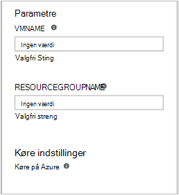  
7.  Når runbook er fuldført, skal du kontrollere, at den virtuelle maskine er blevet startet.

## <a name="differences-from-powershell-workflow"></a>Forskelle i forhold til PowerShell arbejdsproces

PowerShell runbooks har de samme livscyklus, funktioner og administration som PowerShell arbejdsproces runbooks, men der er nogle forskelle og begrænsninger:

1.  PowerShell runbooks køre hurtigt sammenlignet med PowerShell arbejdsproces runbooks, som de ikke har kompilering trin.
2.  PowerShell arbejdsproces runbooks understøtter kontrolpunkterne ved hjælp af kontrolpunkter, PowerShell arbejdsproces runbooks kan genoptage fra et vilkårligt sted i runbook, mens PowerShell runbooks kan kun fortsætte fra begyndelsen.
3.  PowerShell arbejdsproces runbooks understøtter udførelse af parallelle og serielle, mens PowerShell runbooks kan kun udføre kommandoer serielt.
4.  I en arbejdsproces for PowerShell runbook kan en aktivitet, en kommando eller et script Bloker have sin egen runspace mens i en PowerShell-runbook alt i et script kører i et enkelt runspace. Der er også nogle [syntaktisk forskelle](https://technet.microsoft.com/magazine/dn151046.aspx) mellem en oprindelig PowerShell runbook og en PowerShell arbejdsproces runbook.

## <a name="next-steps"></a>Næste trin

-   For at komme i gang med grafiske runbooks skal du se [Min første grafiske runbook](automation-first-runbook-graphical.md)
-   For at komme i gang med PowerShell arbejdsproces runbooks skal du se [Min første PowerShell arbejdsproces runbook](automation-first-runbook-textual.md)
-   Hvis du vil vide mere om runbook typer, deres fordele og begrænsninger, skal du se [Azure automatisering runbook typer](automation-runbook-types.md)
-   Yderligere oplysninger om PowerShell-script understøttelse funktion skal du se [oprindelige PowerShell-script, der understøtter i Azure Automation](https://azure.microsoft.com/blog/announcing-powershell-script-support-azure-automation-2/)
