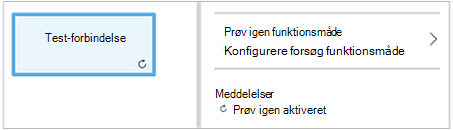
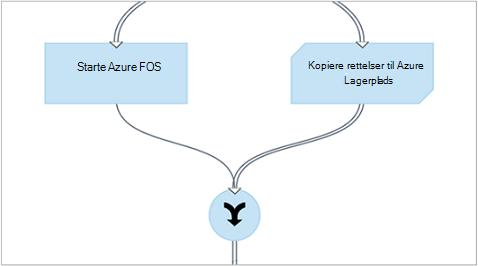
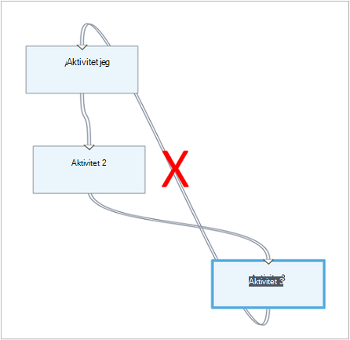
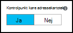

<properties 
    pageTitle="Grafiske redigering i Azure automatisering | Microsoft Azure"
    description="Grafiske redigering, kan du oprette runbooks til Azure automatisering uden at arbejde med kode. Denne artikel indeholder en introduktion til grafiske redigering og alle de oplysninger, der er behov for at starte oprettelsen af et grafisk runbook."
    services="automation"   
    documentationCenter=""
    authors="mgoedtel"
    manager="jwhit"
    editor="tysonn" />
<tags 
    ms.service="automation"
    ms.devlang="na"
    ms.topic="article"
    ms.tgt_pltfrm="na"
    ms.workload="infrastructure-services"
    ms.date="06/03/2016"
    ms.author="magoedte;bwren" />

# Grafiske redigering i Azure automatisering

## Introduktion

Grafiske redigering kan du oprette runbooks til Azure automatisering uden lede den underliggende kode Windows PowerShell eller PowerShell arbejdsproces. Du føjer aktiviteter til lærredet fra et bibliotek med cmdletter og runbooks, sammenkæde dem og konfigurere for at danne en arbejdsproces.  Hvis du har prøvet at arbejde med System Center Orchestrator eller Service Management automatisering (SMA), derefter ser dette velkendte for dig.   

I denne artikel indeholder en introduktion til grafiske redigering og de begreber, du har brug at komme i gang med at oprette en grafisk runbook.

## Grafiske runbooks

Alle runbooks i Azure Automation er Windows PowerShell arbejdsprocesser.  Grafiske og grafiske PowerShell arbejdsprocessen runbooks generere PowerShell-kode, der udføres med Automation medarbejdere, men du kan ikke til at få den vist eller redigere den direkte.  En grafisk runbook kan konverteres til en grafisk PowerShell arbejdsproces runbook og omvendt, men de kan ikke konverteres til en runbook, der indeholder tekst. En eksisterende tekstdata runbook kan ikke importeres til den grafiske editor.  

## Oversigt over grafiske editor

Du kan åbne den grafiske editor i portalen Azure ved at oprette eller redigere en grafisk runbook.

I følgende afsnit beskrives kontrolelementerne i den grafiske editor.

### Lærred
Lærredet er, hvor du designer dit runbook.  Du kan tilføje aktiviteter fra knuderne i kontrolelementet bibliotek til runbook og forbinde dem med links til at definere logik af runbook.

Du kan bruge kontrolelementerne nederst på lærredet for at zoome ind og ud.

### Bibliotek kontrolelement

Kontrolelementet bibliotek er, hvor du vælger [aktiviteter](#activities) til at føje til din runbook.  Du kan føje dem til det sted, hvor du slutter dem til andre aktiviteter lærred.  Den indeholder fire sektioner, der er beskrevet i følgende tabel.

| Sektion | Beskrivelse |
|:---|:---|
| Cmdletter | Omfatter alle de cmdlet'er, der kan bruges i din runbook.  Cmdletter er organiseret efter modul.  Alle de moduler, som du har installeret på din konto med automation vil være tilgængelige.  |
| Runbooks |  Indeholder runbooks på din konto med automation. Disse runbooks kan føjes til lærredet som skal bruges som underordnet runbooks. Kun runbooks af core samme type som runbook redigeres vises; runbooks kun PowerShell-baserede runbooks, til grafiske vises, mens til grafiske PowerShell arbejdsproces runbooks kun PowerShell-arbejdsproces-baserede runbooks vises.
| Aktiver | Omfatter de [automatiske Aktiver](http://msdn.microsoft.com/library/dn939988.aspx) i kontoen automatisering, der kan bruges i din runbook.  Når du tilføjer et aktiv i en runbook, føjer en arbejdsprocesaktivitet, der henter det valgte aktiv.  I forbindelse med variable aktiver, kan du vælge, om du vil føje en aktivitet for at få variablen eller indstille variablen.
| Runbook kontrolelement | Omfatter runbook kontrolelement aktiviteter, der kan bruges i din aktuelle runbook. Et *knudepunkt* tager flere input og skal vente, indtil alle har fuldført, før du fortsætter arbejdsprocessen. En *kode* aktivitet kører en eller flere kodelinjer PowerShell eller PowerShell arbejdsproces afhængigt af den grafiske runbook type.  Du kan bruge denne aktivitet for brugerdefineret kode eller funktionalitet, som er svært at opnå med andre aktiviteter.|

### Konfiguration af kontrolelement

Kontrolelementet konfiguration er, hvor du angiver detaljer for et objekt er markeret på lærredet. De egenskaber, der er tilgængelige i dette kontrolelement, afhænger af typen objekt, der er markeret.  Når du vælger en indstilling i kontrolelementet konfiguration, åbnes den ekstra blade for at angive yderligere oplysninger.

### Test kontrolelement

Kontrolelementet Test vises ikke, når den grafiske editor startes første gang. Det er åbnes, når du interaktivt [teste en grafisk runbook](#graphical-runbook-procedures).  

## Grafiske runbook procedurer 

### Eksport og import af en grafisk runbook

Du kan kun eksportere den udgivne version af et grafisk runbook.  Hvis runbook ikke er endnu publiceret, deaktiveres knappen **Eksporter publiceret** .  Når du klikker på knappen **Eksportér publiceret** , hentes runbook til din lokale computer.  Navnet på filen svarer til navnet på runbook med filtypenavnet *graphrunbook* .

Du kan importere en grafiske eller grafiske PowerShell arbejdsproces runbook-fil ved at vælge indstillingen **importere** , når du tilføjer en runbook.   Når du vælger filen, der importeres, kan du beholde det samme **navn** eller angive en ny.  Feltet Runbook Type vises typen runbook, når den vurderer, hvor den fil, der er markeret, og hvis du forsøger at vælge en anden type, der ikke er korrekt, en meddelelse der præsenteres bemærke, der er potentielle konflikter, og under konverteringen, der kan være syntaksfejl.  

### Test af en grafisk runbook

Du kan teste kladde-version af en runbook i portalen Azure, mens bibeholder den udgivne version af runbook være uændret, eller du kan teste en ny runbook, før den er blevet publiceret. Dette giver dig mulighed at bekræfte, at runbook fungerer korrekt, før du erstatter den udgivne version. Når du tester en runbook, kladde runbook udføres og eventuelle handlinger, der udfører den er fuldført. Ingen jobs oprettes, men output vises i ruden Test Output. 

Åbn kontrolelementet Test for en runbook ved at åbne runbook for Rediger, og klik derefter på knappen **Test rude** .

Kontrolelementet Test bliver bedt om at eventuelle inputparametre, og du kan starte runbook ved at klikke på knappen **Start** .

### Publicere en grafisk runbook

Hver runbook i Azure Automation har en kladde og en udgivet version. Kun den udgivne version er tilgængelig til at blive kørt, og kun kladde-versionen kan redigeres. Den udgivne version er ikke påvirket af eventuelle ændringer til kladde-versionen. Når den kladdeversion er klar til at være tilgængeligt, derefter publicere du den, overskriver den udgivne version med kladde-versionen.

Du kan udgive en grafisk runbook ved at åbne runbook til redigering og derefter klikke på knappen **Publicer** .

Når en runbook ikke er endnu publiceret, har statussen **Ny**.  Når den er udgivet, har statussen **udgivet**.  Hvis du redigerer runbook, når den er blevet publiceret, og de kladde- og Published versioner er forskellige, har runbook status **i Rediger**.

 

Du har også mulighed for at vende tilbage til den udgivne version af en runbook.  Dette viser ikke til stede eventuelle ændringer, der har foretaget, siden runbook sidst blev publiceret og erstatter den kladdeversion af runbook med den udgivne version.

## Aktiviteter

Aktiviteter er grundpillerne i en runbook.  En aktivitet kan være en PowerShell-cmdlet, en underordnet runbook eller en arbejdsprocesaktivitet.  Du kan føje en aktivitet til runbook ved at højreklikke på det i kontrolelementet bibliotek og vælge **Føj til lærredet**.  Du kan derefter klikke på og trække aktiviteten for at placere et vilkårligt sted på lærredet, som du have.  Placeringen af den aktivitetens på lærredet ikke nødvendige handlingen af runbook på nogen måde.  Du kan layout din runbook, men der er det bedst egnet til visualisering af driften. 

Vælg aktiviteten på lærredet for at konfigurere egenskaberne og parametre i bladet konfiguration.  Du kan ændre **etiket** aktivitetens til noget, som beskriver for dig.  Cmdletten oprindelige stadig køres, ændrer du blot visningsnavn, der skal bruges i den grafiske editor.  Etiketten skal være entydig i runbook. 

### Parametersæt

Angive en parameter definerer de obligatoriske og valgfrie parametre, der accepterer værdier for en bestemt cmdlet.  Alle cmdletter har mindst én parameter, der er angivet, og nogle har flere.  Hvis en cmdlet har flere parametersæt, skal derefter du vælge som en, du vil bruge, før du kan konfigurere parametre.  De parametre, du kan konfigurere afhænger sættet parameter, som du vælger.  Du kan ændre sættet parameter bruges af en aktivitet, ved at vælge **Parameter angivet** og vælge et andet sæt.  I dette tilfælde skal går alle de værdier, du konfigurerede tabt.

I eksemplet nedenfor har cmdlet'en Get-AzureRmVM til tre parametersæt.  Du kan ikke konfigurere parameterværdier, indtil du vælger sæt af parameter.  Sættet ListVirtualMachineInResourceGroupParamSet parameter er til at returnere alle virtuelle maskiner i en ressourcegruppe og har en enkelt valgfri parameter.  GetVirtualMachineInResourceGroupParamSet bruges til at angive den virtuelle maskine, du vil gå tilbage og har to obligatoriske og en valgfri parameter.

#### Parameterværdier

Når du angiver en værdi for en parameter, kan du vælge en datakilde til at bestemme, hvordan værdien være angivet.  De datakilder, der er tilgængelige for et bestemt parameter afhænger gyldige værdier for denne parameter.  Null kan for eksempel ikke markere indstillingen for en parameter, der ikke tillader null-værdier.

| Datakilde | Beskrivelse |
|:---|:---|
|Konstant værdi|Skriv en værdi for parameteren.  Dette er kun tilgængelig for følgende datatyper: Int32 Int64 streng, boolesk, dato og klokkeslæt, og Skift. |
|Aktivitet Output|Output fra en aktivitet, der står foran den aktuelle aktivitet i arbejdsprocessen.  Alle gyldige aktiviteter vises.  Vælg kun aktiviteten bruge dets output til værdien for parameteren.  Hvis aktiviteten producerer et objekt med flere egenskaber, kan du skrive navnet på egenskaben når du har valgt aktiviteten.|
|Runbook Input |Vælg en runbook Inputparameteren som input til parameteren aktivitet.|  
|Variabelt aktiv|Vælg en automatisering Variable som input.|  
|Legitimationsoplysninger aktiv|Vælg en automatisering legitimationsoplysninger som input.|  
|Certifikat aktiv|Vælg et certifikat med Automation som input.|  
|Forbindelse aktiv|Vælg en forbindelse med Automation som input.| 
|PowerShell udtryk|Angiv enkel [PowerShell udtryk](#powershell-expressions).  Udtrykket skal evalueres før aktiviteten og bruges til værdien for parameteren resultatet.  Du kan bruge variabler til at referere til output fra en aktivitet eller en runbook inputparameteren.|
|Ikke konfigureret|Rydder alle værdier, der tidligere var konfigureret.|

#### Valgfri yderligere parametre

Alle cmdletter har mulighed for at tilføje yderligere parametre.  Dette er PowerShell fælles parametre eller andre brugerdefinerede parametre.  Der vises med en tekstboks, hvor du kan angive parametre ved hjælp af PowerShell syntaks.  Eksempelvis hvis du vil bruge parameteren **detaljeret** almindelige, du vil angive **"-detaljeret: $True"**.

### Prøv igen aktivitet

**Prøv igen funktionsmåde** gør det muligt for en aktivitet skal køres flere gange, indtil en bestemt betingelse er opfyldt, stil med en løkke.  Du kan bruge denne funktion til aktiviteter, der skal køre flere gange, er i fejl og muligvis har brug for mere end ét forsøg til succes eller test af output oplysninger for aktiviteten for gyldige data.    

Når du aktiverer forsøg for en aktivitet, kan du angive en forsinkelse og en betingelse.  Forsinkelsen er den tid (målt i sekunder eller minutter), skal vente runbook, før der køres aktiviteten igen.  Hvis nogen forsinkelse ikke er angivet, derefter kører aktiviteten igen med det samme, når den er fuldført. 

Betingelsen forsøg er en PowerShell-udtryk, der er evalueret efter hver gang aktiviteten kører.  Hvis udtrykket giver til sand, derefter kører aktiviteten igen.  Hvis udtrykket giver falsk derefter aktiviteten køres ikke igen, og runbook går videre til næste aktivitet. 

Betingelsen forsøg kan bruge en variabel, kaldet $RetryData, der giver adgang til oplysninger om aktivitet gentagelserne.  Denne variabel har egenskaber i den følgende tabel.

| Egenskaben | Beskrivelse |
|:--|:--|
| NumberOfAttempts | Antallet af gange, der er kørt aktiviteten.              |
| Output           | Output fra den seneste kørsel af aktiviteten.                    |
| TotalDuration    | Blev afbrudt, der er forløbet siden aktiviteten blev startet første gang. |
| StartedAt        | Tid i UTC-format aktiviteten for første gang.           |

Følgende er eksempler på aktivitet Prøv igen betingelser.

    # Run the activity exactly 10 times.
    $RetryData.NumberOfAttempts -ge 10 

    # Run the activity repeatedly until it produces any output.
    $RetryData.Output.Count -ge 1 

    # Run the activity repeatedly until 2 minutes has elapsed. 
    $RetryData.TotalDuration.TotalMinutes -ge 2

Når du har konfigureret en forsøg betingelse for en aktivitet, indeholder aktiviteten to visuelle tip for at minde dig.  En præsenteres i aktiviteten, og den anden er, når du gennemser konfigurationen af aktiviteten.

### Arbejdsproces Script kontrolelement

Kontrolelementet kode er en speciel aktivitet, der accepterer PowerShell eller PowerShell arbejdsproces script afhængigt af typen grafiske runbook forfattes for at levere funktionalitet, som ellers ikke muligvis tilgængelig.  Det kan ikke acceptere parametre, men den kan bruge variabler for aktivitet output og runbook inputparametre.  Noget output aktivitetens føjes til databus, medmindre den har ingen udgående link i så fald det føjes til output af runbook.

Følgende kode udfører f.eks datoberegninger ved hjælp af en runbook input variabel kaldet $NumberOfDays.  Derefter sender den beregnede dato klokkeslæt som output der skal bruges i efterfølgende aktiviteter i runbook.

    $DateTimeNow = (Get-Date).ToUniversalTime()
    $DateTimeStart = ($DateTimeNow).AddDays(-$NumberOfDays)}
    $DateTimeStart

## Links og arbejdsprocesser

Et **link** i en grafisk runbook forbinder to aktiviteter.  Det vises på lærredet som en pil, der peger fra den kilde aktivitet på destination aktiviteten.  Aktiviteterne, der kører i pilens retning med destination aktiviteten starter efter den kilde aktivitet er fuldført.  

### Oprette et link

Oprette en kæde mellem to aktiviteter ved at vælge den kilde aktivitet og klikke på cirklen i bunden af figuren.  Træk pilen til destination aktivitet og version.

Vælg linket til at konfigurere egenskaberne i bladet konfiguration.  Dette omfatter kædetype der er beskrevet i følgende tabel.

| Kædetype | Beskrivelse |
|:---|:---|
| Pipeline | Destination aktiviteten udføres én gang for hvert objekt output fra den kilde aktivitet.  Destination aktivitet kører ikke, hvis den kilde aktivitet resulterer i intet output.  Output fra den kilde aktivitet findes som et objekt.  |
| Sekvens | Destination aktiviteten kører kun én gang.  Den modtager en matrix af objekter fra den kilde aktivitet.  Output fra den kilde aktivitet findes som en matrix af objekter. |

### Første aktivitet

En grafisk runbook starter med en hvilken som helst aktiviteter, der ikke har en indgående forbindelse.  Dette er ofte kun én aktivitet, der skal fungere som den første aktivitet for runbook.  Hvis flere aktiviteter ikke har en indgående forbindelse, begynder runbook ved at køre dem parallelt.  Det derefter følge disse links for at køre andre aktiviteter, som hver er fuldført.

### Betingelser

Når du angiver en betingelse på et link, destination aktiviteten køres kun, hvis betingelsen fortolkes til sand.  Du bruger normalt en $ActivityOutput variabel i stand til at hente output fra den kilde aktivitet.  

For en pipeline kæde, du angiver en betingelse for et enkelt objekt, og betingelsen evalueres for hver objekt output af kilde aktivitet.  Derefter køres aktiviteten destination for de enkelte objekter, der opfylder betingelsen.  For eksempel med en kilde-aktivitet på Get-AzureRmVm kan følgende syntaks bruges til et betinget pipeline link til at hente kun virtuelle maskiner i ressourcegruppen med navnet *Gruppe1*.  

    $ActivityOutput['Get Azure VMs'].Name -match "Group1"

For en sekvens kæde evalueres betingelsen kun én gang, da der returneres en enkelt matrix, som indeholder alle objekter output fra den kilde aktivitet.  En sekvens link kan ikke bruges til filtrering som et pipeline link på grund af dette men blot bestemmer eller ej næste aktivitet kører. Tage f.eks følgende sæt af aktiviteter i vores starte VM runbook.   
Der findes tre forskellige sekvens links, der godkender værdier blev leveret til to runbook inputparametre, der repræsenterer VM navnet og ressourcegruppe for at finde ud af, hvilket er de nødvendige skridt for at tage - starte en enkelt VM, og begynd at alle FOS i gruppen ressource og alle FOS i et abonnement.  Linket sekvens mellem Opret forbindelse til Azure og få enkelt VM er her den betingelse logik:

    <# 
    Both VMName and ResourceGroupName runbook input parameters have values 
    #>
    (
    (($VMName -ne $null) -and ($VMName.Length -gt 0))
    ) -and (
    (($ResourceGroupName -ne $null) -and ($ResourceGroupName.Length -gt 0))
    )

Når du bruger et betinget link, filtreres de data, der er tilgængelige fra kilde aktiviteten til andre aktiviteter i grenen efter betingelsen.  Hvis en aktivitet er kilden til flere kæder, afhænger de data, der er tilgængelige for aktiviteter i hver gren på betingelse i linket til at oprette forbindelse til grenen.

For eksempel starter **Start AzureRmVm** aktivitet i runbook nedenfor alle virtuelle computere.  Der er to betingede links.  Det første betingede hyperlink bruger udtrykket *$ActivityOutput ['Start-AzureRmVM']. IsSuccessStatusCode - eq $true* til at filtrere Hvis Start-AzureRmVm aktiviteten blev fuldført.  Andet bruger udtrykket *$ActivityOutput ['Start-AzureRmVM']. IsSuccessStatusCode - ne $true* til at filtrere Hvis Start-AzureRmVm aktivitet ikke kunne starte den virtuelle maskine.  

En hvilken som helst aktivitet, der følger den første link og bruger aktivitet output fra Get-AzureVM får kun de virtuelle maskiner, der er blevet startet på det tidspunkt, Get-AzureVM blev kørt.  En hvilken som helst aktivitet, der følger efter den anden link får kun den virtuelle maskiner, der er stoppet på det tidspunkt, Get-AzureVM blev kørt.  En hvilken som helst aktivitet, følge den tredje link får alle virtuelle maskiner uanset deres kører tilstand.

### Kryds

En samling, der er en speciel aktivitet, som skal vente, indtil alle indgående grene er færdig.  Dette giver dig mulighed at køre flere aktiviteter parallelt og sikre, at alle har fuldført inden du går videre.

Mens en samling, der kan have et ubegrænset antal indgående links, kan ikke mere end én af disse links en rørledning.  Antallet af indgående sekvens links er ikke begrænset.  Du kan oprette knudepunkt med flere indgående pipeline links og gemme runbook, men den mislykkes, når den kører.

Eksemplet herunder er en del af en runbook, der starter et sæt af virtuelle maskiner under samtidigt hentning af rettelser skal anvendes på disse computere.  En samling, der bruges til at sikre, at begge processer er fuldført, før runbook fortsætter.

### Skifter

En cyklus er, når en destination aktivitet kæder tilbage til dens kilde aktivitet eller til en anden aktivitet, der til sidst links tilbage til kilden.  Skifter er i øjeblikket er ikke tilladt i grafiske redigering.  Hvis din runbook har en cyklus, gemmes korrekt, men får en fejlmeddelelse, når der køres.

### Deling af data mellem aktiviteter

De data, der er output ved en aktivitet med et link af typen udgående skrives til *databus* for runbook.  Ingen aktiviteter i runbook kan bruge dataene på databus udfylde parameterværdier eller medtage i script-kode.  En aktivitet kan få adgang til output fra en hvilken som helst foregående aktivitet i arbejdsprocessen.     

Hvordan data, der er skrevet til databus, afhænger af typen link på aktiviteten.  For en **rørledning**er dataene output som multipla objekter.  For en **sekvens** kæde er dataene output som en matrix.  Hvis der er kun én værdi, vil det være output som et enkelt element matrix.

Du kan få adgang til data på databus ved hjælp af en af to metoder.  Først er at bruge en **Aktivitet Output** datakilde til at udfylde en parameter for en anden aktivitet.  Hvis resultatet er et objekt, kan du angive en enkelt egenskab.

Du kan også hente output fra en aktivitet i en datakilde til **PowerShell udtryk** eller fra en **Arbejdsproces Script** aktivitet med en ActivityOutput variabel.  Hvis resultatet er et objekt, kan du angive en enkelt egenskab.  ActivityOutput variabler Brug følgende syntaks.

    $ActivityOutput['Activity Label']
    $ActivityOutput['Activity Label'].PropertyName 

### Kontrolpunkter

Du kan angive [kontrolpunkter](automation-powershell-workflow.md#checkpoints) i et grafisk PowerShell arbejdsproces runbook ved at vælge *kontrolpunkt runbook* på en hvilken som helst aktivitet.  Derved en kontrolpunkt skal angives, når du har kørt aktiviteten.

Kontrolpunkter kun er aktiveret i grafiske PowerShell arbejdsproces runbooks, det er ikke tilgængelig i grafiske runbooks.  Hvis runbook bruger Azure-cmdletter, skal du følge en tildelt et kontrolpunkt aktivitet med en Tilføj-AzureRMAccount i tilfælde af runbook afbrydes midlertidigt og genstarter fra denne kontrolpunkt på en anden arbejder. 

## Godkendelse til Azure ressourcer

Runbooks i Azure automatisering, der administrerer Azure ressourcer kræver godkendelse til Azure.  Den nye [konto Kør som](automation-sec-configure-azure-runas-account.md) funktion (også kaldet en tjeneste vigtigste) er standardmetoden til at få adgang til Azure ressourcestyring ressourcer i dit abonnement med Automation runbooks.  Du kan tilføje denne funktion til en grafisk runbook ved at tilføje **AzureRunAsConnection** forbindelse aktiv, som bruger [Get-AutomationConnection](https://technet.microsoft.com/library/dn919922%28v=sc.16%29.aspx) for PowerShell-cmdlet, og [Tilføj AzureRmAccount](https://msdn.microsoft.com/library/mt619267.aspx) -cmdlet til lærredet. Dette er vist i følgende eksempel.  
Få køre som forbindelse aktivitet (det vil sige Get-AutomationConnection), er konfigureret med en konstant værdi datakilde med navnet AzureRunAsConnection.  
Den næste aktivitet, Tilføj-AzureRmAccount, tilføjer godkendte Kør som kontoen til brug i runbook. 
 
Du skal angive navnet på egenskaben for feltet sti, fordi aktiviteten skriver et objekt med flere egenskaber for parametrene **APPLICATIONID**, **CERTIFICATETHUMBPRINT**og **TENANTID** .  Ellers når du udfører runbook, kan den ikke forsøger at godkende.  Dette er, hvad du skal som minimum godkende din runbook med kontoen, der kører som.

For at bevare baglæns kompatibilitet for abonnenter, der har oprettet en automatisering konto ved hjælp af en [Azure AD-brugerkonto](automation-sec-configure-aduser-account.md) til at administrere Azure Service Management (ASM) eller Azure ressourcestyring ressourcer, er metoden til at godkende Cmdletten Tilføj AzureAccount med [legitimationsoplysninger aktiv](http://msdn.microsoft.com/library/dn940015.aspx) , der repræsenterer en Active Directory-brugere med adgang til Azure-konto.

Du kan tilføje denne funktion til en grafisk runbook ved at tilføje en legitimationsoplysninger aktiv lærredet efterfulgt af en Tilføj AzureAccount aktivitet.  Tilføje AzureAccount bruger legitimationsoplysninger aktiviteten til dens input.  Dette er vist i følgende eksempel.

Du skal godkende i starten af runbook og efter hvert kontrolpunkt.  Det betyder, at tilføje en tilføjelse Tilføj AzureAccount aktivitet efter en hvilken som helst kontrolpunkt-arbejdsproces aktivitet. Du behøver ikke en tilføjelse legitimationsoplysninger aktivitet, idet du kan bruge den samme 

## Runbook input og output

### Runbook input

En runbook kan kræve input fra en bruger, når de starter runbook via Azure administrationsportalen eller fra en anden runbook, hvis den aktuelle, der bruges som underordnet.
Eksempelvis hvis du har en runbook, som opretter en virtuel maskine, du muligvis angive oplysninger som navnet på den virtuelle maskine og andre egenskaber hver gang du starter runbook.  

Du accepterer input til en runbook ved at definere et eller flere inputparametre.  Du angiver værdier for disse parametre for hver gang runbook startes.  Når du starter en runbook ved hjælp af Azure portal, bliver du bedt om at angive værdier for hver af de runbook inputparametre.

Du kan få adgang til inputparametre for en runbook ved at klikke på knappen **Input og output** på værktøjslinjen runbook.  

 

Dette åbner kontrolelementet **Input og Output** , hvor du kan redigere en eksisterende Inputparameteren eller oprette en ny ved at klikke på **Tilføj input**. 

Hver inputparameteren er defineret af egenskaberne i den følgende tabel.

|Egenskaben|Beskrivelse|
|:---|:---|
| Navn | Det entydige navn for parameteren.  Dette kan kun indeholde alpha numeriske tegn og må ikke indeholde et mellemrum. |
| Beskrivelse | En valgfri beskrivelse for inputparameteren.  |
| Type | Datatypen forventet for værdien for parameteren.  Portalen Azure giver et passende kontrolelement til datatypen for hver parameter, når bede om input. |
| Obligatorisk | Angiver, om der skal angives en værdi for parameteren.  Runbook kan ikke startes, hvis du ikke angiver en værdi for hver obligatorisk parameter, der ikke har en standardværdi, der er defineret. |
| Standardværdi | Angiver, hvilken værdi der bruges til parameteren, hvis der ikke angives.  Dette kan enten være Null eller en bestemt værdi. |

### Runbook output

Data, der er oprettet af enhver aktivitet, der ikke har en udgående forbindelse, føjes til [output af runbook](http://msdn.microsoft.com/library/azure/dn879148.aspx).  Output gemmes sammen med runbook jobbet og findes på en overordnet runbook, når runbook bruges som underordnet.  

## PowerShell udtryk

En af fordelene ved grafiske redigering giver dig mulighed for at opbygge en runbook med minimale kendskab til PowerShell.  I øjeblikket, skal du vide lidt af PowerShell, selvom for udfylde visse [parameterværdier](#activities) og indstille [link betingelser](#links-and-workflow).  Dette afsnit indeholder en hurtig introduktion til PowerShell udtryk for de brugere, som ikke muligvis kendskab til den.  Få flere detaljer i PowerShell findes på [Scripting med Windows PowerShell](http://technet.microsoft.com/library/bb978526.aspx). 

### Datakilde til PowerShell udtryk

Du kan bruge en PowerShell-udtryk som datakilde til at udfylde værdien af en [parameter for aktivitet](#activities) med resultaterne af PowerShell kode.  Det kan være en enkelt linje af kode, som udfører nogle enkle funktion eller flere linjer, som udfører nogle kompleks logik.  Noget output fra en kommando, som ikke er tildelt til en variabel er output til værdien for parameteren. 

For eksempel vil følgende kommando output dags dato. 

    Get-Date

Følgende kommandoer opbygge en streng fra dags dato og tildele den til en variabel.  Indholdet af variablen sendes til output 

    $string = "The current date is " + (Get-Date)
    $string

Følgende kommandoer evaluere den aktuelle dato og returnere en streng, der angiver, om den aktuelle dag er en weekend eller ugedag. 

    $date = Get-Date
    if (($date.DayOfWeek = "Saturday") -or ($date.DayOfWeek = "Sunday")) { "Weekend" }
    else { "Weekday" }
    
 
### Aktivitet output

For at bruge output fra en foregående aktivitet i runbook skal du bruge variablen $ActivityOutput med følgende syntaks.

    $ActivityOutput['Activity Label'].PropertyName

For eksempel skal du muligvis en aktivitet med en egenskab, der kræver navnet på en virtuel maskine i hvilket tilfælde du kan bruge følgende udtryk.

    $ActivityOutput['Get-AzureVm'].Name

Hvis egenskaben, der kræves den virtuelle maskine objekt i stedet for blot en egenskab, skal du gå tilbage hele objektet ved hjælp af følgende syntaks.

    $ActivityOutput['Get-AzureVm']

Du kan også bruge output fra en aktivitet i et mere komplekse udtryk som følgende, der sammenkæder tekst til navnet på den virtuelle computer.

    "The computer name is " + $ActivityOutput['Get-AzureVm'].Name

### Betingelser

Bruge [sammenligningsoperatorer](https://technet.microsoft.com/library/hh847759.aspx) til at sammenligne værdier eller fastslå, om en værdi svarer til et bestemt mønster.  En sammenligning returnerer en værdi af $true eller $false.

Nedenstående betingelse for bestemmer for eksempel, om den virtuelle maskine fra en aktivitet med navnet *Get-AzureVM* er i øjeblikket *ikke længere*. 

    $ActivityOutput["Get-AzureVM"].PowerState –eq "Stopped"

Nedenstående betingelse kontrollerer, om den samme virtuelle maskine er i en hvilken som helst tilstand end *ikke længere*.

    $ActivityOutput["Get-AzureVM"].PowerState –ne "Stopped"

Du kan deltage i flere betingelser ved hjælp af en [logisk operator](https://technet.microsoft.com/library/hh847789.aspx) såsom **- og** eller **- eller**.  Nedenstående betingelse kontrollerer f.eks, om den samme virtuelle maskine i det forrige eksempel er i tilstanden af *standses* eller *stoppe*.

    ($ActivityOutput["Get-AzureVM"].PowerState –eq "Stopped") -or ($ActivityOutput["Get-AzureVM"].PowerState –eq "Stopping") 

### Hashtables

[Hashtables](http://technet.microsoft.com/library/hh847780.aspx) er navn/værdi-par, der er praktisk til at returnere et sæt af værdier.  Egenskaber for visse aktiviteter kan forvente en hashtabel i stedet for en enkelt værdi.  Du kan også få vist som hashtable kaldes en ordbog. 

Du kan oprette en hashtabel med følgende syntaks.  En hashtabel kan indeholde et vilkårligt antal poster, men hver er defineret af et navn og en værdi.

    @{ <name> = <value>; [<name> = <value> ] ...}

For eksempel opretter følgende udtryk en hashtabel skal bruges i datakilden til en aktivitet parameter, som forventet en hashtabel med værdier for en søgning på internettet.

    $query = "Azure Automation"
    $count = 10
    $h = @{'q'=$query; 'lr'='lang_ja';  'count'=$Count}
    $h

I følgende eksempel bruges output fra en aktivitet, kaldet *Få Twitter-forbindelse* til at udfylde en hashtabel.

    @{'ApiKey'=$ActivityOutput['Get Twitter Connection'].ConsumerAPIKey;
      'ApiSecret'=$ActivityOutput['Get Twitter Connection'].ConsumerAPISecret;
      'AccessToken'=$ActivityOutput['Get Twitter Connection'].AccessToken;
      'AccessTokenSecret'=$ActivityOutput['Get Twitter Connection'].AccessTokenSecret}

## Næste trin

- For at komme i gang med PowerShell arbejdsproces runbooks skal du se [Min første PowerShell arbejdsproces runbook](automation-first-runbook-textual.md) 
- For at komme i gang med grafiske runbooks skal du se [Min første grafiske runbook](automation-first-runbook-graphical.md)
- Hvis du vil vide mere om runbook typer, deres fordele og begrænsninger, skal du se [Azure automatisering runbook typer](automation-runbook-types.md)
- For at forstå hvordan til at godkende med Automation Kør som-konto, skal du se [Konfigurere Azure køre som konto](automation-sec-configure-azure-runas-account.md)
 
