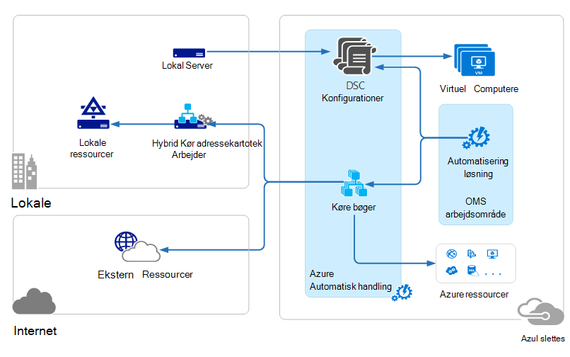
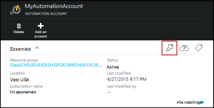
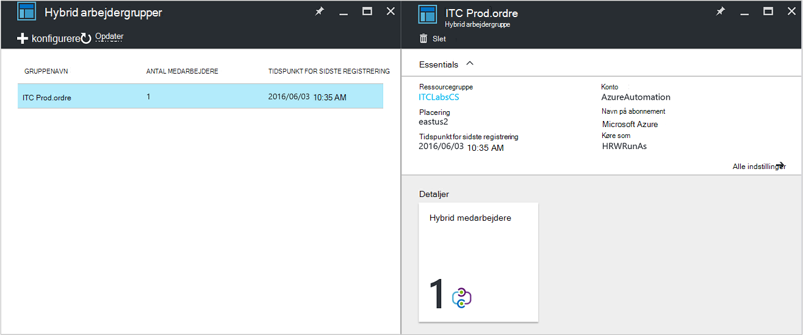
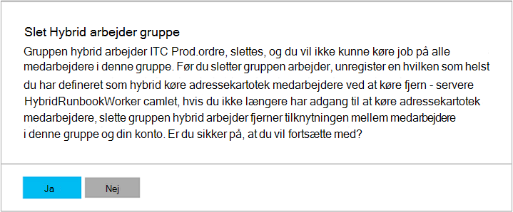

<properties
   pageTitle="Azure automatisering Hybrid Runbook medarbejdere | Microsoft Azure"
   description="I denne artikel indeholder oplysninger om installation og brug af Hybrid Runbook arbejder som er en funktion af Azure automatisering, hvor du kan køre runbooks på computere i dit lokale datacenter."
   services="automation"
   documentationCenter=""
   authors="mgoedtel"
   manager="jwhit"
   editor="tysonn" />
<tags
   ms.service="automation"
   ms.devlang="na"
   ms.topic="article"
   ms.tgt_pltfrm="na"
   ms.workload="infrastructure-services"
   ms.date="10/14/2016"
   ms.author="bwren" />

# Azure automatisering Hybrid Runbook medarbejdere

Runbooks i Azure automatisering kan ikke få adgang til ressourcer i din lokale datacenter, da de kører i Azure skyen.  Funktionen Hybrid Runbook arbejder i Azure automatisering giver dig mulighed at køre runbooks på computere, der er placeret i dit datacenter for at administrere lokale ressourcer. Runbooks gemmes og administreres i Azure automatisering og derefter leveret til en eller flere lokale computere.  

Denne funktionalitet er vist på følgende billede.   

Du kan angive en eller flere computere i dit datacenter til at fungere som en Hybrid Runbook arbejder og køre runbooks fra Azure automatisering.  Hver bruger, der kræver Microsoft Management Agent med en forbindelse til Microsoft Operations Management Suite og Azure automatisering runbook miljø.  Handlinger Management Suite bruges kun til at installere og vedligeholde management agent og til at overvåge funktionaliteten i arbejderen.  Leveringen af runbooks og instruktionerne til at køre dem udføres af Azure automatisering.

Der er ingen indgående firewallkrav til at understøtte Hybrid Runbook medarbejdere. Agent på den lokale computer starter al kommunikation med Automation Azure i skyen. Når en runbook startes, opretter Azure automatisering en instruktion, der er hentet af agent. Agenten trækker derefter ned runbook og parametrene, før du kører den.  Det kan også hente en hvilken som helst [Aktiver](http://msdn.microsoft.com/library/dn939988.aspx) , der anvendes af runbook fra Azure automatisering.

>[AZURE.NOTE] Hybrid Runbook medarbejdere understøtter ikke aktuelt [DTK konfigurationer](automation-dsc-overview.md).

## Hybrid Runbook arbejder grupper

Hver Hybrid Runbook arbejder er medlem af en Hybrid Runbook arbejder gruppe, du angiver, når du installerer agenten.  En gruppe kan indeholde et enkelt agent, men du kan installere flere supportmedarbejdere i en gruppe til høj tilgængelighed.

Når du starter en runbook på en Hybrid Runbook arbejder, kan du angive den gruppe, den kan køre på.  Medlemmer af gruppen bestemmer, hvilke arbejder vil vedligeholde anmodningen.  Du kan ikke angive en bestemt arbejder.

## Hybrid Runbook arbejder krav

Du skal angive mindst én lokale computer til at køre hybrid runbook job.  Denne computer skal have følgende:

- Windows Server 2012 eller nyere
- Windows PowerShell 4.0 eller nyere
- Mindst to kerner og 4 GB RAM

Overvej følgende anbefalinger til hybrid medarbejdere: 

- Udpege flere hybrid medarbejdere i hver gruppe med høj tilgængelighed.  
- Hybrid medarbejdere kan fungere sammen med Service Management automatisering eller System Center Orchestrator runbook-servere.
- Overvej at bruge en computer, fysisk placeret i eller i nærheden af området af kontoen automatisering, da jobbet dataene sendes tilbage til Azure automatisering, når et job er fuldført.

>[AZURE.NOTE] Hybrid Runbook arbejder version 7.2.11136.0 understøtter kommunikere via en proxyserver kun med PowerShell-scripts.  Understøttelse af arbejdsproces PowerShell-scripts, vil være tilgængelige i en senere version.  

### Konfigurere proxy og firewall-indstillinger

For den lokalt Hybrid Runbook arbejder til at oprette forbindelse til og registrere med tjenesten Microsoft Operations Management pakke (OMS), skal den have adgang til portnummeret og URL-adresser, der er beskrevet nedenfor.  Dette er ud over [porte og URL-adresser, der kræves til Microsoft overvågning Agent](../log-analytics/log-analytics-proxy-firewall.md#configure-proxy-and-firewall-settings-with-the-microsoft-monitoring-agent) til at oprette forbindelse til OMS. Hvis du bruger en proxyserver til kommunikationen mellem agenten og OMS-tjenesten, skal du sikre dig, at de relevante ressourcer er tilgængelige. Hvis du bruger en firewall til at begrænse adgang til internettet, skal du konfigurere din firewall til at tillade adgang. 

Oplysningerne nedenfor vises de port og URL-adresser, der kræves til Hybrid Runbook arbejder til at kommunikere med Automation.

- Port: Kun TCP 443 er påkrævet til udgående forbindelse til internettet
- Global URL-adresse: *.azure-automation.net

Hvis du har en Automation-konto, der er defineret for et bestemt område, og du vil begrænse kommunikation med den regionale datacenter, indeholder den følgende tabel DNS-posten for hvert område.

|**Område**|**DNS-post**|
|--------------|--------------|
|Syd centrale USA|scus-jobruntimedata-Prod.ordre-su1.azure-automation.net|
|Indtastning af østasiatiske USA 2|eus2-jobruntimedata-Prod.ordre-su1.azure-automation.net|
|Vest Europe|Vi-jobruntimedata-Prod.ordre-su1.azure-automation.net|
|Nord Europe|ne-jobruntimedata-Prod.ordre-su1.azure-automation.net|
|Canada Central|Cc-jobruntimedata-Prod.ordre-su1.azure-automation.net|
|Syd Østasien|Hav-jobruntimedata-Prod.ordre-su1.azure-automation.net|
|Central Indien|CID-jobruntimedata-Prod.ordre-su1.azure-automation.net|
|Japan øst|jpe-jobruntimedata-Prod.ordre-su1.azure-automation.net|
|Australien syd øst|ASE-jobruntimedata-Prod.ordre-su1.azure-automation.net|

## Installere Hybrid Runbook arbejder

Nedenstående fremgangsmåde beskriver, hvordan du installerer og konfigurerer Hybrid Runbook arbejder.  Udføre de første to trin én gang for dit miljø med Automation, og gentag derefter de resterende trin for hver arbejder computer.

### 1. Opret handlinger Management Suite arbejdsområde

Hvis du ikke allerede har et handlinger Management Suite arbejdsområde, derefter oprette en ved hjælp af vejledningen i [konfigurere dit arbejdsområde](https://technet.microsoft.com/library/mt484119.aspx). Du kan bruge et eksisterende arbejdsområde, hvis du allerede har en.

### 2. Tilføj automatisering løsning til handlinger Management Suite arbejdsområde

Løsninger tilføje funktioner til handlinger Management pakke.  Automatisering løsningen tilføjer funktionalitet til Azure automatisering, herunder understøttelse af hybride Runbook arbejder.  Når du tilføjer løsningen til dit arbejdsområde, vil den automatisk push ned arbejder komponenter til agent computer, du vil installere i næste trin.

Følg vejledningen på [at tilføje en løsning med løsningsgalleriet](../log-analytics/log-analytics-add-solutions.md) for at føje **automatisering** løsningen til arbejdsområdet handlinger Management-pakken.

### 3. Installer Microsoft overvågning Agent

Microsoft overvågning Agent forbinder computere til handlinger Management pakke.  Når du installerer agenten på din lokale computer og forbinde den til dit arbejdsområde, hentes de påkrævede komponenter for hybride Runbook arbejder automatisk.

Følg vejledningen på [forbinde Windows-computere at Log analyser](../log-analytics/log-analytics-windows-agents.md) for at installere agenten på den lokale computer.  Du kan gentage denne proces for flere computere for at tilføje flere medarbejdere i dit miljø.

Når agenten er oprettet forbindelse til handlinger Management-pakken, vises den under fanen **Forbindelse kilder** i ruden Handlinger Management Suite **Indstillinger** .  Du kan kontrollere, at agenten korrekt har hentet løsningen automatisering, når den har en mappe med navnet **AzureAutomationFiles** i C:\Program Files\Microsoft overvågning Agent\Agent.  For at bekræfte versionen af Hybrid Runbook arbejder, kan du navigere til C:\Program Files\Microsoft overvågning Agent\Agent\AzureAutomation\ og note på \\ *version* undermappe.   

### 4. Installer runbook miljø og oprette forbindelse til Azure automatisering

Når du tilføjer en agent til handlinger Management pakke, flytter automatisering løsningen ned **HybridRegistration** PowerShell-modulet som indeholder Cmdletten **Tilføj HybridRunbookWorker** .  Du kan bruge denne cmdlet til at installere runbook miljøet på computeren og registrere den med Automation Azure.

Åbn en PowerShell-session i administratortilstand og Kør følgende kommandoer for at importere modulet.

    cd "C:\Program Files\Microsoft Monitoring Agent\Agent\AzureAutomation\<version>\HybridRegistration"
    Import-Module HybridRegistration.psd1

Derefter køre **Tilføj HybridRunbookWorker** cmdlet ved hjælp af følgende syntaks:

    Add-HybridRunbookWorker –Name <String> -EndPoint <Url> -Token <String>

Du kan finde de nødvendige oplysninger for denne cmdlet fra bladet **Administrer nøgler** i portalen Azure.  Åbn denne blade ved at klikke på ikonet vigtige på panelet elementer for kontoen automatisering.

- **Navn** er navnet på gruppen Hybrid Runbook arbejder. Hvis denne gruppe findes allerede i kontoen automatisering, er den aktuelle computer føjet til den.  Hvis den ikke allerede findes, derefter føjes.
- **Slutpunkt** er feltet **URL-adresse** i bladet **Administrer nøgler** .
- **Token** er den **Primærnøgle i Access** i bladet **Administrer nøgler** .  

Brug den **-detaljeret** skifte med **Tilføj HybridRunbookWorker** at få detaljerede oplysninger om installationen.

### 5. Installer PowerShell moduler

Runbooks kan bruge en af de aktiviteter og cmdlet'er, der er defineret i de moduler, der er installeret i dit miljø, Azure automatisering.  Disse moduler er ikke automatisk installeret på lokale computere, så du skal installere dem manuelt.  Undtagelsen er modulet Azure, som er installeret som standard at give adgang til cmdletter for alle Azure tjenester og aktiviteter til Azure automatisering.

Da Hovedformålet med funktionen Hybrid Runbook arbejder er til at administrere lokale ressourcer, skal du sandsynligvis at installere de moduler, der understøtter disse ressourcer.  Du kan referere til [Installation af moduler](http://msdn.microsoft.com/library/dd878350.aspx) oplysninger om installation af Windows PowerShell moduler.

## Fjerne Hybrid Runbook arbejder

Du kan fjerne en eller flere Hybrid Runbook medarbejdere fra en gruppe, eller du kan fjerne gruppen, afhængigt af dine behov.  Åbne en PowerShell-session i administratortilstand for at fjerne en Hybrid Runbook arbejder fra en lokal computer, og køre følgende kommando - **Fjern HybridRunbookWorker** cmdlet.  Brug den **-detaljeret** skifte til en detaljeret logfil over processen til fjernelse af. 

Dette fjerner ikke Microsoft overvågning Agent fra computeren, til funktionalitet og konfiguration af rollen Hybrid Runbook arbejder.  

Hvis du vil fjerne en gruppe, skal du først fjerne den Hybrid Runbook arbejder fra alle computere, der er medlem af gruppen ved hjælp af kommandoen vises tidligere, og derefter du udføre følgende trin for at fjerne gruppen.  

1. Åbn den automatiske konto i portalen Azure.
2. Vælg feltet **Hybrid arbejdergrupper** , og vælg den gruppe, du vil slette i bladet **Hybrid arbejdergrupper** .  Når du har valgt den angivne gruppe, vises bladet **Hybrid arbejder gruppen** egenskaber.     
3. Klik på **Slet**på bladet egenskaber for den valgte gruppe.  Meddelelsen vises beder dig om at bekræfte denne handling, og vælg **Ja** , hvis du er sikker på, du vil fortsætte.    Denne proces kan tage nogle sekunder at fuldføre, og du kan få vist status under **beskeder** i menuen.  

## Starte runbooks Hybrid Runbook arbejder

[Starte en Runbook i Azure Automation](automation-starting-a-runbook.md) beskrives forskellige metoder til at starte en runbook.  Hybrid Runbook arbejder tilføjer en **RunOn** indstilling, hvor du kan angive navnet på en Hybrid Runbook arbejder gruppe.  Hvis der er angivet en gruppe, er derefter runbook hentet og køres af af medarbejdere i den pågældende gruppe.  Hvis denne indstilling ikke er angivet, derefter køres i Azure Automation som normalt.

Når du starter en runbook i portalen Azure, vises der en indstilling for **køre på** hvor du kan vælge **Azure** eller **Hybrid kollega**.  Hvis du vælger **Hybrid arbejder**, kan du vælge gruppen fra en rulleliste.

Bruge parameteren **RunOn** , du kan bruge følgende kommando for at starte en runbook med navnet Test-Runbook for en Hybrid Runbook arbejder gruppe med navnet MyHybridGroup ved hjælp af Windows PowerShell.

    Start-AzureRmAutomationRunbook –AutomationAccountName "MyAutomationAccount" –Name "Test-Runbook" -RunOn "MyHybridGroup"

>[AZURE.NOTE] Parameteren **RunOn** blev føjet til **Start-AzureAutomationRunbook** cmdlet i 0.9.1-versionen af Microsoft Azure PowerShell.  Du skal [hente den nyeste version](https://azure.microsoft.com/downloads/) , hvis du har en tidligere et installeret.  Du skal kun installere denne version på en arbejdsstation, hvor du vil være ved at starte runbook fra Windows PowerShell.  Du behøver ikke at installere den på computeren, arbejder, medmindre du har til hensigt at starte runbooks fra denne computer.  Du kan ikke i øjeblikket starte en runbook på en Hybrid Runbook arbejder fra en anden runbook, da dette kræver den seneste version af Azure Powershell til at være installeret på din konto med Automation.  Den nyeste version opdateres automatisk i Azure Automation og automatisk sendes til medarbejderne snart.

## Runbook tilladelser

Runbooks, der kører på en Hybrid Runbook arbejder kan ikke bruge den samme [metode, der bruges typisk til runbooks godkendelse til Azure ressourcer](automation-configuring.md#configuring-authentication-to-azure-resources) , da de får adgang til ressourcer uden for Azure.  Runbook kan enten angive et separat godkendelse til lokale ressourcer, eller du kan angive en RunAs konto for at give en brugerkontekst til alle runbooks.

### Runbook godkendelse

Som standard kører runbooks i konteksten for den lokale systemkonto for den lokale computer, så de skal angive deres egne godkendelse til ressourcer, som de skal have adgang til.  

Du kan bruge [legitimationsoplysninger](http://msdn.microsoft.com/library/dn940015.aspx) og [certifikat](http://msdn.microsoft.com/library/dn940013.aspx) aktiver i din runbook med cmdletter, så du kan angive legitimationsoplysninger, så du kan godkende forskellige ressourcer.  I følgende eksempel viser en del af en runbook, der genstarter en computer.  Den henter legitimationsoplysninger fra et legitimationsoplysninger aktiv og navnet på computeren, fra en variabel aktiv og derefter bruger disse værdier med Cmdletten genstart computeren.

    $Cred = Get-AzureRmAutomationCredential -ResourceGroupName "ResourceGroup01" -Name "MyCredential"
    $Computer = Get-AzureRmAutomationVariable -ResourceGroupName "ResourceGroup01" -Name  "ComputerName"

    Restart-Computer -ComputerName $Computer -Credential $Cred

Du kan også udnytte [InlineScript](automation-powershell-workflow.md#inline-script) som gør det muligt at køre blokke med kode på en anden computer med legitimationsoplysninger, der er angivet af [PSCredential almindelige parameter](http://technet.microsoft.com/library/jj129719.aspx).

### RunAs konto

I stedet for få runbooks angive deres egne godkendelse til lokale ressourcer, kan du angive en **RunAs** konto for en Hybrid arbejdergruppe.  Du angiver en [aktiv legitimationsoplysninger](automation-credentials.md) , der har adgang til lokale ressourcer, og alle runbooks skal køre under disse legitimationsoplysninger, når der benyttes en Hybrid Runbook arbejder i gruppen.  

Brugernavnet for legitimationsoplysninger, der skal være i en af følgende formater:

- domæne\brugernavn 
- username@domain
- brugernavn (for lokale for den lokale computer-konti)

Benyt følgende fremgangsmåde til at angive en RunAs konto for en Hybrid arbejdergruppe:

1. Oprette et [legitimationsoplysninger aktiv](automation-credentials.md) med adgang til lokale ressourcer.
2. Åbn den automatiske konto i portalen Azure.
2. Vælg feltet **Hybrid arbejdergrupper** , og derefter vælge gruppen.
3. Vælg **alle indstillinger** og derefter **Hybrid arbejder gruppeindstillinger**.
4. Ændre **køre som** fra **standard** til **brugerdefineret**.
5. Vælg legitimationsoplysninger, og klik på **Gem**.

## Oprette runbooks for hybride Runbook arbejder

Der er ingen forskel i strukturen i runbooks, der kører i Azure automatisering og dem, der kører på en Hybrid Runbook arbejder. Runbooks, som du bruger sammen med hver højst sandsynligt varierer betydeligt via siden runbooks for hybride Runbook arbejder typisk administrere lokale ressourcer i dit datacenter, mens runbooks i Azure Automation typisk administrere ressourcer i Azure skyen. 

Du kan redigere en runbook for hybride Runbook arbejder i Azure automatisering, men det kan være nødvendigt problemer, hvis du forsøger at teste runbook i editoren.  De PowerShell-moduler, få adgang til de lokale ressourcer er muligvis ikke installeret i dit miljø, Azure automatisering i så fald, testen vil mislykkes.  Hvis du ønsker at installere de nødvendige moduler, derefter runbook kører, men den kan ikke få adgang til lokale ressourcer til en komplet test.

## Fejlfinding i forbindelse med runbooks på Hybrid Runbook arbejder

[Runbook output og meddelelser](automation-runbook-output-and-messages.md) sendes til Azure automatisering fra hybrid medarbejdere ligesom runbook job kører i skyen.  Du kan også aktivere detaljeret og opgavefremdrift streams på samme måde, du ville gøre til andre runbooks.  

Logfiler gemt lokalt på hver hybrid arbejder på C:\ProgramData\Microsoft\System Center\Orchestrator\7.2\SMA\Sandboxes.

Hvis din runbooks er ikke completeing blev og jobbet oversigt viser statussen **afbrudt**, skal du gennemgå artiklen om fejlfinding [Hybrid Runbook arbejder: et runbook job ophører med statussen afbrudt](automation-troubleshooting-hrw-runbook-terminates-suspended.md).   

## Relation til Service Management Automation

[Service Management automatisering (SMA)](https://technet.microsoft.com/library/dn469260.aspx) giver dig mulighed at køre den samme runbooks, der understøttes af Azure automatisering i dit lokale datacenter. SMA installeres normalt sammen med Windows Azure Pack, som Windows Azure Pack indeholder en grafisk brugergrænseflade til administration af SMA. I modsætning til Azure automatisering kræver SMA en lokal installation, der indeholder-webserverne for at være vært for API, en database skal indeholde runbooks og SMA konfiguration og Runbook medarbejdere for at udføre runbook opgaver. Azure automatisering indeholder disse tjenester i skyen og kun kræver, at du til at vedligeholde Hybrid Runbook medarbejdere i dit lokale miljø.

Hvis du er en eksisterende SMA bruger, kan du flytte dine runbooks til Azure automatisering skal bruges til Hybrid Runbook arbejder sammen med nogen ændringer, hvis resultatet, de udfører deres egen godkendelse til ressourcer som beskrevet i [oprette runbooks for hybride Runbook arbejder](#creating-runbooks-for-hybrid-runbook-worker).  Runbooks i SMA køre i konteksten for tjenestekontoen på serveren arbejder, der kan angive, at godkendelse for runbooks.

Du kan bruge følgende kriterier til at afgøre, om Azure automatisering med Hybrid Runbook arbejder eller Service Management automatisering er mere passende til dine behov.

- SMA kræver en lokal installation af dens underliggende komponenter, der er forbundet til Windows Azure Pack, hvis en grafisk management-grænseflade er påkrævet. Flere lokale ressourcer kan det være nødvendigt med højere vedligeholdelsesomkostninger end Azure automatisering, som kun kræver en agent, der er installeret på lokale runbook medarbejdere. Supportmedarbejdere administreres af handlinger Management-pakken, hvis du vil reducere din vedligeholdelsesomkostninger.
- Azure automatisering gemmer dens runbooks i skyen og leverer dem til lokale Hybrid Runbook medarbejdere. Hvis din sikkerhedspolitik ikke tillader dette problem, skal du bruge SMA.
- SMA er inkluderet i System Center og derfor kræver en System Center 2012 R2-licens. Azure automatisering er baseret på en lagdelte abonnement model.
- Azure automatisering med avancerede funktioner som grafiske runbooks, der ikke er tilgængelig i SMA.

## Næste trin

- Hvis du vil vide mere om de forskellige metoder, der kan bruges til at starte en runbook, se [starte en Runbook i Azure Automation](automation-starting-a-runbook.md)
- For at forstå de forskellige metoder til at arbejde med PowerShell og PowerShell arbejdsprocessen runbooks i Azure Automation ved hjælp af tekstdata editor, se [redigere en Runbook i Azure Automation](automation-edit-textual-runbook.md)

 
