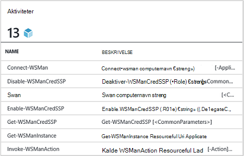
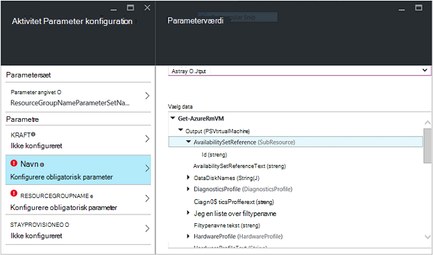
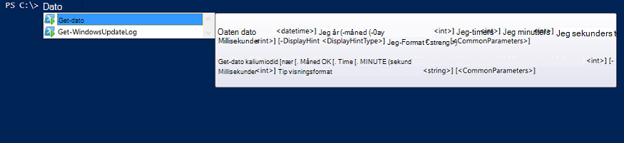

<properties
   pageTitle="Oprette et Azure automatisering Integration modul | Microsoft Azure"
   description="Selvstudium, der vejleder dig gennem oprettelse, test og eksempler på brug af integrationsmoduler i Azure Automation."
   services="automation"
   documentationCenter=""
   authors="mgoedtel"
   manager="jwhit"
   editor="" />

<tags
   ms.service="automation"
   ms.workload="tbd"
   ms.tgt_pltfrm="na"
   ms.devlang="na"
   ms.topic="get-started-article"
   ms.date="09/12/2016"
   ms.author="magoedte" />

# <a name="azure-automation-integration-modules"></a>Azure automatisering integrationsmoduler

PowerShell er den grundlæggende teknologi bag Azure automatisering. Da Azure automatisering er oprettet på PowerShell, som PowerShell moduler nøgle til udvidelse af Azure automatisering. I denne artikel fører vi dig gennem de specifikke oplysninger i Azure automatisering brug af PowerShell moduler, kaldes "integrationsmoduler", og bedste fremgangsmåder til at oprette din egen PowerShell moduler for at sikre, at de fungerer som integrationsmoduler i Azure automatisering. 

## <a name="what-is-a-powershell-module"></a>Hvad er en PowerShell-modulet?

En PowerShell-modulet er en gruppe af PowerShell-cmdlet'er som **Get-dato** eller **Kopier emne**, der kan bruges fra PowerShell console, scripts, arbejdsprocesser, runbooks og PowerShell DTK ressourcer som WindowsFeature eller fil, der kan bruges fra PowerShell DTK konfigurationer. Alle funktionerne i PowerShell er fremvises cmdletter og DTK ressourcer, og alle cmdlet/DTK ressource understøttes af en PowerShell-modulet mange af som følger med PowerShell sig selv. For eksempel Cmdletten **Get-dato** er en del af Microsoft.PowerShell.Utility PowerShell-modulet, og **Kopier emne** cmdlet er en del af Microsoft.PowerShell.Management PowerShell-modulet og pakke DTK ressourcen er en del af PSDesiredStateConfiguration PowerShell-modulet. Begge af disse moduler leveres med PowerShell. Men mange PowerShell moduler Lever ikke som en del af PowerShell, og fordeles i stedet med første eller tredjeparts produkter som System Center 2012 Configuration Manager eller ved store PowerShell community'et på steder som PowerShell galleriet.  Modulerne er nyttige, fordi de gør det nemmere gennem encapsulated funktionalitet komplekse opgaver.  Du kan få mere at vide om [PowerShell moduler på MSDN](https://msdn.microsoft.com/library/dd878324%28v=vs.85%29.aspx). 

## <a name="what-is-an-azure-automation-integration-module"></a>Hvad er et Azure automatisering Integration modul?

Et modul Integration ikke er meget forskelligt fra et PowerShell-modulet. Dens blot en PowerShell-modulet, som du kan også indeholder en yderligere fil - metadatafilen, der angiver en Azure automatisering forbindelsestype skal bruges sammen med det modul-cmdletter i runbooks. Valgfrit fil eller ej, disse PowerShell moduler kan importeres til Azure automatisering til rådighed deres cmdletter tilgængelig til brug i runbooks og deres DTK ressourcer til brug i DTK konfigurationer. I baggrunden Azure automatisering gemmer disse moduler, og på runbook job og DTK compiliation job kørselstid du indlæser dem i de Azure automatisering Sandingsanlægget hvor runbooks udføres og DTK konfigurationer er kompileret.  DTK ressourcer i moduler placeres også automatisk på automatisering DTK hente serveren, så de kan trækkes ved computere, du forsøger at anvende DTK konfigurationer.  Vi sender et antal Azure PowerShell moduler af feltet i Azure automatisering, så du kan bruge, så du kan komme i gang automatisere Azure management straks, men du kan nemt importere PowerShell moduler til andet System, tjenesten eller værktøj, du vil integrere med. 

>[AZURE.NOTE] Visse moduler leveres som "globale moduler" i Automation service. Disse globale moduler er tilgængelige for dig af feltet når du opretter en konto med automation, og vi opdatere nogle gange der automatisk flytter dem til din konto med automation. Hvis du ikke vil kunne blive opdateret automatisk, kan du altid importere det samme modul dig selv og, der tilsidesætter den globale modul version af det modul, der leveres i tjenesten. 

Det format, hvori du importerer en Integration modul pakke er en komprimeret fil med samme navn som modulet og filtypenavnet .zip. Den indeholder Windows PowerShell-modulet og eventuelle supplerende filer, herunder en manifestfil (.psd1), hvis modulet, der har en.

Hvis modulet, der skal indeholde en Azure automatisering forbindelsestype, skal det også indeholde en fil med navnet *<ModuleName>*-Automation.json, der angiver type forbindelsesegenskaberne. Dette er en json-fil, der er placeret i mappen modul i komprimeret .zip-filen, og den indeholder felterne i en "forbindelsen", der er påkrævet for at oprette forbindelse til systemet eller modulet repræsenterer-tjenesten. Dette vil ender oprettelse af en forbindelsestype i Azure automatisering. Ved hjælp af denne fil, du kan angive feltnavnene, skriver, og om felterne, der skal være krypteret og / eller valgfrit for forbindelsestype i modulet. Følgende er en skabelon i json-filformat:

```
{ 
   "ConnectionFields": [
   {
      "IsEncrypted":  false,
      "IsOptional":  false,
      "Name":  "ComputerName",
      "TypeName":  "System.String"
   },
   {
      "IsEncrypted":  false,
      "IsOptional":  true,
      "Name":  "Username",
      "TypeName":  "System.String"
   },
   {
      "IsEncrypted":  true,
      "IsOptional":  false,
      "Name":  "Password",
   "TypeName":  "System.String"
   }],
   "ConnectionTypeName":  "DataProtectionManager",
   "IntegrationModuleName":  "DataProtectionManager"
}
```

Hvis du har installeret Service Management automatisering og oprettet integrationsmoduler pakker til din automatisering runbooks, ser det meget bekendt for dig til dig. 


## <a name="authoring-best-practices"></a>Redigering af bedste fremgangsmåder

Bare fordi integrationsmoduler er grundlæggende PowerShell moduler, det betyder ikke vi ikke har en række metoder til redigering af dem. Der er stadig en række ting, anbefaler vi du overvejer samtidig redigering af en PowerShell-modulet, at sikre den bedst i Azure Automation. Nogle af disse er Azure automatisering bestemt, og nogle af dem er nyttige til gøre din moduler, fungerer godt i PowerShell arbejdsproces, uanset om du bruger automatisering. 

1. Medtage et resumé, beskrivelse og hjælp URI til hver cmdlet i modulet. Du kan angive bestemte oplysninger om cmdlet'er til at tillade, at brugeren at få hjælp til brug af dem med Cmdletten **Get-Help** i PowerShell. Her er for eksempel, hvordan du kan definere et resumé og hjælp URI til en PowerShell-modulet, der er skrevet i en .psm1 fil.<br>  

    ```
    <#
        .SYNOPSIS
         Gets all outgoing phone numbers for this Twilio account 
    #>
    function Get-TwilioPhoneNumbers {
    [CmdletBinding(DefaultParameterSetName='SpecifyConnectionFields', `
    HelpUri='http://www.twilio.com/docs/api/rest/outgoing-caller-ids')]
    param(
       [Parameter(ParameterSetName='SpecifyConnectionFields', Mandatory=$true)]
       [ValidateNotNullOrEmpty()]
       [string]
       $AccountSid,

       [Parameter(ParameterSetName='SpecifyConnectionFields', Mandatory=$true)]
       [ValidateNotNullOrEmpty()]
       [string]
       $AuthToken,

       [Parameter(ParameterSetName='UseConnectionObject', Mandatory=$true)]
       [ValidateNotNullOrEmpty()]
       [Hashtable]
       $Connection
    )

    $cred = CreateTwilioCredential -Connection $Connection -AccountSid $AccountSid -AuthToken $AuthToken

    $uri = "$TWILIO_BASE_URL/Accounts/" + $cred.UserName + "/IncomingPhoneNumbers"
    
    $response = Invoke-RestMethod -Method Get -Uri $uri -Credential $cred

    $response.TwilioResponse.IncomingPhoneNumbers.IncomingPhoneNumber
    }
    ```
<br> 
Forudsat at denne oplysninger ikke vises kun denne Hjælp med Cmdletten **Get-Help** i PowerShell-konsollen, kan det også få vist denne Hjælp-funktionalitet i Azure automatisering, for eksempel, når du indsætter aktiviteter under redigering af runbook. Klik på "Få vist detaljeret hjælp" åbnes Hjælp URI i en anden fane af den webbrowser, du bruger til at få adgang til Azure automatisering.<br>
2. Hvis modulet, der kører med et eksternt system, en. Den skal indeholde en Integration modul metadata-fil, der definerer de oplysninger, der er behov for at oprette forbindelse til den eksterne system, hvilket betyder, at forbindelsestypen. b. Hver cmdlet i modulet skal kunne tage i et connection-objekt (en forekomst af forbindelsestype) som en parameter.  
    Cmdletter i modulet bliver nemmere at bruge i Azure automatisering, hvis du tillader, at overføre et objekt med felter af forbindelsestypen som en parameter til cmdlet. Denne måden, hvorpå brugere behøver ikke at tilknytte parametre for aktivet forbindelse til cmdlet'en til tilsvarende parametre, hver gang de ringe til en-cmdlet. Baseret på runbook eksemplet ovenfor, bruges en Twilio forbindelse aktiv, kaldet CorpTwilio til at få adgang til Twilio og returnere alle telefonnumre i kontoen.  Bemærk, hvor det er tilknytte felterne for forbindelsen til parametrene for cmdlet?<br>

    ```
    workflow Get-CorpTwilioPhones
    {
      $CorpTwilio = Get-AutomationConnection -Name 'CorpTwilio'
    
      Get-TwilioPhoneNumbers 
        -AccountSid $CorpTwilio.AccountSid  
        -AuthToken $CorptTwilio.AuthToken
    }
    ```
<br>
En nemmere og bedre måde at løse dette direkte overføre objektet connection til cmdlet-

    ```
    workflow Get-CorpTwilioPhones
    {
      $CorpTwilio = Get-AutomationConnection -Name 'CorpTwilio'

      Get-TwilioPhoneNumbers -Connection $CorpTwilio
    }
    ```
<br>
Du kan aktivere funktionsmåden således for din cmdletter ved at lade dem til at acceptere et connection-objekt direkte som en parameter i stedet for lige forbindelse felter for parametre. Normalt skal du en parameter, der er defineret for hver, så en bruger, der ikke bruger Azure automatisering kan ringe til din cmdletter uden bygning af en hashtabel skal fungere som connection-objektet. Parametersæt **SpecifyConnectionFields** nedenfor bruges til at videresende forbindelsen feltegenskaber én ad gangen. **UseConnectionObject** kan du overføre forbindelsen lige gennem. Som du kan se, kan Cmdletten Send TwilioSMS i [Twilio PowerShell-modulet](https://gallery.technet.microsoft.com/scriptcenter/Twilio-PowerShell-Module-8a8bfef8) , der passerer begge måder: 

    ```
    function Send-TwilioSMS {
      [CmdletBinding(DefaultParameterSetName='SpecifyConnectionFields', `
      HelpUri='http://www.twilio.com/docs/api/rest/sending-sms')]
      param(
         [Parameter(ParameterSetName='SpecifyConnectionFields', Mandatory=$true)]
         [ValidateNotNullOrEmpty()]
         [string]
         $AccountSid,

         [Parameter(ParameterSetName='SpecifyConnectionFields', Mandatory=$true)]
         [ValidateNotNullOrEmpty()]
         [string]
         $AuthToken,

         [Parameter(ParameterSetName='UseConnectionObject', Mandatory=$true)]
         [ValidateNotNullOrEmpty()]
         [Hashtable]
         $Connection

       )
    }
    ```
<br>
3. Definere outputtype for alle-cmdletter i modulet. Definerer outputtypen til en-cmdlet kan designfasen IntelliSense til at afgøre output egenskaberne for cmdlet til brug under redigering. Det er især praktisk under automatisering runbook grafiske redigering, hvor design tidspunkt knowledge er vigtigt, at en nemt brugeroplevelsen med din modul.<br> <br> Dette er lig med "Skriv videre" funktionaliteten i en cmdlet output i PowerShell ISE uden at køre den.<br> <br>
4. Cmdletter i modulet fører ikke komplekse objekttyper for parametre. PowerShell arbejdsproces er forskellig fra PowerShell, i den valgte komplekse typer gemmes i deserialiserede formular. Enkle typer forbliver som primitiver, men komplekse typer konverteres til deres deserialiserede versioner, som er grundlæggende egenskaben forsendelser. Hvis du har brugt Cmdletten **Get-proces** i en runbook (eller en arbejdsproces for PowerShell for forbedrede), vil den returnere et objekt af typen [Deserialized.System.Diagnostic.Process], ikke den forventede [System.Diagnostic.Process] type. Denne type har alle de samme egenskaber som typen ikke deserialiseres, men ingen af disse metoder. Hvis du forsøger at overføre denne værdi som en parameter til en-cmdlet, hvor cmdlet forventer en [System.Diagnostic.Process] værdi for denne parameter, får du vist følgende fejlmeddelelse: *kan ikke behandle argument transformation på parameter 'proces'. Fejl: "kan ikke konvertere"System.Diagnostics.Process (CcmExec)"værdi af typen"Deserialized.System.Diagnostics.Process"skrive"System.Diagnostics.Process".*   Dette skyldes, at der er en uoverensstemmelse mellem den forventede [System.Diagnostic.Process] type og den givne [Deserialized.System.Diagnostic.Process] type. Finde rundt i dette problem er at sikre cmdletter i modulet ikke træder i komplekse typer for parametre. Her er den forkerte måde at gøre den.

    ```
    function Get-ProcessDescription {
      param (
            [System.Diagnostic.Process] $process
      )
      $process.Description
    }
    ``` 
<br>
Og her er den rigtige måde, tage i en primitiv, der kan bruges internt af-Cmdletten til at tage objektet komplekse og bruge den. Da cmdletter udføre i forbindelse med PowerShell, bliver ikke PowerShell arbejdsprocessen, i cmdlet $process den korrekte type [System.Diagnostic.Process].  

    ```
    function Get-ProcessDescription {
      param (
            [String] $processName
      )
      $process = Get-Process -Name $processName

      $process.Description
    }
    ```
<br>
Forbindelse aktiver i runbooks er hashtables, som er en kompleks type, og endnu disse hashtables tilsyneladende ikke kunne sendes til cmdlet'er til deres-parameter for dataforbindelsen perfekt, med ingen cast undtagelse. Teknisk set visse typer af PowerShell kan konverteres korrekt fra deres fortløbende formular til deserialiserede formularen, og derfor kan overføres til cmdletter for acceptere den deserialiserede type ikke - parametre. Hashtable er en af disse. Det er muligt for en modul forfatterens definerede typer skal implementeres på en måde, som de kan korrekt deserialisere samt, men der er nogle kompromiserne at gøre. Typen skal have en standardkonstruktør, har alle egenskaberne offentlige og har en PSTypeConverter. Dog allerede defineret typer, der modul forfatteren ikke ejer, der findes ingen måde at "Løs" dem derfor anbefaling for at undgå komplekse typer for parametre for alle sammen. Redigering af Runbook tip: Hvis for nogle årsag din cmdletter skal tage en kompleks typeparameter, eller hvis du bruger en anden persons modul, der kræver en kompleks typeparameter, er løsning i PowerShell arbejdsproces runbooks og PowerShel arbejdsprocesser i lokale PowerShell ombryde cmdlet til at generere den komplekse type og cmdlet, der forbruger den komplekse type i den samme InlineScript aktivitet. Da InlineScript udfører indholdet som PowerShell i stedet for PowerShell arbejdsproces, resulterer cmdlet generering af typen komplekse den korrekte type, ikke den deserialiserede komplekse type.
5. Gøre alle cmdletter i modulet uden tilstand. PowerShell arbejdsprocessen kører hver cmdlet titlen i arbejdsprocessen i en anden session. Det betyder, at en hvilken som helst-cmdletter, som er afhænger af sessionstilstand oprettet / ændret af andre-cmdletter i det samme modul ikke fungerer i PowerShell arbejdsproces runbooks.  Her er et eksempel på, hvad du ikke skal gøre.

    ```
    $globalNum = 0
    function Set-GlobalNum {
       param(
           [int] $num
       )
      
       $globalNum = $num
    }
    function Get-GlobalNumTimesTwo {
       $output = $globalNum * 2
     
       $output
    }
    ```
<br>
6. Modulet, der skal være fuldt indeholdt i en Xcopy kan pakke. Fordi Azure automatisering moduler distribueres til automatisering Sandingsanlægget, når runbooks skal udføre, de skal bruge til at arbejde uafhængigt af værten for de kører på. Hvad det betyder, at du skulle nu kunne Zip op modul-pakke, skal du flytte den til alle andre værter med den samme eller nyere PowerShell-version, og har den fungerer som normalt, når de importeres til pågældende host PowerShell-miljø. I rækkefølge for, at dette sker, modulet skal ikke afhænger af alle filer uden for mappen modul (den mappe, der bliver zip-op, når du importerer til Azure automatisering), eller på en hvilken som helst entydige Registreringsindstillingerne på en vært, som dem, der er angivet af installation af produktet. Hvis denne fremgangsmåde ikke følges, er modulet ikke kan bruges i Azure Automation.  

## <a name="next-steps"></a>Næste trin

- For at komme i gang med PowerShell arbejdsproces runbooks skal du se [Min første PowerShell arbejdsproces runbook](automation-first-runbook-textual.md)
- Hvis du vil vide mere om oprettelse af PowerShell moduler, skal du se [oprettelsen af en Windows PowerShell-modulet](https://msdn.microsoft.com/library/dd878310%28v=vs.85%29.aspx)