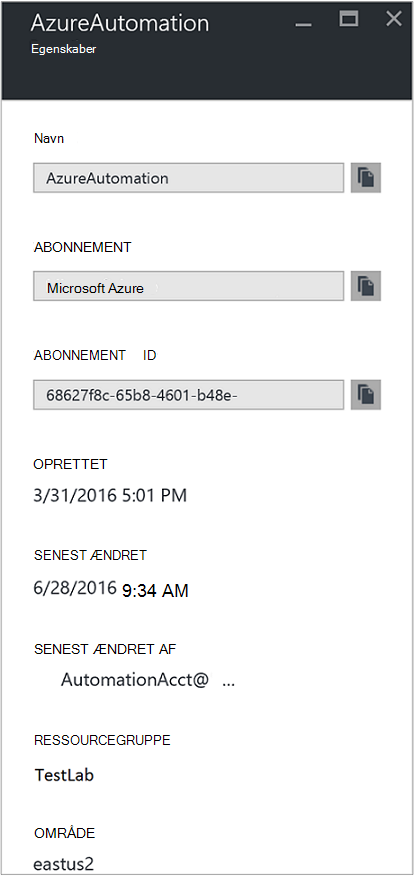
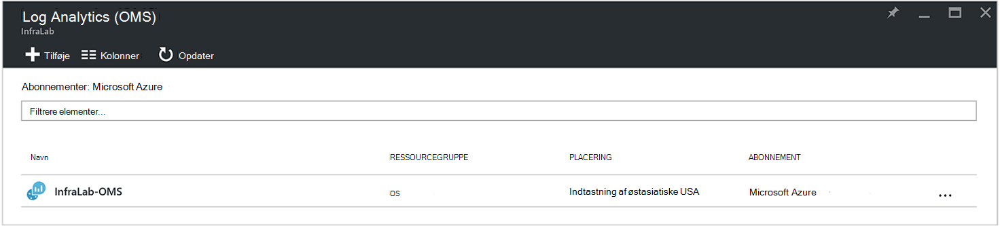
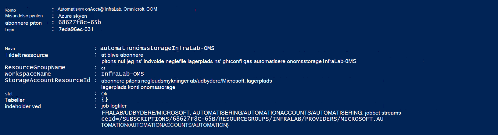
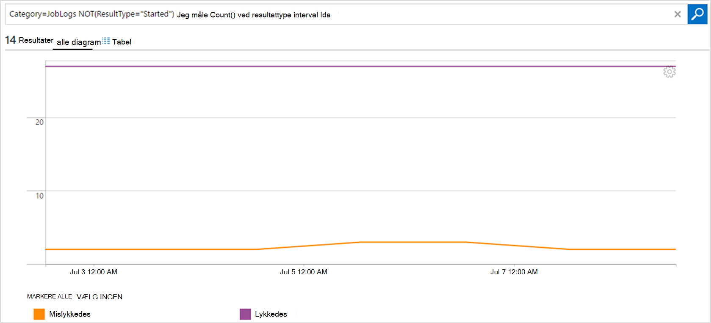

<properties
    pageTitle="Videresende jobstatus og job streams fra automatisering til Log Analytics (OMS) | Microsoft Azure"
    description="Denne artikel beskrives, hvordan du kan sende job streams jobstatus og runbook til Microsoft Operations Management pakke Log Analytics til at levere yderligere indsigt og administration."
    services="automation"
    documentationCenter=""
    authors="MGoedtel"
    manager="jwhit"
    editor="tysonn" />
<tags
    ms.service="automation"
    ms.devlang="na"
    ms.topic="article"
    ms.tgt_pltfrm="na"
    ms.workload="infrastructure-services"
    ms.date="09/22/2016"
    ms.author="magoedte" />

# Videresende jobstatus og job streams fra automatisering til Log Analytics (OMS)

Automatisering kan sende runbook job status og job streams til dit Microsoft handlinger Management pakke (OMS) Log Analytics-arbejdsområde.  Mens du kan se oplysningerne i portalen Azure eller med PowerShell ved individuelle jobstatus eller alle job for en bestemt automatisering-konto, kræver noget Avanceret for at understøtte dine krav til funktionsdygtige muligt at oprette brugerdefinerede PowerShell-scripts.  Med Log Analytics kan du nu:

- Få oplysninger om dine automatisering sager 
- Udløse en mail eller beskeden baseret på dine runbook jobstatus (fx mislykkedes eller suspenderet) 
- Skrive avancerede forespørgsler på tværs af din sag streams 
- Koordinere job på tværs af automatisering konti 
- Visualisere dine jobs over tid     

## Forudsætninger og overvejelser om installation

For at begynde at sende automatiske logfilerne til Log Analytics, skal du have følgende:

1. Et OMS-abonnement. Yderligere oplysninger finder du i [komme i gang med Log Analytics](../log-analytics/log-analytics-get-started.md).  

    >[AZURE.NOTE]OMS workspace og automatisering konto skal være i samme Azure-abonnement for at denne konfiguration fungerer korrekt. 
  
2. En [Azure-lager-konto](../storage/storage-create-storage-account.md).  
   
    >[AZURE.NOTE]Lagerplads konto *skal* være i samme område som kontoen automatisering. 
 
3. Azure PowerShell med version 1.0.8 eller nyere af cmdlet'erne funktionsdygtige indsigt. Finde oplysninger om denne version, og hvordan du installerer programmet, se, [hvordan du installerer og konfigurerer Azure PowerShell](../powershell-install-configure.md).
4. Azure Diagnostic and Log Analytics PowerShell.  Yderligere oplysninger om denne version og hvordan du installerer programmet, skal du se [Azure Diagnostic and Log Analytics](https://www.powershellgallery.com/packages/AzureDiagnosticsAndLogAnalytics/0.1).  
5. Du kan hente PowerShell-script **Aktivér AzureDiagnostics.ps1** fra [PowerShell galleriet](https://www.powershellgallery.com/packages/Enable-AzureDiagnostics/1.0/DisplayScript). Dette script kan konfigurere følgende:
 - En lagerplads konto for at holde runbook job status og stream dataene til en Automation-konto, du angiver.
 - Aktivere samlingen af disse data fra din automatisering konto for at gemme den på en Azure Blob storage konto i JSON-formatet.
 - Konfigurere indsamling af dataene fra kontoen Blob-lager til OMS Log analyser.
 - Aktivere automatiske Log Analytics løsningen arbejdsområdet OMS.   

**Aktivér AzureDiagnostics.ps1** scriptet kræver følgende parametre under kørsel af:

- *AutomationAccountName* - navnet på din konto med Automation
- *LogAnalyticsWorkspaceName* - navnet på arbejdsområdet OMS

For at finde værdierne for *AutomationAccountName*, i portalen Azure Vælg din konto med Automation bladet **automatisering konto** og vælge **alle indstillinger**.  Vælg **Egenskaber**under **Kontoindstillinger** bladet **alle indstillinger** .  Du kan se disse værdier i bladet **Egenskaber** .  .

## Konfiguration af integration med Log Analytics

1. På din computer skal du starte **Windows PowerShell** på **startskærmen i** .  
2. Gå til den mappe, som indeholder det script, du har downloadet og udføre den ved at justere værdierne for parametre fra kommandolinjen shell PowerShell *- AutomationAccountName* og *-LogAnalyticsWorkspaceName*.

    >[AZURE.NOTE] Du bliver bedt om at godkende med Azure, når du udfører scriptet.  Du **skal** logge på med en konto, der er medlem af rollen abonnement administratorer og samtidig administratoren af abonnementet.   
    
        .\Enable-AzureDiagnostics -AutomationAccountName <NameofAutomationAccount> `
        -LogAnalyticsWorkspaceName <NameofOMSWorkspace> `

3. Når du har kørt dette script skal du se poster i Log Analytics om 30 minutter, efter at der skrives nye diagnosticering data til lager.  Hvis poster ikke er tilgængelige, når denne gang refererer til afsnittet om fejlfinding i [JSON-filer i blob-lager](../log-analytics/log-analytics-azure-storage-json.md#troubleshooting-configuration-for-azure-diagnostics-written-to-blob-in-json).

### Bekræfte konfiguration

For at bekræfte scriptet konfigureret din automatisering konto og OMS wokspace korrekt, kan du udføre følgende trin i PowerShell.  Læg mærke til værdien for **navn** og **Ressourcegruppe**, før du gør dette, hvis du vil finde værdierne for dit navn på OMS arbejdsområde og ressource gruppenavn fra Azure-portalen, gå til Log Analytics (OMS) og i bladet Log Analytics (OMS).   vi bruger disse to værdier, når vi Verificer konfigurationen i arbejdsområdet OMS ved hjælp af PowerShell-cmdlet [Get-AzureRmOperationalInsightsStorageInsight](https://msdn.microsoft.com/library/mt603567.aspx).

1.  Gå til lagerplads konti, og Søg efter følgende lagerplads-konto, som bruger navnekonventionen - *AutomationAccountNameomsstorage*fra portalen Azure.  Når du har en runbook jobbet er fuldført, kort bagefter skal du se afsnittet to Blob beholdere oprettet - **indsigt-logfiler-joblogs** og **viden-logfiler-jobstreams**.  

2.  Kør følgende kode i PowerShell, ændre værdierne for parametrene, **ResourceGroupName** og **WorkspaceName** , som du har kopieret eller nævnt tidligere fra PowerShell.  

    Logon-AzureRmAccount Get-AzureRmSubscription - SubscriptionName 'SubscriptionName' | Angiv AzureRmContext Get-AzureRmOperationalInsightsStorageInsight - ResourceGroupName "OMSResourceGroupName" '-arbejdsområde "OMSWorkspaceName" 

    Dette vil returnere lagerplads indsigt for den angivne OMS arbejdsområde.  Vi vil kontrollere lagerplads indsigt til automatisering kontoen vi angivet tidligere findes, og objektet **tilstand** viser en værdi på **OK**.  .

## Log Analytics poster

Automatisering opretter to typer af poster i OMS-lager.

### Logfiler over job

Egenskaben | Beskrivelse|
----------|----------|
Tid | Dato og klokkeslæt, når runbook jobbet udført.|
resourceId | Angiver ressourcetypen i Azure.  Værdien er for automatisering, kontoen automatisering, der er knyttet til runbook.|
operationName | Angiver typen handling, der udføres i Azure.  Til automatisering bliver værdien Job.|
resultType | Status for runbook jobbet.  Mulige værdier er: -I gang -Ikke længere -Suspenderet -Mislykkedes -Lykkedes|
resultDescription | Beskriver runbook job resultatet tilstand.  Mulige værdier er: -Jobbet startes -Job mislykkedes -Job fuldført|
CorrelationId | GUID, der er korrelations-id'et for runbook jobbet.|
Kategori | Klassifikation af typen data.  Værdien er for automatisering, JobLogs.|
RunbookName | Navnet på runbook.|
Job-id | GUID, der er runbook jobbet Id.|
Opkalds |  Hvem der startede handlingen.  Mulige værdier er en mailadresse eller system til planlagte opgaver.|

### Jobbet Streams
Egenskaben | Beskrivelse|
----------|----------|
Tid | Dato og klokkeslæt, når runbook jobbet udført.|
resourceId | Angiver ressourcetypen i Azure.  Værdien er for automatisering, kontoen automatisering, der er knyttet til runbook.|
operationName | Angiver typen handling, der udføres i Azure.  Til automatisering bliver værdien Job.|
resultType | Status for runbook jobbet.  Mulige værdier er: -InProgress|
resultDescription | Omfatter output strømmen fra runbook.|
CorrelationId | GUID, der er korrelations-id'et for runbook jobbet.|
Kategori | Klassifikation af typen data.  Værdien er for automatisering, JobStreams.|
RunbookName | Navnet på runbook.|
Job-id | GUID, der er runbook jobbet Id.|
Opkalds | Hvem der startede handlingen.  Mulige værdier er en mailadresse eller system til planlagte opgaver.| 
StreamType | Typen job stream. Mulige værdier er: -Status -Output -Advarsel -Fejl -Fejlfinding -Detaljeret|

## Få vist automatisering logfiler i Log Analytics 

Nu hvor du har startet sende automatiske job logfilerne til Log Analytics, Lad os se, hvad du kan gøre med disse logfiler i OMS.   

### Sende en mail, når et runbook job mislykkes eller afbryder 

En af vores øverste kunde spørger er muligheden for at sende en mail eller en tekst, når gå noget galt med et runbook job.   

Hvis du vil oprette en besked om, starter du ved at oprette en logfil søgning efter de runbook jobposter, der skal aktivere beskeden.  Knappen **besked** vil derefter være tilgængelige, så du kan oprette og konfigurere reglen.

1.  Klik på **Log Søg**fra siden OMS Overview.
2.  Oprette en logfil søgeforespørgsel til beskeden ved at skrive i følgende i forespørgselsfeltet: `Category=JobLogs (ResultType=Failed || ResultType=Suspended)`.  Du kan også gruppere efter RunbookName ved hjælp af: `Category=JobLogs (ResultType=Failed || ResultType=Suspended) | measure Count() by RunbookName_s`.   
  
    Hvis du har konfigureret logfiler fra mere end én automatisering konto eller et andet abonnement til dit arbejdsområde, kan du måske også interesseret i at gruppere dine beskeder af abonnement eller automatisering konto.  Automatisering kontonavn kan være afledt af ressourcefeltet i feltet Søg i JobLogs.  

3.  Klik på **beskeder om** øverst på siden for at åbne skærmbilledet **Tilføj besked regel** .  Yderligere oplysninger om indstillinger for at konfigurere beskeden, skal du se [beskeder i Log analyser](../log-analytics/log-analytics-alerts.md#creating-an-alert-rule).

### Finde alle job, der har fuldført med fejl 

Ud over advarer baseret på fejl, du sandsynligvis vil gerne vide når et runbook job har haft fejlen ikke-afslutning (PowerShell giver en fejl stream, men ikke slutter fejl ikke få tingene til at suspendere eller mislykkes).    

1. Klik på **Log Søg**i portalen OMS.
2. Skriv i feltet forespørgsel `Category=JobStreams StreamType_s=Error | measure count() by JobId_g` og derefter klikke på **Søg**.

### Vis job streams for en sag  

Når du foretager fejlfinding af en sag, kan du også vil undersøge job streams.  Forespørgslen nedenfor viser alle streams for en enkelt sag med GUID 2ebd22ea-e05e-4eb9 - 9d 76-d73cbd4356e0:   

`Category=JobStreams JobId_g="2ebd22ea-e05e-4eb9-9d76-d73cbd4356e0" | sort TimeGenerated | select ResultDescription` 

### Få vist historiske jobstatus 

Til sidst skal overveje du at visualisere dine jobs over tid.  Du kan bruge denne forespørgsel til at søge efter status for dine sager over tid. 

`Category=JobLogs NOT(ResultType="started") | measure Count() by ResultType interval 1day`  
   

## Oversigt

Ved at sende automatiske job status og stream dataene til Log Analytics, kan du få bedre indsigt i status for dine automatisering sager ved at konfigurere beskeder til at give dig besked, når der er et problem og brugerdefinerede dashboards ved hjælp af avancerede forespørgsler til visualisering af runbook resultaterne, runbook jobstatus og andre relaterede vigtige KPI'er eller målepunkter.  Det gør det nemmere giver større funktionsdygtige synlighed og adresse hændelser hurtigere.  

## Næste trin

- Få mere at vide om at oprette forskellige søgeforespørgsler og gennemse loggene automatisering job med Log Analytics under [Log søgninger i Log Analytics](../log-analytics/log-analytics-log-searches.md)
- For at forstå, hvordan du opretter og hente output og fejlmeddelelser fra runbooks, se [Runbook output og meddelelser](automation-runbook-output-and-messages.md) 
- Få mere at vide om runbook udførelse af, hvordan til at overvåge runbook job og andre tekniske detaljer under [Registrer et runbook-job](automation-runbook-execution.md)
- Hvis du vil vide mere om OMS Log analyser og datakilder af websteder, se [indsamling af Azure lagerplads data i Log Analytics oversigt](../log-analytics/log-analytics-azure-storage.md)