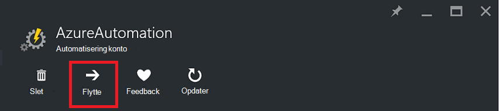
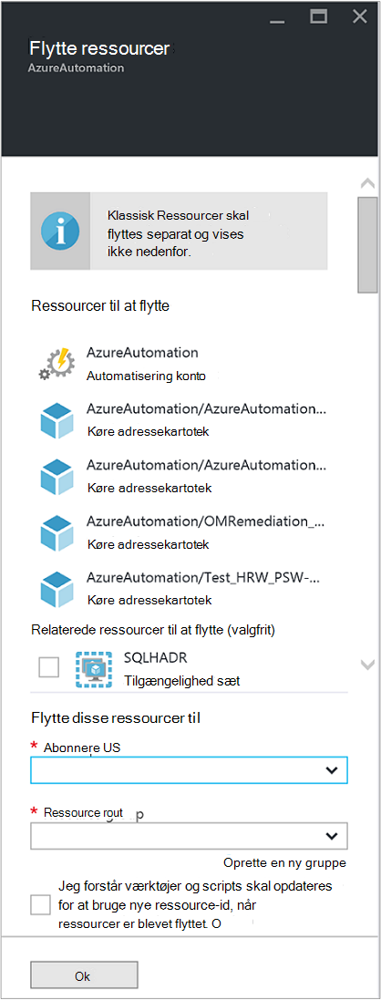

<properties
   pageTitle="Overføre automatisering konto og ressourcer | Microsoft Azure"
   description="I denne artikel beskrives, hvordan du flytter en automatisering konto i Azure automatisering og de tilknyttede ressourcer fra et abonnement til en anden."
   services="automation"
   documentationCenter=""
   authors="MGoedtel"
   manager="jwhit"
   editor="tysonn" />
<tags
   ms.service="automation"
   ms.devlang="na"
   ms.topic="article"
   ms.tgt_pltfrm="na"
   ms.workload="infrastructure-services"
   ms.date="07/07/2016"
   ms.author="magoedte" />

# <a name="migrate-automation-account-and-resources"></a>Overføre automatisering konto og ressourcer

Til automatisering konti og dens tilknyttede ressourcer (det vil sige aktiver, runbooks, moduler, osv.), som du har oprettet i portalen Azure og vil overføre fra én ressourcegruppe til en anden eller fra et abonnement til en anden, kan du udføre dette nemt med funktionen [flytte ressourcer, der er](../resource-group-move-resources.md) tilgængelige i portalen Azure. Men før du fortsætter med denne handling, skal du først Gennemse følgende [tjekliste før flytning af ressourcer](../resource-group-move-resources.md#Checklist-before-moving-resources) og desuden på listen herunder specifikt for automatisering.   

1.  Destination abonnement/ressourcegruppe skal være i samme område som kilde.  Dvs., kan automatisering konti ikke flyttes på tværs af områder.
2.  Når du flytter ressourcer (fx runbooks, job, osv.), er både kildegruppen og målgruppen låst for varigheden af handlingen. Skrive og slette handlinger er blokeret på grupperne, indtil Flyt er fuldført.  
3.  En hvilken som helst runbooks eller variabler, som henviser til en ressource eller et andet abonnement-ID fra det eksisterende abonnement skal opdateres, når overførslen er fuldført.   


>[AZURE.NOTE] Denne funktion understøtter ikke flytning klassisk automatisering ressourcer.

## <a name="to-move-the-automation-account-using-the-portal"></a>Flytte den automatiske konto ved hjælp af portalen

1. Klik på **Flyt** øverst i bladet fra kontoen automatisering.<br> <br> 
2. Bemærk, at det indeholder ressourcer, der er relateret til både kontoen automatisering og din ressource rullelisten på bladet **flytte ressourcer** .  Vælg **abonnement** og **ressourcegruppe** rullelister, eller Vælg den indstilling, **oprette en ny ressourcegruppe** , og Angiv en ny ressource gruppenavn i det viste felt.  
3. Gennemse, og Markér afkrydsningsfeltet for at bekræfte du *forstå værktøjer og scripts skal opdateres for at bruge ny ressource id'er, når ressourcer er blevet flyttet* og klik derefter på **OK**.<br> <br>   

Denne handling kan tage flere minutter at gennemføre.  I **meddelelser**, du der præsenteres med statussen for hver handling, der skal udføres - validering, migrering, og gå derefter til sidst når den er fuldført.     

## <a name="to-move-the-automation-account-using-powershell"></a>Flytte den automatiske konto ved hjælp af PowerShell

Brug cmdlet'en **Get-AzureRmResource** til at finde bestemte automatisering konto og derefter på **Flyt AzureRmResource** cmdlet til at udføre Flyt til at flytte eksisterende automatisering ressourcer til en anden ressourcegruppe eller et andet abonnement.

Det første eksempel viser, hvordan du flytter en automatisering konto til en ny ressourcegruppe.

   ```
    $resource = Get-AzureRmResource -ResourceName "TestAutomationAccount" -ResourceGroupName "ResourceGroup01"
    Move-AzureRmResource -ResourceId $resource.ResourceId -DestinationResourceGroupName "NewResourceGroup"
   ``` 

Når du udfører kodeeksemplet ovenfor, bliver du bedt om at bekræfte, at du vil udføre denne handling.  Når du klikker på **Ja** og tillade scriptet til at fortsætte, modtager du ikke alle meddelelser, mens det udfører overførslen.  

Hvis du vil flytte til et nyt abonnement, omfatte en værdi for parameteren *DestinationSubscriptionId* .

   ```
    $resource = Get-AzureRmResource -ResourceName "TestAutomationAccount" -ResourceGroupName "ResourceGroup01"
    Move-AzureRmResource -ResourceId $resource.ResourceId -DestinationResourceGroupName "NewResourceGroup" -DestinationSubscriptionId "SubscriptionId"
   ``` 

Som i det forrige eksempel, bliver du bedt om at bekræfte Flyt.  

## <a name="next-steps"></a>Næste trin

- Du kan finde flere oplysninger om at flytte ressourcer til ny ressourcegruppe eller et andet abonnement, kan du se [flytte ressourcer til ny ressourcegruppe eller et andet abonnement](../resource-group-move-resources.md)
- Du kan finde flere oplysninger om rollebaseret adgangskontrol i Azure Automation referere til [Rollebaseret adgangskontrol i Azure Automation](../automation/automation-role-based-access-control.md).
- For at få mere for at vide om PowerShell-cmdletter til administration af dit abonnement, se [Bruge Azure PowerShell med ressourcestyring](../powershell-azure-resource-manager.md)
- For at få mere for at vide om portalen funktioner for administration af dit abonnement, kan du se [ved hjælp af portalen Azure for at administrere ressourcer](../azure-portal/resource-group-portal.md). 
