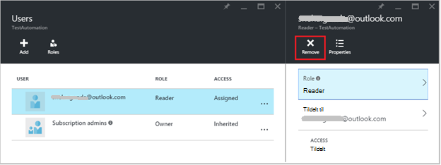
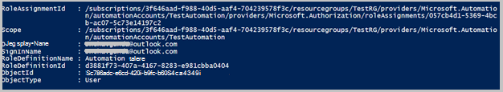

<properties 
   pageTitle="Rollebaseret adgangskontrol i Azure Automation | Microsoft Azure"
   description="Rollebaseret adgangskontrol (RBAC) gør det muligt for administration af adgang til Azure ressourcer. I denne artikel beskrives, hvordan du konfigurerer RBAC i Azure Automation."
   services="automation"
   documentationCenter=""
   authors="mgoedtel"
   manager="jwhit"
   editor="tysonn"
   keywords="automatisering rbac rollebaseret adgangskontrol, azure rbac" />
<tags 
   ms.service="automation"
   ms.devlang="na"
   ms.topic="get-started-article"
   ms.tgt_pltfrm="na"
   ms.workload="infrastructure-services"
   ms.date="09/12/2016"
   ms.author="magoedte;sngun"/>

# Rollebaseret adgangskontrol i Azure Automation

## Rollebaseret adgangskontrol

Rollebaseret adgangskontrol (RBAC) gør det muligt for administration af adgang til Azure ressourcer. Ved hjælp af [RBAC](../active-directory/role-based-access-control-configure.md), kan du udskille opgaver i dit team og give kun mængden adgang til brugere, grupper og programmer, de skal bruge til at udføre deres arbejde. Rollebaseret access kan tildeles til brugere, der bruger Azure-portalen, Azure kommandolinjen værktøjer eller Azure Management API'er.

## RBAC i automatisering konti

I Azure automatisering, der gives adgang ved at tildele den relevante RBAC rolle til brugere, grupper og programmer i området automatisering konto. Her er de indbyggede roller, der understøttes af en konto med Automation:  

|**Rolle** | **Beskrivelse** |
|:--- |:---|
| Ejer | Ejer rollen tillader adgang til alle ressourcer og handlinger i en Automation-konto, herunder give adgang til andre brugere, grupper og programmer til at administrere kontoen automatisering. |
| Bidragyder | Rollen bidragyder tillader dig at administrere alt undtagen ændring af anden brugers adgangstilladelser til en konto med Automation. |
| Reader | Rollen Læser gør det muligt at få vist alle ressourcerne i en konto med Automation, men foretage ikke eventuelle ændringer.|
| Automatisering Operator | Automatisering Operator rollen tillader dig at udføre driftsopgaver som start, stop, afbryde, genoptage og planlægge job. Denne rolle er nyttigt, hvis du vil beskytte ressourcerne automatisering konto som legitimationsoplysninger aktiver og runbooks fra blive vist eller ændret, men stadig tillade, at medlemmer af organisationen til at udføre disse runbooks. |
| Access Brugeradministrator | Rollen Brugeradministrator Access kan du administrere brugeradgang til Azure automatisering konti. |

>[AZURE.NOTE] Du kan ikke give adgangsrettigheder til en bestemt runbook eller runbooks, kun til de ressourcer og handlinger i forbindelse med Automation kunden.  

I denne artikel vil vi guider dig gennem for at konfigurere RBAC i Azure Automation. Men først, Lad os se nærmere på de enkelte tilladelser tildeles bidragyder, læser, automatisering Operator og Access Brugeradministrator, så vi få en god forståelse før give alle rettigheder til den automatiske konto.  Ellers kan det medføre utilsigtede eller uønskede konsekvenser.     

## Bidragyder rolletilladelser

Den følgende tabel viser de specifikke handlinger, der kan udføres af rollen bidragyder i automatisering.

| **Ressourcetype** | **Læs** | **Skrive** | **Slet** | **Andre handlinger** |
|:--- |:---|:--- |:---|:--- |
| Azure automatisering konto |  |  |  | | 
| Automatisering certifikat aktiv |  |  |  | |
| Automatisering forbindelse aktiv |  |  |  | | 
| Automatisering forbindelse Type aktiv |  |  |  | | 
| Automatisering legitimationsoplysninger aktiv |  |  |  | |
| Automatisering tidsplan aktiv |  |  |  | |
| Automatisering Variable aktiv |  |  |  | |
| Automatisering beskedteksten stat konfiguration | | | |  |
| Hybrid Runbook arbejder ressourcetype |  | |  | | 
| Azure automatisering Job |  |  | |  | 
| Automatisering Job værdistrøm |  | | | | 
| Automatisering Job tidsplan |  |  |  | |
| Automatisering modul |  |  |  | |
| Azure automatisering Runbook |  |  |  |  |
| Automatisering Runbook kladde |  | | |  |
| Automatisering Runbook kladde testjob |  |  | |  | 
| Automatisering Webhook |  |  |  |  |

## Læser rolletilladelser

Den følgende tabel viser de specifikke handlinger, der kan udføres af rollen Læser i Automation.

| **Ressourcetype** | **Læs** | **Skrive** | **Slet** | **Andre handlinger** |
|:--- |:---|:--- |:---|:--- |
| Klassisk abonnement administrator |  | | | 
| Administration af Lås |  | | | 
| Tilladelse |  | | |
| Udbyder handlinger |  | | | 
| Rolletildeling |  | | | 
| Rolledefinition af |  | | | 

## Automatisering Operator rolletilladelser

Den følgende tabel viser de specifikke handlinger, der kan udføres af rollen automatisering Operator i Automation.

| **Ressourcetype** | **Læs** | **Skrive** | **Slet** | **Andre handlinger** |
|:--- |:---|:--- |:---|:--- |
| Azure automatisering konto |  | | | 
| Automatisering certifikat aktiv | | | |
| Automatisering forbindelse aktiv | | | |
| Automatisering forbindelse Type aktiv | | | |
| Automatisering legitimationsoplysninger aktiv | | | |
| Automatisering tidsplan aktiv |  |  | | |
| Automatisering Variable aktiv | | | |
| Automatisering beskedteksten stat konfiguration | | | | |
| Hybrid Runbook arbejder ressourcetype | | | | | 
| Azure automatisering Job |  |  | |  | 
| Automatisering Job værdistrøm |  | | |  
| Automatisering Job tidsplan |  |  | | |
| Automatisering modul | | | |
| Azure automatisering Runbook |  | | | |
| Automatisering Runbook kladde | | | |
| Automatisering Runbook kladde testjob | | | |  
| Automatisering Webhook | | | |

Yderligere oplysninger finder viser [automatisering operator handlinger](../active-directory/role-based-access-built-in-roles.md#automation-operator) de handlinger, der understøttes af rollen automatisering operator på kontoen automatisering og dens ressourcer.

## Access Brugeradministrator rolletilladelser

Den følgende tabel viser de specifikke handlinger, der kan udføres af administratorrollen bruger Access i Automation.

| **Ressourcetype** | **Læs** | **Skrive** | **Slet** | **Andre handlinger** |
|:--- |:---|:--- |:---|:--- |
| Azure automatisering konto |  | | | |
| Automatisering certifikat aktiv |  | | | |
| Automatisering forbindelse aktiv |  | | | |
| Automatisering forbindelse Type aktiv |  | | | |
| Automatisering legitimationsoplysninger aktiv |  | | | |
| Automatisering tidsplan aktiv |  | | | |
| Automatisering Variable aktiv |  | | | |
| Automatisering beskedteksten stat konfiguration | | | | |
| Hybrid Runbook arbejder ressourcetype |  | | | | 
| Azure automatisering Job |  | | | | 
| Automatisering Job værdistrøm |  | | | | 
| Automatisering Job tidsplan |  | | | |
| Automatisering modul |  | | | |
| Azure automatisering Runbook |  | | | |
| Automatisering Runbook kladde |  | | | |
| Automatisering Runbook kladde testjob |  | | | | 
| Automatisering Webhook |  | | |

## Konfigurere RBAC til kontoen automatisering portalen til Azure

1.  Log på [Azure-portalen](https://portal.azure.com/) , og Åbn kontoen automatisering fra bladet automatisering konti.  

2.  Klik på **adgangskontrol i det øverste højre hjørne** . Dette åbner bladet **brugere** , hvor du kan tilføje nye brugere, grupper og programmer til at administrere din konto med Automation og få vist eksisterende roller, der kan konfigureres for kontoen automatisering.  

      

>[AZURE.NOTE] Der findes allerede **abonnement administratorer** som standardbruger. Abonnement administratorer active directory-gruppen omfatter service administratorer og co-administrator(s) for abonnementet Azure. Tjenesten administratoren er ejeren af abonnementet Azure og dets ressourcer, og vil have rollen ejer nedarvet for automatisering konti for. Det betyder, at adgangen **Inherited** for **administratorer af tjenester og flere administratorer** af et abonnement og det er **tildelt** til alle de andre brugere. Klik på **abonnement administratorer** for at få vist flere oplysninger om deres tilladelser.  

### Tilføje en ny bruger og tildele en rolle

1.  Klik på **Tilføj** for at åbne **Tilføj access blade** , hvor du kan tilføje en bruger, gruppe eller program, og Tildel en rolle til dem fra bladet brugere.  

      

2.  Vælg en rolle, på listen over tilgængelige roller. Vi vil vælge rollen **læser** , men du kan vælge en af de tilgængelige indbyggede roller, der understøtter en Automation-konto eller en brugerdefineret rolle, du har angivet.  

      

3.  Klik på **Tilføj brugere** til at åbne bladet **Tilføj brugere** . Hvis du har tilføjet alle brugere, grupper eller programmer til at administrere dit abonnement, og klik derefter disse brugere er angivet, og du kan vælge dem for at føje adgang. Hvis der ikke er nogen brugere, der er angivet, eller hvis brugeren, du er interesseret i at tilføje er ikke angivet klik derefter på **Inviter** for at åbne bladet **inviterer gæst** , hvor du kan invitere en bruger med en gyldig Microsoft-konto mailadresse som Outlook.com, OneDrive eller Xbox Live-id'er. Når du har angivet mailadressen på brugeren, kan du klikke på **Vælg** for at føje brugeren, og klik derefter på **OK**. 

      
 
    Du bør nu se den bruger, der er føjet til bladet **brugere** med rollen **læser** tildelt.  

      

    Du kan også tildele en rolle til brugeren fra bladet **roller** . 

1. Klik på **roller** fra bladet brugere at åbne **roller blade**. Fra denne blade, kan du se navnet på rollen, antallet af brugere og grupper, der er tildelt til denne rolle.

      
   
    >[AZURE.NOTE] Rollebaseret adgangskontrol kan kun angives på niveauet for automatisering konto og ikke på en hvilken som helst ressource under kontoen automatisering.

    Du kan tildele mere end én rolle til en bruger, gruppe eller -programmer. Eksempelvis hvis vi tilføjer rollen **Automatisering Operator** sammen med den **læser rolle** til brugeren, kan derefter de få vist alle automatisering ressourcerne, samt udføre runbook opgaver. Du kan udvide på rullelisten for at få vist en liste over roller, der er tildelt til brugeren.  

      
 
### Fjerne en bruger

Du kan fjerne adgangstilladelse for en bruger, der ikke styrer kontoen automatisering, eller der ikke længere fungerer for organisationen. Følger disse trin for at fjerne en bruger: 

1.  Vælg den rolletildeling, som du vil fjerne bladet **brugere** .

2.  Klik på knappen **Fjern** i bladet tildeling detaljer.

3.  Klik på **Ja** for at bekræfte fjernelse. 

      

## Rolle tildelte bruger

Når en bruger, der er tildelt til en rolle logger på deres automatisering-konto, de kan nu se ejerens firma, der vises på listen over **Standard kataloger**. For at få vist den automatiske konto, som de er blevet føjet til, skal de skifte standardmappen til ejerens standardmappen.  

  

### Brugeroplevelsen for automatisering operator rolle

Når en bruger, der er tildelt visningerne automatisering Operator rolle kontoen automatisering, de er tildelt til, de kan kun få vist en liste over runbooks, runbook job og tidsplaner, der er oprettet i den automatiske konto, men de kan ikke se deres definition. De kan starte, stoppe, annullere, genoptage eller planlægge runbook jobbet. Brugeren vil ikke have adgang til andre automatisering ressourcer som konfigurationer, hybrid arbejdergrupper eller DTK noder.  

  

Når brugeren klikker på runbook, er kommandoer til at få vist kilden eller redigere runbook ikke angivet som rollen automatisering operator ikke tillader adgang til dem.  

  

Brugeren har adgang til at få vist og oprette tidsplaner, men vil ikke have adgang til en anden Aktivtype.  

  

Denne bruger have ikke også adgang til at få vist den webhooks, der er knyttet til en runbook

  

## Konfigurere RBAC til kontoen automatisering ved hjælp af Azure PowerShell

Også du kan konfigurere rollebaseret adgang til en Automation-konto ved hjælp af følgende [Azure PowerShell-cmdlet'er](../active-directory/role-based-access-control-manage-access-powershell.md).

• [Get-AzureRmRoleDefinition](https://msdn.microsoft.com/library/mt603792.aspx) viser alle RBAC roller, der er tilgængelige i Azure Active Directory. Du kan bruge denne kommando sammen med egenskaben **Name** til at få vist alle de handlinger, der kan udføres af en rolle.  
    **Eksempel:**  
      

• [Get-AzureRmRoleAssignment](https://msdn.microsoft.com/library/mt619413.aspx) viser Azure AD RBAC rolletildelinger på det angivne område. Denne kommando returnerer uden parametre, rolletildelinger, der er foretaget under abonnementet. Bruge parameteren **ExpandPrincipalGroups** tildelinger af listen adgang til den angivne bruger samt de grupper, brugeren er medlem af.  
    **Eksempel:** Brug følgende kommando for at få vist alle brugerne og deres roller i en konto med automation.

    Get-AzureRMRoleAssignment -scope “/subscriptions/<SubscriptionID>/resourcegroups/<Resource Group Name>/Providers/Microsoft.Automation/automationAccounts/<Automation Account Name>” 

• [Ny AzureRmRoleAssignment](https://msdn.microsoft.com/library/mt603580.aspx) at give adgang til brugere, grupper og programmer til et bestemt område.  
    **Eksempel:** Brug følgende kommando for at tildele rollen "Automatisering operatoren" for en bruger i området automatisering konto.

    New-AzureRmRoleAssignment -SignInName <sign-in Id of a user you wish to grant access> -RoleDefinitionName "Automation operator" -Scope “/subscriptions/<SubscriptionID>/resourcegroups/<Resource Group Name>/Providers/Microsoft.Automation/automationAccounts/<Automation Account Name>”  

• Brug [Fjern AzureRmRoleAssignment](https://msdn.microsoft.com/library/mt603781.aspx) til at fjerne adgangen til en bestemt bruger, gruppe eller et program fra et særlig omfang.  
    **Eksempel:** Brug følgende kommando for at fjerne brugeren fra rollen "Automatisering operatoren" i området automatisering konto.

    Remove-AzureRmRoleAssignment -SignInName <sign-in Id of a user you wish to remove> -RoleDefinitionName "Automation Operator" -Scope “/subscriptions/<SubscriptionID>/resourcegroups/<Resource Group Name>/Providers/Microsoft.Automation/automationAccounts/<Automation Account Name>”

Erstat **logge på Id**, **abonnement Id**, **ressource gruppenavn** og **automatisering kontonavn** i ovenstående eksempler, med dine kontooplysninger. Vælg **Ja** , når du bliver bedt om at bekræfte før du fortsætter med at fjerne brugeren rolletildeling.   

## Næste trin
-  Se oplysninger om forskellige måder at konfigurere RBAC til Azure automatisering, til at [administrere RBAC med Azure PowerShell](../active-directory/role-based-access-control-manage-access-powershell.md).
- Få mere at vide om forskellige måder at starte en runbook på se [starter en runbook](automation-starting-a-runbook.md)
- For at vide om forskellige runbook, referere til [Azure automatisering runbook typer](automation-runbook-types.md)

