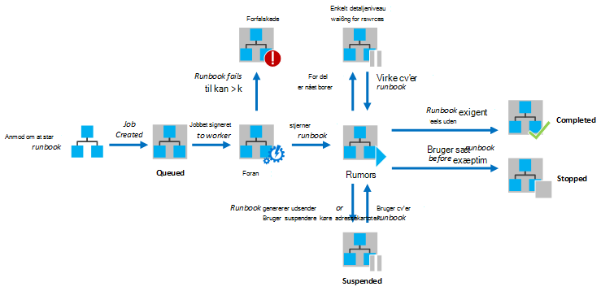

<properties
   pageTitle="Udførelse af Runbook i Azure Automation"
   description="I denne artikel beskrives oplysninger om, hvordan en runbook i Azure Automation behandles."
   services="automation"
   documentationCenter=""
   authors="mgoedtel"
   manager="stevenka"
   editor="tysonn" />
<tags
   ms.service="automation"
   ms.devlang="na"
   ms.topic="article"
   ms.tgt_pltfrm="na"
   ms.workload="infrastructure-services"
   ms.date="03/21/2016"
   ms.author="bwren" />

# Runbook udførelse af i Azure Automation

Når du starter en runbook i Azure automatisering, oprettes der et job. Et job er en enkelt udførelse af forekomst af en runbook. En Azure automatisering arbejder er tildelt hver kørslen. Mens medarbejdere, der deles af flere Azure konti, er job fra forskellige automatisering konti adskilt fra hinanden. Du har ikke kontrol over hvilke arbejder vil tjenesten anmodning om tingene.  En enkelt runbook kan have flere job kører ad gangen. Når du får vist på listen over runbooks i portalen Azure, vises den status for det sidste job, der er blevet startet for hver runbook. Du kan få vist en liste over job for hver runbook for at registrere status for hver. Du kan finde en beskrivelse af de forskellige job statusser [Job statusser](#job-statuses).

I det følgende diagram viser et runbook job livscyklus for [grafiske runbooks](automation-runbook-types.md#graphical-runbooks) og [PowerShell arbejdsproces runbooks](automation-runbook-types.md#powershell-workflow-runbooks).

I det følgende diagram viser livscyklus for et job runbook for [PowerShell runbooks](automation-runbook-types.md#powershell-runbooks).

Dine sager har adgang til dine Azure ressourcer ved at gøre en forbindelse til dit Azure-abonnement. De kan kun har adgang til ressourcer i dit datacenter, hvis disse ressourcer er tilgængelige fra offentlige skyen.

## Statusser, som job

I følgende tabel beskrives de forskellige statusser, som er muligt for en sag.

| Status| Beskrivelse|
|:---|:---|
|Fuldført|Jobbet blev fuldført.|
|Mislykkedes| For [grafiske og PowerShell arbejdsprocessen runbooks](automation-runbook-types.md)kunne runbook samle.  Runbook kunne ikke starte [PowerShell-Script runbooks](automation-runbook-types.md), eller jobbet der opstod en undtagelse. |
|Mislykkedes, venter på ressourcer|Jobbet mislykkedes, fordi den nået [sædvanlig del](#fairshare) grænsen tre gange og starter fra den samme kontrolpunkt eller fra starten af runbook, hver gang.|
|I kø|Jobbet venter ressourcer på en automatisering arbejder kommer tilgængelige, så den kan startes.|
|Starte|Jobbet har fået tildelt en arbejder, og systemet er ved at starte den.|
|Genoptage|Systemet er ved at genoptage jobbet, når den er blevet suspenderet.|
|Kører|Jobbet kører.|
|Kører, venter på ressourcer|Jobbet er blevet fjernet, fordi den har nået grænsen på [sædvanlig del](#fairshare) . Den genoptages kortvarigt fra dens sidste kontrolpunkt.|
|Ikke længere|Jobbet blev stoppet af brugeren, før den blev fuldført.|
|Stoppe|Systemet er ved at stoppe jobbet.|
|Suspenderet|Jobbet blev afbrudt af brugeren, systemet eller en kommando på runbook. Et job, der er suspenderet kan startes igen og vil genoptage fra dens sidste kontrolpunkt eller fra begyndelsen af runbook, hvis der er ingen kontrolpunkter. Runbook vil kun være suspenderet af systemet tale om en undtagelse. ErrorActionPreference er som standard angivet til **Fortsæt** betydning, jobbet vil beholde kører på en fejl. Hvis denne indstilling variabel er angivet til **Stop** derefter annullerer jobbet ved en fejl.  Gælder kun for [grafiske og PowerShell arbejdsprocessen runbooks](automation-runbook-types.md) .|
|Annullering af|Systemet forsøger at annullere jobbet på anmodning af brugeren. Runbook skal nå dens næste kontrolpunkt, før det kan være suspenderet. Hvis det allerede er overskredet dens sidste kontrolpunkt, derefter fuldfører den før kan afbrydes midlertidigt.  Gælder kun for [grafiske og PowerShell arbejdsprocessen runbooks](automation-runbook-types.md) .|

## Vise jobstatus ved hjælp af portalen Azure administration

### Automatisering Dashboard

Dashboardet automatisering viser en oversigt over runbooks for en bestemt automatisering konto. Den indeholder også en oversigt over brugen for kontoen. Oversigt over grafen viser antallet af job i alt for alle runbooks, har angivet hver status over et givet antal dage eller timer. Du kan vælge tidsinterval på det øverste højre hjørne af diagrammet. Tid aksen i diagrammet ændres afhængigt af tidsinterval, du vælger den. Du kan vælge, om du vil vise linjen for en bestemt status ved at klikke på den øverst på skærmen.

Du kan bruge følgende trin til at vise automatisering instrumentbræt.

1. Vælg **automatisering** i portalen Azure administration, og klik derefter på navnet på en konto med automation.
1. Vælg fanen **Dashboard** .

### Runbook Dashboard

Dashboardet Runbook viser en oversigt over for et enkelt runbook. Oversigt over grafen viser antallet af job i alt for runbook, har angivet hver status over et givet antal dage eller timer. Du kan vælge tidsinterval på det øverste højre hjørne af diagrammet. Tid aksen i diagrammet ændres afhængigt af tidsinterval, du vælger den. Du kan vælge, om du vil vise linjen for en bestemt status ved at klikke på den øverst på skærmen.

Du kan bruge følgende trin til at vise Runbook instrumentbræt.

1. Vælg **automatisering** i portalen Azure administration, og klik derefter på navnet på en konto med automation.
1. Klik på navnet på en runbook.
1. Vælg fanen **Dashboard** .

### Oversigt over job

Du kan få vist en liste over alle de job, der er oprettet for en bestemt runbook og deres seneste status. Du kan filtrere denne liste ved jobstatus og intervallet af datoer for den seneste ændring til jobbet. Klik på navnet på et job for at få vist detaljerede oplysninger og dens afgang. Detaljeret visning af jobbet indeholder værdierne for de runbook parametre, der blev leveret til jobbet.

Du kan bruge følgende trin til at få vist job for en runbook.

1. Vælg **automatisering** i portalen Azure administration, og klik derefter på navnet på en konto med automation.
1. Klik på navnet på en runbook.
1. Vælg fanen **job** .
1. Klik på kolonnen **Jobbet oprettet** for en sag til at få vist dets detaljer og output.

## Hente jobstatus ved hjælp af Windows PowerShell

Du kan bruge [Get-AzureAutomationJob](http://msdn.microsoft.com/library/azure/dn690263.aspx) til at hente de job, der er oprettet for en runbook og detaljerne for en bestemt sag. Hvis du starter en runbook med Windows PowerShell ved hjælp af [Start-AzureAutomationRunbook](http://msdn.microsoft.com/library/azure/dn690259.aspx), returnerer den det resulterende job. Brug [Get-AzureAutomationJob](http://msdn.microsoft.com/library/azure/dn690263.aspx)Output til at få et job output.

Kommandoerne følgende eksempel henter den sidste opgave til en stikprøve runbook og viser dens status, værdierne giver for parametrene runbook og output fra jobbet.

    $job = (Get-AzureAutomationJob –AutomationAccountName "MyAutomationAccount" –Name "Test-Runbook" | sort LastModifiedDate –desc)[0]
    $job.Status
    $job.JobParameters
    Get-AzureAutomationJobOutput –AutomationAccountName "MyAutomationAccount" -Id $job.Id –Stream Output

## Sædvanlig del

Hvis du vil dele ressourcer mellem alle runbooks i skyen, fjernes Azure automatisering midlertidigt et job efter det har kørt for 3 timer.    [Grafiske](automation-runbook-types.md#graphical-runbooks) og [PowerShell arbejdsprocessen](automation-runbook-types.md#powershell-workflow-runbooks) runbooks genoptages fra deres sidste [kontrolpunkt](http://technet.microsoft.com/library/dn469257.aspx#bk_Checkpoints). I denne periode vises jobbet statussen kører, venter på ressourcer. Hvis runbook har ingen kontrolpunkter eller jobbet har nået det første kontrolpunkt før der fjernes, genstartes den fra begyndelsen.  [PowerShell](automation-runbook-types.md#powershell-runbooks) runbooks er altid genstartet fra begyndelsen, da de ikke understøtter kontrolpunkter.

>[AZURE.NOTE] Grænsen på sædvanlig del gælder ikke for runbook job udførelse af på Hybrid Runbook medarbejdere.

Hvis runbook genstarter fra det samme kontrolpunkt eller fra begyndelsen af runbook tre gange i træk, afsluttes med statussen mislykket, venter på ressourcer. Dette er at beskytte mod runbooks, der kører på ubestemt tid uden at færdiggøre, som de ikke kan til at gøre det til det næste kontrolpunkt uden at der fjernes igen. I dette tilfælde får du følgende undtagelse med fejlen.

*Jobbet kan ikke fortsætte med at køre, fordi den gentagne gange blev udskilt fra den samme kontrolpunkt. Kontrollér, at din Runbook udfører ikke længerevarende handlinger uden vedvarer dens tilstand.*

Når du opretter en runbook, skal du sikre dig, at tid til at køre en hvilken som helst aktiviteter mellem to kontrolpunkter ikke overstiger 3 timer. Du skal muligvis føje kontrolpunkter til din runbook for at sikre, at det ikke når denne 3 timers grænse eller opdele lange kører handlinger. For eksempel kan din runbook udføre en reindex på en stor SQL-database. Hvis handlingen enkelt ikke fuldføres inden sædvanlig del, fjernes og genstartet fra begyndelsen jobbet. I dette tilfælde skal du opdele handlingen reindex i flere trin, som indeksere én tabel ad gangen, og derefter indsætte et kontrolpunkt efter hver handling, så jobbet kunne Fortsæt efter den sidste handling er fuldført.

## Næste trin

- [Starte en runbook fra Azure automatisering](automation-starting-a-runbook.md)
