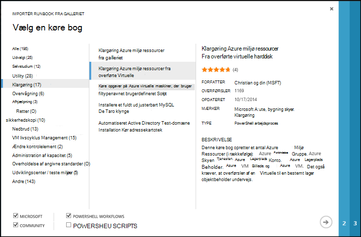

<properties
    pageTitle="Modulet og Runbook gallerier til Azure automatisering | Microsoft Azure"
    description="Runbooks og moduler fra Microsoft og gruppen er tilgængelige for dig at installere og bruge i dit miljø, Azure automatisering.  I denne artikel beskrives, hvordan du kan få adgang til disse ressourcer og til at bidrage din runbooks til galleriet."
    services="automation"
    documentationCenter=""
    authors="mgoedtel"
    manager="jwhit"
    editor="tysonn" />
<tags
    ms.service="automation"
    ms.devlang="na"
    ms.topic="article"
    ms.tgt_pltfrm="na"
    ms.workload="infrastructure-services"
    ms.date="09/18/2016"
    ms.author="magoedte;bwren" />

# Modulet og Runbook gallerier til Azure automatisering

I stedet for at oprette dine egne runbooks og moduler i Azure automatisering, kan du få adgang til en række forskellige scenarier, der allerede er blevet oprettet af Microsoft og community'et.  Du kan enten bruge disse scenarier uden ændringer, eller du kan bruge dem som et udgangspunkt og redigere dem til din specifikke krav.

Du kan få runbooks fra [Runbook galleriet](#runbooks-in-runbook-gallery) og moduler i [PowerShell galleriet](#modules-in-powerShell-gallery).  Du kan også bidrage til community'et ved at dele scenarier, som du udvikler.

## Runbooks i Runbook galleri

[Galleri med Runbook](http://gallery.technet.microsoft.com/scriptcenter/site/search?f[0].Type=RootCategory&f[0].Value=WindowsAzure&f[1].Type=SubCategory&f[1].Value=WindowsAzure_automation&f[1].Text=Automation) indeholder en række runbooks fra Microsoft og gruppen, kan du importere til Azure automatisering. Du kan hente en runbook fra galleriet, som er hostet i [TechNet Script Center](http://gallery.technet.microsoft.com/), eller du kan importere runbooks direkte fra galleriet fra Azure klassisk portal eller Azure-portalen.

Du kan kun importere direkte fra galleriet Runbook ved hjælp af Azure klassisk portal eller Azure-portalen. Du kan ikke udføre denne funktion ved hjælp af Windows PowerShell.

>[AZURE.NOTE] Du skal validere indholdet af en hvilken som helst runbooks, du modtager fra galleriet Runbook og yderste forsigtig med at installere og køre dem i et produktionsmiljø. |

### Importere en runbook fra galleriet Runbook ved hjælp af Azure klassisk portal

1. I portalen Azure, klik på, **Ny** **App Services**, **automatisering**, **Runbook**, **Fra galleriet**.
2. Vælg en kategori for at få vist relaterede runbooks, og vælg en runbook for at se detaljerne. Når du vælger runbook du vil, kan du klikke på højre pil.

    

3. Gennemse indholdet af runbook, og notér eventuelle krav i beskrivelsen. Klik på knappen højre pil, når du er færdig.
4. Angiv runbook oplysninger, og klik derefter på knappen markering. Runbook navnet skal allerede være udfyldt.
5. Runbook vises under fanen **Runbooks** for kontoen automatisering.

### Importere en runbook fra galleriet Runbook ved hjælp af Azure portal

1. Åbn din konto med Automation i Azure-portalen.
2. Klik på feltet **Runbooks** for at åbne listen med runbooks.
3. Klik på knappen **Gennemse galleriet** .

    

4. Find det gallerielement og vælge den for at få vist detaljerne.

    

4. Klik på **Vis kildeprojektet** for at få vist elementet i [TechNet Script Center](http://gallery.technet.microsoft.com/).
5. Klik på den for at få vist detaljerne og derefter klikke på knappen **Importér** for at importere et element.

    

6. Du kan også ændre navnet på runbook, og klik derefter på **OK** for at importere runbook.
5. Runbook vises under fanen **Runbooks** for kontoen automatisering.

### Tilføje en runbook til galleriet runbook

Microsoft opfordrer dig til at føje runbooks til galleriet Runbook, som du mener kan være nyttige til andre kunder.  Du kan tilføje en runbook ved at [overføre den til Script Center](http://gallery.technet.microsoft.com/site/upload) tages højde for følgende oplysninger.

- Du skal angive *Windows Azure* for den **kategori** og *automatisering* af **underkategori** for runbook skal vises i guiden.  

- Upload skal være en enkelt .ps1 eller .graphrunbook-fil.  Hvis runbook kræver en hvilken som helst moduler, underordnede runbooks eller aktiver, skal derefter du angive dem i beskrivelsen af indsendelse og i sektionen kommentarer i runbook.  Hvis du har et scenarie, der kræver flere runbooks, derefter overføre hver separat og få vist navnene på de relaterede runbooks i hver af beskrivelserne. Sørg for, at du bruger de samme mærker, så de vises i den samme kategori. En bruger nødt til at læse beskrivelsen for at vide, at andre runbooks er påkrævet dette scenario til at arbejde.

- Tilføje mærket "GraphicalPS", hvis du publicerer en **grafisk runbook** (ikke en grafisk arbejdsproces). 

- Indsætte et PowerShell eller PowerShell arbejdsproces kodestykke i beskrivelsen af ved hjælp af **Indsæt kodeafsnittet** ikon.

- Oversigt over for overførslen vises i resultatet af Runbook galleriet så du kan give detaljerede oplysninger, der er en bruger identificere funktionaliteten af runbook.

- Du skal knytte en til tre af de følgende mærker til overførslen.  Runbook vises i guiden under de kategorier, der svarer til dens mærker.  Eventuelle mærker ikke findes på listen blive, ignoreret ved hjælp af guiden. Hvis du ikke angiver en tilsvarende mærker, vises runbook under kategorien andre.

 - Sikkerhedskopi
 - Kapacitet administration
 - Ændre kontrolelement
 - Overholdelse af angivne standarder
 - Udviklingscenter / teste miljøer
 - Nedbrud
 - Overvågning
 - Rettelse
 - Klargøring
 - Afhjælpning
 - Administration af VM livscyklus

- Galleriet opdaterer én gang i timen, automatisering, så du ikke kan se dine bidrag med det samme.

## Moduler i PowerShell-galleri

PowerShell moduler indeholder-cmdletter, som du kan bruge i din runbooks, og eksisterende moduler, som du kan installere i Azure automatisering er tilgængelige i [Galleriet PowerShell](http://www.powershellgallery.com).  Du kan starte dette galleri fra Azure-portalen og installere dem direkte i Azure automatisering, eller du kan hente dem og installere dem manuelt.  Du kan ikke installere modulerne direkte fra portalen Azure klassisk, men du kan hente dem installere dem, som du ville gøre et andet modul.

### Importere et modul fra galleriet med Automation modul ved hjælp af Azure portal

1. Åbn din konto med Automation i Azure-portalen.
2. Klik på feltet **Aktiver** for at åbne listen over aktiver.
3. Klik på feltet **moduler** for at åbne listen med moduler.
4. Klik på knappen **Gennemse galleriet** og bladet Gennemse galleri er startet.

      
5. Når du har startet bladet Gennemse galleri, kan du søge efter følgende felter:

   - Modulnavn
   - Mærker
   - Forfatter
   - Cmdlet/DTK ressourcenavn

6. Find et modul, som du er interesseret i, og Markér afkrydsningsfeltet for at få vist detaljerne.  
Når du får vist i et bestemt modul, kan du se få mere at vide om modulet, inklusive et link tilbage til galleri PowerShell obligatoriske afhængigheder, og alle de cmdletter og/eller DTK ressourcer, der indeholder modulet.

      

7. Klik på knappen **Import** for at installere modulet direkte i Azure automatisering.

    

8. Når du klikker på knappen Importér, vil du se det Modulnavn, du er ved at importere. Hvis alle afhængigheder er installeret, er knappen **OK** være aktiv. Hvis du mangler afhængigheder, skal du importere dem, før du kan importere dette modul.
9. Klik på **OK** for at importere modulet, og åbne bladet modul. Når Azure automatisering importerer et modul til din konto, henter metadata om modulet og -cmdletter.

    

    Det kan tage et par minutter, da hver aktivitet skal udtrækkes.
10. Du modtager en meddelelse om, at der modulet installeres og en besked når den er fuldført.
11. Når modulet, der er importeret, vises de tilgængelige aktiviteter, og du kan bruge sine ressourcer i din runbooks og beskedteksten tilstand konfiguration.

## Anmoder om en runbook eller et modul

Du kan sende anmodninger til [Bruger tale](https://feedback.azure.com/forums/246290-azure-automation/).  Hvis du har brug for at skrive en runbook eller har et spørgsmål om PowerShell, stil et spørgsmål til vores [forum](http://social.msdn.microsoft.com/Forums/windowsazure/en-US/home?forum=azureautomation&filter=alltypes&sort=lastpostdesc).

## Næste trin

- For at komme i gang med runbooks skal du se [oprette eller importere en runbook i Azure Automation](automation-creating-importing-runbook.md)
- For at forstå forskellene mellem PowerShell og PowerShell arbejdsproces med runbooks, skal du se [Learning PowerShell arbejdsgang](automation-powershell-workflow.md)
