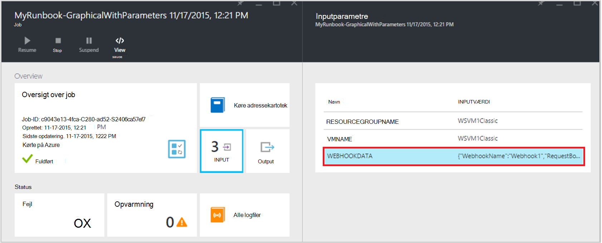

<properties
   pageTitle="Runbook inputparametre | Microsoft Azure"
   description="Runbook inputparametre øge fleksibilitet af runbooks med gør det muligt at overføre data til en runbook, når det startes. I denne artikel beskrives forskellige scenarier, hvor inputparametre bruges i runbooks."
   services="automation"
   documentationCenter=""
   authors="MGoedtel"
   manager="jwhit"
   editor="tysonn" />
<tags
   ms.service="automation"
   ms.devlang="na"
   ms.topic="article"
   ms.tgt_pltfrm="na"
   ms.workload="infrastructure-services"
   ms.date="10/11/2016"
   ms.author="sngun"/>

# <a name="runbook-input-parameters"></a>Runbook inputparametre

Runbook inputparametre øge fleksibilitet af runbooks med gør det muligt at overføre data til den, når det startes. Parametrene Tillad runbook handlinger målrettes til bestemte scenarier og miljøer. I denne artikel vil fører vi dig gennem forskellige scenarier hvor inputparametre bruges i runbooks.

## <a name="configure-input-parameters"></a>Konfigurere inputparametre

Inputparametre kan konfigureres i PowerShell, PowerShell arbejdsprocesser og grafiske runbooks. En runbook kan have flere parametre med forskellige datatyper eller ingen parametre overhovedet. Inputparametre kan være tvungne eller mulige, og du kan tildele en standardværdi for valgfrie parametre. Du kan tildele værdier til inputparametre for en runbook, når du starter programmet via et af de tilgængelige metoder. Disse metoder inkluderer Start en runbook fra portalen eller en webtjeneste. Du kan også starte et som en underordnet runbook, der kaldes i selve teksten i en anden runbook.

## <a name="configure-input-parameters-in-powershell-and-powershell-workflow-runbooks"></a>Konfigurere inputparametre i PowerShell og PowerShell arbejdsprocessen runbooks

PowerShell og [PowerShell arbejdsproces runbooks](automation-first-runbook-textual.md) i Azure Automation understøtter inputparametre, der er defineret gennem følgende attributter.  

| **Egenskaben** | **Beskrivelse** |
|:--- |:---|
| Type | Der er påkrævet. Datatypen forventet for værdien for parameteren. En hvilken som helst .NET type er gyldig. |
| Navn | Der er påkrævet. Navnet på parameteren. Dette skal være entydige i runbook, og kan indeholde kun bogstaver, tal eller understregningstegn. Det skal starte med et bogstav. |
| Obligatorisk | Valgfrit. Angiver, om der skal angives en værdi for parameteren. Hvis du angiver dette til **$true**, skal derefter en værdi angives når runbook startes. Hvis du angiver til **$false**, derefter er en værdi valgfrit. |
| Standardværdi | Valgfrit.  Angiver en værdi, der skal bruges til parameteren, hvis en værdi ikke er overføres i, når runbook startes. En standardværdi kan angives for alle parametre og gør automatisk parameteren valgfrit uanset den tvungne indstilling. |

Windows PowerShell understøtter flere egenskaber for inputparametre end dem, der er angivet her, som validering, aliasser, og parameter angiver. Azure automatisering understøtter dog i øjeblikket kun de inputparametre, er anført ovenfor.

Parameterdefinitionen af en i PowerShell arbejdsproces runbooks har følgende generelle formularen, hvor flere parametre er adskilt af kommaer.

   ```
     Param
     (
         [Parameter (Mandatory= $true/$false)]
         [Type] Name1 = <Default value>,

         [Parameter (Mandatory= $true/$false)]
         [Type] Name2 = <Default value>
     )
   ```

>[AZURE.NOTE] Når du definerer parametre, hvis du ikke angiver egenskaben **obligatorisk** , derefter betragtes som standard parameteren som valgfrit. Også, hvis du angiver en standardværdi for en parameter i PowerShell arbejdsproces runbooks, den skal behandles ved PowerShell som en valgfri parameter, uanset **obligatorisk** attributværdien.

Lad os konfigurere inputparametre for en arbejdsproces for PowerShell runbook, som producerer detaljer om virtuelle maskiner, enten en enkelt VM eller alle FOS inden for en ressourcegruppe som et eksempel. Denne runbook har to parametre, som vist på følgende skærmbillede: navnet på virtuelt og navnet på ressourcegruppen.


I denne parameter er definition, parametre **$VMName** og **$resourceGroupName** simple parametre af typen streng. PowerShell og PowerShell arbejdsprocessen runbooks understøtter dog alle typer af enkle og komplekse typer, som **objekt** eller **PSCredential** for inputparametre.

Hvis din runbook har Inputparameteren et objekt, skal du bruge en PowerShell hashtabel med (navn, værdi) par til at overføre en værdi. For eksempel, hvis du har følgende parameter i en runbook:

     [Parameter (Mandatory = $true)]
     [object] $FullName

Derefter kan du overføre følgende værdi til parameteren:

    @{"FirstName"="Joe";"MiddleName"="Bob";"LastName"="Smith"}


## <a name="configure-input-parameters-in-graphical-runbooks"></a>Konfigurere inputparametre i grafiske runbooks

Du kan [konfigurere en grafisk runbook](automation-first-runbook-graphical.md) med inputparametre, Lad os oprette en grafisk runbook, som producerer detaljer om virtuelle maskiner, enten en enkelt VM eller alle FOS inden for en ressourcegruppe. Konfigurere en runbook består af to overordnede aktiviteter, som beskrevet nedenfor.

[**Godkende Runbooks med Azure Kør som konto**](automation-sec-configure-azure-runas-account.md) for at godkende med Azure.

[**Get-AzureRmVm**](https://msdn.microsoft.com/library/mt603718.aspx) at få egenskaberne for en virtuelle computere.

Du kan bruge [**Skriv Output**](https://technet.microsoft.com/library/hh849921.aspx) aktiviteten til at få vist navnene på virtuelle maskiner. Aktivitet **Get-AzureRmVm** accepterer to parametre, **virtuelt navn** og **ressource gruppenavn**. Da disse parametre kan kræve forskellige værdier, hver gang du starter runbook, kan du føje Inputparametre til din runbook. Her er trinnene for at tilføje inputparametre:

1. Vælg grafiske runbook bladet **Runbooks** , og klik derefter på [**Rediger**](automation-graphical-authoring-intro.md) den.

2. Klik på **Input og output** for at åbne bladet **Input og output** fra editor runbook.

    

3. Bladet **Input og output** viser en liste over inputparametre, der er defineret for runbook. På denne blade, kan du tilføje en ny Inputparameteren eller redigere konfigurationen af en eksisterende inputparameteren. Hvis du vil tilføje en ny parameter for runbook, skal du klikke på **Tilføj input** for at åbne bladet **Runbook Inputparameteren** . Der, kan du konfigurere følgende parametre:

  	| **Egenskaben** | **Beskrivelse** |
  	|:--- |:---|
  	| Navn | Der er påkrævet.  Navnet på parameteren. Dette skal være entydige i runbook, og kan indeholde kun bogstaver, tal eller understregningstegn. Det skal starte med et bogstav. |
  	| Beskrivelse | Valgfrit. Beskrivelse af formålet med inputparameteren. |
  	| Type | Valgfrit. Den datatype, der forventes for værdien for parameteren. Understøttede parametre er **streng**, **Int32**, **Int64**, **Decimal**, **boolesk**, **DateTime**og **objekt**. Hvis en datatype ikke er markeret, standard **streng**. |
  	| Obligatorisk | Valgfrit. Angiver, om der skal angives en værdi for parameteren. Hvis du vælger **Ja**, skal derefter en værdi angives når runbook startes. Hvis du **ingen**vælger, derefter er en værdi ikke påkrævet når runbook er startet, og kan angives en standardværdi. |
  	| Standardværdi | Valgfrit. Angiver en værdi, der skal bruges til parameteren, hvis en værdi ikke er overføres i, når runbook startes. Kan angives en standardværdi for en parameter, der ikke er obligatorisk. Hvis du vil angive en standardværdi, du Vælg **brugerdefineret**. Denne værdi bruges, medmindre en anden værdi leveres, når runbook startes. Vælg **ingen** , hvis du ikke vil angive en standardværdi. |  

    

4. Opret to parametre med følgende egenskaber, der skal bruges ved at **Få AzureRmVm** aktiviteten:

    - **Parameter1:**
      - Name - VMName
      - Typen - streng
      - Obligatorisk - Nej

    - **Parameter2:**
      - Name - resourceGroupName
      - Typen - streng
      - Obligatorisk - Nej
      - Standardværdien - brugerdefineret
      - Brugerdefineret standardværdien - \<navnet på den ressourcegruppe, der indeholder de virtuelle maskiner >

5. Når du har tilføjet parametrene, skal du klikke på **OK**.  Du kan nu se dem i den **Input og output blade**. Klik på **OK** igen, og klik derefter på **Gem** og **Publicer** dine runbook.

## <a name="assign-values-to-input-parameters-in-runbooks"></a>Tildele værdier til inputparametre i runbooks

Du kan overføre værdier for at skrive parametre i runbooks i følgende scenarier.

### <a name="start-a-runbook-and-assign-parameters"></a>Starte en runbook og tildele parametre

En runbook kan startes på mange måder: via Azure administrationsportalen, med en webhook, med PowerShell-cmdletter, med REST-API eller med SDK. Nedenfor gennemgås forskellige metoder til at starte en runbook og tildele parametre.

#### <a name="start-a-published-runbook-by-using-the-azure-portal-and-assign-parameters"></a>Starte en publiceret runbook ved hjælp af portalen Azure og tildele parametre

Når du [starter runbook](automation-starting-a-runbook.md#starting-a-runbook-with-the-azure-portal), bladet **Starte Runbook** åbnes, og du kan konfigurere værdier for de parametre, du lige har oprettet.


Du kan se de attributter, der er angivet for parameteren i etiket under inputfeltet. Attributter omfatter tvungne eller mulige, type, og hvad standardværdien. I Hjælp-kommentarboble ud for parameternavnet på det, kan du se alle de vigtige oplysninger, du skal træffe beslutninger om input parameterværdier. Disse oplysninger omfatter om en parameter er tvungne eller mulige. Den indeholder typen og standardværdien (hvis relevant) og andre nyttige noter.


>[AZURE.NOTE] Streng typeparametre understøtter **tomme** strengværdier.  Angive **[EmptyString]** i feltet Inputparameteren overfører en tom streng til parameteren. Desuden understøtter streng typeparametre ikke **Null** -værdier der overføres. Hvis du ikke kan overføre en hvilken som helst værdi til parameteren streng, kan derefter PowerShell fortolkes som null.

#### <a name="start-a-published-runbook-by-using-powershell-cmdlets-and-assign-parameters"></a>Starte en publiceret runbook ved hjælp af PowerShell-cmdletter og tildele parametre

  - **Azure ressourcestyring cmdletter:** Du kan starte en automatisering runbook, der er oprettet i en ressourcegruppe ved hjælp af [Start-AzureRmAutomationRunbook](https://msdn.microsoft.com/library/mt603661.aspx).

    **Eksempel:**

   ```
    $params = @{“VMName”=”WSVMClassic”;”resourceGroupeName”=”WSVMClassicSG”}
 
    Start-AzureRmAutomationRunbook -AutomationAccountName “TestAutomation” -Name “Get-AzureVMGraphical” –ResourceGroupName $resourceGroupName -Parameters $params
   ```

  - **Azure Service Management-cmdletter:** Du kan starte en automatisering runbook, der er oprettet i en standard-ressourcegruppe ved hjælp af [Start-AzureAutomationRunbook](https://msdn.microsoft.com/library/dn690259.aspx).

    **Eksempel:**

   ```
    $params = @{“VMName”=”WSVMClassic”; ”ServiceName”=”WSVMClassicSG”}

    Start-AzureAutomationRunbook -AutomationAccountName “TestAutomation” -Name “Get-AzureVMGraphical” -Parameters $params
   ```

>[AZURE.NOTE] Når du starter en runbook ved hjælp af PowerShell-cmdletter, en standardparameter, oprettes **MicrosoftApplicationManagementStartedBy** med værdien **PowerShell**. Du kan se denne parameter i bladet **oplysninger om Job** .  

#### <a name="start-a-runbook-by-using-an-sdk-and-assign-parameters"></a>Starte en runbook ved hjælp af en SDK og tildele parametre

  - **Azure ressourcestyring metode:** Du kan starte en runbook ved hjælp af SDK i et programmeringssprog. Nedenfor finder du et C# kodestykke for at starte en runbook i din konto med Automation. Du kan få vist alle koden vores [GitHub lager](https://github.com/Azure/azure-sdk-for-net/blob/master/src/ResourceManagement/Automation/Automation.Tests/TestSupport/AutomationTestBase.cs).  

   ```
     public Job StartRunbook(string runbookName, IDictionary<string, string> parameters = null)
        {
          var response = AutomationClient.Jobs.Create(resourceGroupName, automationAccount, new JobCreateParameters
           {
              Properties = new JobCreateProperties
               {
                  Runbook = new RunbookAssociationProperty
                   {
                     Name = runbookName
                   },
                     Parameters = parameters
               }
           });
        return response.Job;
        }
   ```

  - **Azure Service Management metode:** Du kan starte en runbook ved hjælp af SDK i et programmeringssprog. Nedenfor finder du et C# kodestykke for at starte en runbook i din konto med Automation. Du kan få vist alle koden vores [GitHub lager](https://github.com/Azure/azure-sdk-for-net/blob/master/src/ServiceManagement/Automation/Automation.Tests/TestSupport/AutomationTestBase.cs).

   ```      
    public Job StartRunbook(string runbookName, IDictionary<string, string> parameters = null)
      {
        var response = AutomationClient.Jobs.Create(automationAccount, new JobCreateParameters
      {
        Properties = new JobCreateProperties
           {
             Runbook = new RunbookAssociationProperty
           {
             Name = runbookName
                },
                  Parameters = parameters
                }
         });
        return response.Job;
      }
   ```

  For at starte denne metode skal du oprette en ordbog for at gemme parametrene runbook, **VMName** og **resourceGroupName**og deres værdier. Start derefter runbook. Nedenfor vises kodestykke C# for opkald til den metode, der er defineret ovenfor.

   ```
    IDictionary<string, string> RunbookParameters = new Dictionary<string, string>();

    // Add parameters to the dictionary.
    RunbookParameters.Add("VMName", "WSVMClassic");
    RunbookParameters.Add("resourceGroupName", "WSSC1");

    //Call the StartRunbook method with parameters
    StartRunbook(“Get-AzureVMGraphical”, RunbookParameters);
   ```

#### <a name="start-a-runbook-by-using-the-rest-api-and-assign-parameters"></a>Starte en runbook ved hjælp af REST-API og tildele parametre

Et runbook job kan oprettes og ved hjælp af metoden **PLACERE** med følgende anmodningen URI i gang med Azure automatisering REST-API.

    https://management.core.windows.net/<subscription-id>/cloudServices/<cloud-service-name>/resources/automation/~/automationAccounts/<automation-account-name>/jobs/<job-id>?api-version=2014-12-08`

Erstat følgende parametre i anmodningen URI:

  - **abonnement-id:** Dit Azure abonnement-ID.  
  - **cloud-service-navn:** Navnet på den skybaseret tjeneste, som anmodningen skal sendes.  
  - **automatisering kontonavn:** Navnet på kontoen automatisering, der er placeret i den angivne skybaseret tjeneste.  
  - **job-id:** GUID for jobbet. GUID i PowerShell kan oprettes ved hjælp af **[GUID]::NewGuid(). ToString()** kommandoen.

Brug anmodningsteksten for at overføre parametre til runbook jobbet. Det tager de følgende to egenskaber, der er angivet i JSON-format:

  - **Runbook navn:** Der er påkrævet. Navnet på runbook for jobbet skal startes.  
  - **Runbook parametre:** Valgfrit. En ordbog på parameterlisten i (navn, værdi) Formatér, hvor navnet skal være af strengtypen og værdi kan være en hvilken som helst gyldigt JSON-værdi.

Hvis du vil starte **Get-AzureVMTextual** runbook, der tidligere blev oprettet med **VMName** og **resourceGroupName** som parametre, skal du bruge følgende JSON-formatet til anmodningsteksten.

   ```
    {
      "properties":{
        "runbook":{
        "name":"Get-AzureVMTextual"},
      "parameters":{
         "VMName":"WSVMClassic",
         "resourceGroupName":”WSCS1”}
        }
    }
   ```

En HTTP-statuskode 201 returneres, hvis jobbet er blevet oprettet. Refererer til i artiklen om, hvordan du kan finde flere oplysninger om svar sidehoveder og svar brødteksten [opretter en runbook sag ved hjælp af REST-API.](https://msdn.microsoft.com/library/azure/mt163849.aspx)

### <a name="test-a-runbook-and-assign-parameters"></a>Teste en runbook og tildele parametre

Når du [teste kladdeversion af din runbook](automation-testing-runbook.md) ved hjælp af indstillingen test, bladet **teste** åbnes, og du kan konfigurere værdier for de parametre, du lige har oprettet.


### <a name="link-a-schedule-to-a-runbook-and-assign-parameters"></a>Sammenkæde en tidsplan med et runbook og tildele parametre

Du kan [sammenkæde en tidsplan](automation-schedules.md) til din runbook, så runbook starter på et bestemt tidspunkt. Du kan tildele inputparametre, når du opretter tidsplanen, og runbook bruger disse værdier, når den er startet af tidsplanen. Du kan ikke gemme tidsplanen, før alle obligatorisk parameterværdier er angivet.


### <a name="create-a-webhook-for-a-runbook-and-assign-parameters"></a>Oprette en webhook for en runbook og tildele parametre

Du kan oprette en [webhook](automation-webhooks.md) til din runbook og konfigurere runbook inputparametre. Du kan ikke gemme webhook, før alle obligatorisk parameterværdier er angivet.


Når du udfører en runbook ved hjælp af en webhook, foruddefinerede Inputparameteren **[Webhookdata](automation-webhooks.md#details-of-a-webhook)** sendes sammen med de inputparametre, du har defineret. Du kan klikke på for at udvide parameteren **WebhookData** kan finde flere oplysninger.




## <a name="next-steps"></a>Næste trin

- Du kan finde flere oplysninger om runbook input og output, under [Azure automatisering: runbook input, output og indlejrede runbooks](https://azure.microsoft.com/blog/azure-automation-runbook-input-output-and-nested-runbooks/).
- Få mere at vide om forskellige måder at starte en runbook se [starter en runbook](automation-starting-a-runbook.md).
- For at redigere en tekstdata runbook skal referere til [redigering tekstdata runbooks](automation-edit-textual-runbook.md).
- For at redigere en grafisk runbook skal referere til [grafiske redigering i Azure automatisering](automation-graphical-authoring-intro.md).
