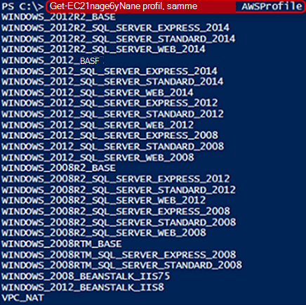

<properties
   pageTitle="Automatisere installation af en VM i Amazon webtjenester | Microsoft Azure"
   description="Denne artikel beskrives, hvordan du kan bruge Azure automatisering til at automatisere oprettelse af en Amazon Web Service VM"
   services="automation"
   documentationCenter=""
   authors="mgoedtel"
   manager="jwhit"
   editor="" />
<tags
   ms.service="automation"
   ms.devlang="na"
   ms.topic="article"
   ms.tgt_pltfrm="na"
   ms.workload="na"
   ms.date="08/17/2016"
   ms.author="tiandert; bwren" />

# <a name="azure-automation-scenario---provision-an-aws-virtual-machine"></a>Azure automatisering scenarie - klargøring en AWS virtuelt 

I denne artikel viser vi, hvordan du kan udnytte Azure automatisering klargøre en virtuel maskine i abonnementet Amazon Web Service (AWS), og giv VM et bestemt navn – der AWS refererer til som "mærkning" VM.

## <a name="prerequisites"></a>Forudsætninger

I forbindelse med denne artikel skal du have en Azure automatisering konto og et AWS-abonnement. Gennemse [Konfigurere godkendelse med Amazon webtjenester](../automation/automation-sec-configure-aws-account.md)kan finde flere oplysninger om at oprette en Azure automatisering konto og konfigurere det med din AWS abonnement legitimationsoplysninger.  Denne konto skal oprettes eller opdateres med legitimationsoplysningerne AWS abonnement før du fortsætter, som vi skal referere til denne konto i nedenstående fremgangsmåde.


## <a name="deploy-amazon-web-services-powershell-module"></a>Installere Amazon Web Services PowerShell-modulet

Vores VM klargøring af runbook udnytter AWS PowerShell-modulet for at gøre arbejdet. Udfør følgende trin for at føje modulet til kontoen automatisering, der er konfigureret med legitimationsoplysningerne AWS abonnement.  

1. Åbne din webbrowser og gå til [PowerShell galleriet](http://www.powershellgallery.com/packages/AWSPowerShell/) , og klik på **Implementer til Azure automatisering knap**.<br> 

2. Du føres til logonsiden Azure og efter godkendelse, du skal distribueres til portalen Azure og præsenteres med bladet følgende.<br> 

3. Vælg den ressourcegruppe fra rullelisten **Ressourcegruppe** og bladet parametre skal du angive følgende oplysninger:
   * Vælg **eksisterende**rullelisten **ny eller eksisterende automatisering konto (streng)** .  
   * Skriv det nøjagtige navn på kontoen automatisering, der indeholder legitimationsoplysningerne for abonnementet AWS i boksen **Kontonavn automatisering (streng)** .  Er for eksempel, hvis du har oprettet en dedikeret konto med navnet **AWSAutomation**, derefter, hvad du skriver i feltet.
   * Vælg det relevante område fra rullelisten **Automatisering konto placering** .

4. Klik på **Opret**, når du er færdig med at angive de nødvendige oplysninger.

    >[AZURE.NOTE]Mens importerer en PowerShell-modulet til Azure automatisering, det også hente cmdlet'erne og disse aktiviteter vises ikke, før modulet, der er helt færdig, importere og hente cmdlet'erne. Denne proces kan tage et par minutter.  
<br>
5. Åbn kontoen automatisering, der refereres til i trin 3 i Azure-portalen.
6. Klik på feltet **Aktiver** og af bladet **Aktiver** skal du vælge feltet **moduler** .
7. På bladet **moduler** vises modulet **AWSPowerShell** på listen.

## <a name="create-aws-deploy-vm-runbook"></a>Oprette AWS installere VM runbook

Når AWS PowerShell-modulet er blevet installeret, kan vi nu opretter en runbook for at automatisere klargøring af en virtuel maskine i AWS ved hjælp af en PowerShell-script. Nedenstående trin gennemgås, hvordan du kan udnytte oprindelige PowerShell-script i Azure Automation.  

>[AZURE.NOTE] Besøg [PowerShell galleriet](https://www.powershellgallery.com/packages/New-AwsVM/DisplayScript)til yderligere indstillinger og oplysninger om dette script.


1. Hente PowerShell-script ny AwsVM fra galleriet PowerShell ved åbning af en session med PowerShell og skrive følgende:<br>
   ```
   Save-Script -Name New-AwsVM -Path \<path\>
   ```
<br>
2. Åbn kontoen automatisering fra Azure-portalen, og klik på feltet **Runbooks** .  
3. Vælg **Tilføj en runbook**bladet **Runbooks** .
4. Vælg bladet **Tilføj en runbook** **Hurtig oprettelse** (oprette en ny runbook).
5. På bladet **Runbook** egenskaber, Skriv et navn i feltet navn for din runbook og fra **Runbook type** rullelisten Vælg **PowerShell**, og klik derefter på **Opret**.<br> 
6. Når bladet redigere PowerShell Runbook vises, skal du kopiere og indsætte PowerShell-script i runbook redigering lærred.<br> <br>

    >[AZURE.NOTE] Bemærk følgende, når du arbejder med eksempel PowerShell-script:
    >
    > - Runbook indeholder et antal Standardparameterværdier. Evaluere alle standardværdier, og Opdater om nødvendigt.
    > - Hvis du har gemt din AWS legitimationsoplysninger som en legitimationsoplysninger aktiv med navnet anderledes end **AWScred**, skal du opdatere scriptet på linjen 57 til at matche i overensstemmelse hermed.  
    > - Når du arbejder med AWS CLI-kommandoer i PowerShell, især med dette eksempel runbook, skal du angive AWS området. Ellers mislykkes cmdlet'erne.  Få vist AWS emne [Angive AWS område](http://docs.aws.amazon.com/powershell/latest/userguide/pstools-installing-specifying-region.html) i AWS værktøjer til PowerShell dokument for at få yderligere oplysninger.  
<br>
7. Hvis du vil hente en liste over billednavne fra abonnementet AWS, Start PowerShell ISE og importere AWS PowerShell-modulet.  Godkendelse mod AWS ved at erstatte **Get-AutomationPSCredential** i dit miljø, ISE med **AWScred = Get-legitimationsoplysninger**.  Dette vil bede dig om dine legitimationsoplysninger og kan du angive dit **Access nøgle-ID** for det brugernavn og **Hemmeligt hurtigtast** til adgangskoden.  Se eksemplet nedenfor:

        #Sample to get the AWS VM available images
        #Please provide the path where you have downloaded the AWS PowerShell module
        Import-Module AWSPowerShell
        $AwsRegion = "us-west-2"
        $AwsCred = Get-Credential
        $AwsAccessKeyId = $AwsCred.UserName
        $AwsSecretKey = $AwsCred.GetNetworkCredential().Password

        # Set up the environment to access AWS
        Set-AwsCredentials -AccessKey $AwsAccessKeyId -SecretKey $AwsSecretKey -StoreAs AWSProfile
        Set-DefaultAWSRegion -Region $AwsRegion

        Get-EC2ImageByName -ProfileName AWSProfile
   I følgende eksempel returneres:<br>
     
8. Kopiere og indsætte et billede af navnene i en automatisering variabel som der refereres til i runbook som **$InstanceType**. Da vi er i dette eksempel ved hjælp af den gratis AWS lagdelt abonnement, vi bruger **t2.micro** for eksemplet runbook.
9. Gemme runbook, og klik derefter på **Publicer** for at publicere runbook, og skriv derefter **Ja** når du bliver bedt om.


### <a name="testing-the-aws-vm-runbook"></a>Test AWS VM runbook
Før vi fortsætter med test af runbook, har vi brug at bekræfte et par ting. Mere specifikt:

   -  Et aktiv til godkendelse af mod AWS er blevet oprettet kaldet **AWScred** eller scriptet er blevet opdateret for at referere til navnet på dine legitimationsoplysninger aktiv.  
   -  AWS PowerShell-modulet er blevet importeret i Azure Automation
   -  En ny runbook er blevet oprettet og parameterværdier er blevet godkendt og opdateret om nødvendigt
   -  **Detaljeret logposter** og eventuelt **fremdrift logposter** under angivelse af **logføring og sporing af** runbook er indstillet til **til**.<br> 

1. Vi vil starte runbook, så klik på **Start** , og klik derefter på **OK** , når bladet starte Runbook åbnes.
2. Angiv en **VMname**på bladet starte Runbook.  Acceptere standardværdierne for de andre parametre, du tidligere forudkonfigureret i scriptet.  Klik på **OK** for at starte runbook jobbet.<br> 
3. En rude med tingene er åbnet for runbook jobbet, vi lige har oprettet. Luk denne rude.
4. Vi kan få vist status på sag, og få vist output- **Streams** ved at markere feltet **Alle logfiler** fra bladet runbook job.<br> 
5. Log på AWS Management Console, hvis du ikke aktuelt er logget på for at bekræfte VM er ved at blive klargjort.<br> 

## <a name="next-steps"></a>Næste trin
-   For at komme i gang med grafiske runbooks skal du se [Min første grafiske runbook](automation-first-runbook-graphical.md)
-   For at komme i gang med PowerShell arbejdsproces runbooks skal du se [Min første PowerShell arbejdsproces runbook](automation-first-runbook-textual.md)
-   Hvis du vil vide mere om runbook typer, deres fordele og begrænsninger, skal du se [Azure automatisering runbook typer](automation-runbook-types.md)
-   Yderligere oplysninger om PowerShell-script understøttelse funktion skal du se [oprindelige PowerShell-script, der understøtter i Azure Automation](https://azure.microsoft.com/blog/announcing-powershell-script-support-azure-automation-2/)
