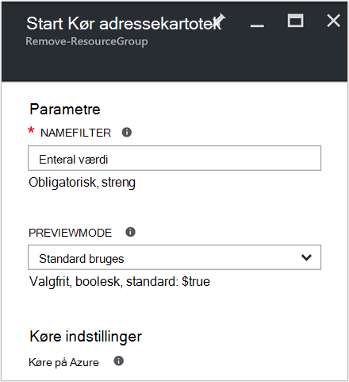
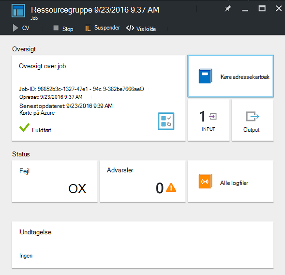
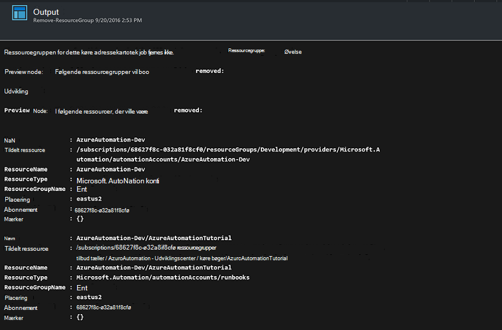

<properties
    pageTitle="Automatisere fjernelse af ressourcegrupper | Microsoft Azure"
    description="PowerShell arbejdsproces version af en Azure automatisering scenarie, herunder runbooks for at fjerne alle ressourcegrupper i dit abonnement."
    services="automation"
    documentationCenter=""
    authors="MGoedtel"
    manager="jwhit"
    editor=""
    />
<tags
    ms.service="automation"
    ms.workload="tbd"
    ms.tgt_pltfrm="na"
    ms.devlang="na"
    ms.topic="get-started-article"
    ms.date="09/26/2016"
    ms.author="magoedte"/>

# Azure scenarie med Automation - automatisere fjernelse af grupper

Mange kunder oprette mere end én ressourcegruppe. Nogle måske er vant til at administrere fremstilling programmer, og andre kan bruges som udvikling, test og arrangere miljøer. Automatiseret implementering af disse ressourcer er en ting, men der kan afvikle en ressourcegruppe med et klik på knappen er en anden. Du kan strømline denne almindelige management opgave ved hjælp af Azure automatisering. Dette er nyttigt, hvis du arbejder med et Azure abonnement, som har en udgifter begrænsning gennem et medlem tilbud som MSDN eller Microsoft Partner Network Cloud Essentials-programmet.

Dette scenario er baseret på en PowerShell-runbook og er udviklet til at fjerne en eller flere ressourcegrupper,, som du angiver fra dit abonnement. Standardindstillingen af runbook er at teste, før du fortsætter. Dette sikrer, at du ved et uheld ikke slette ressourcegruppen, før du er klar til at udføre denne procedure.   

## Få dette scenario

Dette scenarie består af en PowerShell-runbook, som kan hentes fra [PowerShell galleriet](https://www.powershellgallery.com/packages/Remove-ResourceGroup/1.0/DisplayScript). Du kan også importere den direkte fra [Runbook galleriet](automation-runbook-gallery.md) i portalen Azure.  

Runbook | Beskrivelse|
----------|------------|
Fjern ResourceGroup | Fjerner en eller flere Azure grupper og de tilknyttede ressourcer fra abonnementet.  
 
De følgende inputparametre er defineret for denne runbook:

Parameter | Beskrivelse|
----------|------------|
NameFilter (påkrævet) | Angiver et navn filter for at begrænse ressourcegrupperne, som du har til hensigt om sletning af. Du kan overføre flere værdier ved hjælp af en kommasepareret liste. Filteret er ikke store og små bogstaver og matcher en hvilken som helst ressourcegruppe, der indeholder strengen.|
PreviewMode (valgfrit) | Udfører runbook for at se, hvilke ressourcegrupper vil blive slettet, men ingen handlinger. Standard er **Sand** for at undgå utilsigtede sletning af en eller flere grupper overføres til runbook.  

## Installere og konfigurere dette scenario

### Forudsætninger

Denne runbook godkender ved hjælp af [Azure Kør som konto](automation-sec-configure-azure-runas-account.md).    

### Installere og publicere runbooks

Når du har hentet runbook, kan du importere den ved hjælp af fremgangsmåden i [importere runbook procedurer](automation-creating-importing-runbook.md#importing-a-runbook-from-a-file-into-Azure-Automation). Publicere runbook, når den er blevet importeret i din konto med Automation.

## Brug af runbook

Følgende trin fører dig gennem udførelse af denne runbook og Hjælp du blive fortrolig med hvordan det fungerer. Du vil kun teste runbook i dette eksempel ikke egentlig at slette ressourcegruppen.  

1. Åbn din konto med Automation fra Azure-portalen, og klik på **Runbooks**.
2. Vælg **Fjern ResourceGroup** runbook, og klik på **Start**.
3. Når du starter runbook, bladet **Starte Runbook** åbnes, og du kan konfigurere parametrene. Skriv navnene på ressourcegrupper i dit abonnement, du kan bruge til at teste og medfører ikke noget, hvis slettes ved et uheld.  

    >[AZURE.NOTE] Sørg for, at **Previewmode** er indstillet til **Sand** for at undgå at slette de valgte ressourcegrupper.  **Bemærk** , at denne runbook ikke fjerne ressourcegruppen, der indeholder kontoen automatisering, der kører denne runbook.  

4. Når du har konfigureret alle parameteren værdier, klik på **OK**, og runbook sættes i kø til udførelse af.  

Vælg **job** i runbook for at få vist oplysninger om kørslen **Fjern ResourceGroup** runbook i portalen Azure. Jobbet oversigt viser de inputparametre og output strømmen ud over generelle oplysninger om jobbet og eventuelle undtagelser, der er opstået.  .

**Oversigt over Job** omfatter meddelelser fra output, advarsler og fejl streams. Vælg **Output** til at få vist detaljerede resultater fra runbook udførelsen.  

## Næste trin

- For at få en introduktion til din egen runbook, skal du se [oprette eller importere en runbook i Azure Automation](automation-creating-importing-runbook.md).
- For at komme i gang med PowerShell arbejdsproces runbooks skal du se [Min første PowerShell arbejdsproces runbook](automation-first-runbook-textual.md).
