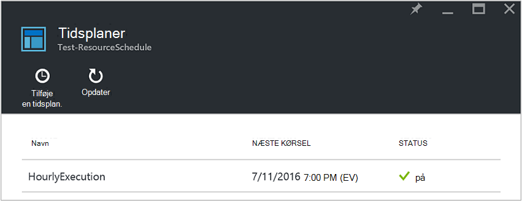
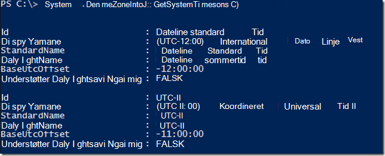
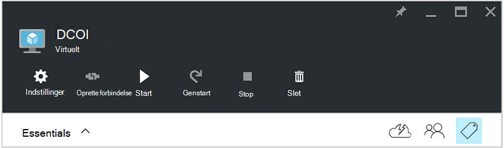
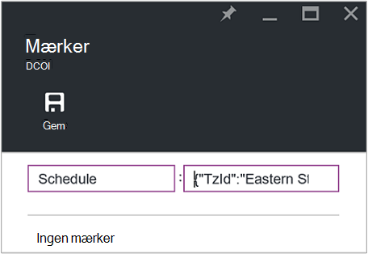
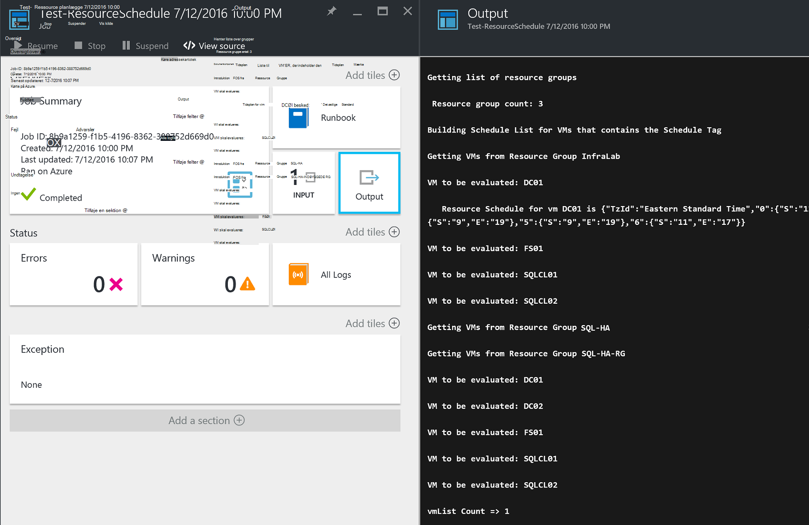

<properties
   pageTitle="Bruge JSON-formateret mærker til at oprette en tidsplan til Azure VM start og lukning | Microsoft Azure"
   description="Denne artikel beskrives, hvordan du kan bruge JSON strenge efter mærker til at automatisere planlægningen af VM start og lukning."
   services="automation"
   documentationCenter=""
   authors="MGoedtel"
   manager="jwhit"
   editor="tysonn" />
<tags
   ms.service="automation"
   ms.devlang="na"
   ms.topic="article"
   ms.tgt_pltfrm="na"
   ms.workload="infrastructure-services"
   ms.date="07/18/2016"
   ms.author="magoedte;paulomarquesc" />

# Azure automatisering scenarie: bruge JSON-formateret mærker til at oprette en tidsplan til Azure VM start og lukning

Kunder vil ofte planlægge start og lukning af virtuelle maskiner til at reducere abonnement omkostninger eller support business og tekniske krav.  

I følgende scenario gør det muligt at konfigurere automatisk start og lukning af din FOS ved hjælp af en såkaldt tidsplan på en ressource grupperingsniveau eller et virtuelt niveau i Azure. Denne plan kan konfigureres fra søndag til lørdag med en start dato og tidspunkt for lukning.  

Vi har nogle indstillinger for ud for feltet. Dette omfatter:
-  [Virtuelt skala angiver](../virtual-machine-scale-sets/virtual-machine-scale-sets-overview.md) med Autoskalering indstillinger, der gør det muligt at skalere ind eller ud.
- [DevTest øvelser](../devtest-lab/devtest-lab-overview.md) tjeneste, som har den indbyggede funktion ved at planlægge start og lukning handlinger.

Disse indstillinger understøtter dog kun bestemte scenarier og kan ikke anvendes til infrastruktur som-en-tjenesten (IaaS) FOS.   

Når mærket tidsplan anvendes til en ressourcegruppe, anvendes det også på alle virtuelle maskiner i denne ressourcegruppe. Hvis en tidsplan anvendes også direkte til en VM, har sidste tidsplanen højere prioritet i følgende rækkefølge:

1.  Tidsplan, der er anvendt på en ressourcegruppe
2.  Tidsplan, der er anvendt på en ressourcegruppe og virtuel maskine i ressourcegruppen
3.  Tidsplan, der er anvendt på en virtuel maskine

Dette scenarie grundlæggende tager en JSON streng med et bestemt format og tilføjer den som værdien for en såkaldt tidsplan. Skriv derefter en runbook viser en liste over alle grupper og virtuelle computere og identificerer tidsplanerne for hver VM, der er baseret på de scenarier, der er angivet tidligere. Derefter løkker gennem VM'er, der har vedhæftet tidsplaner og evaluerer hvilke indsats. For eksempel bestemmer den, hvilke FOS skal stoppes, lukke eller ignoreres.

Disse runbooks godkende ved hjælp af [Azure Kør som konto](../automation/automation-sec-configure-azure-runas-account.md).

## Hente runbooks til dette scenario

Dette scenarie består af fire PowerShell arbejdsproces runbooks, som kan hentes fra [TechNet galleriet](https://gallery.technet.microsoft.com/Azure-Automation-Runbooks-84f0efc7) eller [GitHub](https://github.com/paulomarquesdacosta/azure-automation-scheduled-shutdown-and-startup) lager for dette projekt.

Runbook | Beskrivelse
----------|----------
Test-ResourceSchedule | Kontrollerer hvert virtuelt tidsplan og udfører lukning eller Start afhængigt af tidsplanen.
Tilføje ResourceSchedule | Føjer mærket tidsplan til en gruppe af VM eller ressource.
Opdater ResourceSchedule | Ændrer det eksisterende tidsplan mærke ved at erstatte den med en ny.
Fjern ResourceSchedule | Fjerner mærket tidsplan fra en gruppe af VM eller ressource.

## Installere og konfigurere dette scenario

### Installere og publicere runbooks

Når du henter runbooks, kan du importere dem ved hjælp af fremgangsmåden i [oprette eller importere en runbook i Azure Automation](automation-creating-importing-runbook.md#importing-a-runbook-from-a-file-into-Azure-Automation).  Publicere hver runbook, når den er blevet importeret i din konto med Automation.

### Føje en plan til Test-ResourceSchedule runbook

Følg disse trin for at aktivere tidsplanen for Test-ResourceSchedule runbook. Dette er runbook, der bekræfter hvilke virtuelle maskiner skal i gang, lukke eller forbliver som de er.

1. Åbn kontoen automatisering fra portalen Azure, og klik derefter på feltet **Runbooks** .
2. Klik på feltet **tidsplaner** på bladet **Test-ResourceSchedule** .
3. Klik på **Tilføj en tidsplan**på bladet **tidsplaner** .
4. Vælge **Sammenkæd en tidsplan til din runbook**på bladet **tidsplaner** . Vælg derefter **Opret en ny tidsplan**.
5.  På bladet **ny tidsplan** , Skriv navnet på denne tidsplanen, for eksempel: *HourlyExecution*.
6. Angive starttidspunktet for planen, der **starter**, til en time stigende.
7. Vælg **Gentagelse**, og vælg derefter for at **blive gentaget hvert interval**, **1 time**.
8. Kontroller, at **angive udløb** er indstillet til **Nej**, og klik derefter på **Opret** for at gemme din nye kalender.
9. Vælg **parametre og køre indstillinger**på bladet **Tidsplan Runbook** indstillinger. Angiv navnet på dit abonnement i feltet **SubscriptionName** i bladet Test ResourceSchedule **parametre** .  Dette er den eneste parameter, der kræves til runbook.  Klik på **OK**, når du er færdig.  

Runbook tidsplanen skal ligne følgende, når den er fuldført:

 

## Formatere JSON-streng

Denne løsning som tager en JSON streng med et bestemt format og tilføjer den som værdien for et mærke en såkaldt tidsplan. Skriv derefter en runbook viser en liste over alle grupper og virtuelle maskiner og identificerer tidsplaner for hver virtuelt.

Runbook løkker over de virtuelle maskiner, der har vedhæftet tidsplaner og kontrollerer, hvilke handlinger skal udføres. Følgende er et eksempel på, hvordan løsningerne, der skal formateres:

    {
       "TzId": "Eastern Standard Time",
        "0": {  
           "S": "11",
           "E": "17"
        },
        "1": {
           "S": "9",
           "E": "19"
        },
        "2": {
           "S": "9",
           "E": "19"
        },
    }

Her er nogle detaljerede oplysninger om denne struktur:

1. Formatet for denne JSON struktur er optimeret til at omgå begrænsningen med 256 tegn for et mærke fra en værdi i Azure.

2. *TZID-værdi* repræsenterer en tidszone for den virtuelle maskine. Denne ID'ET kan hentes ved hjælp af klassen oplysninger om tidszone .NET i en PowerShell-session –**[System.TimeZoneInfo]:: GetSystemTimeZones()**.

    

    - Ugedage vises med en numerisk værdi på nul til seks. Værdien nul er lig med søndag.
    - Starttidspunktet er repræsenteret med attributten **S** , og dens værdi er i et 24-timers format.
    - End eller lukning klokkeslættet repræsenteres indeholder attributten, **E** , og dens værdi er i et 24-timers format.

    Hvis **S** **E** attributterne og hver har en værdi på nul (0), vil den virtuelle maskine blive i dens nuværende tilstand på tidspunktet for evalueringen.   

3. Hvis du vil springe over evaluering for en bestemt dag i ugen, ikke tilføje en sektion for den pågældende dag i ugen. Kun mandag evalueres, og de andre dage i ugen, ignoreres i eksemplet nedenfor:

        {
          "TzId": "Eastern Standard Time",
           "1": {
             "S": "11",
             "E": "17"
           }
        }

## Mærke ressourcegrupper eller FOS

For at lukke FOS, skal du mærke FOS eller ressourcegrupperne, hvor de er placeret. Virtuelle maskiner, der ikke har mærket tidsplan evalueres ikke. Derfor ikke de startet eller lukket.

Der er to måder at mærke ressourcegrupper eller FOS med denne løsning. Du kan gøre det direkte fra portalen. Eller du kan bruge Tilføj ResourceSchedule, Opdater ResourceSchedule og fjern ResourceSchedule runbooks.

### Mærke via portalen

Følg disse trin for at mærke en virtuel computer eller ressourcegruppe på portalen:

1. Udjævne strengen JSON, og Bekræft, at der ikke er mellemrum.  JSON strengen ser sådan ud:

        {"TzId":"Eastern Standard Time","0":{"S":"11","E":"17"},"1":{"S":"9","E":"19"},"2": {"S":"9","E":"19"},"3":{"S":"9","E":"19"},"4":{"S":"9","E":"19"},"5":{"S":"9","E":"19"},"6":{"S":"11","E":"17"}}

2. Vælg ikonet **mærke** for en VM eller ressource gruppe for at anvende denne tidsplanen.

    
3. Mærker er defineret efter et tasten/værdi-par. Skriv **tidsplan** i feltet **nøgle** , og derefter indsætte JSON strengen i feltet **værdi** . Klik på **Gem**. Din nye mærke vises nu på listen over mærker for dine ressource.

### Mærke fra PowerShell

Alle importerede runbooks indeholder oplysninger om hjælp i starten af det script, der beskriver, hvordan du udfører runbooks direkte fra PowerShell. Du kan ringe Tilføj ScheduleResource og Opdater ScheduleResource runbooks fra PowerShell. Du kan gøre dette ved at overføre nødvendige parametre, der gør det muligt at oprette eller opdatere mærket tidsplan for en VM eller ressource gruppe uden for portalen.  

Hvis du vil oprette, tilføje og slette mærker via PowerShell, skal du først [konfigurere dit PowerShell-miljø til Azure](../powershell-install-configure.md). Når du har afsluttet konfigurationen, kan du fortsætte med følgende trin.

### Oprette en tidsplan mærke med PowerShell

1. Åbne en PowerShell-session. Derefter bruges i følgende eksempel til at godkende med din konto, der kører som og angive et abonnement:   

        Conn = Get-AutomationConnection -Name AzureRunAsConnection
        Add-AzureRMAccount -ServicePrincipal -Tenant $Conn.TenantID `
        -ApplicationId $Conn.ApplicationID -CertificateThumbprint $Conn.CertificateThumbprint
        Select-AzureRmSubscription -SubscriptionName "MySubscription"

2. Definere en tidsplan hashtabel. Her er et eksempel på, hvordan den skal være opbygget:

        $schedule= @{ "TzId"="Eastern Standard Time"; "0"= @{"S"="11";"E"="17"};"1"= @{"S"="9";"E"="19"};"2"= @{"S"="9";"E"="19"};"3"= @{"S"="9";"E"="19"};"4"= @{"S"="9";"E"="19"};"5"= @{"S"="9";"E"="19"};"6"= @{"S"="11";"E"="17"}}

3. Definer de parametre, der kræves af runbook. I eksemplet nedenfor har vi målretter en VM:

        $params = @{"SubscriptionName"="MySubscription";"ResourceGroupName"="ResourceGroup01"; `
        "VmName"="VM01";"Schedule"=$schedule}

    Hvis du mærkning en ressourcegruppe, du fjern parameteren *VMName* fra Hashtabellen $params på følgende måde:

        $params = @{"SubscriptionName"="MySubscription";"ResourceGroupName"="ResourceGroup01"; `
        "Schedule"=$schedule}

4. Du kan køre Tilføj ResourceSchedule runbook med følgende parametre til at oprette mærket tidsplan:

        Start-AzureRmAutomationRunbook -Name "Add-ResourceSchedule" -Parameters $params `
        -AutomationAccountName "AutomationAccount" -ResourceGroupName "ResourceGroup01"

5. For at opdatere en ressourcegruppe eller virtuelt mærke, skal du udføre **Opdatering ResourceSchedule** runbook med følgende parametre:

        Start-AzureRmAutomationRunbook -Name "Update-ResourceSchedule" -Parameters $params `
        -AutomationAccountName "AutomationAccount" -ResourceGroupName "ResourceGroup01"

### Fjerne mærket tidsplan med PowerShell

1. Åbne en PowerShell-session og køre følgende for at godkende med din konto, der kører som og for at vælge og angive et abonnement:

        Conn = Get-AutomationConnection -Name AzureRunAsConnection
        Add-AzureRMAccount -ServicePrincipal -Tenant $Conn.TenantID `
        -ApplicationId $Conn.ApplicationID -CertificateThumbprint $Conn.CertificateThumbprint
        Select-AzureRmSubscription -SubscriptionName "MySubscription"

2. Definer de parametre, der kræves af runbook. I eksemplet nedenfor har vi målretter en VM:

        $params = @{"SubscriptionName"="MySubscription";"ResourceGroupName"="ResourceGroup01" `
        ;"VmName"="VM01"}

    Hvis du fjerner et mærke fra en ressourcegruppe, du fjern parameteren *VMName* fra Hashtabellen $params på følgende måde:

        $params = @{"SubscriptionName"="MySubscription";"ResourceGroupName"="ResourceGroup01"}

3. Udføre Fjern ResourceSchedule runbook for at fjerne mærket tidsplan:

        Start-AzureRmAutomationRunbook -Name "Remove-ResourceSchedule" -Parameters $params `
        -AutomationAccountName "AutomationAccount" -ResourceGroupName "ResourceGroup01"

4. For at opdatere en ressourcegruppe eller virtuelt mærke, skal du udføre Fjern ResourceSchedule runbook med følgende parametre:

        Start-AzureRmAutomationRunbook -Name "Remove-ResourceSchedule" -Parameters $params `
        -AutomationAccountName "AutomationAccount" -ResourceGroupName "ResourceGroup01"

>[AZURE.NOTE] Vi anbefaler, at du proaktiv overvåge disse runbooks (og virtuelt tilstande) for at bekræfte, at din virtuelle maskiner er blive lukket ned og gang i overensstemmelse hermed.  

Vælg feltet **job** af runbook for at få vist oplysninger om Test-ResourceSchedule runbook jobbet i portalen Azure. Jobbet oversigt viser de inputparametre og output strømmen, ud over generelle oplysninger om jobbet og eventuelle undtagelser, hvis de er indtruffet.  

**Oversigt over Job** omfatter meddelelser fra output, advarsler og fejl streams. Vælg feltet **Output** til at få vist detaljerede resultater fra runbook udførelsen.

  

## Næste trin

-  For at komme i gang med PowerShell arbejdsproces runbooks skal du se [Min første PowerShell arbejdsproces runbook](automation-first-runbook-textual.md).
-  Hvis du vil vide mere om typer af runbook og deres fordele og begrænsninger, kan du se [Azure automatisering runbook typer](automation-runbook-types.md).
-  Du kan finde flere oplysninger om PowerShell-script understøtter funktioner, skal du se [oprindelige PowerShell-script, der understøtter i Azure Automation](https://azure.microsoft.com/blog/announcing-powershell-script-support-azure-automation-2/).
-  Hvis du vil vide mere om logføring af runbook og output skal du se [Runbook output og meddelelser i Azure automatisering](automation-runbook-output-and-messages.md).
-  Hvis du vil vide mere om Azure Kør som en konto, og hvordan godkende din runbooks ved hjælp af det, skal du se [Godkend runbooks med Azure Kør som konto](../automation/automation-sec-configure-azure-runas-account.md).
