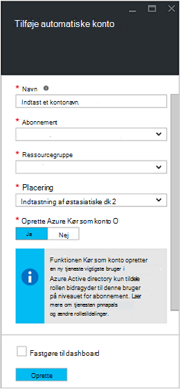
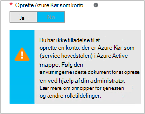

<properties
   pageTitle="Konfigurere Azure AD brugerkonto | Microsoft Azure"
   description="I denne artikel beskrives, hvordan du kan konfigurere Azure AD-bruger konto legitimationsoplysningerne for runbooks i Azure automatisering til godkendelse mod ARM og ASM."
   services="automation"
   documentationCenter=""
   authors="MGoedtel"
   manager="jwhit"
   editor="tysonn"
   keywords="Azure active directory bruger, azure service management, azure ad-brugerkonto" />
<tags
   ms.service="automation"
   ms.devlang="na"
   ms.topic="get-started-article"
   ms.tgt_pltfrm="na"
   ms.workload="infrastructure-services"
   ms.date="09/12/2016"
   ms.author="magoedte" />

# Godkende Runbooks med Azure Service Management og ressourcestyring

I denne artikel beskrives de trin, du skal udføre for at konfigurere en Azure AD-brugerkonto til Azure automatisering runbooks kører mod Azure Service Management (ASM) eller Azure ressource Manager (ARM) ressourcer.  Mens dette fortsætter med at være en understøttede godkendelsestyper identitet til din ARM baseret runbooks, er den anbefalede metode med den nye Azure Kør som konto.       

## Oprette en ny bruger af Azure Active Directory

1. Log på portalen Azure klassisk som tjenesteadministrator af en til Azure abonnement, du vil administrere.
2. Vælg **Active Directory**, og vælg derefter navnet på din organisation-mappe.
3. Vælg fanen **brugere** , og vælg derefter **Tilføj bruger**i området kommandoen.
4. På siden **fortælle os om denne bruger** under **Type af bruger**skal du vælge **ny bruger i organisationen**.
5. Angive et brugernavn.  
6. Vælg navnet på den mappe, der er knyttet til abonnementet Azure Active Directory-siden.
7. Indeholder en første og sidste navn, et brugervenligt navn og bruger fra listen **roller** på siden **brugerprofil** .  Kan ikke **aktivere Multi-Factor Authentication**.
8. Bemærk brugerens fulde navn og en midlertidig adgangskode.
9. Vælg **Indstillinger > administratorer > Tilføj**.
10. Skriv det fulde brugernavn på den bruger, du har oprettet.
11. Markere det abonnement, du ønsker, at brugeren til at administrere.
12. Log af Azure og derefter logge på igen med den konto, du lige har oprettet. Du bliver bedt om at ændre brugerens adgangskode.

## Oprette en konto med Automation i Azure klassisk Portal
I dette afsnit, skal du udføre følgende trin for at oprette en ny konto Azure automatisering i portalen Azure, der skal bruges sammen med din runbooks, administration af ressourcer i ASM og ARM tilstand.  

>[AZURE.NOTE] Automatisering konti, der er oprettet ved hjælp af Azure klassisk Portal kan administreres af både Azure-klassisk og Azure Portal og et sæt af cmdletter. Når kontoen er oprettet, kan det betyder ikke noget, hvordan du opretter og administrere ressourcer inden for kontoen. Hvis du planlægger at fortsætte med at bruge portalen Azure klassisk, skal du bruge den i stedet for på Azure-portalen til at oprette en hvilken som helst automatisering konti.

1. Log på portalen Azure klassisk som tjenesteadministrator af en til Azure abonnement, du vil administrere.
2. Vælg **automatisering**.
3. Vælg **Opret en konto med Automation**på siden **automatisering** .
4. Skriv et navn til den nye konto med Automation i feltet **Opret en konto med Automation** , og vælg et **område** på rullelisten.  
5. Klik på **OK** for at acceptere indstillingerne og oprette kontoen.
6. Når den er oprettet vises det på siden **automatisering** .
7. Klik på kontoen, og kommer du til siden Dashboard.  
8. Vælg **Aktiver**på siden automatisering Dashboard.
9. Vælg **Tilføj indstillinger** nederst på siden, på siden **Aktiver** .
10. Vælg **Tilføj legitimationsoplysninger**på siden **Tilføj indstillinger** .
11. Vælg **Windows PowerShell legitimationsoplysninger** fra rullelisten **Type legitimationsoplysninger** på siden **Definere legitimationsoplysninger** , og Angiv et navn for legitimationsoplysninger.
12. Følgende **Definere legitimationsoplysninger** siden type i feltet username AD brugerkontoen oprettet tidligere i feltet **Brugernavn** og adgangskode i felterne **adgangskode** og **Bekræft adgangskode** . Klik på **OK** for at gemme ændringerne.

## Oprette en konto med Automation i portalen Azure

I dette afsnit, skal du udføre følgende trin for at oprette en ny konto Azure automatisering i portalen Azure, der skal bruges sammen med dine runbooks administration af ressourcer i ARM tilstand.  

1. Log på portalen Azure som tjenesteadministrator af en til Azure abonnement, du vil administrere.
2. Vælg **automatisering konti**.
3. Klik på **Tilføj**i bladet automatisering konti. 
2. I bladet **Tilføj automatisering konto** i **navnet** skrive et navn til din nye konto med Automation.
5. Hvis du har mere end ét abonnement, skal du angive en for den nye konto, samt en ny eller eksisterende **ressourcegruppe** og en Azure datacenter **placering**.
3. Vælg værdien **Nej** til indstillingen **Opret Azure køre som konto** , og klik på knappen **Opret** .  

    >[AZURE.NOTE] Hvis du vælger ikke at oprette kontoen Kør som ved at vælge indstillingen **ingen**, vises der en advarselsmeddelelse i bladet **Tilføj automatisering konto** .  Når kontoen er oprettet og tildelt rollen **bidragyder** i abonnementet, vil det ikke har en tilsvarende Godkendelsesidentitet i adresselisten abonnementer og derfor ikke få adgang til ressourcer i dit abonnement.  Dette forhindrer en hvilken som helst runbooks refererer til denne konto fra at kunne godkendes og udføre opgaver mod ARM ressourcer.

    

4. Mens Azure opretter kontoen automatisering, kan du spore status under **beskeder** i menuen.

Når oprettelse af legitimationsoplysninger, der er fuldført, skal du derefter til at oprette en legitimationsoplysninger aktiv for at knytte kontoen automatisering til AD brugerkontoen oprettet tidligere.  Husk, vi oprettede kun kontoen automatisering og den er ikke forbundet med en Godkendelsesidentitet.  Udføre trinnene beskrevet i de [legitimationsoplysninger aktiver i Azure automatisering artikel](../automation/automation-credentials.md#creating-a-new-credential) , og angiv værdien for **brugernavn** i formatet **domæne\brugernavn**.

## Brug legitimationsoplysninger i en runbook

Du kan hente legitimationsoplysninger i en runbook ved hjælp af [Get-AutomationPSCredential](http://msdn.microsoft.com/library/dn940015.aspx) aktivitet og derefter bruge det sammen med [Tilføj AzureAccount](http://msdn.microsoft.com/library/azure/dn722528.aspx) til at oprette forbindelse til dit Azure-abonnement. Hvis legitimationsoplysninger, der er en administrator af flere Azure abonnementer, skal du også bruge [Vælg AzureSubscription](http://msdn.microsoft.com/library/dn495203.aspx) til at angive den korrekte en. Dette er vist i eksemplet Windows PowerShell nedenfor, der typisk vises øverst i de fleste Azure automatisering runbooks.

    $cred = Get-AutomationPSCredential –Name "myuseraccount.onmicrosoft.com"
    Add-AzureAccount –Credential $cred
    Select-AzureSubscription –SubscriptionName "My Subscription"

Du skal gentage disse linjer efter en hvilken som helst [kontrolpunkter](http://technet.microsoft.com/library/dn469257.aspx#bk_Checkpoints) i din runbook. Hvis runbook afbrydes midlertidigt, og derefter genoptages på en anden arbejder, skal den til at udføre godkendelse igen.

## Næste trin
* Gennemgå de forskellige runbook typer og trin til at oprette dine egne runbooks fra følgende artikel [Azure automatisering runbook typer](../automation/automation-runbook-types.md)
