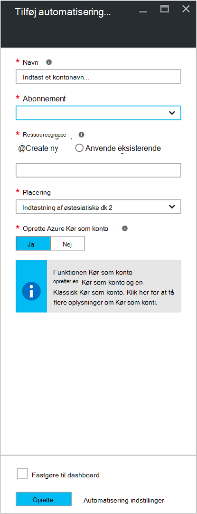

<properties
    pageTitle="Konfigurere Azure Kør som konto | Microsoft Azure"
    description="Selvstudium, der vejleder dig gennem oprettelse, test og eksempler på brugen af sikkerhed vigtigste godkendelse i Azure Automation."
    services="automation"
    documentationCenter=""
    authors="mgoedtel"
    manager="jwhit"
    editor=""
    keywords="tjenestens hovednavn, setspn, azure-godkendelse"/>
<tags
    ms.service="automation"
    ms.workload="tbd"
    ms.tgt_pltfrm="na"
    ms.devlang="na"
    ms.topic="get-started-article"
    ms.date="08/17/2016"
    ms.author="magoedte"/>

# Godkende Runbooks med Azure Kør som konto

Dette emne viser dig, hvordan du konfigurerer en automatisering konto fra Azure-portalen ved hjælp af funktionen Kør som konto til at godkende runbooks administrere ressourcer i Azure ressourcestyring eller Azure Service Management.

Når du opretter en ny konto med Automation i portalen Azure, oprettes automatisk:

- Køre som konto, som opretter en ny tjeneste hovedstolen i Azure Active Directory, et certifikat og tildeler den bidragyder rollebaseret adgangskontrol (RBAC), der skal bruges til at administrere ressourcestyring ressourcer ved hjælp af runbooks.   
- Klassisk Kør som konto ved at uploade et certifikat, administration, som bruges til at administrere Azure Service Management eller klassisk ressourcer ved hjælp af runbooks.  

Dette gør lettere for dig og hjælper med at du hurtigt starte opbygning og implementering af runbooks for at understøtte dine behov for automatisering.      

Med en Kør som og klassisk Kør som konto, kan du:

- Angiv en standardiseret metode til at godkende med Azure, når du administrerer Azure ressourcestyring eller Azure Service Management ressourcer fra runbooks i portalen Azure.  
- Automatisere brugen af globale runbooks, der er konfigureret i Azure beskeder.

>[AZURE.NOTE] Azure [funktionen beskeder om integration](../monitoring-and-diagnostics/insights-receive-alert-notifications.md) med Automation globale Runbooks kræver en automatisering, der er konfigureret med en Kør som og klassisk Kør som kontoen. Du kan vælge en Automation-konto, der allerede har en Kør som og klassisk Kør som konto, der er defineret eller Vælg for at oprette en ny.

Vi viser dig, hvordan du opretter kontoen automatisering fra Azure-portalen, opdatere en automatisering konto ved hjælp af PowerShell og viser, hvordan du kan godkende i din runbooks.

Før vi gør dette, er der et par ting, du skal forstå og overveje, før du fortsætter.

1. Dette påvirker ikke eksisterende automatisering konti, der allerede er oprettet i klassiske eller Ressourcestyring implementeringsmodel.  
2. Dette fungerer kun for automatisering konti, der er oprettet ved hjælp af portalen Azure.  Forsøg på at oprette en konto fra portalen klassisk replikeres ikke Kontokonfiguration Kør som.
3. Hvis du aktuelt har runbooks og aktiver (det vil sige tidsplaner, variabler, osv.), der tidligere har oprettet for at administrere klassisk ressourcer, og du vil disse runbooks for at godkende med den nye klassisk Kør som konto, skal du overføre dem til den nye konto med Automation eller opdatere din eksisterende konto ved hjælp af PowerShell-script nedenfor.  
4. Hvis du vil godkende ved hjælp af den nye Kør som konto og klassisk køre som automatisering konto, skal du ændre din eksisterende runbooks med nedenstående eksempelkode.  **Skal du bemærke** , at kontoen Kør som er til godkendelse mod ressourcestyring ressourcer ved hjælp af den vigtigste certifikat-baseret tjeneste, og kontoen klassisk Kør som er til godkendelse af mod Service Management ressourcer med certifikatet for administration.     

## Oprette en ny konto med Automation fra Azure-portalen

I dette afsnit, skal du udføre følgende trin for at oprette en ny konto Azure automatisering fra Azure-portalen.  Dette opretter både Kør som og klassisk Kør som konto.  

>[AZURE.NOTE] Brugeren udføre disse trin *skal* være medlem af rollen abonnement administratorer og samtidig administratoren på det abonnement, som giver adgang til abonnementet til brugeren.  Brugeren skal også tilføjes som en bruger som standard abonnementer Active Directory. Kontoen behøver ikke at være tildelt en privilegerede rolle.

1. Log på portalen Azure med en konto, der er medlem af rollen abonnement administratorer og samtidig administratoren af abonnementet.
2. Vælg **automatisering konti**.
3. Klik på **Tilføj**i bladet automatisering konti. 

    >[AZURE.NOTE]Hvis du får vist følgende advarsel i bladet **Tilføj automatisering konto** , er dette, fordi din konto ikke er medlem af rollen abonnement administratorer og co-administrator af abonnementet. 

4. I bladet **Tilføj automatisering konto** i **navnet** skrive et navn til din nye konto med Automation.
5. Hvis du har mere end ét abonnement, kan du angive et til den nye konto, såvel som en ny eller eksisterende **ressourcegruppe** og en Azure datacenter **placering**.
6. Kontroller værdien **Ja** er valgt for indstillingen **Opret Azure køre som konto** , og klik på knappen **Opret** .  

    >[AZURE.NOTE] Hvis du vælger ikke at oprette kontoen Kør som ved at vælge indstillingen **ingen**, vises der en advarselsmeddelelse i bladet **Tilføj automatisering konto** .  Mens kontoen, der er oprettet i portalen Azure, vil det ikke har en tilsvarende Godkendelsesidentitet i din klassisk eller Ressourcestyring abonnement-katalogtjenesten og derfor ikke adgang til ressourcer i dit abonnement.  Dette forhindrer en hvilken som helst runbooks refererer til denne konto fra at kunne godkendes og udføre opgaver mod ressourcer i disse installation-modeller.

    > 
Når tjenesten hovedstolen ikke oprettes tildeles rollen bidragyder ikke.

7. Mens Azure opretter kontoen automatisering, kan du spore status under **beskeder** i menuen.

### Ressourcer, der er inkluderet

Når kontoen automatisering er blevet oprettet, oprettes automatisk flere ressourcer for dig.  Den følgende tabel opsummerer ressourcer til at køre som kontoen. 

Ressource|Beskrivelse
--------|-----------
AzureAutomationTutorial Runbook|Et eksempel PowerShell runbook, der viser, hvordan til at godkende ved hjælp af kontoen Kør som og får alle ressourcestyring ressourcerne.
AzureAutomationTutorialScript Runbook|Et eksempel PowerShell runbook, der viser, hvordan til at godkende ved hjælp af kontoen Kør som og får alle ressourcestyring ressourcerne.
AzureRunAsCertificate|Certifikat aktiv oprettes under oprettelse af automatisering en konto automatisk eller ved hjælp af PowerShell-script under til en eksisterende konto.  Det gør det muligt at godkende med Azure, så du kan administrere Azure ressourcestyring ressourcer fra runbooks.  Dette certifikat har en etårige levetid.
AzureRunAsConnection|Forbindelse aktiv oprettes under oprettelse af automatisering en konto automatisk eller ved hjælp af PowerShell-script under til en eksisterende konto.

Den følgende tabel opsummerer ressourcer for kontoen klassisk Kør som. 

Ressource|Beskrivelse
--------|-----------
AzureClassicAutomationTutorial Runbook|Et eksempel runbook som får alle klassisk FOS i et abonnement, ved hjælp af klassisk køre som kontoen (certifikat) og derefter skriver VM navnet og status.
AzureClassicAutomationTutorial Script Runbook|Et eksempel runbook som får alle klassisk FOS i et abonnement, ved hjælp af klassisk køre som kontoen (certifikat) og derefter skriver VM navnet og status.
AzureClassicRunAsCertificate|Certifikat aktiv oprettes automatisk, der bruges til at godkende med Azure, så du kan administrere Azure klassisk ressourcer fra runbooks.  Dette certifikat har en etårige levetid.
AzureClassicRunAsConnection|Forbindelse aktiv oprettes automatisk, der bruges til at godkende med Azure, så du kan administrere Azure klassisk ressourcer fra runbooks.  

## Kontrollere Kør som godkendelse

Næste udfører vi en lille test for at bekræfte, at du kan få er blevet godkendt ved hjælp af den nye Kør som konto.     

1. Åbn den automatiske konto har oprettet tidligere i Azure-portalen.  
2. Klik på feltet **Runbooks** for at åbne listen med runbooks.
3. Vælg **AzureAutomationTutorialScript** runbook, og klik derefter på **Start** for at starte runbook.  Du modtager en meddelelse om ved at bekræfte, du vil starte runbook.
4. Der oprettes et [runbook job](automation-runbook-execution.md) jobbet blade vises, og jobstatus vises i feltet **Job oversigt** .  
5. Jobstatus starter som *i kø* , der angiver, at der venter på en runbook arbejder i skyen, bliver tilgængelig. Den flyttes derefter til *Start* , når en arbejder udgiver den sag og derefter *køre* , når runbook begynder faktisk at køre.  
6. Når runbook jobbet er fuldført, skal vi se statussen **fuldført**.   
7. Hvis du vil se de detaljerede resultater af runbook, klik på feltet **Output** .
8. I bladet **Output** skal du se den er korrekt godkendte og en liste over alle de ressourcer, der er tilgængelige i ressourcegruppen.
9. Luk bladet **Output** at vende tilbage til bladet **Job oversigt** .
13. Lukke **Sag oversigt** og tilsvarende **AzureAutomationTutorialScript** runbook blade.

## Kontrollere klassisk Kør som godkendelse

Næste udfører vi en lille test for at bekræfte, at du kan få er blevet godkendt ved hjælp af den nye klassisk Kør som konto.     

1. Åbn den automatiske konto har oprettet tidligere i Azure-portalen.  
2. Klik på feltet **Runbooks** for at åbne listen med runbooks.
3. Vælg **AzureClassicAutomationTutorialScript** runbook, og klik derefter på **Start** for at starte runbook.  Du modtager en meddelelse om ved at bekræfte, du vil starte runbook.
4. Der oprettes et [runbook job](automation-runbook-execution.md) jobbet blade vises, og jobstatus vises i feltet **Job oversigt** .  
5. Jobstatus starter som *i kø* , der angiver, at der venter på en runbook arbejder i skyen, bliver tilgængelig. Den flyttes derefter til *Start* , når en arbejder udgiver den sag og derefter *køre* , når runbook begynder faktisk at køre.  
6. Når runbook jobbet er fuldført, skal vi se statussen **fuldført**.   
7. Hvis du vil se de detaljerede resultater af runbook, klik på feltet **Output** .
8. I bladet **Output** skal du se det har er blevet godkendt og returneres en liste over alle klassisk VM findes i abonnementet.
9. Luk bladet **Output** at vende tilbage til bladet **Job oversigt** .
13. Lukke **Sag oversigt** og tilsvarende **AzureClassicAutomationTutorialScript** runbook blade.

## Opdatere en automatisering konto ved hjælp af PowerShell

Her giver vi dig mulighed for at bruge PowerShell til at opdatere din eksisterende automatisering-konto, hvis:

1. Du har oprettet en Automation-konto, men afslået til at oprette kontoen Kør som
2. Du har allerede en automatisering konto til at administrere ressourcestyring ressourcer, og du vil opdatere den for at medtage på Kør som kontoen for runbook godkendelse
2. Du har allerede en automatisering konto til at administrere klassisk ressourcer, og du vil opdatere den for at bruge den klassiske Kør som i stedet for at oprette en ny konto og overføre dine runbooks og aktiver til det   

Før du fortsætter, du skal du kontrollere følgende:

1. Du har downloadet og installeret [Windows Management Framework (WMF) 4.0](https://www.microsoft.com/download/details.aspx?id=40855) , hvis du kører Windows 7.   
    Hvis du kører Windows Server 2012 R2, Windows Server 2012, Windows 2008 R2, Windows 8.1 og Windows 7 SP1, findes [Windows Management Framework 5.0](https://www.microsoft.com/download/details.aspx?id=50395) til installation.
2. Azure PowerShell 1.0. Finde oplysninger om denne version, og hvordan du installerer programmet, se, [hvordan du installerer og konfigurerer Azure PowerShell](../powershell-install-configure.md).
3. Du har oprettet en konto med automation.  Der skal refereres til denne konto som værdien for parametre – AutomationAccountName og -ApplicationDisplayName i begge scripts nedenfor.

Hvis du vil hente værdier til *SubscriptionID*, *ResourceGroup*og *AutomationAccountName*, som er obligatoriske parametre for scriptene i portalen Azure vælge kontoen automatisering fra bladet **automatisering konto** og vælge **alle indstillinger**.  Vælg **Egenskaber**under **Kontoindstillinger** bladet **alle indstillinger** .  Du kan se disse værdier i bladet **Egenskaber** .    

### Oprette køre som konto PowerShell-script

PowerShell-script nedenfor vil konfigurere følgende:

- Et Azure AD-program, der skal godkendes med selvsigneret certifikat, oprette en vigtigste tjenestekonto for dette program i Azure AD og tildelt rollen bidragyder (du kan ændre dette for ejer eller en anden rolle) for denne konto i dit aktuelle abonnement.  Yderligere oplysninger, skal du gennemgå artiklen om [Rollebaseret adgangskontrol i Azure Automation](../automation/automation-role-based-access-control.md) .
- Et automatisering certifikat aktiv i den angivne automatisering konto med navnet **AzureRunAsCertificate**, der indeholder det certifikat, der bruges af tjenesten vigtigste.
- Et automatisering forbindelse aktiv i den angivne automatisering konto med navnet **AzureRunAsConnection**, som indeholder applicationId, tenantId, subscriptionId og certifikat miniature.    

Nedenstående trin fører dig gennem processen med at afholde scriptet.

1. Gemme følgende script på din computer.  I dette eksempel skal du gemme den med filnavnet **Ny AzureServicePrincipal.ps1**.  

        #Requires -RunAsAdministrator
        Param (
        [Parameter(Mandatory=$true)]
        [String] $ResourceGroup,

        [Parameter(Mandatory=$true)]
        [String] $AutomationAccountName,

        [Parameter(Mandatory=$true)]
        [String] $ApplicationDisplayName,

        [Parameter(Mandatory=$true)]
        [String] $SubscriptionId,

        [Parameter(Mandatory=$true)]
        [String] $CertPlainPassword,

        [Parameter(Mandatory=$false)]
        [int] $NoOfMonthsUntilExpired = 12
        )

        Login-AzureRmAccount
        Import-Module AzureRM.Resources
        Select-AzureRmSubscription -SubscriptionId $SubscriptionId

        $CurrentDate = Get-Date
        $EndDate = $CurrentDate.AddMonths($NoOfMonthsUntilExpired)
        $KeyId = (New-Guid).Guid
        $CertPath = Join-Path $env:TEMP ($ApplicationDisplayName + ".pfx")

        $Cert = New-SelfSignedCertificate -DnsName $ApplicationDisplayName -CertStoreLocation cert:\LocalMachine\My -KeyExportPolicy Exportable -Provider "Microsoft Enhanced RSA and AES Cryptographic Provider"

        $CertPassword = ConvertTo-SecureString $CertPlainPassword -AsPlainText -Force
        Export-PfxCertificate -Cert ("Cert:\localmachine\my\" + $Cert.Thumbprint) -FilePath $CertPath -Password $CertPassword -Force | Write-Verbose

        $PFXCert = New-Object -TypeName System.Security.Cryptography.X509Certificates.X509Certificate -ArgumentList @($CertPath, $CertPlainPassword)
        $KeyValue = [System.Convert]::ToBase64String($PFXCert.GetRawCertData())

        $KeyCredential = New-Object  Microsoft.Azure.Commands.Resources.Models.ActiveDirectory.PSADKeyCredential
        $KeyCredential.StartDate = $CurrentDate
        $KeyCredential.EndDate= $EndDate
        $KeyCredential.KeyId = $KeyId
        $KeyCredential.Type = "AsymmetricX509Cert"
        $KeyCredential.Usage = "Verify"
        $KeyCredential.Value = $KeyValue

        # Use Key credentials
        $Application = New-AzureRmADApplication -DisplayName $ApplicationDisplayName -HomePage ("http://" + $ApplicationDisplayName) -IdentifierUris ("http://" + $KeyId) -KeyCredentials $keyCredential

        New-AzureRMADServicePrincipal -ApplicationId $Application.ApplicationId | Write-Verbose
        Get-AzureRmADServicePrincipal | Where {$_.ApplicationId -eq $Application.ApplicationId} | Write-Verbose

        $NewRole = $null
        $Retries = 0;
        While ($NewRole -eq $null -and $Retries -le 6)
        {
           # Sleep here for a few seconds to allow the service principal application to become active (should only take a couple of seconds normally)
           Sleep 5
           New-AzureRMRoleAssignment -RoleDefinitionName Contributor -ServicePrincipalName $Application.ApplicationId | Write-Verbose -ErrorAction SilentlyContinue
           Sleep 10
           $NewRole = Get-AzureRMRoleAssignment -ServicePrincipalName $Application.ApplicationId -ErrorAction SilentlyContinue
           $Retries++;
        }

        # Get the tenant id for this subscription
        $SubscriptionInfo = Get-AzureRmSubscription -SubscriptionId $SubscriptionId
        $TenantID = $SubscriptionInfo | Select TenantId -First 1

        # Create the automation resources
        New-AzureRmAutomationCertificate -ResourceGroupName $ResourceGroup -AutomationAccountName $AutomationAccountName -Path $CertPath -Name AzureRunAsCertificate -Password $CertPassword -Exportable | write-verbose

        # Create a Automation connection asset named AzureRunAsConnection in the Automation account. This connection uses the service principal.
        $ConnectionAssetName = "AzureRunAsConnection"
        Remove-AzureRmAutomationConnection -ResourceGroupName $ResourceGroup -AutomationAccountName $AutomationAccountName -Name $ConnectionAssetName -Force -ErrorAction SilentlyContinue
        $ConnectionFieldValues = @{"ApplicationId" = $Application.ApplicationId; "TenantId" = $TenantID.TenantId; "CertificateThumbprint" = $Cert.Thumbprint; "SubscriptionId" = $SubscriptionId}
        New-AzureRmAutomationConnection -ResourceGroupName $ResourceGroup -AutomationAccountName $AutomationAccountName -Name $ConnectionAssetName -ConnectionTypeName AzureServicePrincipal -ConnectionFieldValues $ConnectionFieldValues

2. På din computer skal du starte **Windows PowerShell** fra **startskærmen med administratorrettigheder** .
3. Fra den udvidede PowerShell kommandolinjen shell, skal du gå til den mappe, som indeholder scriptet oprettede i trin 1 og udføre scriptet ved at justere værdierne for parametre, *– ResourceGroup*, *- AutomationAccountName*, *- ApplicationDisplayName*, *- SubscriptionId*og *-CertPlainPassword*. 

    >[AZURE.NOTE] Du bliver bedt om at godkende med Azure, når du udfører scriptet. Du skal logge på med en konto, der er medlem af rollen abonnement administratorer og co-administrator af abonnementet.

        .\New-AzureServicePrincipal.ps1 -ResourceGroup <ResourceGroupName>
        -AutomationAccountName <NameofAutomationAccount> `
        -ApplicationDisplayName <DisplayNameofAutomationAccount> `
        -SubscriptionId <SubscriptionId> `
        -CertPlainPassword "<StrongPassword>"  
 

Når scriptet er fuldført, kan du referere til [kodeeksempler](#sample-code-to-authenticate-with-resource-manager-resources) nedenfor for at godkende med ressourcestyring ressourcer og validere konfigurationen af legitimationsoplysninger.

### Oprette klassisk Kør som konto PowerShell-script

PowerShell-script nedenfor vil konfigurere følgende:

- Et automatisering certifikat aktiv i den angivne automatisering konto med navnet **AzureClassicRunAsCertificate**, der indeholder det certifikat, der bruges til at godkende din runbooks.
- Et automatisering forbindelse aktiv i den angivne automatisering konto med navnet **AzureClassicRunAsConnection**, der indeholder det abonnementsnavn, subscriptionId og certifikat aktiv navn.

Scriptet opretter et selvsigneret certifikat og gemme den til mappen midlertidige filer på din computer under brugerprofilen bruges til at udføre sessionen PowerShell - *%USERPROFILE%\AppData\Local\Temp*.  Efter udførelse af script skal du overføre Azure management-certifikat til administration af store for abonnementet automatisering kontoen blev oprettet i.  Nedenstående trin fører dig gennem processen med at afholde scriptet og overføre certifikatet.  

1. Gemme følgende script på din computer.  I dette eksempel skal du gemme den med filnavnet **Ny AzureClassicRunAsAccount.ps1**.

        #Requires -RunAsAdministrator
        Param (
        [Parameter(Mandatory=$true)]
        [String] $ResourceGroup,

        [Parameter(Mandatory=$true)]
        [String] $AutomationAccountName,

        [Parameter(Mandatory=$true)]
        [String] $ApplicationDisplayName,

        [Parameter(Mandatory=$true)]
        [String] $SubscriptionId,

        [Parameter(Mandatory=$true)]
        [String] $CertPlainPassword,

        [Parameter(Mandatory=$false)]
        [int] $NoOfMonthsUntilExpired = 12
        )

        Login-AzureRmAccount
        Import-Module AzureRM.Resources
        $Subscription = Select-AzureRmSubscription -SubscriptionId $SubscriptionId
        $SubscriptionName = $subscription.Subscription.SubscriptionName

        $CurrentDate = Get-Date
        $EndDate = $CurrentDate.AddMonths($NoOfMonthsUntilExpired)
        $KeyId = (New-Guid).Guid
        $CertPath = Join-Path $env:TEMP ($ApplicationDisplayName + ".pfx")
        $CertPathCer = Join-Path $env:TEMP ($ApplicationDisplayName + ".cer")

        $Cert = New-SelfSignedCertificate -DnsName $ApplicationDisplayName -CertStoreLocation cert:\LocalMachine\My -KeyExportPolicy Exportable -Provider "Microsoft Enhanced RSA and AES Cryptographic Provider"

        $CertPassword = ConvertTo-SecureString $CertPlainPassword -AsPlainText -Force
        Export-PfxCertificate -Cert ("Cert:\localmachine\my\" + $Cert.Thumbprint) -FilePath $CertPath -Password $CertPassword -Force | Write-Verbose
        Export-Certificate -Cert ("Cert:\localmachine\my\" + $Cert.Thumbprint) -FilePath $CertPathCer -Type CERT | Write-Verbose

        # Create the automation resources
        $ClassicCertificateAssetName = "AzureClassicRunAsCertificate"
        New-AzureRmAutomationCertificate -ResourceGroupName $ResourceGroup -AutomationAccountName $AutomationAccountName -Path $CertPath -Name $ClassicCertificateAssetName  -Password $CertPassword -Exportable | write-verbose

        # Create a Automation connection asset named AzureClassicRunAsConnection in the Automation account. This connection uses the ClassicCertificateAssetName.
        $ConnectionAssetName = "AzureClassicRunAsConnection"
        Remove-AzureRmAutomationConnection -ResourceGroupName $ResourceGroup -AutomationAccountName $AutomationAccountName -Name $ConnectionAssetName -Force -ErrorAction SilentlyContinue
        $ConnectionFieldValues = @{"SubscriptionName" = $SubscriptionName; "SubscriptionId" = $SubscriptionId; "CertificateAssetName" = $ClassicCertificateAssetName}
        New-AzureRmAutomationConnection -ResourceGroupName $ResourceGroup -AutomationAccountName $AutomationAccountName -Name $ConnectionAssetName -ConnectionTypeName AzureClassicCertificate -ConnectionFieldValues $ConnectionFieldValues

        Write-Host -ForegroundColor red "Please upload the cert $CertPathCer to the Management store by following the steps below."
        Write-Host -ForegroundColor red "Log in to the Microsoft Azure Management portal (https://manage.windowsazure.com) and select Settings -> Management Certificates."
        Write-Host -ForegroundColor red "Then click Upload and upload the certificate $CertPathCer"

2. På din computer skal du starte **Windows PowerShell** fra **startskærmen med administratorrettigheder** .  
3. Fra den udvidede PowerShell kommandolinjen shell, skal du gå til den mappe, som indeholder scriptet oprettede i trin 1 og udføre scriptet ved at justere værdierne for parametre, *– ResourceGroup*, *- AutomationAccountName*, *- ApplicationDisplayName*, *- SubscriptionId*og *-CertPlainPassword*. 

    >[AZURE.NOTE] Du bliver bedt om at godkende med Azure, når du udfører scriptet. Du skal logge på med en konto, der er medlem af rollen abonnement administratorer og co-administrator af abonnementet.

        .\New-AzureClassicRunAsAccount.ps1 -ResourceGroup <ResourceGroupName>
        -AutomationAccountName <NameofAutomationAccount> `
        -ApplicationDisplayName <DisplayNameofAutomationAccount> `
        -SubscriptionId <SubscriptionId> `
        -CertPlainPassword "<StrongPassword>"

Når scriptet er fuldført, skal du kopiere det certifikat, der er oprettet i mappen **Temp** med brugerprofiler.  Følge fremgangsmåden for at [overføre et management API certifikat](../azure-api-management-certs.md) til portalen Azure klassisk og derefter henvise til [eksempelkode](#sample-code-to-authenticate-with-service-management-resources) til at validere konfigurationen af legitimationsoplysninger med Service Management ressourcer.

## Eksempel på kode til at godkende med ressourcestyring ressourcer

Du kan bruge den opdaterede eksempelkode nedenfor, tages fra **AzureAutomationTutorialScript** eksempel runbook, til at godkende ved hjælp af kontoen Kør som til at administrere ressourcestyring ressourcer med din runbooks.   

    $connectionName = "AzureRunAsConnection"
    $SubId = Get-AutomationVariable -Name 'SubscriptionId'
    try
    {
       # Get the connection "AzureRunAsConnection "
       $servicePrincipalConnection=Get-AutomationConnection -Name $connectionName         

       "Logging in to Azure..."
       Add-AzureRmAccount `
         -ServicePrincipal `
         -TenantId $servicePrincipalConnection.TenantId `
         -ApplicationId $servicePrincipalConnection.ApplicationId `
         -CertificateThumbprint $servicePrincipalConnection.CertificateThumbprint
       "Setting context to a specific subscription"  
       Set-AzureRmContext -SubscriptionId $SubId             
    }
    catch {
        if (!$servicePrincipalConnection)
        {
           $ErrorMessage = "Connection $connectionName not found."
           throw $ErrorMessage
         } else{
            Write-Error -Message $_.Exception
            throw $_.Exception
         }
    }

Scriptet omfatter to ekstra kodelinjer til at understøtte refererer til en abonnement kontekst, så du nemt kan arbejde mellem flere abonnementer. Et variabelt aktiv med navnet SubscriptionId indeholder ID'ET for abonnementet, og efter sætningen Tilføj AzureRmAccount cmdlet [sæt AzureRmContext cmdlet](https://msdn.microsoft.com/library/mt619263.aspx) er angivet med parameteren angivet *- SubscriptionId*. Hvis den variabelnavn er også generisk, kan du ændrer navnet på variablen for at medtage et præfiks eller andre navngivningskonvention for at gøre det nemmere at identificere til dit formål. Du kan også bruge parameteren angivet - SubscriptionName i stedet for - SubscriptionId med en tilsvarende variable aktiv.  

Bemærk cmdlet bruges til godkendelse i runbook - **Tilføj AzureRmAccount**, bruger sættet *ServicePrincipalCertificate* parameter.  Den godkender ved hjælp af tjenesten vigtigste certifikatet, ikke-legitimationsoplysninger.  

## Eksempel på kode til at godkende med Service Management ressourcer

Du kan bruge den opdaterede eksempelkode nedenfor, tages fra **AzureClassicAutomationTutorialScript** eksempel runbook, til at godkende ved hjælp af kontoen klassisk Kør som til at administrere klassisk Ressourcer med din runbooks.

    $ConnectionAssetName = "AzureClassicRunAsConnection"
    # Get the connection
    $connection = Get-AutomationConnection -Name $connectionAssetName        

    # Authenticate to Azure with certificate
    Write-Verbose "Get connection asset: $ConnectionAssetName" -Verbose
    $Conn = Get-AutomationConnection -Name $ConnectionAssetName
    if ($Conn -eq $null)
    {
       throw "Could not retrieve connection asset: $ConnectionAssetName. Assure that this asset exists in the Automation account."
    }

    $CertificateAssetName = $Conn.CertificateAssetName
    Write-Verbose "Getting the certificate: $CertificateAssetName" -Verbose
    $AzureCert = Get-AutomationCertificate -Name $CertificateAssetName
    if ($AzureCert -eq $null)
    {
       throw "Could not retrieve certificate asset: $CertificateAssetName. Assure that this asset exists in the Automation account."
    }

    Write-Verbose "Authenticating to Azure with certificate." -Verbose
    Set-AzureSubscription -SubscriptionName $Conn.SubscriptionName -SubscriptionId $Conn.SubscriptionID -Certificate $AzureCert
    Select-AzureSubscription -SubscriptionId $Conn.SubscriptionID

## Næste trin

- Referere til [programmet og Service hovedstolen objekter](../active-directory/active-directory-application-objects.md)kan finde flere oplysninger om principper for tjenesten.
- Du kan finde flere oplysninger om rollebaseret adgangskontrol i Azure Automation referere til [Rollebaseret adgangskontrol i Azure Automation](../automation/automation-role-based-access-control.md).
- Du kan finde flere oplysninger om certifikater og Azure services referere til [Oversigt over certifikater til Azure Cloud Services](../cloud-services/cloud-services-certs-create.md)
