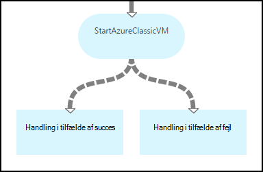
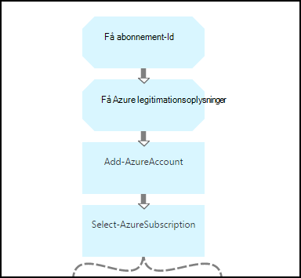
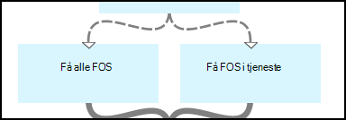
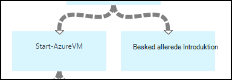
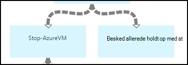
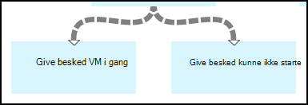
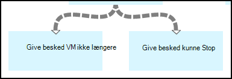

<properties 
    pageTitle="Start og Stop virtuelle maskiner - graf | Microsoft Azure"
    description="PowerShell arbejdsproces version af Azure automatisering tilfælde, herunder runbooks for at starte og stoppe klassisk virtuelle computere."
    services="automation"
    documentationCenter=""
    authors="mgoedtel"
    manager="jwhit"
    editor="tysonn" />
<tags 
    ms.service="automation"
    ms.devlang="na"
    ms.topic="article"
    ms.tgt_pltfrm="na"
    ms.workload="infrastructure-services"
    ms.date="07/06/2016"
    ms.author="bwren" />

# Azure scenarie med Automation - start og Stop virtuelle maskiner

Dette scenarie Azure automatisering indeholder runbooks for at starte og stoppe klassisk virtuelle computere.  Du kan bruge dette scenario på grund af følgende:  

- Brug runbooks uden ændringer i dit eget miljø. 
- Ændre runbooks for at udføre tilpasset funktionalitet.  
- Ringe på runbooks fra en anden runbook som en del af en overordnede løsning. 
- Brug runbooks som selvstudier til at lære runbook redigering begreber. 

> [AZURE.SELECTOR]
- [Grafiske](automation-solution-startstopvm-graphical.md)
- [PowerShell arbejdsproces](automation-solution-startstopvm-psworkflow.md)

Dette er den grafiske runbook version af dette scenario. Det er også tilgængelige ved hjælp af [PowerShell arbejdsproces runbooks](automation-solution-startstopvm-psworkflow.md).

## Få dette scenario

Dette scenarie består af to to grafiske runbooks, som kan hentes fra følgende links.  Se [PowerShell arbejdsproces version](automation-solution-startstopvm-psworkflow.md) af dette scenarie for links til PowerShell arbejdsproces runbooks.

| Runbook | Link | Type | Beskrivelse |
|:---|:---|:---|:---|
| StartAzureClassicVM | [Starte Azure klassisk VM grafiske Runbook](https://gallery.technet.microsoft.com/scriptcenter/Start-Azure-Classic-VM-c6067b3d) | Grafiske | Starter alle klassisk virtuelle maskiner i et Azure-abonnement eller alle virtuelle maskiner med et bestemt tjenestenavn. |
| StopAzureClassicVM | [Stoppe Azure klassisk VM grafiske Runbook](https://gallery.technet.microsoft.com/scriptcenter/Stop-Azure-Classic-VM-397819bd) | Grafiske | Stopper alle virtuelle maskiner på en konto med automation eller alle virtuelle maskiner med et bestemt tjenestenavn.  |

## Installation og konfiguration af dette scenario

### 1. installere runbooks

Når du henter runbooks, kan du importere dem med brug af fremgangsmåden i [grafiske runbook procedurer](automation-graphical-authoring-intro.md#graphical-runbook-procedures).

### 2. Gennemse beskrivelsen og krav
Runbooks omfatter en aktivitet, kaldet **Vigtigt-fil** , der indeholder en beskrivelse og påkrævet aktiver.  Du kan få vist disse oplysninger ved at vælge **Læst mig** aktiviteten og derefter parameteren **Arbejdsproces Script** .  Du kan også finde de samme oplysninger fra denne artikel. 

### 3. Konfigurer Aktiver
Runbooks kræver, at de følgende aktiver, skal du oprette og udfylde med relevante værdier.  Navnene er standard.  Du kan bruge Aktiver med forskellige navne, hvis du angiver navne i [Inputparametre](#using-the-runbooks) , når du starter runbook.

| Aktivtype | Standardnavnet | Beskrivelse |
|:---|:---|:---|:---|
| [Legitimationsoplysninger](automation-credentials.md) | AzureCredential | Indeholder legitimationsoplysninger for en konto, der har tilladelse til at starte og stoppe virtuelle maskiner i Azure-abonnement.  |
| [Variabel](automation-variables.md) | AzureSubscriptionId | Indeholder abonnementet Azure abonnement-ID. |

## Ved hjælp af dette scenario

### Parametre

Runbooks har følgende [Inputparametre](automation-starting-a-runbook.md#runbook-parameters).  Du skal angive værdier for de obligatoriske parametre og kan eventuelt angive værdier for andre parametre, afhængigt af dine behov.

| Parameter | Type | Obligatorisk | Beskrivelse |
|:---|:---|:---|:---|
| ServiceName | streng | Nej | Hvis du har angivet en værdi, er derefter alle virtuelle maskiner med dette tjenestenavn startet eller ikke længere.  Hvis ingen værdi ikke er angivet, er derefter alle klassisk virtuelle maskiner i Azure-abonnement i gang eller ikke længere. |
| AzureSubscriptionIdAssetName | streng | Nej | Indeholder navnet på det [variable aktiv](#installing-and-configuring-the-scenario) , der indeholder abonnement-ID for abonnementet Azure.  Hvis du ikke angiver en værdi, anvendes *AzureSubscriptionId* .  |
| AzureCredentialAssetName | streng | Nej | Indeholder navnet på [legitimationsoplysninger aktiv](#installing-and-configuring-the-scenario) , der indeholder legitimationsoplysninger for runbook til brug.  Hvis du ikke angiver en værdi, anvendes *AzureCredential* .  |

### Starte runbooks

Du kan bruge en af metoder i [starter en runbook i Azure automatisering](automation-starting-a-runbook.md) til at starte en af runbooks i denne artikel.

Følgende eksempel kommandoer bruger Windows PowerShell til at køre **StartAzureClassicVM** for at starte alle virtuelle maskiner med navnet på tjenesten *MyVMService*.

    $params = @{"ServiceName"="MyVMService"}
    Start-AzureAutomationRunbook –AutomationAccountName "MyAutomationAccount" –Name "StartAzureClassicVM" –Parameters $params

### Output

Runbooks vil [sende en meddelelse](automation-runbook-output-and-messages.md) til hver enkelt virtuelt med angivelse eller ej instruktionerne til at starte eller stoppe blev sendt.  Du kan søge efter en bestemt tekststreng i svaret for at bestemme resultatet for hver runbook.  De mulige output strenge findes i den følgende tabel.

| Runbook | Betingelse | Meddelelse |
|:---|:---|:---|
| StartAzureClassicVM | Virtuelt kører allerede  | MyVM kører allerede |
| StartAzureClassicVM | Starte anmodning om virtuelt sendt | MyVM er blevet startet |
| StartAzureClassicVM | Startanmodning om virtuelt mislykkedes  | MyVM kunne ikke startes |
| StopAzureClassicVM | Virtuelt kører allerede  | MyVM er allerede stoppet |
| StopAzureClassicVM | Starte anmodning om virtuelt sendt | MyVM er blevet startet |
| StopAzureClassicVM | Startanmodning om virtuelt mislykkedes  | MyVM kunne ikke startes |

Følgende er et billede ved at bruge **StartAzureClassicVM** som en [underordnet runbook](automation-child-runbooks.md) i et grafisk runbook eksempel.  Bruger betinget linkene i den følgende tabel.

| Link | Kriterier |
|:---|:---|
| Succes link | $ActivityOutput [StartAzureClassicVM]-som "\* er blevet startet"    |
| Fejllink   | $ActivityOutput [StartAzureClassicVM]-notlike som "\* er blevet startet" |

## Detaljeret opdeling

Følgende er en detaljeret opdeling af runbooks i dette scenarie.  Du kan bruge disse oplysninger til enten tilpasse runbooks eller bare for at få mere for at vide fra dem til oprettelse af din egen scenarier med automation.
 

### Godkendelse

Runbook starter med aktiviteter til at angive [legitimationsoplysninger](automation-configuring.md#configuring-authentication-to-azure-resources) og Azure-abonnement, der skal bruges for resten af runbook.

De første to aktiviteter, **Få abonnement-Id** og **Få Azure legitimationsoplysninger**, hente de [Aktiver](#installing-the-runbook) , der bruges af de næste to aktiviteter.  Disse aktiviteter kan direkte angive aktiverne, men de har brug for aktiv navnene.  Da vi giver brugeren mulighed at angive navne i [Inputparametre](#using-the-runbooks), har vi brug for disse aktiviteter til at hente aktiverne med et navn, der er angivet af en inputparameteren.

**Tilføj AzureAccount** angiver de legitimationsoplysninger, der skal bruges for resten af runbook.  Legitimationsoplysninger for aktivet, der hentes fra **Få Azure legitimationsoplysninger** skal have adgang til at starte og stoppe virtuelle maskiner i Azure-abonnement.  Det abonnement, der bruges vælges ved at **Vælge AzureSubscription** som bruger abonnement-id'et fra **Få abonnement-Id**.

### Få virtuelle maskiner

Runbook skal finde ud af, hvilke virtuelle maskiner, der arbejder med, og om de allerede er i gang eller stoppet (afhængigt af runbook).   En af to aktiviteter henter FOS.  **Få FOS i tjenesten** kører, hvis *ServiceName* inputparameteren for runbook indeholder en værdi.  **Få alle FOS** udføres, hvis *ServiceName* inputparameteren for runbook ikke indeholder en værdi.  Denne logik er udført af linkene betinget før hver aktivitet.

Begge aktiviteter Brug cmdlet'en **Get-AzureVM** .  **Få alle FOS** bruger parameteren **ListAllVMs** , der er angivet for at returnere alle virtuelle computere.  **Få FOS i tjeneste** bruger sættet **GetVMByServiceAndVMName** parameter og indeholder **ServiceName** inputparameteren for parameteren **ServiceName** .  

### Flette FOS

**Flette FOS** aktiviteten er påkrævet for at give input til **Start-AzureVM** som skal navn og navnet på vm(s) til at starte tjenesten.  Dette input kan komme fra enten **Få alle FOS** eller **Få FOS i tjenesten**, men **Start-AzureVM** kan kun angive en aktivitet for dens input.   

Dette scenario er at oprette **Flette FOS** som kører Cmdletten **Skriv Output** .  Parameteren **InputObject** for denne cmdlet er et PowerShell-udtryk, der kombinerer input fra de tidligere to aktiviteter.  Kun én af disse aktiviteter vil køre, så kun ét sæt output forventes.  **Start-AzureVM** kan bruge outputtet til dens inputparametre. 

### Start/Stop virtuelle maskiner

 

Afhængigt af runbook forsøger de næste aktiviteter at starte eller stoppe runbook ved hjælp af **Start-AzureVM** eller **Stop AzureVM**.  Da aktiviteten står et pipeline link, køres det én gang for hvert objekt, der returneres fra **Flette FOS**.  Linket er betinget, så aktiviteten kan kun køre, hvis *RunningState* på den virtuelle maskine er *stoppet* for **Start-AzureVM** og *Introduktion* til **Stop AzureVM**. Hvis problemet ikke er opfyldt, derefter køres **Besked allerede er startet** eller **Besked allerede er stoppet** for at sende en meddelelse med **Skriv Output**.

### Sende output

 

Det sidste trin i runbook er at sende output om start eller stop anmodning om hver virtuelt blev sendt. Der er en separat **Skriv Output** aktivitet for hvert, og vi afgøre, hvilken til at køre med betinget links.  **Give besked VM startes** eller **Besked VM stoppes** kører, hvis *OperationStatus* er *lykkedes*.  Hvis *OperationStatus* er en anden værdi, udføres **Besked mislykkedes til Start** eller **Stop besked, blev ikke** .

## Næste trin

- [Grafiske redigering i Azure automatisering](automation-graphical-authoring-intro.md)
- [Underordnet runbooks i Azure Automation](automation-child-runbooks.md) 
- [Runbook output og meddelelser i Azure automatisering](automation-runbook-output-and-messages.md)