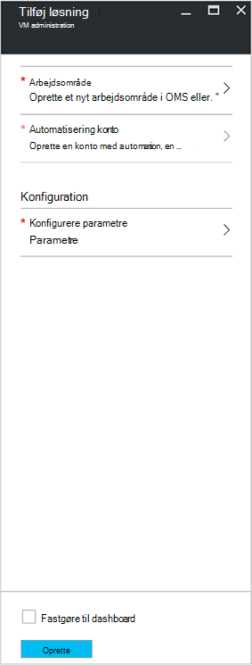
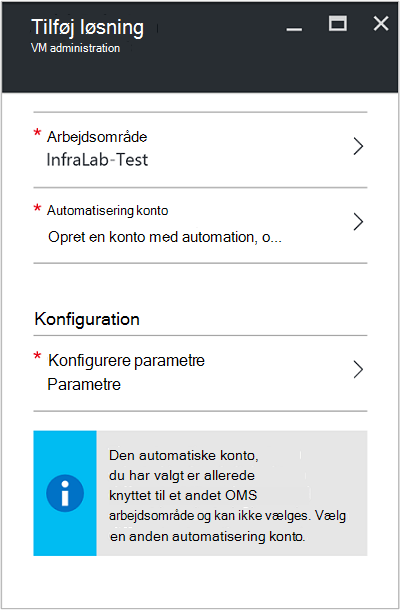
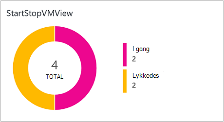
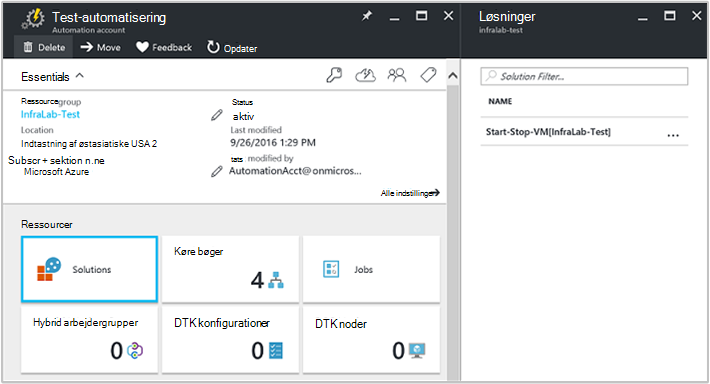
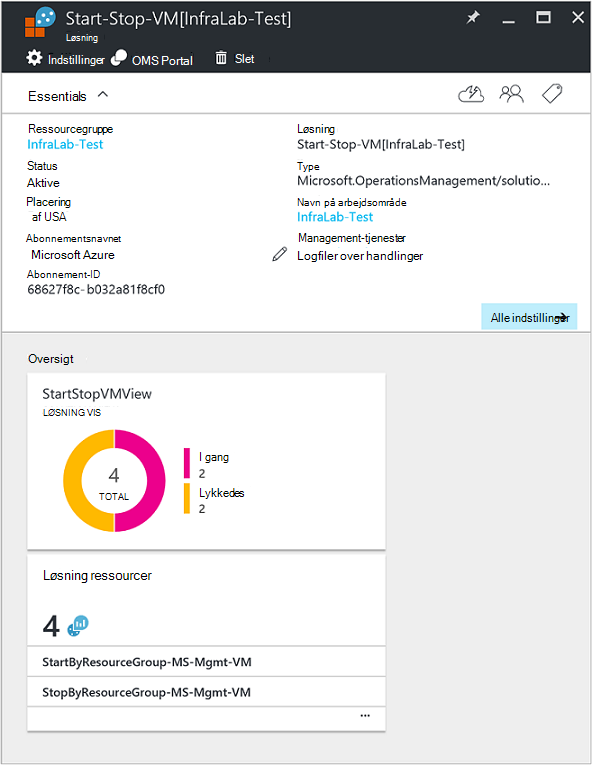

<properties
    pageTitle="Start/Stop FOS under uden for normal arbejdstid [Preview] løsning | Microsoft Azure"
    description="VM Management-løsninger starter og holder dine Azure ressourcestyring virtuelle maskiner på en tidsplan og overvåge proaktiv fra Log analyser."
    services="automation"
    documentationCenter=""
    authors="MGoedtel"
    manager="jwhit"
    editor=""
    />
<tags
    ms.service="automation"
    ms.workload="tbd"
    ms.tgt_pltfrm="na"
    ms.devlang="na"
    ms.topic="get-started-article"
    ms.date="10/07/2016"
    ms.author="magoedte"/>

# Start/Stop FOS under uden for normal arbejdstid [Preview] løsning i Automation

Start/Stop FOS under uden for normal arbejdstid [Preview] løsning starter og holder dine Azure ressourcestyring virtuelle maskiner på en brugerdefineret tidsplan og giver indblik i en vellykket over job automatisering, starte og stoppe din virtuelle maskiner med OMS Log Analytics.  

## Forudsætninger

- Runbooks arbejde med en [Azure Kør som konto](automation-sec-configure-azure-runas-account.md).  Kør som kontoen er den foretrukne godkendelsesmetode, da det bruger certifikatgodkendelse i stedet for en adgangskode, der kan udløbe eller ændre ofte.  

- Denne løsning kan kun administrere FOS, som er i samme abonnement og ressourcegruppe som hvor kontoen automatisering er placeret.  

- Denne løsning installerer kun på de følgende Azure områder - Australien Sydøst, indtastning af østasiatiske USA, Sydøstasien og Vest Europe.  Den runbooks, der administrerer VM planen kan målrette FOS i et område.  

- Hvis du vil sende e-mail-beskeder, når start og stop VM runbooks udfører, er en professionel Office 365-abonnement påkrævet.  

## Løsningskomponenter

Denne løsning består af følgende ressourcer, der skal importeres og føjet til din konto med Automation.

### Runbooks

Runbook | Beskrivelse|
--------|------------|
CleanSolution-MS-Mgmt-VM | Denne runbook, fjernes alle indeholdte ressourcer og tidsplaner, når du går til slette løsningen fra dit abonnement.|  
SendMailO365-MS-Mgmt | Denne runbook sender en mail via Office 365 Exchange.|
StartByResourceGroup-MS-Mgmt-VM | Denne runbook er beregnet til at starte FOS (begge klassisk og ARM baseret FOS), der er placeret i en bestemt liste over Azure ressource rullelisten.
StopByResourceGroup-MS-Mgmt-VM | Denne runbook er beregnet på at stoppe FOS (begge klassisk og ARM baseret FOS), der er placeret i en bestemt liste over Azure ressource rullelisten.|
 

### Variabler

Variabel | Beskrivelse|
---------|------------|
**SendMailO365-MS-Mgmt** Runbook ||
SendMailO365-IsSendEmail-MS-Mgmt | Angiver, hvis StartByResourceGroup-MS-Mgmt-VM og StopByResourceGroup-MS-Mgmt-VM runbooks kan sende mailmeddelelse når er afsluttet.  Vælg **Sand** til at aktivere og **Falsk** til at deaktivere mail advarer. Standardværdien er **Falsk**.| 
**StartByResourceGroup-MS-Mgmt-VM** Runbook ||
StartByResourceGroup-ExcludeList-MS-Mgmt-VM | Angiv VM navnene skal udelukkes fra management-handling; Adskil navnene med semikolon (;). Værdier er store og små bogstaver og jokertegn (stjerne) understøttes.|
StartByResourceGroup-SendMailO365-EmailBodyPreFix-MS-Mgmt | Tekst, der kan føjes til starten af e-mail-meddelelsens brødtekst.|
StartByResourceGroup-SendMailO365-EmailRunBookAccount-MS-Mgmt | Angiver navnet på den automatiske konto, der indeholder runbook mail.  **Denne variabel må ikke ændres.**|
StartByResourceGroup-SendMailO365-EmailRunbookName-MS-Mgmt | Angiver navnet på runbook mail.  Det bruges af StartByResourceGroup-MS-Mgmt-VM og StopByResourceGroup-MS-Mgmt-VM runbooks til at sende mail.  **Denne variabel må ikke ændres.**|
StartByResourceGroup-SendMailO365-EmailRunbookResourceGroup-MS-Mgmt | Angiver navnet på den ressourcegruppe, der indeholder runbook mail.  **Denne variabel må ikke ændres.**|
StartByResourceGroup-SendMailO365-EmailSubject-MS-Mgmt | Angiver teksten for emnelinjen i mailen.|  
StartByResourceGroup-SendMailO365-EmailToAddress-MS-Mgmt | Angiver modtagerne af mailen.  Angive separate navnene med semikolon (;).|
StartByResourceGroup-TargetResourceGroups-MS-Mgmt-VM | Angiv VM navnene skal udelukkes fra management-handling; Adskil navnene med semikolon (;). Værdier er store og små bogstaver og jokertegn (stjerne) understøttes.  Standardværdien (stjerne) omfatter alle ressourcegrupper i abonnementet.|
StartByResourceGroup-TargetSubscriptionID-MS-Mgmt-VM | Angiver det abonnement, der indeholder FOS der skal administreres af denne løsning.  Det skal være den samme abonnement hvor automatisering kontoen for denne løsning er placeret.|
**StopByResourceGroup-MS-Mgmt-VM** Runbook ||
StopByResourceGroup-ExcludeList-MS-Mgmt-VM | Angiv VM navnene skal udelukkes fra management-handling; Adskil navnene med semikolon (;). Værdier er store og små bogstaver og jokertegn (stjerne) understøttes.|
StopByResourceGroup-SendMailO365-EmailBodyPreFix-MS-Mgmt | Tekst, der kan føjes til starten af e-mail-meddelelsens brødtekst.|
StopByResourceGroup-SendMailO365-EmailRunBookAccount-MS-Mgmt | Angiver navnet på den automatiske konto, der indeholder runbook mail.  **Denne variabel må ikke ændres.**|
StopByResourceGroup-SendMailO365-EmailRunbookResourceGroup-MS-Mgmt | Angiver navnet på den ressourcegruppe, der indeholder runbook mail.  **Denne variabel må ikke ændres.**|
StopByResourceGroup-SendMailO365-EmailSubject-MS-Mgmt | Angiver teksten for emnelinjen i mailen.|  
StopByResourceGroup-SendMailO365-EmailToAddress-MS-Mgmt | Angiver modtagerne af mailen.  Angive separate navnene med semikolon (;).|
StopByResourceGroup-TargetResourceGroups-MS-Mgmt-VM | Angiv VM navnene skal udelukkes fra management-handling; Adskil navnene med semikolon (;). Værdier er store og små bogstaver og jokertegn (stjerne) understøttes.  Standardværdien (stjerne) omfatter alle ressourcegrupper i abonnementet.|
StopByResourceGroup-TargetSubscriptionID-MS-Mgmt-VM | Angiver det abonnement, der indeholder FOS der skal administreres af denne løsning.  Det skal være den samme abonnement hvor automatisering kontoen for denne løsning er placeret.|  
 

### Tidsplaner

Tidsplan | Beskrivelse|
---------|------------|
StartByResourceGroup-tidsplan-MS-Mgmt | Planen for StartByResourceGroup runbook, som udfører start af FOS administreres af denne løsning.|
StopByResourceGroup-tidsplan-MS-Mgmt | Planen for StopByResourceGroup runbook, som udfører lukning af FOS administreres af denne løsning.|

### Legitimationsoplysninger

Legitimationsoplysninger | Beskrivelse|
-----------|------------|
O365Credential | Angiver en gyldig Office 365-brugerkonto for at sende mail.  Kun påkrævet, hvis variable SendMailO365-IsSendEmail-MS-Mgmt er indstillet til **Sand**.

## Konfiguration

Udfør følgende trin for at tilføje Start/Stop FOS under uden for normal arbejdstid [Preview] løsning til din konto med Automation og derefter konfigurere variabler for at tilpasse løsningen.

1. I startskærmen i Azure-portalen skal du vælge feltet **Marketplace** .  Vælg **Ny**, hvis feltet er ikke længere fastgjort til din startskærmen, fra den venstre navigationsrude.  
2. Skriv **Starte VM** i søgefeltet i bladet Marketplace, og vælg derefter løsningen **Start/Stop FOS kontortiden [Preview]** i søgeresultaterne.  
3. Gennemgå oversigtsoplysningerne i bladet **Start/Stop FOS kontortiden [Preview]** for den valgte løsning, og klik derefter på **Opret**.  
4. **Tilføj løsning** blade vises, hvor du bliver bedt om at konfigurere løsningen, før du kan importere den til dit abonnement med Automation.     
5.  Vælg **arbejdsområde** på bladet **Tilføj løsning** og her skal du vælge et OMS arbejdsområde, der er sammenkædet med det samme Azure abonnement, er den automatiske konto i eller oprette et nyt OMS arbejdsområde.  Hvis du ikke har et OMS arbejdsområde, kan du vælge **Opret nyt arbejdsområde** og gør følgende på bladet **OMS arbejdsområde** : 
   - Angiv et navn til det nye **OMS arbejdsområde**.
   - Vælg et **abonnement** til at oprette et link til ved at vælge på rullelisten listen, hvis standard markeret ikke er relevant.
   - Du kan oprette en ny ressourcegruppe eller vælge en eksisterende ressourcegruppe for **Ressourcegruppe**.  
   - Vælg en **placering**.  I øjeblikket er de eneste placeringer, der er knyttet til markeringen **Australien Sydøst**, **Af USA**, **Sydøstasien**og **Vest Europe**.
   - Vælg en **priser niveau**.  Løsningen fås i to niveauer: ledig og OMS betalt niveau.  Det gratis niveau har en begrænsning på mængden data indsamles dagligt, opbevaringsperiode og runbook job runtime minutter.  OMS betalt niveauet har ikke en grænse på mængden data, der indsamles dagligt.  

        > [AZURE.NOTE]
        > Det er ikke tilgængelig, mens den enkeltstående, som er betalt niveau vises som en valgmulighed.  Hvis du vælger den og fortsætte med oprettelse af denne løsning i dit abonnement, mislykkes.  Dette vil blive behandlet, når denne løsning er udgivet officielt. Hvis du bruger denne løsning, den kun bruge automatisering job minutter og logge indtagelse.  Løsningen tilføjer ikke yderligere OMS noder til dit miljø.  

6. Når du har indtastet de nødvendige oplysninger på bladet **OMS arbejdsområde** , skal du klikke på **Opret**.  Mens oplysninger, der er bekræftet og arbejdsområdet er oprettet, kan du få vist status under **beskeder** i menuen.  Du kommer tilbage til bladet **Tilføj løsning** .  
7. Vælg **Automatisering konto**bladet **Tilføj løsning** .  Hvis du opretter et nyt OMS arbejdsområde, skal du også oprette en ny konto med Automation, der skal knyttes til det nye OMS arbejdsområde angivet tidligere, herunder din Azure-abonnement, ressourcegruppe og region.  Du kan vælge **Opret en konto med Automation** og på bladet **tilføje automatisering konto** du angive følgende: 
  - Angiv navnet på kontoen, automatisering i feltet **navn** .

    Alle andre indstillinger udfyldes automatisk baseret på arbejdsområdet OMS markeret, og disse indstillinger kan ikke ændres.  Et firma Azure Kør som er standard godkendelsesmetode for runbooks findes i denne løsning.  Når du klikker på **OK**, konfigurationsindstillingerne valideres og den automatiske konto er oprettet.  Du kan få vist status under **beskeder** i menuen. 

    Ellers kan du vælge en eksisterende automatisering Kør som konto.  Bemærk, at den konto, du vælger ikke allerede være kædet sammen med et andet OMS arbejdsområde, ellers en meddelelse, der præsenteres i bladet at informere dig.  Hvis det allerede er sammenkædet, skal du vælge en anden automatisering Kør som konto eller oprette en ny.    

8. Til sidst vælge **konfiguration** på bladet **Tilføj løsning** og bladet **parametre** vises.  På bladet **parametre** , bliver du bedt om at:  
   - Angiv **Mål ResourceGroup navne**, som er en ressource gruppenavn, der indeholder FOS der skal administreres af denne løsning.  Du kan angive mere end ét navn og adskille dem med et semikolon (værdier er store og små bogstaver).  Brug et jokertegn understøttes, hvis du vil destination FOS i alle ressourcegrupper i abonnement.
   - Vælg en **tidsplan** , som er en tilbagevendende dato og klokkeslæt for start og Stop VM i target ressource rullelisten.  

10. Når du har udført konfiguration af de første indstillinger, der kræves til løsningen, skal du vælge **Opret**.  Alle indstillinger vil være valideret, og derefter forsøger at installere løsningen i dit abonnement.  Denne proces kan tage nogle sekunder at fuldføre, og du kan få vist status under **beskeder** i menuen. 

## Frekvens af websteder

Automatisering job log og job streamdata er optagelse til OMS lageret hver fem minutter.  

## Ved hjælp af løsningen

Når du tilføjer VM Management-løsning, i arbejdsområdet OMS **StartStopVM visning** tilføjes felt til dit OMS dashboard.  Dette felt viser en Tæl og grafisk repræsentation af de runbooks job for løsningen, der har startet og er fuldført.     

I din konto med Automation, kan du få adgang til og administrere løsningen ved at markere feltet **løsninger** og derefter fra bladet **løsninger** vælge løsningen **Start-Stop-VM [Workspace]** på listen.     

Valg af løsningen vises bladet **Start-Stop-VM [Workspace]** løsning, hvor du kan gennemse vigtige detaljer som feltet **StartStopVM** som i arbejdsområdet OMS, som viser en Tæl og grafisk repræsentation af de runbooks job for løsningen, der har startet og er fuldført.     

Her kan du også åbne arbejdsområdet OMS og udføre yderligere analyse af posterne, der job.  Bare Klik på **alle indstillinger**, og vælg **Hurtig Start** i bladet **Indstillinger** , og vælg derefter **OMS Portal**i bladet **Hurtig Start** .   Dette vil åbne en ny fane eller en ny browsersession og præsentere dit OMS arbejdsområde, der er knyttet til din konto med Automation og abonnement.  

### Konfiguration af e-mail-meddelelser

Sådan aktiveres besked via mail, når VM start- og runbooks fuldført, skal du ændre **O365Credential** legitimationsoplysninger og som minimum følgende variabler:

 - SendMailO365-IsSendEmail-MS-Mgmt
 - StartByResourceGroup-SendMailO365-EmailToAddress-MS-Mgmt
 - StopByResourceGroup-SendMailO365-EmailToAddress-MS-Mgmt

For at konfigurere **O365Credential** legitimationsoplysninger skal du udføre følgende trin:

1. Klik på **Indstillinger for alle** øverst i vinduet kontoen automatisering. 
2. Vælg **Aktiver**bladet **Indstillinger** under afsnittet **Automatisering ressourcer**. 
3. Vælg feltet **legitimationsoplysninger** på bladet **Aktiver** og bladet **legitimationsoplysninger** Vælg **O365Credential**.  
4. Angiv et gyldigt Office 365-brugernavn og adgangskode, og klik derefter på **Gem** for at gemme ændringerne.  

Hvis du vil konfigurere variablerne fremhævet tidligere, skal du udføre følgende trin:

1. Klik på **Indstillinger for alle** øverst i vinduet kontoen automatisering. 
2. Vælg **Aktiver**bladet **Indstillinger** under afsnittet **Automatisering ressourcer**. 
3. Vælg feltet **variabler** på bladet **Aktiver** og bladet **variabler** , Vælg den variabel, der er anført ovenfor, og rediger derefter dens værdi følgende beskrivelse til den tidligere angivet i sektionen [variabel](##variables) .  
4. Klik på **Gem** for at gemme ændringerne i variablen.   

### Ændre start og lukning planen

Administrere start og lukning tidsplanen i denne løsning følger samme fremgangsmåde, som beskrevet i [planlægge en runbook i Azure Automation](automation-scheduling-a-runbook.md).  Husk, at du ikke kan ændre tidsplan konfigurationen.  Skal du deaktivere den eksisterende plan og derefter oprette en ny og derefter sammenkæde med **StartByResourceGroup-MS-Mgmt-VM** eller **StopByResourceGroup-MS-Mgmt-VM** runbook, du vil tidsplanen skal gælde for.   

## Log Analytics poster

Automatisering opretter to typer af poster i OMS-lager.

### Logfiler over job

Egenskaben | Beskrivelse|
----------|----------|
Opkalds |  Hvem der startede handlingen.  Mulige værdier er en mailadresse eller system til planlagte opgaver.|
Kategori | Klassifikation af typen data.  Værdien er for automatisering, JobLogs.|
CorrelationId | GUID, der er korrelations-id'et for runbook jobbet.|
Job-id | GUID, der er runbook jobbet Id.|
operationName | Angiver typen handling, der udføres i Azure.  Til automatisering bliver værdien Job.|
resourceId | Angiver ressourcetypen i Azure.  Værdien er for automatisering, kontoen automatisering, der er knyttet til runbook.|
ResourceGroup | Angiver ressource gruppenavn på sag, runbook.|
ResourceProvider | Angiver den Azure tjeneste, der leverer de ressourcer, du kan installere og administrere.  Værdien er for automatisering, Azure automatisering.|
Ressourcetypen | Angiver ressourcetypen i Azure.  Værdien er for automatisering, kontoen automatisering, der er knyttet til runbook.|
resultType | Status for runbook jobbet.  Mulige værdier er: -I gang -Ikke længere -Suspenderet -Mislykkedes -Lykkedes|
resultDescription | Beskriver runbook job resultatet tilstand.  Mulige værdier er: -Jobbet startes -Job mislykkedes -Job fuldført|
RunbookName | Angiver navnet på runbook.|
SourceSystem | Angiver kilden for de data, der er sendt.  Til automatisering, vil værdien være: OpsManager|
StreamType | Angiver typen hændelse. Mulige værdier er: -Detaljeret -Output -Fejl -Advarsel|
SubscriptionId | Angiver abonnement-ID'ET for opgaven.
Tid | Dato og klokkeslæt, når runbook jobbet udført.|

### Jobbet streams

Egenskaben | Beskrivelse|
----------|----------|
Opkalds |  Hvem der startede handlingen.  Mulige værdier er en mailadresse eller system til planlagte opgaver.|
Kategori | Klassifikation af typen data.  Værdien er for automatisering, JobStreams.|
Job-id | GUID, der er runbook jobbet Id.|
operationName | Angiver typen handling, der udføres i Azure.  Til automatisering bliver værdien Job.|
ResourceGroup | Angiver ressource gruppenavn på sag, runbook.|
resourceId | Angiver ressourcen Id i Azure.  Værdien er for automatisering, kontoen automatisering, der er knyttet til runbook.|
ResourceProvider | Angiver den Azure tjeneste, der leverer de ressourcer, du kan installere og administrere.  Værdien er for automatisering, Azure automatisering.|
Ressourcetypen | Angiver ressourcetypen i Azure.  Værdien er for automatisering, kontoen automatisering, der er knyttet til runbook.|
resultType | Resultatet af kørslen runbook på det tidspunkt, hændelsen blev oprettet.  Mulige værdier er: -InProgress|
resultDescription | Omfatter output strømmen fra runbook.|
RunbookName | Navnet på runbook.|
SourceSystem | Angiver kilden for de data, der er sendt.  Automatisering, vil værdien være OpsManager|
StreamType | Typen job stream. Mulige værdier er: -Status -Output -Advarsel -Fejl -Fejlfinding -Detaljeret|
Tid | Dato og klokkeslæt, når runbook jobbet udført.|

Når du udfører en hvilken som helst log søgning, der returnerer poster med kategori af **JobLogs** eller **JobStreams**, kan du vælge visningen **JobLogs** eller **JobStreams** som viser et sæt af fliser summering af de opdateringer, der returneres af søgningen.

## Eksempel log søgninger

Den følgende tabel indeholder eksempel log søger efter jobposter, der indsamles via denne løsning. 

Forespørgsel | Beskrivelse|
----------|----------|
Finde job for runbook StartVM, der er fuldført | Kategori = JobLogs RunbookName_s = "StartByResourceGroup-MS-Mgmt-VM" ResultType = lykkedes & #124; måle count() ved JobId_g|
Finde job for runbook StopVM, der er fuldført | Kategori = JobLogs RunbookName_s = "StartByResourceGroup-MS-Mgmt-VM" ResultType = mislykkedes & #124; måle count() ved JobId_g
Vise jobstatus over tid for StartVM og StopVM runbooks | Kategori = JobLogs RunbookName_s = "StartByResourceGroup-MS-Mgmt-VM" eller "StopByResourceGroup-MS-Mgmt-VM" NOT(ResultType="started") | måle Count() ved ResultType interval 1 dag|

## Næste trin

- Få mere at vide om at oprette forskellige søgeforespørgsler og gennemse loggene automatisering job med Log Analytics under [Log søgninger i Log Analytics](../log-analytics/log-analytics-log-searches.md)
- Få mere at vide om runbook udførelse af, hvordan til at overvåge runbook job og andre tekniske detaljer under [Registrer et runbook-job](automation-runbook-execution.md)
- Hvis du vil vide mere om OMS Log analyser og datakilder af websteder, se [indsamling af Azure lagerplads data i Log Analytics oversigt](../log-analytics/log-analytics-azure-storage.md)

   

