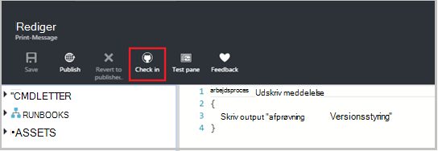
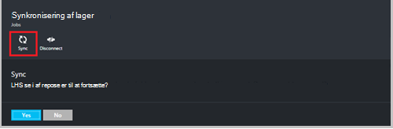

<properties 
    pageTitle=" Datakilde kontrolelement integration i Azure Automation | Microsoft Azure"
    description="I denne artikel beskrives kilde kontrolelement integration med GitHub i Azure Automation."
    services="automation"
    documentationCenter=""
    authors="mgoedtel"
    manager="jwhit"
    editor="tysonn" />    
<tags 
    ms.service="automation"
    ms.devlang="na"
    ms.topic="article"
    ms.tgt_pltfrm="na"
    ms.workload="infrastructure-services"
    ms.date="09/12/2016"
    ms.author="magoedte;sngun" />

# Kilde kontrolelement integration i Azure Automation

Kilde kontrolelement integration kan du knytte runbooks i kontoen automatisering til en GitHub kildekontrol. Versionsstyring kan du nemt samarbejde med dit team, registrere ændringer og vende tilbage til tidligere versioner af din runbooks. For eksempel versionsstyring giver dig mulighed at synkronisere forskellige forgreninger i versionsstyring til dine udvikling, test eller fremstilling automatisering konti, hvilket gør det nemt at fremme kode, der er testet i dit udviklingsmiljø til din fremstilling automatisering konto.

Versionsstyring kan du overføre kode fra Azure automatisering til versionsstyring eller trække din runbooks fra versionsstyring til Azure Automation. I denne artikel beskrives, hvordan du konfigurerer versionsstyring i dit miljø, Azure automatisering. Vi begynder ved at konfigurere Azure automatisering for at få adgang til din GitHub lager og gennemgå forskellige handlinger, der kan udføres ved hjælp af kilde kontrolelement integration. 

>[AZURE.NOTE]Versionsstyring understøtter at og trykke på [PowerShell arbejdsproces runbooks](automation-runbook-types.md#powershell-workflow-runbooks) samt [PowerShell runbooks](automation-runbook-types.md#powershell-runbooks). [Grafiske runbooks](automation-runbook-types.md#graphical-runbooks) understøttes ikke endnu.  

Der findes to enkle trin, der kræves for at konfigurere versionsstyring for kontoen automatisering, og kun én, hvis du allerede har en GitHub-konto. De er:
## Trin 1-Opret et GitHub lager

Hvis du allerede har en GitHub-konto og et lager, du vil oprette et link til Azure automatisering, og derefter logge på din eksisterende konto og starter fra trin 2 nedenfor. Ellers kan navigere til [GitHub](https://github.com/), log op til en ny konto og [oprette et nyt lager](https://help.github.com/articles/create-a-repo/).

## Trin 2 – konfigurere versionsstyring i Azure Automation

1. Klik på fra bladet automatisering konto i portalen Azure **angive versionsstyring.** 
 
    

2. Bladet **Versionsstyring** åbnes, hvor du kan konfigurere din GitHub kontooplysninger. Nedenfor vises på listen over parametre for at konfigurere:  

  	|**Parameter**            |**Beskrivelse** |
  	|:---|:---| 
  	|Vælg kilde   | Markér kilden. På nuværende tidspunkt understøttes kun **GitHub** . |
  	|Godkendelse | Klik på knappen **godkende** for at give Azure automatisering adgang til din GitHub lager. Hvis du allerede er logget på kontoen GitHub i et andet vindue, anvendes legitimationsoplysningerne for denne konto. Når godkendelse er gået igennem, vises bladet din GitHub brugernavn under **Godkendelse egenskab**. |
  	|Vælg lager | Vælg et GitHub lager på listen over tilgængelige typer lagre. |
  	|Vælg gren | Vælg en gren fra listen over tilgængelige forgreninger. Kun den **overordnede** gren vises Hvis du ikke har oprettet en hvilken som helst forgreninger. |
  	|Runbook mappesti | Stien til runbook angiver stien i den GitHub lager, hvorfra du vil skubbe eller trække din kode. Det skal angives i formatet **/foldername/subfoldername**. Kun runbooks i stien til runbook vil blive synkroniseret til din konto med Automation. Runbooks i undermapper på runbook mappe stien vil **ikke** blive synkroniseret. Brug **/** til at synkronisere alle runbooks under lageret. |

3. Eksempelvis hvis du har et lager, med navnet **PowerShellScripts** , der indeholder en mappe med navnet **RootFolder**, som indeholder en mappe med navnet **undermappe**. Du kan bruge følgende strenge til at synkronisere hver mappeniveau:

    1. Hvis du vil synkronisere runbooks fra **lager**, er runbook mappesti, der*/*
    2. Hvis du vil synkronisere runbooks fra **RootFolder**, er runbook mappesti, der */RootFolder*
    3. Hvis du vil synkronisere runbooks fra **undermappen**, er runbook mappesti */RootFolder/SubFolder*.
  

4. Når du konfigurerer parametrene, de vises på den **angive versionsstyring blade.**  
 
    

5. Når du klikker på OK, kilde kontrolelement integration er nu er konfigureret for din konto med Automation og skal opdateres med dine GitHub oplysninger. Nu kan du klikke på denne del til at få vist alle dine kilde kontrolelement Synkroniser jobs.  

    

6. Når du har konfigureret versionsstyring, oprettes følgende automatisering ressourcer på kontoen automatisering:  
 Der oprettes to [variable Aktiver](automation-variables.md) .  
      
    * Variabelt **Microsoft.Azure.Automation.SourceControl.Connection** indeholder værdierne i forbindelsesstrengen, som vist nedenfor.  

  	|**Parameter**            |**Værdi** |
  	|:---|:---|
  	| Navn  | Microsoft.Azure.Automation.SourceControl.Connection |
  	| Type | Streng |
  	| Værdi  | {"Gren":\<*kaldt gren*>, "RunbookFolderPath":\<*Runbook mappesti*>, "Kommunikationsprovidertypen":\<*har værdien 1 til GitHub*>, "Lager":\<*navnet på din lager*>, "Brugernavn":\<*din GitHub brugernavn*>} |   

    * Variabelt **Microsoft.Azure.Automation.SourceControl.OAuthToken**indeholder sikker krypterede værdien af din OAuthToken.  

  	|**Parameter**            |**Værdi** |
  	|:---|:---|
  	| Navn  | Microsoft.Azure.Automation.SourceControl.OAuthToken |
  	| Type | Unknown(Encrypted) |
  	| Værdi | <*Krypteret OAuthToken*> |  

      

    * **Automatisering versionsstyring** tilføjes som et autoriserede program til kontoen GitHub. Sådan får du vist programmet: gå til din **profil**fra startsiden GitHub > **Indstillinger** > **programmer**. Dette program kan Azure automatisering til at synkronisere din GitHub lager til en konto med Automation.  

    

## Brug af versionsstyring i automatisering

### Indtjekning en runbook fra Azure automatisering til versionsstyring

Kan du overføre de ændringer, du har foretaget i en runbook i Azure Automation i din kildekontrol Runbook Tjek ind. Nedenfor finder du disse trin for at indtjekning en runbook:

1. Fra din konto med Automation, [oprette en ny tekstdata runbook](automation-first-runbook-textual.md)eller [redigere en eksisterende, indeholder tekst runbook](automation-edit-textual-runbook.md). Denne runbook kan være enten en PowerShell-arbejdsproces eller en PowerShell-script runbook.  

2. Når du redigerer din runbook, gemme den og klikke på **Tjek ind** fra bladet **redigere** .  

    

     >[AZURE.NOTE] Indtjekning fra Azure automatisering overskrive den kode, der aktuelt findes i din versionsstyring. Ciffer tilsvarende kommandolinjen instruktion til indtjekning er **ciffer tilføje + push-ciffer Anvend + ciffer**  

3. Når du klikker på **Tjek ind**, kan du bliver bedt om med en bekræftelsesmeddelelse, skal du klikke på Ja for at fortsætte.  

    

4. Indtjekning starter kilde kontrolelement runbook: **Synkroniser MicrosoftAzureAutomationAccountToGitHubV1**. Denne runbook opretter forbindelse til GitHub og skubber ændringer fra Azure automatisering til dit lager. Gå tilbage til fanen **Kilde kontrolelement Integration** for at få vist jobs Tjek ind, og klik for at åbne bladet lager synkronisering. Denne blade viser alle dine kilde kontrolelement sager.  Vælg den sag, du vil have vist, og klik for at få vist oplysninger.  

    

    >[AZURE.NOTE] Kilde kontrolelementet runbooks er speciel automatisering runbooks, som du ikke kan se eller redigere. Mens de ikke bliver vist på listen over runbook, kan du se synkronisere job vises på joblisten over.
 
5. Navnet på den ændrede runbook sendes som input-parameter til runbook indtjekning. Du kan [få vist oplysninger om job](automation-runbook-execution.md#viewing-job-status-using-the-azure-management-portal) ved at udvide runbook i **Lager synkronisering** blade.  

    

6. Opdatere din GitHub lager, når jobbet er fuldført for at få vist ændringerne.  Der skal være en bekræftelse i lageret med en bekræftelse: * *Opdateret *Runbook navn* i Azure Automation.* *  

### Synkroniser runbooks fra versionsstyring til Azure Automation 

Synkroniseringsknappen på bladet lager synkronisering kan du hente alle runbooks stien til runbook af din lager til din konto med Automation. Den samme lager kan synkroniseres til mere end én konto med Automation. Nedenfor finder du disse trin for at synkronisere en runbook:

1. Fra den automatiske konto, hvor du konfigurere versionsstyring, Åbn **kilde kontrolelement Integration/lager synkronisering blade** og klikke på **Synkroniser** , og derefter bliver du bedt om med en bekræftelsesmeddelelse, skal du klikke på **Ja** for at fortsætte.  

    

2. Synkroniser starter runbook: **Synkroniser MicrosoftAzureAutomationAccountFromGitHubV1**. Denne runbook opretter forbindelse til GitHub og trækker ændringerne fra din lager til Azure Automation. Du bør se et nyt job på bladet **Lager synkronisering** for denne handling. For at få vist oplysninger om kørslen synkronisering, skal du klikke på for at åbne bladet job detaljer.  
 
    

 
    >[AZURE.NOTE] En synkronisering fra versionsstyring overskriver den kladdeversion af runbooks, der i øjeblikket findes i kontoen automatisering for **alle** runbooks, der aktuelt findes i versionsstyring. Ciffer tilsvarende kommandolinjen instruktion synkronisere er **ciffer hente**

## Fejlfinding i kilde kontrolelement

Hvis der er fejl med en Tjek ind eller synkronisere sag, jobstatus skal være suspenderet, og du kan få vist flere oplysninger om fejlen i bladet job.  Delen **Alle logfiler** , vises alle streams for PowerShell, der er knyttet til jobbet. Dette giver dig de oplysninger, der er behov for at hjælpe dig med at løse eventuelle problemer med din indtjekning eller Synkroniser. Det kan du også se rækkefølgen af handlinger, der opstod under synkronisering eller markere i en runbook.  

## Fjerne tilknytning til versionsstyring

Åbn bladet lager synkronisering for at afbryde forbindelsen fra kontoen GitHub, og klik på **Afbryd forbindelse**. Når du afbryder versionsstyring, runbooks, der tidligere er blevet synkroniseret vil stadig være i din konto med Automation, men bladet lager synkronisering bliver ikke aktiveret.  

  

## Næste trin

Se følgende ressourcer kan finde flere oplysninger om datakilde kontrolelement integration:  
- [Azure automatisering: Kilde kontrolelement Integration i Azure Automation](https://azure.microsoft.com/blog/azure-automation-source-control-13/)  
- [Stemme for systemet foretrukne kilde kontrolelement](https://www.surveymonkey.com/r/?sm=2dVjdcrCPFdT0dFFI8nUdQ%3d%3d)  
- [Azure automatisering: Integrering af Runbook versionsstyring ved hjælp af Visual Studio Team Services](https://azure.microsoft.com/blog/azure-automation-integrating-runbook-source-control-using-visual-studio-online/)  
