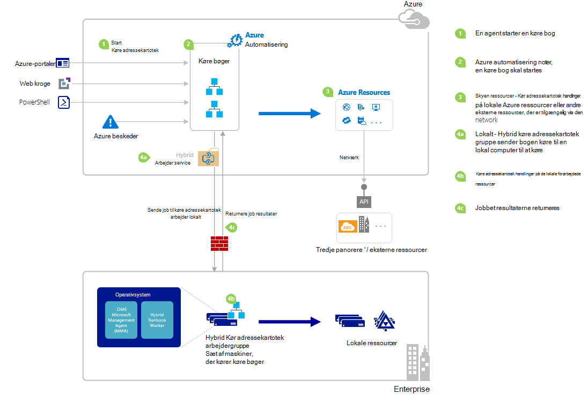

<properties
   pageTitle="Starte en runbook i Azure Automation | Microsoft Azure"
   description="Indeholder en oversigt over de forskellige metoder, der kan bruges til at starte en runbook i Azure automatisering og indeholder oplysninger om brug af både Azure portalen og Windows PowerShell."
   services="automation"
   documentationCenter=""
   authors="mgoedtel"
   manager="jwhit"
   editor="tysonn" />
<tags
   ms.service="automation"
   ms.devlang="na"
   ms.topic="article"
   ms.tgt_pltfrm="na"
   ms.workload="infrastructure-services"
   ms.date="10/08/2016"
   ms.author="magoedte;bwren"/>

# <a name="starting-a-runbook-in-azure-automation"></a>Starte en runbook fra Azure automatisering

Den følgende tabel kan du bestemme, hvilken metode til at starte en runbook i Azure automatisering, der er mest velegnet til scenariet bestemt. I denne artikel indeholder oplysninger om at starte en runbook med portalen Azure og med Windows PowerShell. Få at vide om de andre metoder er angivet i andre dokumentation, som du kan få adgang til fra linkene nedenfor.

| **METODE**                                                                    | **EGENSKABER**                                                                                                                                                                                                                                                                                                                                                |
|-------------------------------------------------------------------------------|--------------------------------------------------------------------------------------------------------------------------------------------------------------------------------------------------------------------------------------------------------------------------------------------------------------------------------------------------------------------|
| [Azure-portalen](#starting-a-runbook-with-the-azure-portal)                     | <li>Nemmeste metode med interaktive brugergrænsefladen.<br> <li>Formular for at få enkle parameterværdier.<br> <li>Nemt registrere jobtilstand.<br> <li>Access godkendt med Azure logon.                                                                                                                                                                               |
| [Windows PowerShell](https://msdn.microsoft.com/library/dn690259.aspx)        | <li>Ringe fra kommandolinjen med Windows PowerShell-cmdlet'er.<br> <li>Kan inkluderes i automatiseret løsning med flere trin.<br> <li>Anmodning om er godkendt med certifikatet eller OAuth bruger vigtigste / service vigtigste.<br> <li>Få simple og komplekse parameterværdier.<br> <li>Spore jobtilstand.<br> <li>Klient, der kræves for at understøtte PowerShell-cmdlet'er. |
| [Azure automatisering API](https://msdn.microsoft.com/library/azure/mt662285.aspx) | <li>Mest fleksible metode, men også de fleste komplekst.<br> <li>Ringe fra en hvilken som helst brugerdefineret kode, der kan foretage HTTP-anmodninger.<br> <li>Anmodning om bekræftes af certifikat eller Oauth bruger vigtigste / service vigtigste.<br> <li>Få simple og komplekse parameterværdier.<br> <li>Spore jobtilstand.                                                                          |
| [Webhooks](automation-webhooks.md)                                            | <li>Starte runbook fra enkelt HTTP-anmodning.<br> <li>Godkendt med sikkerhedstoken i URL-adresse.<br> <li>Klient kan ikke tilsidesætte parameterværdier, der er angivet, da webhook oprettet. Runbook kan definere enkelt parameter, der er udfyldt med HTTP-anmodning om oplysninger.<br> <li>Ingen mulighed for at registrere jobtilstand via webhook URL-adresse.                                      |
| [Besvare Azure besked](../log-analytics/log-analytics-alerts.md)               | <li>Starte en runbook i svar til Azure besked.<br> <li>Konfigurere webhook for runbook og link til Giv besked.<br> <li>Godkendt med sikkerhedstoken i URL-adresse.<br> <li>I øjeblikket kun understøtter besked på målepunkter.                                                                                                                                                       |
| [Tidsplan](automation-schedules.md)                                | <li>Start automatisk runbook på hver time, dagligt eller ugentligt tidsplan.<br> <li>Manipulere tidsplan via Azure-portalen, PowerShell-cmdlet'er eller Azure API.<br> <li>Få parameterværdier skal bruges sammen med tidsplan.                                                                                                                                               |
| [Fra en anden Runbook](automation-child-runbooks.md)                          | <li>Brug en runbook som en aktivitet i en anden runbook.<br> <li>Nyttig til funktionalitet, der bruges af flere runbooks.<br> <li>Angiv parameterværdier til underordnet runbook og brug output i overordnede runbook.                                                                                                                                                               |

Følgende billede viser detaljerede trinvis fremgangsmåde i livscyklussen for en runbook. Den indeholder forskellige måder, en runbook er startet på Azure automatisering, komponenter, der er påkrævet for hybride Runbook arbejder til at udføre Azure automatisering runbooks og interaktion mellem forskellige komponenter. For at få mere for at vide om afvikling automatisering runbooks i dit datacenter, referere til [hybrid runbook medarbejdere](automation-hybrid-runbook-worker.md)



## <a name="starting-a-runbook-with-the-azure-portal"></a>Starte en runbook ved hjælp af Azure portal

1.  Vælg **automatisering** i portalen Azure, og klik derefter på navnet på en konto med automation.
2.  Vælg fanen **Runbooks** .
3.  Vælg en runbook, og klik derefter på **Start**.
4.  Hvis runbook har parametre, bliver du bedt om at angive værdier med et tekstfelt for hver parameter. Du kan finde yderligere oplysninger om parametre i [Runbook parametre](#Runbook-parameters) nedenfor.
5.  Vælg **Periode** ud for **Start** runbook meddelelsen, eller klik på fanen **job** for runbook til at få vist runbook jobstatus.

## <a name="starting-a-runbook-with-the-azure-portal"></a>Starte en runbook ved hjælp af Azure portal

1.  Klik på **Runbooks** del for at åbne bladet **Runbooks** fra kontoen automatisering.
2.  Klik på en runbook for at åbne dets **Runbook** blade.
3.  Klik på **Start**.
4.  Hvis runbook ikke har nogen parametre, bliver du bedt om at bekræfte, om du vil starte den. Hvis runbook har parametre, åbnes bladet **Start Runbook** , så du kan angive parameterværdier. Du kan finde yderligere oplysninger om parametre i [Runbook parametre](#Runbook-parameters) nedenfor.
5.  Bladet **Job** åbnes, så du kan spore den jobstatus.

## <a name="starting-a-runbook-with-windows-powershell"></a>Starte en runbook med Windows PowerShell

Du kan bruge [Start-AzureRmAutomationRunbook](https://msdn.microsoft.com/library/mt603661.aspx) til at starte en runbook med Windows PowerShell. Følgende eksempelkode starter en runbook kaldet Test-Runbook.

```
Start-AzureRmAutomationRunbook -AutomationAccountName "MyAutomationAccount" -Name "Test-Runbook" -ResourceGroupName "ResourceGroup01"
```

Start AzureRmAutomationRunbook returnerer et jobobjekt, du kan bruge til at registrere status, når runbook startes. Du kan derefter bruge dette jobobjekt med [Get-AzureRmAutomationJob](https://msdn.microsoft.com/library/mt619440.aspx) til at bestemme status for den sag og [Få AzureRmAutomationJobOutput](https://msdn.microsoft.com/library/mt603476.aspx) at få dens output. Følgende eksempelkode starter en runbook kaldet Test-Runbook, venter, indtil den er fuldført, og derefter viser dets output.

```
$runbookName = "Test-Runbook"
$ResourceGroup = "ResourceGroup01"
$AutomationAcct = "MyAutomationAccount"

$job = Start-AzureRmAutomationRunbook –AutomationAccountName $AutomationAcct -Name $runbookName -ResourceGroupName $ResourceGroup

$doLoop = $true
While ($doLoop) {
   $job = Get-AzureRmAutomationJob –AutomationAccountName $AutomationAcct -Id $job.JobId -ResourceGroupName $ResourceGroup
   $status = $job.Status
   $doLoop = (($status -ne "Completed") -and ($status -ne "Failed") -and ($status -ne "Suspended") -and ($status -ne "Stopped"))
}

Get-AzureRmAutomationJobOutput –AutomationAccountName $AutomationAcct -Id $job.JobId -ResourceGroupName $ResourceGroup –Stream Output
```

Hvis runbook kræver parametre, skal du angive dem som en [hashtable](http://technet.microsoft.com/library/hh847780.aspx) hvor nøglen i hashtable stemmer overens med parameternavnet og værdien er værdien for parameteren. I følgende eksempel vises, hvordan du starter en runbook med to strengparametre med navnet fornavn og efternavn, et heltal, der hedder RepeatCount og en boolesk parameter med navnet Vis. Du kan finde flere oplysninger om parametre skal [Runbook parametre](#Runbook-parameters) nedenfor.

```
$params = @{"FirstName"="Joe";"LastName"="Smith";"RepeatCount"=2;"Show"=$true}
Start-AzureRmAutomationRunbook –AutomationAccountName "MyAutomationAccount" –Name "Test-Runbook" -ResourceGroupName "ResourceGroup01" –Parameters $params
```

## <a name="runbook-parameters"></a>Runbook parametre

Når du starter en runbook fra Azure-portalen eller Windows PowerShell, sendes instruktionerne til via Azure automatisering webtjeneste. Parametre med komplekse datatyper understøttes ikke i denne tjeneste. Hvis du vil angive en værdi for en kompleks parameter, skal derefter du ringe den indbyggede fra en anden runbook som beskrevet i [underordnede runbooks i Azure Automation](automation-child-runbooks.md).

Azure automatisering webtjenesten give specielle funktioner til parametre ved hjælp af visse datatyper, som det er beskrevet i følgende afsnit.

### <a name="named-values"></a>Navngivne værdier

Hvis parameteren er datatypen [objekt] og derefter du kan bruge følgende JSON format til at sende det til en liste over navngivne værdier: *{Navn1: 'Værdi1', navn 2: 'Værdi2', Name3: 'Værdi3'}*. Disse værdier skal være enkel typer. Runbook får parameteren som en [PSCustomObject](https://msdn.microsoft.com/library/system.management.automation.pscustomobject%28v=vs.85%29.aspx) med egenskaber, der svarer til de enkelte navngivne værdier.

Overvej følgende test runbook, der accepterer en parameter ved navn bruger.

```
Workflow Test-Parameters
{
   param (
      [Parameter(Mandatory=$true)][object]$user
   )
    $userObject = $user | ConvertFrom-JSON
    if ($userObject.Show) {
        foreach ($i in 1..$userObject.RepeatCount) {
            $userObject.FirstName
            $userObject.LastName
        }
    }
}
```

Følgende tekst kan bruges til parameteren bruger.

```
{FirstName:'Joe',LastName:'Smith',RepeatCount:'2',Show:'True'}
```

Dette resulterer i følgende output.

```
Joe
Smith
Joe
Smith
```

### <a name="arrays"></a>Matrixer

Hvis parameteren er en matrix som [matrix] eller [streng []], kan du bruge følgende JSON format til at sende den til en liste over værdier: *[værdi1, værdi2, Værdi3]*. Disse værdier skal være enkel typer.

Overvej følgende test runbook, der accepterer en parameter ved navn *bruger*.

```
Workflow Test-Parameters
{
   param (
      [Parameter(Mandatory=$true)][array]$user
   )
    if ($user[3]) {
        foreach ($i in 1..$user[2]) {
            $ user[0]
            $ user[1]
        }
    }
}
```

Følgende tekst kan bruges til parameteren bruger.

```
["Joe","Smith",2,true]
```

Dette resulterer i følgende output.

```
Joe
Smith
Joe
Smith
```

### <a name="credentials"></a>Legitimationsoplysninger

Hvis parameteren er datatypen **PSCredential**, kan du angive navnet på et Azure automatisering [legitimationsoplysninger aktiv](automation-credentials.md). Runbook henter legitimationsoplysninger med det navn, du angiver.

Overvej følgende test runbook, der accepterer en parameter ved navn legitimationsoplysninger.

```
Workflow Test-Parameters
{
   param (
      [Parameter(Mandatory=$true)][PSCredential]$credential
   )
   $credential.UserName
}
```

Følgende tekst kan bruges til parameteren bruger, hvis du, at der opstod en legitimationsoplysninger aktiv kaldet *Mine legitimationsoplysninger*.

```
My Credential
```

Hvis feltet username i legitimationsoplysninger, der blev *jsmith*, resulterer dette i følgende output.

```
jsmith
```

## <a name="next-steps"></a>Næste trin

-   Runbook arkitekturen i aktuelle artikel indeholder en overordnet oversigt over administration af ressourcer i Azure og lokalt til Hybrid Runbook arbejder runbooks.  For at få mere for at vide om afvikling automatisering runbooks i dit datacenter, se [Hybrid Runbook medarbejdere](automation-hybrid-runbook-worker.md).
-   Hvis du vil vide mere om oprettelse af modul runbooks der skal bruges i andre runbooks til bestemte eller almindelige funktioner, du referere til [Underordnet Runbooks](automation-child-runbooks.md).
