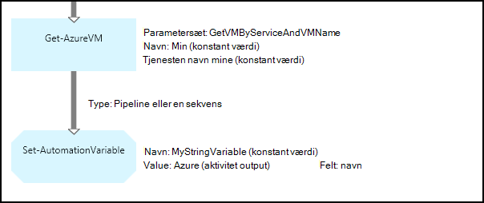

<properties 
   pageTitle="Variabelt aktiver i Azure automatisering | Microsoft Azure"
   description="Variabelt Aktiver er værdier, der er tilgængelige for alle runbooks og DTK konfigurationer i Azure Automation.  I denne artikel beskrives det, oplysninger om variabler og hvordan du kan arbejde med dem i både tekstelementer og grafiske redigering."
   services="automation"
   documentationCenter=""
   authors="mgoedtel"
   manager="jwhit"
   editor="tysonn" />
<tags 
   ms.service="automation"
   ms.devlang="na"
   ms.topic="article"
   ms.tgt_pltfrm="na"
   ms.workload="infrastructure-services"
   ms.date="05/24/2016"
   ms.author="magoedte;bwren" />

# Variabelt aktiver i Azure automatisering

Variabelt Aktiver er værdier, der er tilgængelige for alle runbooks og DTK konfigurationer på din konto med automation. De kan være oprettet, ændret og hentet fra Azure-portalen, Windows PowerShell og inde fra et runbook eller DTK konfiguration. Automatisering variabler er nyttige til følgende scenarier:

- Dele en værdi mellem flere runbooks eller DTK konfigurationer.

- Dele en værdi mellem flere job fra samme runbook eller DTK konfiguration.

- Administrere en værdi fra portalen eller fra kommandolinjen Windows PowerShell, som bruges af runbooks eller DTK konfigurationer.

Automatisering variabler er bevaret, så de fortsat være tilgængelige, selv hvis runbook eller DTK konfiguration mislykkes.  Dette kan også en værdi, der skal angives ved en runbook, der bruges derefter af en anden, eller der bruges af det samme runbook eller DTK konfiguration, næste gang, der udføres.

Når der oprettes en variabel, kan du angive, gemmes krypteret.  Når en variabel er krypteret, gemmes sikkert i Azure Automation og dens værdi kan ikke hentes fra Cmdletten [Get-AzureAutomationVariable](http://msdn.microsoft.com/library/dn913772.aspx) , som leveres som en del af Azure PowerShell-modulet.  Der er den eneste måde, at en krypteret værdi kan hentes fra **Get-AutomationVariable** aktiviteten i en runbook eller DTK konfiguration.

>[AZURE.NOTE]Sikker aktiver i Azure automatisering omfatter legitimationsoplysninger, certifikater, forbindelser og krypterede variabler. Disse aktiver, krypteres og gemmes med Azure automatisering ved hjælp af en entydig nøgle, der oprettes for hver konto med automation. Denne nøgle er krypteret af et overordnet certifikat og gemmes i Azure automatisering. Før du gemmer en sikker aktiv, nøglen for kontoen automatisering er dekrypteres ved hjælp af det overordnede certifikat og derefter bruges til at kryptere aktivet.

## Variabelt typer

Når du opretter en variabel ved hjælp af Azure portal, skal du angive en datatype på rullelisten, så portalen kan vise det rette kontrolelement for at angive den variable værdi. Variablen er ikke begrænset til denne datatype, men du skal angive variablen ved hjælp af Windows PowerShell, hvis du vil angive en værdi på en anden type. Hvis du angiver **ikke defineret**, derefter værdien af variablen indstilles til **$null**, og du skal indstille værdien med [Sæt AzureAutomationVariable](http://msdn.microsoft.com/library/dn913767.aspx) cmdlet eller **Angive AutomationVariable** aktivitet.  Du kan ikke oprette eller ændre værdien for et komplekst variabel type på portalen, men du kan angive en værdi af enhver type ved hjælp af Windows PowerShell. Komplekse typer returneres som en [PSCustomObject](http://msdn.microsoft.com/library/system.management.automation.pscustomobject.aspx).

Du kan gemme flere værdier til en enkelt variabel ved at oprette en matrix eller et hashtable og gemme det på variablen.

## Cmdletter og arbejdsproces aktiviteter

Cmdletter i den følgende tabel, der bruges til at oprette og administrere automatisering variabler med Windows PowerShell. De leveres som en del af [Azure PowerShell-modulet](../powershell-install-configure.md) som er tilgængelig til brug i automatisering runbooks og DTK konfiguration.

|Cmdletter|Beskrivelse|
|:---|:---|
|[Get-AzureAutomationVariable](http://msdn.microsoft.com/library/dn913772.aspx)|Henter værdien af en eksisterende variabel.|
|[Ny AzureAutomationVariable](http://msdn.microsoft.com/library/dn913771.aspx)|Opretter en ny variabel og sætter dens værdi.|
|[Fjern AzureAutomationVariable](http://msdn.microsoft.com/library/dn913775.aspx)|Fjerner en eksisterende variabel.|
|[Angiv AzureAutomationVariable](http://msdn.microsoft.com/library/dn913767.aspx)|Angiver værdien for en eksisterende variabel.|

Arbejdsprocesaktiviteter i den følgende tabel, der bruges til at få adgang til automatisering variabler i en runbook. De er kun tilgængelige til brug i en runbook eller -DTK konfiguration og Lever ikke som en del af Azure PowerShell-modulet.

|Arbejdsprocesaktiviteter|Beskrivelse|
|:---|:---|
|Get-AutomationVariable|Henter værdien af en eksisterende variabel.|
|Angiv AutomationVariable|Angiver værdien for en eksisterende variabel.|

>[AZURE.NOTE] Du skal undgå at bruge variabler i – navn parameteren for **Get-AutomationVariable** i en runbook eller DTK konfiguration, da det kan let gøre registrering afhængigheder mellem runbooks eller DTK konfiguration og automatisering variabler i designfasen.

## Oprette en ny automatisering variabel

### Oprette en ny variabel ved hjælp af Azure portal

1. Klik på **Aktiver** øverst i vinduet fra kontoen automatisering.
1. Klik på **Tilføj indstillingen**nederst i vinduet.
1. Klik på **Tilføj variabel**.
1. Fuldføre guiden, og klik på afkrydsningsfeltet for at gemme den nye variabel.

### Oprette en ny variabel ved hjælp af Azure portal

1. Klik på **Aktiver** del for at åbne bladet **Aktiver** fra kontoen automatisering.
1. Klik på **variabler** del for at åbne bladet **variabler** .
1. Klik på **Tilføj en variabel** øverst i bladet.
1. Udfyld formularen, og klik på **Opret** for at gemme den nye variabel.

### Oprette en ny variabel med Windows PowerShell

Cmdletten [Ny AzureAutomationVariable](http://msdn.microsoft.com/library/dn913771.aspx) opretter en ny variabel og angiver sin startværdi. Du kan hente den ved hjælp af [Get-AzureAutomationVariable](http://msdn.microsoft.com/library/dn913772.aspx)værdi. Hvis værdien er en simpel type, returneres samme type. Hvis det er en kompleks type, returneres en **PSCustomObject** .

Kommandoerne følgende eksempel viser, hvordan du opretter en variabel af strengtypen og derefter returnere dens værdi.

    New-AzureAutomationVariable –AutomationAccountName "MyAutomationAccount" –Name 'MyStringVariable' –Encrypted $false –Value 'My String'
    $string = (Get-AzureAutomationVariable –AutomationAccountName "MyAutomationAccount" –Name 'MyStringVariable').Value

Kommandoerne følgende eksempel viser, hvordan du opretter en variabel med en kompleks type og derefter returnere dens egenskaber. I dette tilfælde bruges et virtuelt objekt fra **Get-AzureVM** .

    $vm = Get-AzureVM –ServiceName "MyVM" –Name "MyVM"
    New-AzureAutomationVariable –AutomationAccountName "MyAutomationAccount" –Name "MyComplexVariable" –Encrypted $false –Value $vm
    
    $vmValue = (Get-AzureAutomationVariable –AutomationAccountName "MyAutomationAccount" –Name "MyComplexVariable").Value
    $vmName = $vmValue.Name
    $vmIpAddress = $vmValue.IpAddress

## Ved hjælp af en variabel i en runbook eller -DTK konfiguration

Brug **Sæt AutomationVariable** aktivitet til at angive værdien af en automatisering variabel i en runbook eller DTK konfiguration og **Få AutomationVariable** til at hente den.  Du skal ikke bruge **Sæt AzureAutomationVariable** eller **Get-AzureAutomationVariable** -cmdletter i en runbook eller -DTK konfiguration, fordi de er mindre effektivt end arbejdsprocesaktiviteter.  Du kan også hente værdien af sikker variabler med **Get-AzureAutomationVariable**.  Den eneste måde at oprette en ny variabel fra en runbook eller DTK konfiguration er at bruge Cmdletten [Ny AzureAutomationVariable](http://msdn.microsoft.com/library/dn913771.aspx) .

### Tekstbaseret runbook eksempler

#### Indstille og hente en enkelt værdi fra en variabel

Kommandoerne følgende eksempel viser, hvordan du angive og hente en variabel i en tekst runbook. I dette eksempel antages det, at variabler af typen heltal med navnet *NumberOfIterations* og *NumberOfRunnings* og en variabel af strengtypen navngivne *SampleMessage* allerede er oprettet.

    $NumberOfIterations = Get-AutomationVariable -Name 'NumberOfIterations'
    $NumberOfRunnings = Get-AutomationVariable -Name 'NumberOfRunnings'
    $SampleMessage = Get-AutomationVariable -Name 'SampleMessage'
    
    Write-Output "Runbook has been run $NumberOfRunnings times."
    
    for ($i = 1; $i -le $NumberOfIterations; $i++) {
       Write-Output "$i`: $SampleMessage"
    }
    Set-AutomationVariable –Name NumberOfRunnings –Value ($NumberOfRunnings += 1)

#### Indstille og hente en kompleks objekt i en variabel

Følgende eksempelkode viser, hvordan du opdaterer en variabel med en kompleks værdi i en tekst runbook. I dette eksempel er en Azure virtuelt hentet med **Get-AzureVM** og gemmes på en eksisterende automatisering variabel.  Som beskrevet i [Variable typer](#variable-types), gemmes det som en PSCustomObject.

    $vm = Get-AzureVM -ServiceName "MyVM" -Name "MyVM"
    Set-AutomationVariable -Name "MyComplexVariable" -Value $vm

Værdien er hentet fra variablen og bruges til at starte den virtuelle maskine i den følgende kode.

    $vmObject = Get-AutomationVariable -Name "MyComplexVariable"
    if ($vmObject.PowerState -eq 'Stopped') {
       Start-AzureVM -ServiceName $vmObject.ServiceName -Name $vmObject.Name
    }

#### Indstilling og hentning af en samling i en variabel

Følgende eksempelkode viser, hvordan du bruger en variabel med en samling af komplekse værdier i en tekst runbook. I dette eksempel er flere Azure virtuelle maskiner hentet med **Get-AzureVM** og gemmes på en eksisterende automatisering variabel.  Som beskrevet i [Variable typer](#variable-types), gemmes det som en samling af PSCustomObjects.

    $vms = Get-AzureVM | Where -FilterScript {$_.Name -match "my"}     
    Set-AutomationVariable -Name 'MyComplexVariable' -Value $vms

I den følgende kode samlingen hentes fra variablen og bruges til at starte hver virtuelt.

    $vmValues = Get-AutomationVariable -Name "MyComplexVariable"
    ForEach ($vmValue in $vmValues)
    {
       if ($vmValue.PowerState -eq 'Stopped') {
          Start-AzureVM -ServiceName $vmValue.ServiceName -Name $vmValue.Name
       }
    }

### Grafiske runbook eksempler

I et grafisk runbook tilføje du **Get-AutomationVariable** eller **Angive AutomationVariable** ved at højreklikke på variablen i ruden bibliotek i den grafiske editor og vælge den ønskede aktivitet.

#### Angive værdier i en variabel

Følgende billede viser eksempel aktiviteter at opdatere en variabel med en enkelt værdi i et grafisk runbook. I dette eksempel er hentet en enkelt Azure virtuel maskine med **Get-AzureVM** og navnet på den computer, der er gemt på en eksisterende automatisering variabel med en type af streng.  Det er ligegyldigt, om det [link er en pipeline eller en sekvens](automation-graphical-authoring-intro.md#links-and-workflow) da vi forventer kun et enkelt objekt i outputtet.

Følgende billede viser de aktiviteter, der bruges til at opdatere en variabel med en kompleks værdi i et grafisk runbook. Den eneste ændring fra det forrige eksempel er ikke angiver en **feltet sti** til **aktivitet output** på **Sæt AutomationVariable** aktiviteten, så objektet, der er gemt i stedet for blot en egenskab for objektet.  Som beskrevet i [Variable typer](#variable-types), gemmes det som en PSCustomObject.

Følgende billede viser tilsvarende funktionalitet som i forrige eksempel med flere virtuelle maskiner, der er gemt i variablen.  En [sekvens link](automation-graphical-authoring-intro.md#links-and-workflow) skal bruges her, så **Sæt AutomationVariable** aktiviteten modtager på hele sættet af virtuelle maskiner som en samling.  Hvis et [pipeline link](automation-graphical-authoring-intro.md#links-and-workflow) blev brugt, vil derefter **Sæt AutomationVariable** aktivitet køre separat for hvert objekt med resultatet er, at kun den sidste virtuelle maskine i gruppen af websteder skal gemmes.  Som beskrevet i [Variable typer](#variable-types), gemmes det som en samling af PSCustomObjects.

#### Henter værdier fra en variabel

Følgende billede viser eksempel aktiviteter, hente og bruge en variabel i et grafisk runbook.  Den første aktivitet henter de virtuelle maskiner, der er gemt på variablen i det forrige eksempel.  Linket skal være en [pipeline](automation-graphical-authoring-intro.md#links-and-workflow) , så **Start AzureVM** aktivitet kører én gang for hvert objekt, der sendes fra **Get-AutomationVariable** aktiviteten.  Det fungerer på samme måde om en et enkelt objekt eller flere objekter er gemt i variablen.  **Start AzureVM** aktivitet bruger egenskaberne for den PSCustomObject, der repræsenterer hver virtuelt. 

Følgende billede viser, hvordan du kan filtrere de objekter, der er gemt til en variabel i et grafisk runbook.  En [betingelse](automation-graphical-authoring-intro.md#links-and-workflow) er føjet til linket i det forrige eksempel til at filtrere kun disse virtuelle maskiner, der er stoppet, da variablen blev angivet.

## Næste trin

- For at få mere for at vide om at oprette forbindelse aktiviteter sammen i grafiske redigering, se [linkene i grafiske redigering](automation-graphical-authoring-intro.md#links-and-workflow)
- For at komme i gang med grafiske runbooks skal du se [Min første grafiske runbook](automation-first-runbook-graphical.md) 
