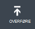

<properties 
    pageTitle="Overføre et Azure Management API certifikat | Azure Microsoft" 
    description="Lær at overføre athe Management API certficate på portalen Azure klassisk." 
    services="cloud-services" 
    documentationCenter=".net" 
    authors="Thraka" 
    manager="timlt" 
    editor=""/>

<tags 
    ms.service="na" 
    ms.workload="tbd" 
    ms.tgt_pltfrm="na" 
    ms.devlang="na" 
    ms.topic="article" 
    ms.date="04/18/2016"
    ms.author="adegeo"/>

# Overføre et Azure Management API Management certifikat

Administration af certifikater gør det muligt at godkende med fra Azure Service Management API. Mange programmer og værktøjer (såsom Visual Studio eller Azure SDK) anvender disse certficates til at automatisere konfiguration og installation af forskellige Azure tjenester. **Dette gælder kun for Azure klassisk portalen**. 

>[AZURE.WARNING] Vær forsigtig! Disse typer certifikater Tillad alle, der godkender med dem til at administrere de er knyttet til abonnementet. 

Yderligere oplysninger om Azure certifikater (herunder oprettelse af et selvsigneret certifikat) er [tilgængelig](cloud-services/cloud-services-certs-create.md#what-are-management-certificates) for dig, hvis du vil have den.

Du kan også bruge [Azure Active Directory](/services/active-directory/) til at godkende klient-kode for automatisering formål.

## Overføre et management certifikat

Når du har en management certficate, der er oprettet, (.cer-fil med den offentlige nøgle) kan du overføre den til portalen. Når certifikatet, der er tilgængelige i portalen, kan alle med en tilsvarende certficiate (privat nøgle) oprette forbindelse via Management API og få adgang til ressourcer for den tilknyttede abonnement.

1. Log på [Azure klassisk portal](http://manage.windowsazure.com).

2. Sørg for at markere det korrekte abonnement, du vil knytte et certifikat med. Tryk på teksten **abonnementer** på øverst til højre på portalen.

    

3. Når du har den korrekte abonnement, der er markeret, skal du trykke på **Indstillinger** i venstre side af portalen (du skal muligvis rulle ned). 
    
    

4. Tryk på fanen **Management certifikater** .

    
    
5. Tryk på knappen **Overfør** .

    
    
6. Udfyld oplysningerne i dialogboksen, og tryk på udført **markering**.

    

## Næste trin

Nu hvor du har en management certficate, der er knyttet til et abonnement, kan du (efter at du har installeret den tilsvarende certifikat lokalt) programmeringsmæssigt oprette forbindelse til [Service Management REST-API](https://msdn.microsoft.com/library/azure/mt420159.aspx) og automatisere de forskellige Azure ressourcer, der også er knyttet til dette abonnement. 