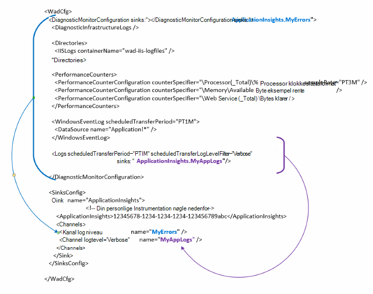

<properties
   pageTitle="Konfigurere Azure diagnosticering for at sende data til programmet indsigt | Microsoft Azure"
   description="Opdatere Azure diagnosticering offentlige konfigurationen for at sende data til programmet indsigt."
   services="multiple"
   documentationCenter=".net"
   authors="sbtron"
   manager="douge"
   editor="" />
<tags
   ms.service="application-insights"
   ms.devlang="na"
   ms.topic="article"
   ms.tgt_pltfrm="na"
   ms.workload="na"
   ms.date="12/15/2015"
   ms.author="saurabh" />

# Konfigurere Azure diagnosticering for at sende data til programmet indsigt

Azure diagnosticering gemmer dine data til Azure-lager tabeller.  Dog kan du også pipe alle eller et undersæt af data til programmet indsigt ved at konfigurere "sinks" og "kanaler" i konfigurationen, når du bruger Azure diagnosticering lokalnummer 1.5 eller nyere.

I denne artikel beskrives, hvordan du opretter den offentlige konfiguration for filtypenavnet Azure diagnosticering så dens konfigureret til at sende data til programmet indsigt.

## Konfiguration af programmet indsigt som en Sink

Filtypenavnet Azure diagnosticering 1,5 introducerer de **<SinksConfig>** element i offentlige konfigurationen. Dette definerer yderligere *sink* hvor Azure diagnosticering data kan sendes. Du kan angive oplysninger om programmet indsigt ressourcen, hvor du vil sende Azure diagnosticering dataene som en del af dette **<SinksConfig>**.
Et eksempel **SinksConfig** ser sådan ud-  

    <SinksConfig>
        <Sink name="ApplicationInsights">
          <ApplicationInsights>{Insert InstrumentationKey}</ApplicationInsights>
          <Channels>
            <Channel logLevel="Error" name="MyTopDiagData"  />
            <Channel logLevel="Verbose" name="MyLogData"  />
          </Channels>
        </Sink>
      </SinksConfig>

For elementet **Sink** angiver attributten *name* en strengværdi, der bruges til at entydigt refererer til sink.
Elementet **ApplicationInsights** angiver instrumentation nøgle på den programmet indsigt ressource, hvor Azure diagnosticering dataene skal sendes. Hvis du ikke har en eksisterende programmet indsigt ressource, kan du se [oprette en ny programmet indsigt ressource](./application-insights/app-insights-create-new-resource.md) kan finde flere oplysninger om at oprette en ressource og få tasten instrumentation.

Hvis du udvikler en skybaseret tjeneste projekt med Azure SDK 2,8 udfyldes automatisk denne instrumentation nøgle i offentlige konfigurationen baseret på indstillingen **APPINSIGHTS_INSTRUMENTATIONKEY** service konfiguration, når emballagen skyen service projektet. Se [Bruge programmet indsigt med Azure diagnosticering til fejlfinding i skybaseret tjeneste](./cloud-services/cloud-services-dotnet-diagnostics-applicationinsights.md).

Elementet **kanaler** kan du angive et eller flere **kanal** elementer for de data, som sendes til sink. Kanalen fungerer som et filter, og gør det muligt at vælge specifikke logføringsniveauer, du vil sende til sink. For eksempel du kan indsamle detaljerede logfiler og sende dem til lagerplads, men du kan vælge at definere en kanal med et logføringsniveau for fejl, og når du sender logfiler gennem, kanal kun fejllogge sendes til sink.
Attributten *name* bruges til en **kanal** sikret henvise til denne kanal.
Attributten *loglevel* kan du angive den logføringsniveau, der gør det kanalen. De tilgængelige logføringsniveauer i rækkefølgen af mest mindste oplysninger er
 - Detaljeret
 - Du kan finde oplysninger
 - Advarsel
 - Fejl
 - Kritisk

## Sende data til programmet indsigt sink
Når programmet indsigt sink er defineret kan du sende data til pågældende sink ved at tilføje attributten *sink* til elementerne under noden **DiagnosticMonitorConfiguration** . Tilføjelse af *sinks* elementet til de enkelte noder angiver, at du vil data, der indsamles fra denne node og en node under det skal sendes til sink angivet.

Eksempelvis hvis du vil sende alle de data, der indsamles af Azure diagnosticering kan du føje attributten *sink* direkte til noden **DiagnosticMonitorConfiguration** . Angive værdien af *sinks* Sink til navnet på den, der blev angivet i **SinkConfig**.

    <DiagnosticMonitorConfiguration overallQuotaInMB="4096" sinks="ApplicationInsights">

Hvis du vil sende kun fejllogge til programmet indsigt synkronisere, og derefter kan du angive *dræn* værdien skal være det Sink navn efterfulgt af det kanalnavn, adskilt med et punktum ("."). For eksempel for at sende kun fejllogge til programmet indsigt Brug sink salgskanalen MyTopDiagdata som blev defineret i den ovenstående SinksConfig.  

    <DiagnosticMonitorConfiguration overallQuotaInMB="4096" sinks="ApplicationInsights.MyTopDiagdata">

Hvis du kun vil sende detaljeret programmet logfiler til programmet indsigt skal du tilføje attributten *sinks* til noden **logfiler** .

    <Logs scheduledTransferPeriod="PT1M" scheduledTransferLogLevelFilter="Verbose" sinks="ApplicationInsights.MyLogData"/>

Du kan også indeholde flere dræn i sektionen konfiguration på forskellige niveauer i hierarkiet. I dette tilfælde sink angivet på øverste niveau i hierarkiet fungerer som en global indstilling og den, der er angivet på enkelt element element fungerer som en tilsidesættelse til den pågældende global indstilling.    

Her er en komplet eksempel af den offentlige konfigurationsfil, der sender alle fejl programmet indsigt (angivet på noden **DiagnosticMonitorConfiguration** ) og desuden detaljerede logfiler for niveau for loggene program (angivet på noden **logfiler** ).

    <WadCfg>
      <DiagnosticMonitorConfiguration overallQuotaInMB="4096"
           sinks="ApplicationInsights.MyTopDiagData"> <!-- All info below sent to this channel -->
        <DiagnosticInfrastructureLogs />
        <PerformanceCounters>
          <PerformanceCounterConfiguration counterSpecifier="\Processor(_Total)\% Processor Time" sampleRate="PT3M" sinks="ApplicationInsights.MyLogData/>
          <PerformanceCounterConfiguration counterSpecifier="\Memory\Available MBytes" sampleRate="PT3M" />
          <PerformanceCounterConfiguration counterSpecifier="\Web Service(_Total)\Bytes Total/Sec" sampleRate="PT3M" />
        </PerformanceCounters>
        <WindowsEventLog scheduledTransferPeriod="PT1M">
          <DataSource name="Application!*" />
        </WindowsEventLog>
        <Logs scheduledTransferPeriod="PT1M" scheduledTransferLogLevelFilter="Verbose"
                sinks="ApplicationInsights.MyLogData"/> <!-- This specific info sent to this channel -->
      </DiagnosticMonitorConfiguration>

    <SinksConfig>
        <Sink name="ApplicationInsights">
          <ApplicationInsights>{Insert InstrumentationKey}</ApplicationInsights>
          <Channels>
            <Channel logLevel="Error" name="MyTopDiagData"  />
            <Channel logLevel="Verbose" name="MyLogData"  />
          </Channels>
        </Sink>
      </SinksConfig>
    </WadCfg>

Der er visse begrænsninger skal være opmærksom på med denne funktion

- Kanaler er kun beregnet til at arbejde med logtype og ikke tællere i ydeevne. Hvis du angiver en kanal med en ydeevne tæller element, vil den blive ignoreret.
- Logføringsniveau for en kanal må ikke overstige logføringsniveau til hvad der indsamles af Azure diagnosticering. For eksempel: Du kan ikke indsamle programmets logfil fejl i elementet logfiler og forsøger at sende detaljeret logfiler til programmet indsigt sink. Attributten *scheduledTransferLogLevelFilter* skal altid opkræve lig eller flere logfiler end logfiler, du forsøger at sende til en sink.
- Du kan ikke sende blob data der indsamles af Azure diagnosticering lokalnummer til programmet indsigt. For eksempel noget angivet under noden *mapper* . For at gå ned gemmer faktisk nedbrud dumpet stadig sendes til blob storage og kun en meddelelse, der blev oprettet nedbrud dumpet sendes til programmet indsigt.

## Næste trin

- Bruge [PowerShell](./cloud-services/cloud-services-diagnostics-powershell.md) til at aktivere filtypenavnet Azure diagnosticering for dit program. 
- Brug [Visual Studio](vs-azure-tools-diagnostics-for-cloud-services-and-virtual-machines.md) til at aktivere filtypenavnet Azure diagnosticering for dit program
