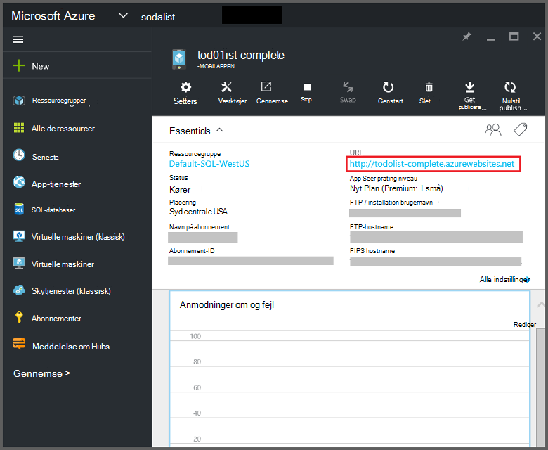
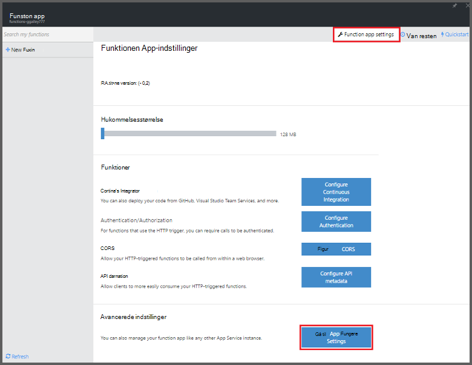
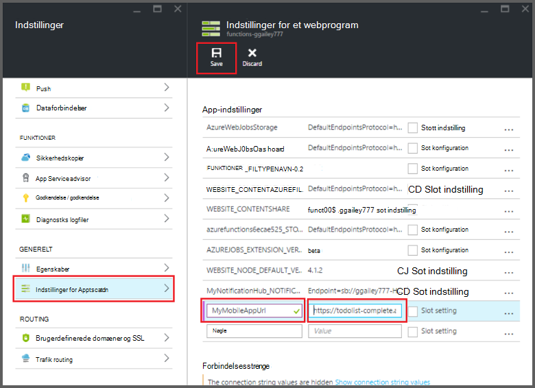

<properties
    pageTitle="Azure funktioner Mobile-Apps bindinger | Microsoft Azure"
    description="Forstå, hvordan du bruger Azure Mobile-Apps bindinger i Azure funktioner."
    services="functions"
    documentationCenter="na"
    authors="ggailey777"
    manager="erikre"
    editor=""
    tags=""
    keywords="Azure fungerer, funktioner, begivenhed behandling, dynamisk Beregn, ikke-serverbaseret arkitektur"/>

<tags
    ms.service="functions"
    ms.devlang="multiple"
    ms.topic="reference"
    ms.tgt_pltfrm="multiple"
    ms.workload="na"
    ms.date="08/30/2016"
    ms.author="glenga"/>

# Azure funktioner Mobile-Apps bindinger

[AZURE.INCLUDE [functions-selector-bindings](../../includes/functions-selector-bindings.md)]

I denne artikel forklares det, hvordan du konfigurerer og kode Azure Mobile-Apps bindinger i Azure funktioner. 

[AZURE.INCLUDE [intro](../../includes/functions-bindings-intro.md)] 

Azure App Service Mobile-Apps kan du få vist slutpunkt tabeldata til mobilklienter. Denne samme tabeldata kan bruges med begge input og output bindinger i Azure funktioner. Fordi den understøtter dynamisk skema, er en Node.js back end-mobilapp ideel til afsløre tabelformat data til brug sammen med din funktioner. Dynamisk skema er aktiveret som standard og bør deaktiveres i en mobilapp fremstilling. Finde flere oplysninger om tabel slutpunkter i en Node.js back-end [Oversigt: tabellen handlinger](../app-service-mobile/app-service-mobile-node-backend-how-to-use-server-sdk.md#TableOperations). I Mobile-Apps understøtter Node.js back-end i portalen gennemsyn og redigering af tabeller. Se [på portalen redigering](../app-service-mobile/app-service-mobile-node-backend-how-to-use-server-sdk.md#in-portal-editing) i emnet Node.js SDK kan finde flere oplysninger. Når du bruger en .NET back end-mobilapp med Azure funktioner, skal du opdatere din datamodel som kræves af din funktion manuelt. Finde flere oplysninger om tabel slutpunkter i en mobilapp af back end-.NET [Sådan: definere en tabel controller](../app-service-mobile/app-service-mobile-dotnet-backend-how-to-use-server-sdk.md#define-table-controller) i .NET back end-SDK emne. 

## Oprette en miljøvariablen til din mobilapp back end-URL-adresse

Mobile-Apps bindinger kræver i øjeblikket er muligt at oprette en miljøvariablen, der returnerer mobilapp back-end selve URL-adressen. Denne URL-adresse kan findes i [Azure-portalen](https://portal.azure.com) ved at finde din mobilapp og åbne bladet.

Sådan indstilles denne URL-adresse som en miljøvariablen i din app, funktionen:

1. I din app, funktionen [Azure funktioner portal](https://functions.azure.com/signin), skal du klikke på **Indstillinger for funktionen** > **Gå til App Tjenesteindstillinger**. 

    

2. I din app, funktionen, skal du klikke på **alle indstillinger**, Rul ned til **Programindstillinger**, derefter under **Indstillinger for** Skriv et nyt **navn** til miljøvariablen skal du indsætte URL-adressen til **værdi**, at sikre, at du bruger skemaet med HTTPS, og derefter klikke på **Gem** og Luk bladet funktionen app at vende tilbage til portalen funktioner.   

    

Du kan nu angive nye miljøvariablen som feltet *forbindelse* i din bindinger.

## Brug en API-nøgle til sikker adgang til Mobile-Apps tabel slutpunkterne.

I Azure-funktioner kan mobile tabel bindinger du angive en API-nøgle, som er en delt hemmeligt, som kan bruges til at forhindre uautoriseret adgang fra apps end din funktioner. Mobile-Apps har ikke indbygget understøttelse af godkendelse af API-nøgle. Du kan dog implementere en API-nøgle i din Node.js back end-mobilapp ved at følge eksemplerne i [Azure App Service Mobile-Apps back-end implementere en API-nøgle](https://github.com/Azure/azure-mobile-apps-node/tree/master/samples/api-key). Du kan implementere en API-nøgle på samme måde i en [.NET back end-mobilappen](https://github.com/Azure/azure-mobile-apps-net-server/wiki/Implementing-Application-Key).

>[AZURE.IMPORTANT] Denne API-nøgle må ikke distribueres med dine mobilapp-klienter, den skal kun fordeles sikkert til tjenesten side-klienter, som Azure funktioner. 

## Azure Mobile-Apps input binding

Indtast bindinger kan indlæse en post fra en mobil tabel slutpunkt og sende dem direkte til din binding. Den post, ID bestemmes baseret på den udløser, aktiveres funktionen. I en C#-funktion, er de ændringer, der har foretaget af posten automatisk sendes tilbage til tabellen, når funktionen afsluttet korrekt.

#### Function.JSON Mobile-Apps input indbinding

Filen *function.json* understøtter følgende egenskaber:

- `name`: Variable navn, der bruges i funktionen kode for den nye post.
- `type`: Biding type skal være indstillet til *mobileTable*.
- `tableName`: Den tabel, hvor den nye post skal oprettes.
- `id`: ID'ET for posten til at hente. Denne egenskab understøtter bindinger ligner `{queueTrigger}`, som anvender strengværdi kø meddelelsens som post Id.
- `apiKey`: Streng, der er programindstillingen, der angiver den valgfrie API-nøgle til mobilappen. Dette er påkrævet, når din mobilapp bruger en API-nøgle til at begrænse klientadgang.
- `connection`: Streng, der er navnet på miljøvariablen programindstillinger, der angiver URL-adressen på din mobil-app'en backend-version.
- `direction`: Bindende retning, som skal være angivet til *i*.

Eksempel *function.json* fil:

    {
      "bindings": [
        {
          "name": "record",
          "type": "mobileTable",
          "tableName": "MyTable",
          "id" : "{queueTrigger}",
          "connection": "My_MobileApp_Url",
          "apiKey": "My_MobileApp_Key",
          "direction": "in"
        }
      ],
      "disabled": false
    }

#### Eksempel på Azure Mobile-Apps kode for en C# kø udløser

Baseret på den eksempel function.json ovenfor, de input binding kopieres i en post fra en Mobile-Apps tabellen slutpunktet med det ID, der svarer til kø meddelelse strengen og overfører dem til parameteren *post* . Når posten, der ikke findes, er parameteren er null. Posten opdateres derefter med den nye *tekst* -værdi, når funktionen afsluttet.

    #r "Newtonsoft.Json"    
    using Newtonsoft.Json.Linq;
    
    public static void Run(string myQueueItem, JObject record)
    {
        if (record != null)
        {
            record["Text"] = "This has changed.";
        }    
    }

#### Eksempel på Azure Mobile-Apps kode for en Node.js kø udløser

Baseret på den eksempel function.json ovenfor, de input binding kopieres i en post fra en Mobile-Apps tabellen slutpunktet med det ID, der svarer til kø meddelelse strengen og overfører dem til parameteren *post* . I Node.js funktioner sendes ikke opdaterede poster tilbage til tabellen. Eksempel på denne kode skriver den hentede post til loggen.

    module.exports = function (context, input) {    
        context.log(context.bindings.record);
        context.done();
    };

## Azure Mobile-Apps output binding

Funktionen kan skrive en post til et Mobile-Apps tabel slutpunkt, ved hjælp af en outputbinding. 

#### Function.JSON til Mobile-Apps output binding

Filen function.json understøtter følgende egenskaber:

- `name`: Variable navn, der bruges i funktionen kode for den nye post.
- `type`: Binding type, der skal være indstillet til *mobileTable*.
- `tableName`: Den tabel, hvor den nye post er oprettet.
- `apiKey`: Streng, der er programindstillingen, der angiver den valgfrie API-nøgle til mobilappen. Dette er påkrævet, når din mobilapp bruger en API-nøgle til at begrænse klientadgang.
- `connection`: Streng, der er navnet på miljøvariablen programindstillinger, der angiver URL-adressen på din mobil-app'en backend-version.
- `direction`: Bindende retning, som skal være indstillet til *ud*.

Eksempel på function.json:

    {
      "bindings": [
        {
          "name": "record",
          "type": "mobileTable",
          "tableName": "MyTable",
          "connection": "My_MobileApp_Url",
          "apiKey": "My_MobileApp_Key",
          "direction": "out"
        }
      ],
      "disabled": false
    }

#### Eksempel på Azure Mobile-Apps kode for en C# kø udløser

Dette C#-kodeeksempel indsætter en ny post i et Mobile-Apps tabel slutpunkt til en egenskab for *tekst* i den tabel, der er angivet i den ovenstående binding.

    public static void Run(string myQueueItem, out object record)
    {
        record = new {
            Text = $"I'm running in a C# function! {myQueueItem}"
        };
    }

#### Eksempel på Azure Mobile-Apps kode for en Node.js kø udløser

Dette Node.js kodeeksempel indsætter en ny post i et Mobile-Apps tabel slutpunkt til en egenskab for *tekst* i den tabel, der er angivet i den ovenstående binding.

    module.exports = function (context, input) {
    
        context.bindings.record = {
            text : "I'm running in a Node function! Data: '" + input + "'"
        }   
    
        context.done();
    };

## Næste trin

[AZURE.INCLUDE [next steps](../../includes/functions-bindings-next-steps.md)]
