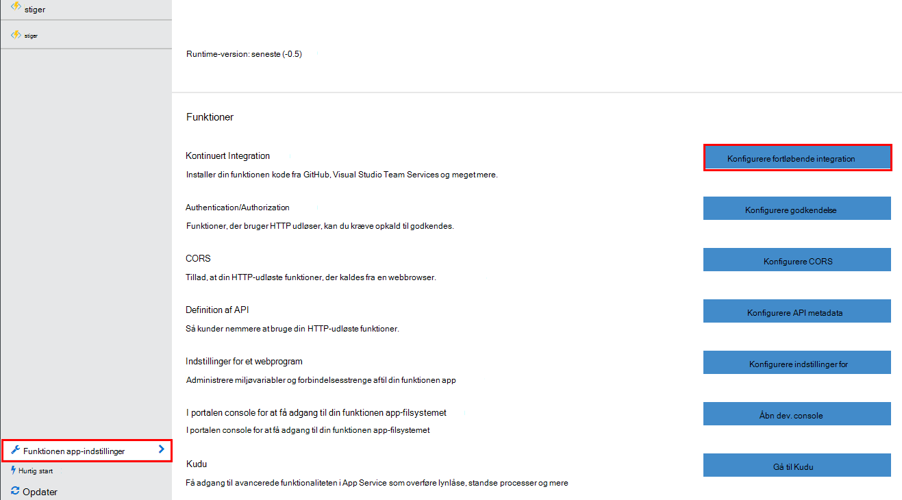

<properties
   pageTitle="Kontinuert installation til Azure funktioner | Microsoft Azure"
   description="Bruge fortløbende installation faciliteter Azure App-tjenesten til at udgive dit Azure-funktioner."
   services="functions"
   documentationCenter="na"
   authors="ggailey777"
   manager="erikre"
   editor=""
   tags=""
   />

<tags
   ms.service="functions"
   ms.devlang="multiple"
   ms.topic="article"
   ms.tgt_pltfrm="multiple"
   ms.workload="na"
   ms.date="09/25/2016"
   ms.author="glenga"/>

# Kontinuert installation til Azure-funktioner 

Azure funktioner gør det nemt at konfigurere fortløbende-din funktionen app. Funktioner, der har Azure App Service integration med BitBucket, Dropbox, GitHub og Visual Studio Team Services (VSTS) til at aktivere en fortløbende installation arbejdsproces, hvor Azure trækker opdateringer til din funktioner kode, når de er udgivet på en af disse tjenester. Hvis du er ny bruger af Azure funktioner, skal du starte med [Azure funktioner oversigt](functions-overview.md).

Kontinuert installation er en god indstilling for de projekter, hvor flere og hyppige bidrag integreres. Det også muligt at vedligeholde versionsstyring på din funktioner kode. Følgende installation kilder understøttes i øjeblikket:

+ [Bitbucket](https://bitbucket.org/)
+ [Dropbox](https://bitbucket.org/)
+ [Ciffer lokale repo](../app-service-web/app-service-deploy-local-git.md)
+ Ciffer eksterne repo
+ [GitHub]
+ Betyder eksterne repo
+ [OneDrive](https://onedrive.live.com/)
+ Visual Studio Team Services

Installationer er konfigureret på grundlag af per-funktionen-app. Når fortløbende installation er aktiveret, adgang til funktionen kode i portalen er indstillet til *skrivebeskyttet tilstand*.

## Kontinuert installation krav

Du skal have din installation kilde, der er konfigureret og din funktioner kode i installation kilden før du konfigureres fortløbende installation. Hver funktion findes i et navngivent i en given funktion app-installation, der mappenavnet er navnet på funktionen. Denne mappestrukturen er grundlæggende kode dit websted. 

[AZURE.INCLUDE [functions-folder-structure](../../includes/functions-folder-structure.md)]

## Konfigurere fortløbende installation

Benyt følgende fremgangsmåde til at konfigurere fortløbende installation for en eksisterende funktionen app:

1. I din app, funktionen [Azure funktioner portal](https://functions.azure.com/signin), skal du klikke på **Indstillinger for funktionen** > **Konfigurer fortløbende integration** > **konfiguration**.

    
    
    
    
    Du kan også finde bladet installationer fra på Hurtig start funktioner ved at klikke på **Start fra versionsstyring**.

2. Klik på **Vælg kilde**, udfyld derefter oplysningerne for den valgte installation kilde bladet installationer, og klik på **OK**.

    

Når fortløbende installation er konfigureret, alle ændringer filer i din installation kilde kopieres til funktionen app og en fuld installation udløses. Webstedet er genaktiveres ved opdatering af filer i kilden.

##Installationsindstillinger

Følgende er nogle typiske installationsscenarier:

+ 

###Oprette en midlertidig installation

Funktionen Apps understøtter ikke endnu installation pladser. Du kan dog stadig administrere separate test- og installationer ved hjælp af fortløbende integration.

Processen til at konfigurere og arbejde med en midlertidig installation ser normalt sådan ud:

1. Opret to funktionen apps i dit abonnement, én for koden fremstilling og én til midlertidige. 

2. Opret en kilde, installation, hvis du ikke allerede har en. Vi bruger [GitHub].
 
3. Fuldfør trinnene herover i **at oprette fortløbende installation** din fremstilling funktionen app, og angive installation grenen til den overordnede gren i din GitHub repo.

    

4. Gentag dette trin for den midlertidige funktion app, men denne gang vælge den midlertidige gren i din GitHub repo. Hvis din installation kilde ikke understøtter forgreninger, kan du bruge en anden mappe.
 
5. Foretage opdateringer i din kode i det midlertidige gren eller den mappe, og derefter kontrollere, afspejles disse ændringer i den midlertidige installation.

6. Efter testen kan flette ændringer fra den midlertidige gren ind i den overordnede gren. Dette udløser installation til fremstilling funktionen app. Hvis din installation kilde ikke understøtter forgreninger, vil du overskrive filerne i mappen fremstilling med filer fra mappen til arrangering af.

###Flytte eksisterende funktioner til fortløbende installation

Når du har eksisterende funktioner, som du har oprettet og vedligeholdes i portalen, du har brug at hente dine eksisterende funktionen kodefiler ved hjælp af FTP eller den lokale ciffer lager før du kan konfigureres fortløbende installation, som beskrevet ovenfor. Du kan gøre dette i indstillingerne for App-tjenesten for din funktionen app. Når filerne er hentet, kan du overføre dem til din valgte fortløbende installation kilde.

>[AZURE.NOTE]Når du konfigurerer fortløbende integration, vil du ikke længere kunne redigere dit kildefiler i portalen funktioner.

####Sådan: konfigurere installation legitimationsoplysninger
Før du kan hente filer fra din funktionen-app, skal du konfigurere dine legitimationsoplysninger for at få adgang til det websted, så du kan gøre fra portalen. Legitimationsoplysningerne er angivet på niveauet for funktionen app.

1. I din app, funktionen [Azure funktioner portal](https://functions.azure.com/signin), skal du klikke på **Indstillinger for funktionen** > **Gå til App Tjenesteindstillinger** > **installation legitimationsoplysninger**.

    

2. Skriv et brugernavn og adgangskode, og derefter klikke på **Gem**. Du kan nu bruge disse legitimationsoplysninger til at få adgang til din funktionen app fra FTP eller den indbyggede ciffer repo.

####Sådan: hente filer ved hjælp af FTP

1. I din app, funktionen [Azure funktioner portal](https://functions.azure.com/signin), skal du klikke på **Indstillinger for funktionen** > **Gå til App Tjenesteindstillinger** > **Egenskaber** , og Kopiér værdierne for **FTP/installation bruger**, **FTP-værtsnavn**og **FTPS Host Name**.  
**FTP/installation bruger** skal indtastes som vist i portalen, herunder app-navn for at give stort kontekst til FTP-serveren.

    
    
2. Brug forbindelsesoplysningerne fra din FTP-klient, du har indsamlet for at oprette forbindelse til din app og hente kildefiler til din funktioner.

####Sådan: hente filer ved hjælp af den lokale ciffer lager

1. I din app, funktionen [Azure funktioner portal](https://functions.azure.com/signin), skal du klikke på **Indstillinger for funktionen** > **Konfigurer fortløbende integration** > **konfiguration**.

2. I bladet installationer, skal du klikke på **Vælg kilde**, **lokale ciffer lager**, og klik derefter på **OK**.
 
3. Klik på **Gå til App Tjenesteindstillinger** > **Egenskaber** og note værdien af ciffer URL-adresse. 
    
    

4. Klone repo på din lokale computer med et ciffer opmærksom på kommandolinjen eller din foretrukne ciffer værktøjet. Kommandoen ciffer Klon ser ud som følger:

        git clone https://username@my-function-app.scm.azurewebsites.net:443/my-function-app.git

5. Hente filer fra din funktionen app til kopien på din lokale computer, som i følgende eksempel:

        git pull origin master

    Hvis du har skrevet, Angiv brugernavnet og adgangskoden til din funktionen app-installation.  

[GitHub]: https://github.com/
