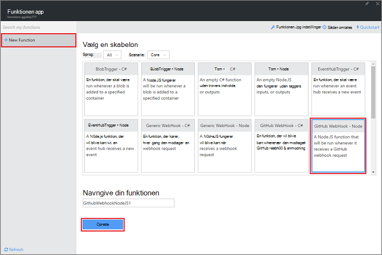
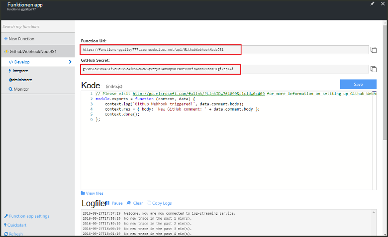
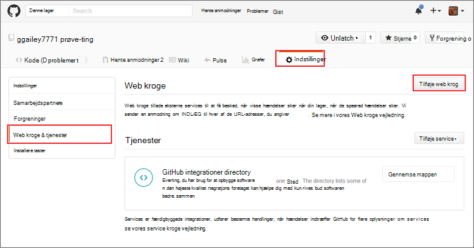
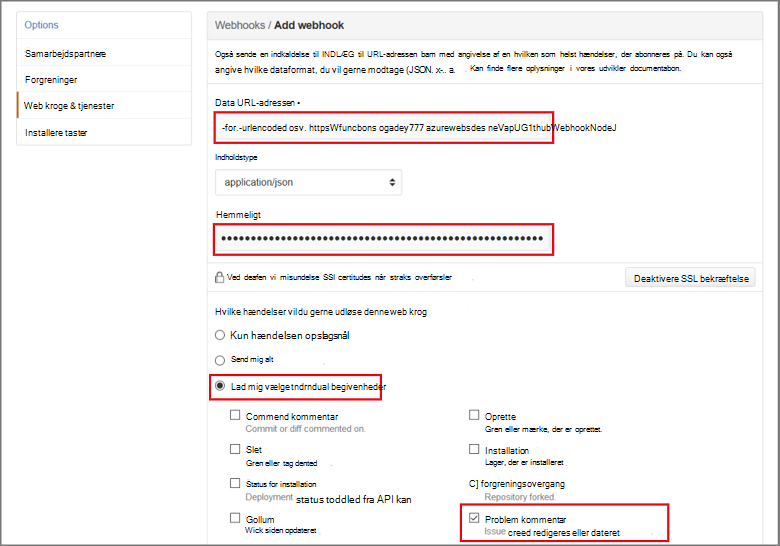

<properties
   pageTitle="Oprette en web krog eller API Azure funktion | Microsoft Azure"
   description="Brug Azure funktioner til at oprette en funktion, der aktiveres af en WebHook eller API opkald."
   services="azure-functions"
   documentationCenter="na"
   authors="ggailey777"
   manager="erikre"
   editor=""
   tags=""
   />

<tags
   ms.service="functions"
   ms.devlang="multiple"
   ms.topic="get-started-article"
   ms.tgt_pltfrm="multiple"
   ms.workload="na"
   ms.date="08/30/2016"
   ms.author="glenga"/>
   
# Oprette en webhook eller API Azure-funktion

Azure-funktioner er en hændelsesstyret, Beregn on demand oplevelse, kan du oprette planlagt eller udløste enheder af kode, der er implementeret i en række programmeringssprog. Hvis du vil vide mere om Azure funktioner, få vist [Azure funktioner oversigt](functions-overview.md).

Dette emne beskrives, hvordan du opretter en ny Node.js funktion, der aktiveres af en GitHub webhook. Den nye funktion oprettes ud fra en foruddefineret skabelon i portalen Azure funktioner. Du kan også se en kort video for at se, hvordan disse trin udføres på portalen.

## Se videoen

Den følgende video viser, hvordan du udfører de grundlæggende trin i dette selvstudium 

[AZURE.VIDEO create-a-web-hook-or-api-azure-function]

##Oprette en webhook udløste funktion fra skabelonen

En funktionen app vært udførelse af funktioner i Azure. Før du kan oprette en funktion, skal du have en active Azure-konto. Hvis du ikke allerede har en Azure-konto, [gratis konti er tilgængelige](https://azure.microsoft.com/free/). 

1. Gå til [Azure funktioner portal](https://functions.azure.com/signin) og logge på med din Azure-konto.

2. Hvis du har en eksisterende funktionen app til at bruge, markere det på **dine funktionen apps** klik derefter på **Åbn**. Oprette en ny funktion app, Skriv et entydigt **navn** til din nye funktionen app eller acceptere den, der er oprettet, Vælg dit foretrukne **område**og derefter skal du klikke på **Opret + Introduktion**. 

3. Klik på **+ nye funktion**i din funktionen app > **GitHub Webhook - Node** > **Opret**. Dette opretter en funktion med et standardnavn, der er baseret på den angivne skabelon. 

     

4. Bemærk funktionen eksempel express.js i **kodevinduet** i **udvikling**. Denne funktion modtager en anmodning om GitHub fra et problem kommentar webhook, logger problem tekst og sender svar til webhook som `New GitHub comment: <Your issue comment text>`.

     

5. Kopiér **URL-adressen til funktionen** og **GitHub hemmeligt** værdierne. Du skal bruge disse, når du opretter webhook i GitHub. 

6. Rul ned til **køre**, Bemærk foruddefinerede JSON brødteksten i en problem kommentar i anmodningsteksten og derefter klikke på **Kør**. 
 
    Du kan altid teste en ny skabelon baseret funktion højre under fanen **udvikling** ved angivelse af en forventet brødtekst JSON data og klikke på knappen **Kør** . I dette tilfælde har skabelonen en foruddefineret brødtekst til et problem kommentar. 
 
Derefter skal oprette du den faktiske webhook i din GitHub lager.

##Konfigurere webhook

1. I GitHub, gå til et lager, at du ejer; Dette omfatter alle typer lagre, som du har forked.
 
2. Klik på **Indstillinger for** > **Webhooks og services** > **Tilføj webhook**.

       

3. Indsæt din funktionen URL-adresse og hemmeligt i **Data URL-adresse** og **hemmeligt**, og derefter Klik på **Lad mig vælge individuelle begivenheder**, Vælg **problem kommentar** , og klik på **Tilføj webhook**.

     

På dette tidspunkt er GitHub webhook konfigureret til at udløse funktionen, når en ny kommentar problem er blevet tilføjet.  
Nu, er det tid til at teste den.

##Teste funktionen

1. I din GitHub repo åbne fanen **problemer** i et nyt browservindue, skal du klikke på **Nyt problem**, Skriv en titel og klik derefter på **Send nyt problem**. Du kan også åbne et eksisterende problem.

2. Skriv en kommentar i problemet, og klik på **kommentar**. På dette tidspunkt, kan du gå tilbage til din nye webhook i GitHub og under **Seneste leverancer** får vist, der blev sendt en anmodning om webhook og brødteksten i svar er `New GitHub comment: <Your issue comment text>`.

3. Tilbage i portalen funktioner, Rul ned til logfiler og se, at funktionen er blevet udløst og værdien `New GitHub comment: <Your issue comment text>` skrives til loggene streaming.

##Næste trin

Se disse emner kan finde flere oplysninger om Azure funktioner.

+ [Azure funktioner Udviklerreference](functions-reference.md)  
Programmer reference kodningssprog funktioner.
+ [Test Azure funktioner](functions-test-a-function.md)  
I denne artikel beskrives forskellige værktøjer og teknikker til test din funktioner.
+ [Sådan skalere Azure funktioner](functions-scale.md)  
I denne artikel beskrives tjenesteplanerne, der er tilgængelige med Azure-funktioner, herunder den dynamiske serviceaftale, og hvordan du vælger den rigtige plan.  

[AZURE.INCLUDE [Getting Started Note](../../includes/functions-get-help.md)]
