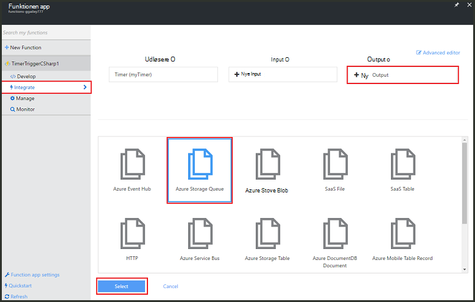
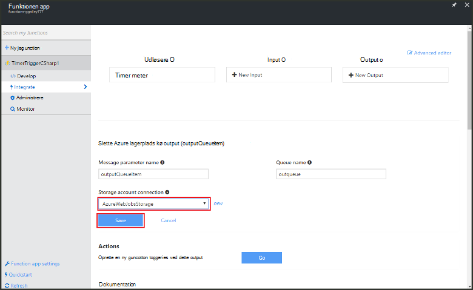

<properties
   pageTitle="Oprette en begivenhed, behandler funktionen | Microsoft Azure"
   description="Brug Azure funktion Opret en C#-funktion, der kører baseret på en begivenhed timer."
   services="functions"
   documentationCenter="na"
   authors="ggailey777"
   manager="erikre"
   editor=""
   tags=""
   />

<tags
   ms.service="functions"
   ms.devlang="multiple"
   ms.topic="get-started-article"
   ms.tgt_pltfrm="multiple"
   ms.workload="na"
   ms.date="09/25/2016"
   ms.author="glenga"/>
   
# Oprette en begivenhed, behandling af Azure-funktionen

Azure-funktioner er en hændelsesstyret, Beregn on demand oplevelse, kan du oprette planlagt eller udløste enheder af kode, der er implementeret i en række programmeringssprog. Hvis du vil vide mere om Azure funktioner, få vist [Azure funktioner oversigt](functions-overview.md).

Dette emne viser, hvordan du opretter en ny funktion i C#, som udfører baseret på en begivenhed timer at føje meddelelser til en lagerplads kø. 

## Forudsætninger 

Før du kan oprette en funktion, skal du have en active Azure-konto. Hvis du ikke allerede har en Azure-konto, [gratis konti er tilgængelige](https://azure.microsoft.com/free/).

## Oprette en timer-udløste funktion fra skabelonen

En funktionen app vært udførelse af funktioner i Azure. Før du kan oprette en funktion, skal du have en active Azure-konto. Hvis du ikke allerede har en Azure-konto, [gratis konti er tilgængelige](https://azure.microsoft.com/free/). 

1. Gå til [Azure funktioner portal](https://functions.azure.com/signin) og logge på med din Azure-konto.

2. Hvis du har en eksisterende funktionen app til at bruge, markere det på **dine funktionen apps** klik derefter på **Åbn**. Oprette en ny funktion app, Skriv et entydigt **navn** til din nye funktionen app eller acceptere den, der er oprettet, Vælg dit foretrukne **område**og derefter skal du klikke på **Opret + Introduktion**. 

3. Klik på **+ nye funktion**i din funktionen app > **TimerTrigger - C#** > **Opret**. Dette opretter en funktion med et standardnavn, der udføres på standard tidsplanen på én gang hver minut. 

    

4. Klik på fanen **integrere** i din nye funktion > **Ny Output** > **Azure lagerplads kø** > **Vælg**.

    

5. Vælg en eksisterende **lagerplads kontoforbindelse**, i **Azure lagerplads kø output**, eller Opret en ny, og klik på **Gem**. 

    

6. Erstat eksisterende C# scriptet i **kodevinduet** tilbage i fanen **udvikling** med følgende kode:

        using System;
        
        public static void Run(TimerInfo myTimer, out string outputQueueItem, TraceWriter log)
        {
            // Add a new scheduled message to the queue.
            outputQueueItem = $"Ping message added to the queue at: {DateTime.Now}.";
            
            // Also write the message to the logs.
            log.Info(outputQueueItem);
        }

    Denne kode tilføjer en ny meddelelse til køen med den aktuelle dato og klokkeslæt, når funktionen udføres.

7. Klik på **Gem** , og se vinduerne **logfiler** til den næste udførelse af funktionen.

8. (Valgfrit) Naviger til kontoen lagerplads, og Bekræft, at meddelelser føjes til køen.

9. Gå tilbage til fanen **integrere** og ændre feltet tidsplan til `0 0 * * * *`. Funktionen kører nu én gang hver time. 

Dette er en meget simplificeret eksempel på både en timer udløser og en lagerplads kø output binding. Se både [Azure funktioner timer udløser](functions-bindings-timer.md) og [Azure funktioner udløsere og bindinger for Azure-lager](functions-bindings-storage.md) emner kan finde flere oplysninger.

##Næste trin

Se disse emner kan finde flere oplysninger om Azure funktioner.

+ [Azure funktioner Udviklerreference](functions-reference.md)  
Programmer reference kodningssprog funktioner og definere udløsere og bindinger.
+ [Test Azure funktioner](functions-test-a-function.md)  
I denne artikel beskrives forskellige værktøjer og teknikker til test din funktioner.
+ [Sådan skalere Azure funktioner](functions-scale.md)  
I denne artikel beskrives tjenesteplanerne, der er tilgængelige med Azure-funktioner, herunder den dynamiske serviceaftale, og hvordan du vælger den rigtige plan.  

[AZURE.INCLUDE [Getting Started Note](../../includes/functions-get-help.md)]
