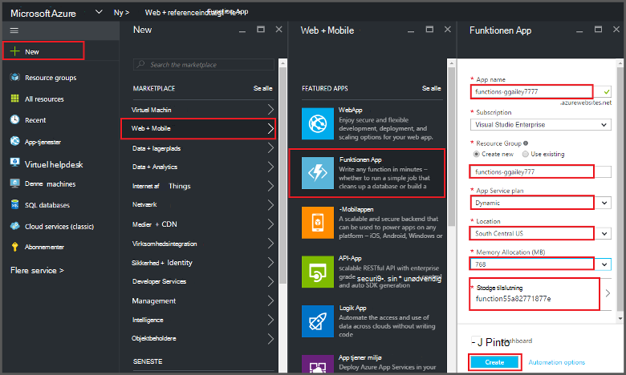
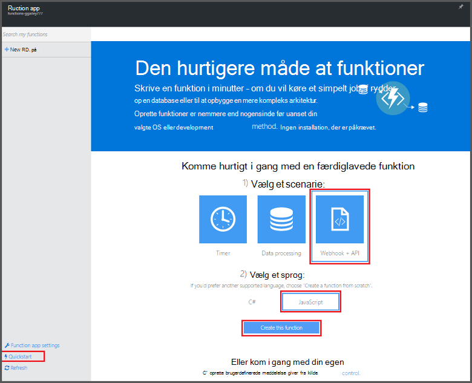
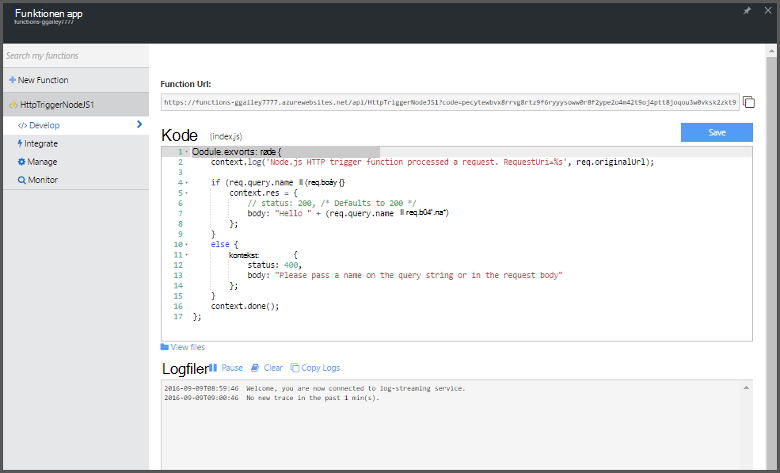

<properties
   pageTitle="Oprette en funktion fra portalen Azure | Microsoft Azure"
   description="Oprette din første Azure-funktion, en ikke-serverbaseret programmet i mindre end to minutter."
   services="functions"
   documentationCenter="na"
   authors="ggailey777"
   manager="erikre"
   editor=""
   tags=""
/>

<tags
   ms.service="functions"
   ms.devlang="multiple"
   ms.topic="article"
   ms.tgt_pltfrm="multiple"
   ms.workload="na"
   ms.date="09/08/2016"
   ms.author="glenga"/>

#Oprette en funktion fra Azure-portalen

##Oversigt
Azure-funktioner er en hændelsesstyret og Beregn on demand brugeroplevelse, der udvider den eksisterende platform Azure-program med funktioner til at implementere kode udløses af hændelser i andre Azure services, SaaS produkter og lokale systemer. Dine programmer skalere efter behov med Azure-funktioner, og du betaler kun for de ressourcer, du forbruger. Azure funktioner kan du oprette planlagt eller udløste enheder af kode, der er implementeret i forskellige programmeringssprog. Hvis du vil vide mere om Azure funktioner, få vist [Azure funktioner oversigt](functions-overview.md).

Dette emne beskrives, hvordan du bruger portalen Azure til at oprette en enkel "Hej verden" Node.js Azure funktion, der aktiveres af en HTTP-udløser. Før du kan oprette en funktion i portalen Azure, skal du opretter en funktionen app direkte i Azure App Service. Se [andre Azure funktioner Hurtig start selvstudiet](functions-create-first-azure-function.md), som er en enklere oplevelse i Hurtig start og indeholder en video for at få appen funktionen oprettes til dig automatisk.

##Oprette en funktionen app

En funktionen app vært udførelse af funktioner i Azure. Følg disse trin for at oprette en funktionen app på portalen Azure.

Før du kan oprette din første funktionen, skal du have en active Azure-konto. Hvis du ikke allerede har en Azure-konto, [gratis konti er tilgængelige](https://azure.microsoft.com/free/).

1. Gå til [Azure portal](https://portal.azure.com) og logge på med din Azure-konto.

2. Klik på **+ Ny** > **Web + Mobile** > **Funktionen App**, Vælg dit **abonnement**, Skriv et entydigt **App-navn** , der identificerer din funktionen app, og derefter angive følgende indstillinger:

    + **[Ressourcegruppe](../azure-portal/resource-group-portal.md/)**: Vælg **Opret ny** , og Angiv et navn til din nye ressourcegruppe. Du kan også vælge en eksisterende ressourcegruppe, men du kan ikke muligvis oprette en dynamisk App Service plan for din funktionen app.
    + **[App-serviceaftale](../app-service/azure-web-sites-web-hosting-plans-in-depth-overview.md)**: Vælg enten *dynamisk* eller *Klassisk*. 
        + **Dynamiske**: planlægge standardtypen for Azure funktioner. Når du vælger en dynamisk plan, skal du også vælge **placeringen** og angive **Hukommelsesallokering** (i MB). Finde oplysninger om hvordan hukommelsesallokering påvirker omkostningerne, [Azure funktioner priser](https://azure.microsoft.com/pricing/details/functions/). 
        + **Klassisk**: en klassisk App serviceaftale, som kræver, at du at oprette en **App Service plan/placering** eller Vælg et eksisterende dokument. Disse indstillinger bestemmer den [placering, funktioner, omkostninger og beregne ressourcer, der](https://azure.microsoft.com/pricing/details/app-service/) er knyttet til din app.  
    + **Lagerplads konto**: hver funktionen app kræver en lagerplads-konto. Du kan vælge en eksisterende konto lagerplads eller Opret en. 

    

3. Klik på **Opret** at blive klargjort og installere den nye funktion app.  

Nu, hvor funktionen app er klargjort, kan du oprette din første funktion.

## Oprette en funktion

Disse trin Opret en funktion fra Azure funktioner Hurtig start.

1. Klik på **WebHook + API** og **JavaScript**i fanen **Hurtig start** og derefter klikke på **Opret en funktion**. Der oprettes en ny foruddefinerede Node.js funktion. 

    

2. (Valgfrit) På dette tidspunkt i Hurtig start, kan du få en hurtig rundtur i Azure funktioner funktioner på portalen.   Når du har fuldført eller ignoreret præsentationen, kan du teste den nye funktion ved hjælp af HTTP udløser.

##Teste funktionen

Da på Hurtig start-guider Azure funktioner indeholder funktionelle kode, kan du teste den nye funktion med det samme.

1. Gennemse vinduet **kode** under fanen **udvikling** , og Bemærk, at denne Node.js kode forventer en HTTP-anmodning med en *navn* værdi, der er gået i meddelelsens brødtekst eller i en forespørgselsstreng. Når funktionen kører, returneres denne værdi i svarmeddelelsen.

    

2. Rul ned til tekstfeltet **anmodningsteksten** , ændre værdien af egenskaben *name* til dit navn, og klik på **Kør**. Du kan se, at udførelse af udløses af en test HTTP-anmodning, oplysninger skrives til loggene streaming, og "Hej" svaret vises i **Output**. 

3. Hvis du vil udløse udførelse af den samme funktion fra en anden browservindue eller tab, kopiere **URL-funktionen** værdien fra fanen **udvikling** og sæt den ind i en browserens adresselinje og derefter tilføje strengværdi forespørgsel `&name=yourname` og trykke på enter. De samme oplysninger skrives til loggene og browseren viser "Hej" svaret som før.

##Næste trin

Denne Hurtig start viser en meget simpel udførelse af en grundlæggende HTTP-udløste funktion. Se disse emner for flere oplysninger om brug af en potens af Azure funktioner i dine apps.

+ [Azure funktioner Udviklerreference](functions-reference.md)  
Programmer reference kodningssprog funktioner og definere udløsere og bindinger.
+ [Test Azure funktioner](functions-test-a-function.md)  
I denne artikel beskrives forskellige værktøjer og teknikker til test din funktioner.
+ [Sådan skalere Azure funktioner](functions-scale.md)  
I denne artikel beskrives tjenesteplanerne, der er tilgængelige med Azure-funktioner, herunder den dynamiske serviceaftale, og hvordan du vælger den rigtige plan. 
+ [Hvad er Azure App Service?](../app-service/app-service-value-prop-what-is.md)  
Azure funktioner bruger Azure App Service platform for kernefunktioner som installationer, miljøvariabler og diagnosticering. 

[AZURE.INCLUDE [Getting Started Note](../../includes/functions-get-help.md)]
