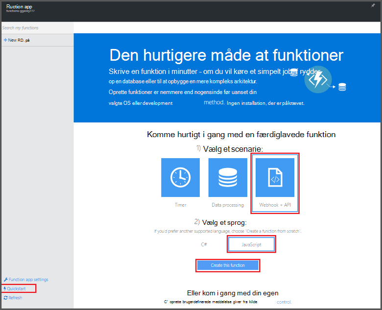
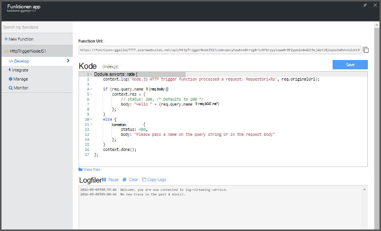

<properties
   pageTitle="Oprette din første Azure-funktionen | Microsoft Azure"
   description="Oprette din første Azure-funktion, en ikke-serverbaseret programmet i mindre end to minutter."
   services="functions"
   documentationCenter="na"
   authors="ggailey777"
   manager="erikre"
   editor=""
   tags=""
/>

<tags
   ms.service="functions"
   ms.devlang="multiple"
   ms.topic="hero-article"
   ms.tgt_pltfrm="multiple"
   ms.workload="na"
   ms.date="09/08/2016"
   ms.author="glenga"/>

#Oprette din første Azure-funktion

##Oversigt
Azure-funktioner er en hændelsesstyret og Beregn on demand brugeroplevelse, der udvider den eksisterende platform Azure-program med funktioner til at implementere kode udløses af hændelser i andre Azure services, SaaS produkter og lokale systemer. Dine programmer skalere efter behov med Azure-funktioner, og du betaler kun for de ressourcer, du forbruger. Azure funktioner kan du oprette planlagt eller udløste enheder af kode, der er implementeret i en række programmeringssprog. Hvis du vil vide mere om Azure funktioner, få vist [Azure funktioner oversigt](functions-overview.md).

Dette emne viser, hvordan du bruger Azure funktioner Hurtig start i portalen til at oprette en simpel "Hej verden" Node.js funktion, der aktiveres af en HTTP-udløser. Du kan også se en kort video for at se, hvordan disse trin udføres på portalen.

## Se videoen

Den følgende video viser, hvordan du udfører de grundlæggende trin i dette selvstudium. 

[AZURE.VIDEO create-your-first-azure-function-simple]

##Oprette en funktion fra på Hurtig start

En funktionen app vært udførelse af funktioner i Azure. Følg disse trin for at oprette en ny funktion app samt den nye funktion. Den nye funktion app er oprettet med en standardkonfiguration. Du kan finde et eksempel på, hvordan du opretter din funktionen app [andre Azure funktioner Hurtig start selvstudiet](functions-create-first-azure-function-azure-portal.md).

Før du kan oprette din første funktionen, skal du have en active Azure-konto. Hvis du ikke allerede har en Azure-konto, [gratis konti er tilgængelige](https://azure.microsoft.com/free/).

1. Gå til [Azure funktioner portal](https://functions.azure.com/signin) og logge på med din Azure-konto.

2. Skriv et entydigt **navn** til din nye app funktionen eller acceptere den, der er oprettet, Vælg dit foretrukne **område**, og klik derefter på **Opret + Introduktion**. 

3. Klik på **WebHook + API** og **JavaScript**i fanen **Hurtig start** og derefter klikke på **Opret en funktion**. Der oprettes en ny foruddefinerede Node.js funktion. 

    

4. (Valgfrit) På dette tidspunkt i Hurtig start, kan du få en hurtig rundtur i Azure funktioner funktioner på portalen.   Når du har fuldført eller ignoreret præsentationen, kan du teste den nye funktion ved hjælp af HTTP udløser.

##Teste funktionen

Da på Hurtig start-guider Azure funktioner indeholder funktionel kode, kan du teste den nye funktion med det samme.

1. Gennemse vinduet **kode** under fanen **udvikling** , og Bemærk, at denne Node.js kode forventer en HTTP-anmodning med en *navn* værdi, der er gået i meddelelsens brødtekst eller i en forespørgselsstreng. Når funktionen kører, returneres denne værdi i svarmeddelelsen.

    

2. Rul ned til tekstfeltet **anmodningsteksten** , ændre værdien af egenskaben *name* til dit navn, og klik på **Kør**. Du får vist, udførelse af udløses af en test HTTP-anmodning, oplysninger skrives til loggene streaming, og "Hej" svaret vises i **Output**. 

3. Hvis du vil udløse udførelse af den samme funktion fra en anden browservindue eller tab, kopiere **URL-funktionen** værdien fra fanen **udvikling** og sæt den ind i en browserens adresselinje og derefter tilføje strengværdi forespørgsel `&name=yourname` og trykke på enter. De samme oplysninger skrives til loggene og browseren viser "Hej" svaret som før.

##Næste trin

Denne Hurtig start viser en meget simpel udførelse af en grundlæggende HTTP-udløste funktion. Se disse emner for flere oplysninger om udnytte fordelene ved Azure funktioner i dine apps.

+ [Azure funktioner Udviklerreference](functions-reference.md)  
Programmer reference kodningssprog funktioner og definere udløsere og bindinger.
+ [Test Azure funktioner](functions-test-a-function.md)  
I denne artikel beskrives forskellige værktøjer og teknikker til test din funktioner.
+ [Sådan skalere Azure funktioner](functions-scale.md)  
I denne artikel beskrives tjenesteplanerne, der er tilgængelige med Azure-funktioner, herunder den dynamiske serviceaftale, og hvordan du vælger den rigtige plan. 
+ [Hvad er Azure App Service?](../app-service/app-service-value-prop-what-is.md)  
Azure-funktioner, der har Azure App Service platformen til kernefunktioner som installationer, miljøvariabler og diagnosticering. 

[AZURE.INCLUDE [Getting Started Note](../../includes/functions-get-help.md)]
