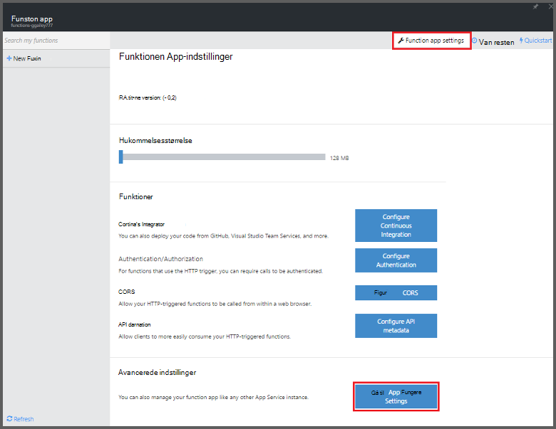
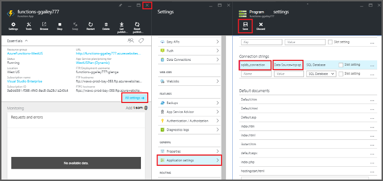
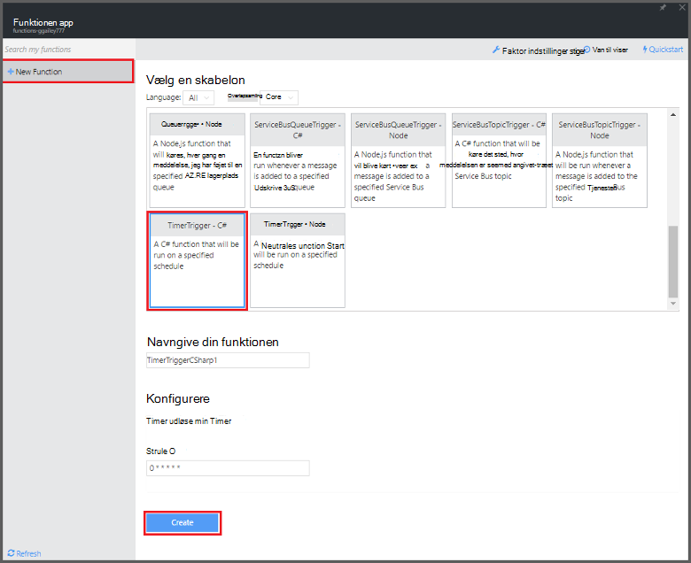

<properties
   pageTitle="Brug Azure funktioner til at udføre en planlagt opgave oprydning | Microsoft Azure"
   description="Brug Azure funktion Opret en C#-funktion, der kører baseret på en begivenhed timer."
   services="functions"
   documentationCenter="na"
   authors="ggailey777"
   manager="erikre"
   editor=""
   tags=""
   />

<tags
   ms.service="functions"
   ms.devlang="multiple"
   ms.topic="article"
   ms.tgt_pltfrm="multiple"
   ms.workload="na"
   ms.date="09/26/2016"
   ms.author="glenga"/>
   
# Brug Azure funktioner til at udføre en planlagt opgave oprydning

Dette emne beskrives, hvordan du bruger Azure funktionerne til at oprette en ny funktion i C#, der kører baseret på en begivenhed timer at rydde op rækker i en databasetabel. Den nye funktion oprettes ud fra en foruddefineret skabelon i portalen Azure funktioner. For at understøtte dette scenario, skal du også angive en databaseforbindelsesstreng som en tjeneste, App indstilling i funktionen-app. 

## Forudsætninger 

Før du kan oprette en funktion, skal du have en active Azure-konto. Hvis du ikke allerede har en Azure-konto, [gratis konti er tilgængelige](https://azure.microsoft.com/free/).

I dette emne beskrives en Transact-SQL-kommando, som udfører en handling af flere oprydning i tabel med navnet *TodoItems* i en SQL-Database. Denne samme TodoItems tabel oprettes, når du udfører [Azure App Service Mobile-Apps Hurtig start selvstudium](../app-service-mobile/app-service-mobile-ios-get-started.md). Du kan også bruge en Northwind, hvis du vælger at bruge en anden tabel, skal du ændre kommandoen.

Du kan få vist den forbindelsesstreng, der bruges af en Mobile-App back-end i portalen under **Indstillinger for alle** > **Programindstillinger** > **forbindelsesstrenge** > **Vis forbindelse strengværdier** > **MS_TableConnectionString**. Du kan også finde forbindelsesstrengen direkte fra en SQL-Database i portalen under **Indstillinger for alle** > **Egenskaber** > **Vis database forbindelsesstrenge** > **ADO.NET (SQL-godkendelse)**.

Dette scenarie bruger en samling af handlinger i databasen. Hvis du vil have din funktionen proces individuelle CRUD-handlinger i en tabel i Mobile-Apps, skal du i stedet bruge Mobile tabel binding.

## Angive en forbindelsesstreng for SQL-Database i funktionen-app

En funktionen app vært udførelse af funktioner i Azure. Det er en god fremgangsmåde at gemme strenge og andre hemmeligheder i indstillingerne for funktionen app. Dette forhindrer utilsigtede for tidligt, når din funktionen kode ender op i en repo et sted. 

1. Gå til [Azure funktioner portal](https://functions.azure.com/signin) og logge på med din Azure-konto.

2. Hvis du har en eksisterende funktionen app til at bruge, markere det på **dine funktionen apps** klik derefter på **Åbn**. Oprette en ny funktion app, Skriv et entydigt **navn** til din nye funktionen app eller acceptere den, der er oprettet, Vælg dit foretrukne **område**og derefter skal du klikke på **Opret + Introduktion**. 

3. I din app, funktionen, skal du klikke på **Indstillinger for funktionen** > **Gå til App Tjenesteindstillinger**. 

    

4. I din app, funktionen, skal du klikke på **alle indstillinger**, Rul ned til **Programindstillinger**, og klik derefter under type af **strenge** `sqldb_connection` efter **navn**, Indsæt forbindelsesstrengen i **værdi**, skal du klikke på **Gem**, og derefter lukke bladet funktionen app for at vende tilbage til portalen funktioner.

    

Nu kan du tilføje den C# funktionen kode, der opretter forbinder til din SQL-Database.

## Oprette en timer-udløste funktion fra skabelonen

1. Klik på **+ nye funktion**i din funktionen app > **TimerTrigger - C#** > **Opret**. Dette opretter en funktion med et standardnavn, der udføres på standard tidsplanen på én gang hver minut. 

    

2. Tilføj følgende samling referencerne øverst på den eksisterende funktion kode i ruden **kode** under fanen **udvikling** :

        #r "System.Configuration"
        #r "System.Data"

3. Tilføj følgende `using` sætninger til funktionen:

        using System.Configuration;
        using System.Data.SqlClient;
        using System.Threading.Tasks; 

4. Erstatte den eksisterende **køre** funktion med følgende kode:

        public static async Task Run(TimerInfo myTimer, TraceWriter log)
        {
            var str = ConfigurationManager.ConnectionStrings["sqldb_connection"].ConnectionString;
            using (SqlConnection conn = new SqlConnection(str))
            {
                conn.Open();
                var text = "DELETE from dbo.TodoItems WHERE Complete='True'";
                using (SqlCommand cmd = new SqlCommand(text, conn))
                {
                    // Execute the command and log the # rows deleted.
                    var rows = await cmd.ExecuteNonQueryAsync();
                    log.Info($"{rows} rows were deleted");
                }
            }
        }

5. Klik på **Gem**, se vinduerne **logfiler** til den næste udførelse af funktionen, og Bemærk, at antallet af rækker, der er slettet fra tabellen TodoItems.

6. (Valgfrit) Ved hjælp af [Mobile-Apps Hurtig start app](../app-service-mobile/app-service-mobile-ios-get-started.md), markér flere elementer, som "afsluttet" Vend derefter tilbage til vinduet **logfiler** og se det samme antal rækker bliver slettet af funktionen under næste kørsel. 

##Næste trin

Se disse emner kan finde flere oplysninger om Azure funktioner.

+ [Azure funktioner Udviklerreference](functions-reference.md)  
Programmer reference kodningssprog funktioner og definere udløsere og bindinger.
+ [Test Azure funktioner](functions-test-a-function.md)  
I denne artikel beskrives forskellige værktøjer og teknikker til test din funktioner.
+ [Sådan skalere Azure funktioner](functions-scale.md)  
I denne artikel beskrives tjenesteplanerne, der er tilgængelige med Azure-funktioner, herunder den dynamiske serviceaftale, og hvordan du vælger den rigtige plan.  

[AZURE.INCLUDE [Getting Started Note](../../includes/functions-get-help.md)]