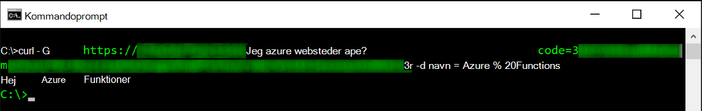
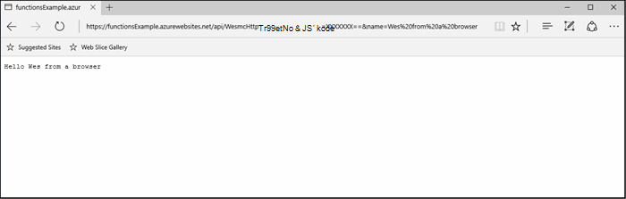
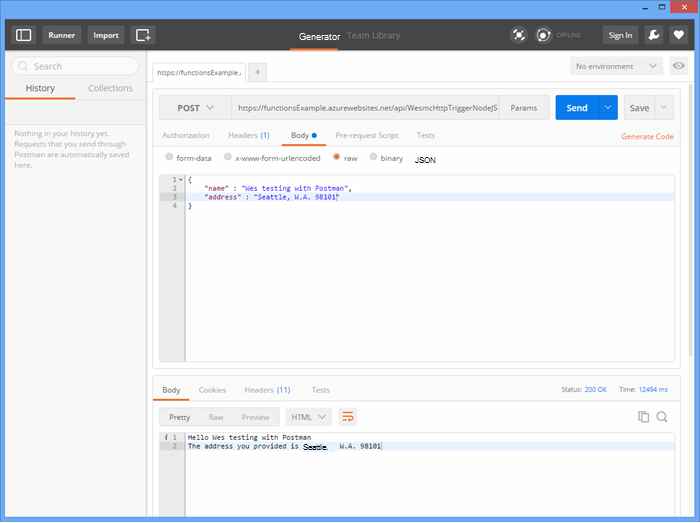
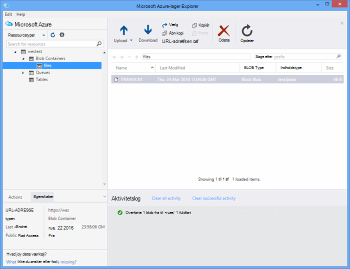

<properties
   pageTitle="Test Azure funktioner | Microsoft Azure"
   description="Teste din Azure-funktioner, ved hjælp af Postman, krøllet og Node.js."
   services="functions"
   documentationCenter="na"
   authors="wesmc7777"
   manager="erikre"
   editor=""
   tags=""
   keywords="Azure-funktioner, funktioner, behandling af hændelse, webhooks, dynamisk Beregn, ikke-serverbaseret arkitektur test"/>

<tags
   ms.service="functions"
   ms.devlang="multiple"
   ms.topic="article"
   ms.tgt_pltfrm="multiple"
   ms.workload="na"
   ms.date="08/19/2016"
   ms.author="wesmc"/>

# Test Azure funktioner

## Oversigt

I dette selvstudium skal vi gennemgå forskellige metoder til test af funktioner. Vi vil definere en http udløser funktion, der accepterer input via en forespørgselsparameter streng eller anmodningsteksten. Standard **HttpTrigger Node.js funktionen** skabelon koden understøtter en `name` forespørgsel strengparameter. Vi kan også tilføje kode for at understøtte denne parameter sammen med `address` oplysninger for brugeren i anmodningsteksten.

## Oprette en funktion til test

Vi bruger en ændret en smule version af skabelonen **HttpTrigger Nodejs funktion** , der er tilgængelige, når du opretter en ny funktion for de fleste af dette selvstudium.  Du kan gennemse, [oprette dit første Azure funktionen selvstudium](functions-create-first-azure-function.md) , hvis du har brug for hjælp til at oprette en ny funktion.  Vælg skabelonen **HttpTrigger Nodejs funktionen** lige, når du opretter funktionen test i [Azure-portalen].

Funktionen standardskabelonen er grundlæggende en Hej verden funktion, der ekkoer tilbage navnet fra parameteren anmodningen, brødtekst eller forespørgsel string `name=<your name>`.  Vi opdaterer koden også gør det muligt at angive navn og en adresse som JSON indhold i anmodningsteksten. Funktionen vil derefter ekko disse tilbage til klienten, når de er tilgængelige.   

Opdatere funktionen med følgende kode som vi skal bruge til test:

    module.exports = function(context, req) {
        context.log("Node.js HTTP trigger function processed a request. RequestUri=%s", req.originalUrl);
        context.log("Request Headers = " + JSON.stringify(req.headers));    
    
        if (req.query.name || (req.body && req.body.name)) {
            if (typeof req.query.name != "undefined") {
                context.log("Name was provided as a query string param..."); 
                ProcessNewUserInformation(context, req.query.name);
            }
            else {
                context.log("Processing user info from request body..."); 
                ProcessNewUserInformation(context, req.body.name, req.body.address);
            }
        }
        else {
            context.res = {
                status: 400,
                body: "Please pass a name on the query string or in the request body"
            };
        }
        context.done();
    };
    
    function ProcessNewUserInformation(context, name, address)
    {    
        context.log("Processing User Information...");            
        context.log("name = " + name);            
        echoString = "Hello " + name;
        
        if (typeof address != "undefined")
        {
            echoString += "\n" + "The address you provided is " + address;
            context.log("address = " + address);            
        }
        
        context.res = {
                // status: 200, /* Defaults to 200 */
                body: echoString
            };
    }

## Teste en funktion med værktøjer

### Test med krøllet

Ofte når test af softwaren, det er ikke nødvendigt at finde en mere end kommandolinjen til at foretage fejlfinding af dit program, det er ikke anderledes med funktioner.

For at teste funktionen ovenfor, skal du kopiere **Funktionen URL-adressen** fra portalen. Det har følgende format: 

    https://<Your Function App>.azurewebsites.net/api/<Your Function Name>?code=<your access code>
    
Dette er URL-adressen for udløsning funktionen, som vi kan du teste ved hjælp af kommandoen krøllet på kommandolinjen at få (`-G` eller `--get`) kaldet mod vores funktionen:

    curl -G https://<Your Function App>.azurewebsites.net/api/<Your Function Name>?code=<your access code>
    
Dette ovenstående eksempel kræver en parameter i forespørgslen streng som kan overføres som Data (`-d`) i kommandoen krøllet:

    curl -G https://<Your Function App>.azurewebsites.net/api/<Your Function Name>?code=<your access code> -d name=<Enter a name here>
    
Tryk på enter, og du får vist output af funktionen på kommandolinjen.

I vinduet portalen **logfiler** logføres output, der svarer til følgende under udførelse af funktionen:

    2016-04-05T21:55:09  Welcome, you are now connected to log-streaming service.
    2016-04-05T21:55:30.738 Function started (Id=ae6955da-29db-401a-b706-482fcd1b8f7a)
    2016-04-05T21:55:30.738 Node.js HTTP trigger function processed a request. RequestUri=https://functionsExample.azurewebsites.net/api/HttpTriggerNodeJS1?code=XXXXXXX&name=Azure Functions
    2016-04-05T21:55:30.738 Function completed (Success, Id=ae6955da-29db-401a-b706-482fcd1b8f7a)

### Test med en browser

Funktioner, der ikke kræver parametre eller kun bruge parametre for forespørgselsstreng, kan testes ved hjælp af en browser.

For at teste den funktion, som vi definerede ovenfor, skal du kopiere **Funktionen URL-adressen** fra portalen. Det har følgende format:

    https://<Your Function App>.azurewebsites.net/api/<Your Function Name>?code=<your access code>

Tilføje den `name` forespørgsel strengparameter, ved hjælp af det faktiske navn for den `<Enter a name here>` pladsholder.

    https://<Your Function App>.azurewebsites.net/api/<Your Function Name>?code=<your access code>&name=<Enter a name here>

Indsæt URL-adressen i din browser, og du skal have et svar stil med følgende.

I vinduet portalen **logfiler** logføres output, der svarer til følgende under udførelse af funktionen:

    2016-03-23T07:34:59  Welcome, you are now connected to log-streaming service.
    2016-03-23T07:35:09.195 Function started (Id=61a8c5a9-5e44-4da0-909d-91d293f20445)
    2016-03-23T07:35:10.338 Node.js HTTP trigger function processed a request. RequestUri=https://functionsExample.azurewebsites.net/api/WesmcHttpTriggerNodeJS1?code=XXXXXXXXXX==&name=Wes from a browser
    2016-03-23T07:35:10.338 Request Headers = {"cache-control":"max-age=0","connection":"Keep-Alive","accept":"text/html","accept-encoding":"gzip","accept-language":"en-US"}
    2016-03-23T07:35:10.338 Name was provided as a query string param.
    2016-03-23T07:35:10.338 Processing User Information...
    2016-03-23T07:35:10.369 Function completed (Success, Id=61a8c5a9-5e44-4da0-909d-91d293f20445)

### Test med Postman

Anbefalede værktøjet for at teste de fleste funktioner er Postman. For at installere Postman skal du se [Få Postman](https://www.getpostman.com/). Postman giver kontrol over mange flere egenskaber for en HTTP-anmodning.

> [AZURE.TIP] Bruge RESTEN-klienten, som du er vant til. Her er nogle alternativer til Postman:  
> 
> * [Fiddler](http://www.telerik.com/fiddler)  
> * [Paw](https://luckymarmot.com/paw)  

Til at afprøve funktionen med en anmodningsteksten i Postman: 

1. Start Postman fra knappen **Apps** i øverste venstre hjørne af et Chrome-browservindue.
2. Kopiér **URL-adresse, funktionen** , og sæt dem ind i Postman. Den indeholder den pinkode forespørgselsparameter streng.
3. Ændre metoden HTTP til **INDLÆG**.
4. Klik på **brødteksten** > **rå** og tilføje JSON anmodningsteksten stil med følgende:

        {
            "name" : "Wes testing with Postman",
            "address" : "Seattle, W.A. 98101"
        }

5. Klik på **Send**.

Følgende billede viser tests enkelt ekkoet funktionen eksempel i dette selvstudium. 

I vinduet portalen **logfiler** logføres output, der svarer til følgende under udførelse af funktionen:

    2016-03-23T08:04:51  Welcome, you are now connected to log-streaming service.
    2016-03-23T08:04:57.107 Function started (Id=dc5db8b1-6f1c-4117-b5c4-f6b602d538f7)
    2016-03-23T08:04:57.763 Node.js HTTP trigger function processed a request. RequestUri=https://functions841def78.azurewebsites.net/api/WesmcHttpTriggerNodeJS1?code=XXXXXXXXXX==
    2016-03-23T08:04:57.763 Request Headers = {"cache-control":"no-cache","connection":"Keep-Alive","accept":"*/*","accept-encoding":"gzip","accept-language":"en-US"}
    2016-03-23T08:04:57.763 Processing user info from request body...
    2016-03-23T08:04:57.763 Processing User Information...
    2016-03-23T08:04:57.763 name = Wes testing with Postman
    2016-03-23T08:04:57.763 address = Seattle, W.A. 98101
    2016-03-23T08:04:57.795 Function completed (Success, Id=dc5db8b1-6f1c-4117-b5c4-f6b602d538f7)
    
### Teste en blob udløser med lagerplads Stifinder

Du kan teste en blob udløser-funktion ved hjælp af [Microsoft Azure lagerplads Stifinder](http://storageexplorer.com/).

1. I [Azure-portalen] til din funktioner app, oprette en ny C#, F # eller Node blob udløser funktion. Angiv stien til at overvåge til navnet på din blob objektbeholder. Eksempel:

        files

2. Klik på den **+** knap for at vælge eller oprette kontoen lagerplads, du vil bruge. Klik derefter på **Opret**.

3. Oprette en tekstfil med følgende tekst og gemme den:

        A text file for blob trigger function testing.

4. Kør [Microsoft Azure lagerplads Explorer](http://storageexplorer.com/) og oprette forbindelse til objektbeholderen blob i kontoen lagerplads, der skal overvåges.

5. Klik på knappen **Overfør** , og Overfør tekstfilen.

    

    Standard blob udløser funktionen kode rapporterer behandling af blob i loggene:

        2016-03-24T11:30:10  Welcome, you are now connected to log-streaming service.
        2016-03-24T11:30:34.472 Function started (Id=739ebc07-ff9e-4ec4-a444-e479cec2e460)
        2016-03-24T11:30:34.472 C# Blob trigger function processed: A text file for blob trigger function testing.
        2016-03-24T11:30:34.472 Function completed (Success, Id=739ebc07-ff9e-4ec4-a444-e479cec2e460)

## Teste en funktion i funktioner

### Teste ved hjælp af funktioner portal knappen Kør

Portalen indeholder knappen **Kør** som gør det muligt for dig at gøre nogle begrænset test. Du kan angive en anmodningsteksten ved hjælp af knappen Kør, men du kan ikke angive forespørgselsparametre streng eller opdatere anmodning sidehoveder.

Teste funktionen HTTP udløser, vi oprettede tidligere ved at tilføje en JSON-streng, der ligner følgende i feltet **anmodningsteksten** , og klik derefter på knappen **Kør** .

    {
        "name" : "Wes testing Run button",
        "address" : "USA"
    } 

I vinduet portalen **logfiler** logføres output, der svarer til følgende under udførelse af funktionen:

    2016-03-23T08:03:12  Welcome, you are now connected to log-streaming service.
    2016-03-23T08:03:17.357 Function started (Id=753a01b0-45a8-4125-a030-3ad543a89409)
    2016-03-23T08:03:18.697 Node.js HTTP trigger function processed a request. RequestUri=https://functions841def78.azurewebsites.net/api/wesmchttptriggernodejs1
    2016-03-23T08:03:18.697 Request Headers = {"connection":"Keep-Alive","accept":"*/*","accept-encoding":"gzip","accept-language":"en-US"}
    2016-03-23T08:03:18.697 Processing user info from request body...
    2016-03-23T08:03:18.697 Processing User Information...
    2016-03-23T08:03:18.697 name = Wes testing Run button
    2016-03-23T08:03:18.697 address = USA
    2016-03-23T08:03:18.744 Function completed (Success, Id=753a01b0-45a8-4125-a030-3ad543a89409)

### Test med en timer udløser

Nogle funktioner kan ikke helt igennem testes værktøjer, som tidligere nævnt. For eksempel en kø udløser funktion, der køres, når en meddelelse er placeret i [Azure kø lager](../storage/storage-dotnet-how-to-use-queues.md). Du kan altid skrive programkode for at slippe en meddelelse i din kø og et eksempel på dette i et projekt, console er angivet herunder. Der findes en anden metode, du kan bruge til at teste med funktioner direkte.  

Du kan bruge en timer udløser, der er konfigureret med en kø output binding. Timer udløserkoden kan derefter skrive test meddelelserne til køen. Dette afsnit fører gennem gennem et eksempel. 

Du kan finde mere detaljerede oplysninger om brug af bindinger med Azure funktioner, [Azure funktioner Udviklerreference](functions-reference.md). 

#### Oprette kø udløser til test

Hvis du vil vise denne metode, vi først opretter en kø udløser funktion, som vi vil teste for en kø med navnet `queue-newusers`. Denne funktion behandler navn og adresse oplysninger til en ny bruger sluppet til Azure kø lagerplads. 

> [AZURE.NOTE] Hvis du bruger en anden kø navn, skal du kontrollere det navn, du bruger er i overensstemmelse med reglerne [navngive køer og MetaData](https://msdn.microsoft.com/library/dd179349.aspx) .  Ellers får du en HTTP-statuskode 400: forkert anmodning. 

1. Klik på **Ny funktion**i [Azure Portal] for din funktioner app > **QueueTrigger - C#**.
2. Angiv navnet kø skal overvåges af funktionen kø 

        queue-newusers 

3. Klik på den **+** (Tilføj) for at vælge eller oprette kontoen lagerplads, du vil bruge. Klik derefter på **Opret**.
4. Lad dette portalen browservindue, der er åbnet, så du kan overvåge logposter for koden standard kø funktionen skabelon.

#### Oprette en timer udløser for at slippe en meddelelse i køen

1. Åbn [Azure Portal] i et nyt browservindue, og gå til din funktionen app.
2. Klik på **ny funktion** > **TimerTrigger - C#**. Angive en cron udtryk for at angive, hvor ofte timer koden udføre test din kø-funktionen. Klik derefter på **Opret**. Hvis du vil prøve at køre hvert 30 kan du bruge følgende [CRON udtryk](https://wikipedia.org/wiki/Cron#CRON_expression):

        */30 * * * * *

2. Klik på fanen **integrere** på den nye timer udløser.
3. Klik på knappen **+ Ny Output** under **Output**. Klik derefter på **kø** og knappen **Vælg** .
4. Bemærk det navn, du bruger til **kø meddelelsesobjekt** , du vil bruge dette i timer funktionskoden.

        myQueue

4. Angiv et navn i kø, hvor meddelelsen sendes: 

        queue-newusers 

3. Klik på den **+** (Tilføj) knappen for at vælge lagerplads-konto, du tidligere har brugt med kø udløser. Klik derefter på **Gem**.
4. Klik på fanen **udvikling** for dine timer udløser.
5. Du kan bruge følgende kode for funktionen C# timer, som du har brugt den samme kø meddelelse objektnavn ovenstående. Klik derefter på **Gem**

        using System;
        
        public static void Run(TimerInfo myTimer, out String myQueue, TraceWriter log)
        {
            String newUser = 
            "{\"name\":\"User testing from C# timer function\",\"address\":\"XYZ\"}";
        
            log.Verbose($"C# Timer trigger function executed at: {DateTime.Now}");   
            log.Verbose($"{newUser}");   
            
            myQueue = newUser;
        }

På dette tidspunkt udføre C# timer funktionen hver 30 sekunder, hvis du har brugt eksempel cron udtrykket. Logfiler for funktionen timer rapporterer hver udførelse af:

    2016-03-24T10:27:02  Welcome, you are now connected to log-streaming service.
    2016-03-24T10:27:30.004 Function started (Id=04061790-974f-4043-b851-48bd4ac424d1)
    2016-03-24T10:27:30.004 C# Timer trigger function executed at: 3/24/2016 10:27:30 AM
    2016-03-24T10:27:30.004 {"name":"User testing from C# timer function","address":"XYZ"}
    2016-03-24T10:27:30.004 Function completed (Success, Id=04061790-974f-4043-b851-48bd4ac424d1)

Der vises hver meddelelsen behandles i browservinduet for funktionen kø:

    2016-03-24T10:27:06  Welcome, you are now connected to log-streaming service.
    2016-03-24T10:27:30.607 Function started (Id=e304450c-ff48-44dc-ba2e-1df7209a9d22)
    2016-03-24T10:27:30.607 C# Queue trigger function processed: {"name":"User testing from C# timer function","address":"XYZ"}
    2016-03-24T10:27:30.607 Function completed (Success, Id=e304450c-ff48-44dc-ba2e-1df7209a9d22)
    
## Teste en funktion med kode

### Teste en HTTP udløser funktion med kode: Node.js

Du kan bruge Node.js kode til at udføre en HTTP-anmodning om at teste din Azure-funktionen. 

Sørg for at angive:

- Den `host` i indstillinger for anmodning om at værten funktionen app
- Din funktionsnavn i den `path`.
- Din pinkode (`<your code>`) i den `path`.

Eksempel på en kode:

    var http = require("http");
    
    var nameQueryString = "name=Wes%20Query%20String%20Test%20From%20Node.js";
    
    var nameBodyJSON = {
        name : "Wes testing with Node.JS code",
        address : "Dallas, T.X. 75201"
    };
    
    var bodyString = JSON.stringify(nameBodyJSON);
    
    var options = {
      host: "functions841def78.azurewebsites.net",
      //path: "/api/HttpTriggerNodeJS2?code=sc1wt62opn7k9buhrm8jpds4ikxvvj42m5ojdt0p91lz5jnhfr2c74ipoujyq26wab3wk5gkfbt9&" + nameQueryString,
      path: "/api/HttpTriggerNodeJS2?code=sc1wt62opn7k9buhrm8jpds4ikxvvj42m5ojdt0p91lz5jnhfr2c74ipoujyq26wab3wk5gkfbt9",
      method: "POST",
      headers : {
          "Content-Type":"application/json",
          "Content-Length": Buffer.byteLength(bodyString)
        }    
    };
    
    callback = function(response) {
      var str = ""
      response.on("data", function (chunk) {
        str += chunk;
      });
    
      response.on("end", function () {
        console.log(str);
      });
    }
    
    var req = http.request(options, callback);
    console.log("*** Sending name and address in body ***");
    console.log(bodyString);
    req.end(bodyString);

Output:

    C:\Users\Wesley\testing\Node.js>node testHttpTriggerExample.js
    *** Sending name and address in body ***
    {"name" : "Wes testing with Node.JS code","address" : "Dallas, T.X. 75201"}
    Hello Wes testing with Node.JS code
    The address you provided is Dallas, T.X. 75201
        
I vinduet portalen **logfiler** logføres output, der svarer til følgende under udførelse af funktionen:

    2016-03-23T08:08:55  Welcome, you are now connected to log-streaming service.
    2016-03-23T08:08:59.736 Function started (Id=607b891c-08a1-427f-910c-af64ae4f7f9c)
    2016-03-23T08:09:01.153 Node.js HTTP trigger function processed a request. RequestUri=http://functionsExample.azurewebsites.net/api/WesmcHttpTriggerNodeJS1/?code=XXXXXXXXXX==
    2016-03-23T08:09:01.153 Request Headers = {"connection":"Keep-Alive","host":"functionsExample.azurewebsites.net"}
    2016-03-23T08:09:01.153 Name not provided as query string param. Checking body...
    2016-03-23T08:09:01.153 Request Body Type = object
    2016-03-23T08:09:01.153 Request Body = [object Object]
    2016-03-23T08:09:01.153 Processing User Information...
    2016-03-23T08:09:01.215 Function completed (Success, Id=607b891c-08a1-427f-910c-af64ae4f7f9c)
    

### Teste en kø udløser funktion med kode: C# #

Vi nævnt tidligere, kan du teste en kø udløser ved hjælp af kode til at slippe en meddelelse i din kø. Følgende eksempelkode er baseret på den C#-kode præsenteres i [Introduktion til Azure kø lagerplads](../storage/storage-dotnet-how-to-use-queues.md) selvstudiet. Kode for andre sprog er også tilgængelig fra dette hyperlink.

Sådan testes denne kode i en console-app, skal du:

- [Konfigurer din lagerplads forbindelsesstrengen i app.config-filen](../storage/storage-dotnet-how-to-use-queues.md#setup-a-storage-connection-string).
- Denne kode accepterer navn og adresse til en ny bruger som kommandolinjeargumenter under kørslen. Overføre en `name` og `address` som parametre til appen. For eksempel`C:\myQueueConsoleApp\test.exe "Wes testing queues" "in a console app"`

C#-eksempelkode:

    static void Main(string[] args)
    {
        string name = null;
        string address = null;
        string queueName = "queue-newusers";
        string JSON = null;

        if (args.Length > 0)
        {
            name = args[0];
        }
        if (args.Length > 1)
        {
            address = args[1];
        }

        // Retrieve storage account from connection string
        CloudStorageAccount storageAccount = CloudStorageAccount.Parse(ConfigurationManager.AppSettings["StorageConnectionString"]);

        // Create the queue client
        CloudQueueClient queueClient = storageAccount.CreateCloudQueueClient();

        // Retrieve a reference to a queue
        CloudQueue queue = queueClient.GetQueueReference(queueName);

        // Create the queue if it doesn't already exist
        queue.CreateIfNotExists();

        // Create a message and add it to the queue.
        if (name != null)
        {
            if (address != null)
                JSON = String.Format("{{\"name\":\"{0}\",\"address\":\"{1}\"}}", name, address);
            else
                JSON = String.Format("{{\"name\":\"{0}\"}}", name);
        }

        Console.WriteLine("Adding message to " + queueName + "...");
        Console.WriteLine(JSON);

        CloudQueueMessage message = new CloudQueueMessage(JSON);
        queue.AddMessage(message);
    }

Der vises hver meddelelsen behandles i browservinduet for funktionen kø:

    2016-03-24T10:27:06  Welcome, you are now connected to log-streaming service.
    2016-03-24T10:27:30.607 Function started (Id=e304450c-ff48-44dc-ba2e-1df7209a9d22)
    2016-03-24T10:27:30.607 C# Queue trigger function processed: {"name":"Wes testing queues","address":"in a console app"}
    2016-03-24T10:27:30.607 Function completed (Success, Id=e304450c-ff48-44dc-ba2e-1df7209a9d22)

<!-- URLs. -->

[Azure-portalen]: https://portal.azure.com
